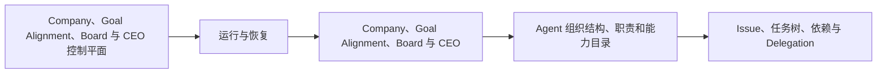

# paperclip（02） - Paperclip 架构与运行方式

> 读完后，你应能完成以下任务：
> - 绘制“paperclip（02） - Paperclip 架构与运行方式 / Company、Goal Alignment、Board 与 CEO 控制平面”的关键对象与数据流，解释“Company 定义隔离边界，”，并用源码位置、日志或 Trace 标注证据。
> - 为“paperclip（02） - Paperclip 架构与运行方式 / 运行与恢复”设计正常与异常输入，验证“Heartbeat 表示 Agent 仍在推进并携带进度证据，不能只更新时间戳；”，输出首个偏差位置与回归测试结果。
> - 实现“paperclip（02） - Paperclip 架构与运行方式 / 补充结论 1”的最小代码或配置，检验“控制平面决定谁做什么、为何执行、可花多少钱和何时需要审批；”，输出命令、结果与 Diff，并说明不适用边界。

> 控制平面决定谁做什么、为何执行、可花多少钱和何时需要审批；执行平面只负责在受控环境中完成具体任务。


## 核心知识清单

- Company、Goal Alignment、Board 与 CEO
- Agent 组织结构、职责和能力目录
- Issue、任务树、依赖与 Delegation
- Atomic Checkout、Heartbeat 与 Wakeup 合并
- Session 持续性、Workspace 与 Runtime Service
- Adapter 与模型/工具执行环境
- Execution Policy、重试、取消与恢复

<!-- article-progressive-block:start -->
# 一、先建立全局：Paperclip 架构与运行方式 是什么？

理解“Paperclip 架构与运行方式”，先要把标题中的对象放进同一条处理链：它接收什么输入，经过哪些状态变化，最终用什么证据判断结果。下表不另造概念，只把作者正文已经解释的章节按依赖顺序连起来。

“Paperclip 架构与运行方式”的第一个核心判断是：Company 定义隔离边界，。先弄清这个判断中的对象和输入输出，后面的实现、故障和验收才有共同语境。

| 顺序 | 章节 | 读完本节应抓住的结论 |
| --- | --- | --- |
| 1 | Company、Goal Alignment、Board 与 CEO 控制平面 | Company 定义隔离边界， |
| 2 | 运行与恢复 | Heartbeat 表示 Agent 仍在推进并携带进度证据，不能只更新时间戳； |
| 3 | Company、Goal Alignment、Board 与 CEO | Company、Goal Alignment、Board 与 CEO 组成控制平面的责任链：Company 限定组织边界， |
| 4 | Agent 组织结构、职责和能力目录 | CEO Agent 或人类负责拆解与协调。 |
| 5 | Issue、任务树、依赖与 Delegation | Issue 是最小可追踪任务，包含目标、输入、依赖、负责人、状态和验收证据。 |
| 6 | Atomic Checkout、Heartbeat 与 Wakeup 合并 | 多个 Wakeup 合并，避免同一任务并发启动。 |

## 1.1 核心对象之间怎样衔接



这张图只表达本文的讲解顺序，不替代正文机制。判断“Paperclip 架构与运行方式”是否真正掌握，需要能从最后一个结果沿图回到前面每个章节的输入、状态变化和证据。

## 1.2 再看失败：问题最早会出现在哪一步？

在“Paperclip 架构与运行方式”的对象和顺序已经明确后，再看可观察的失败：条件缺失、结果不可复现或失败后责任不清。定位时不从最后一条错误猜原因，而是沿上图找第一个偏离正文结论的节点。
<!-- article-progressive-block:end -->

# 二、Company、Goal Alignment、Board 与 CEO 控制平面

Company 定义隔离边界，
Goal 把使命转成可度量结果，
Board 管治理和高风险决策，
CEO Agent 或人类负责拆解与协调。
Agent 注册角色、能力、预算和权限，不应凭名字自动获得资源。

Company、Goal Alignment、Board 与 CEO 组成控制平面的责任链：Company 限定组织边界，
Goal Alignment 保持父子目标可追踪，
Board 审批治理变更，
CEO 对跨 Agent 的最终结果负责。
这条责任链必须落到对象 ID、版本和审计事件，不能只存在 Prompt 描述中。

Issue 是最小可追踪任务，包含目标、输入、依赖、负责人、状态和验收证据。
Delegation 创建父子关系而不是复制文本。
Atomic Checkout 保证同一任务只被一个 Worker 领取，
租约过期后才能重新分配。

# 三、运行与恢复

Heartbeat 表示 Agent 仍在推进并携带进度证据，不能只更新时间戳；
多个 Wakeup 合并，避免同一任务并发启动。
Session 保存连续上下文，
但事实产物写入 Workspace 或知识库，
不能只存在消息历史。

Adapter 把不同模型、CLI 或 Cloud Agent 映射到统一运行契约。
Runtime Service 提供工作区、凭据、网络、日志和取消。
Execution Policy 限制命令、路径、并发、时长、Token 和外部动作，
失败按可重试、需输入、业务拒绝和程序错误分类。

<!-- article-progressive-block:start -->
# 四、动手验证：先跑通 Paperclip 架构与运行方式，再改变一个变量

前面的章节已经建立问题、概念和机制。现在把“Paperclip 架构与运行方式”放进同一套基线中运行；本节不再引入新术语，只验证前文结论能否被复现。

## 4.1 基线与候选只允许一个变量不同

验证“Paperclip 架构与运行方式”时，先固定样本、基线、候选、成功标准和失败边界。候选方案只能改变本次要验证的变量；如果同时更换数据、依赖和配置，即使结果改善，也不能知道是哪一项产生作用。

执行“Paperclip 架构与运行方式”时，动作是：同环境运行基线与候选，记录输入、中间状态和异常。原始结果不能只保留截图或汇总分数，必须同步保存：可重放命令、结构化日志、输出 Diff、失败样本、版本，使下一次复查可以在同一输入上重放。

| 实验要素 | 本文要求 |
| --- | --- |
| 固定条件 | 固定样本、基线、候选、成功标准和失败边界 |
| 唯一变量 | 本次候选方案与基线之间的一项明确差异 |
| 原始证据 | 可重放命令、结构化日志、输出 Diff、失败样本、版本 |
| 通过阈值 | 结果符合结论条件，异常输入可解释、可恢复 |
| 立即停止 | 条件缺失、结果不可复现或失败后责任不清 |

## 4.2 执行前先排除不可比较条件

“Paperclip 架构与运行方式”开始前先确认下面四项；任一项不成立，都应先修复实验条件，而不是解释结果。

- 基线能够在“Paperclip 架构与运行方式”的当前环境重复运行。
- 候选只改变一个与“Paperclip 架构与运行方式”结论直接相关的条件。
- “Paperclip 架构与运行方式”的基线和候选使用同一批输入、同一版本依赖与同一通过阈值。
- “Paperclip 架构与运行方式”的原始输出和失败现场不会被重试、格式化或汇总覆盖。

## 4.3 执行后先核对证据完整性

结果出来后先检查证据，再讨论“Paperclip 架构与运行方式”是否通过。缺少中间状态时，最终输出只能说明现象，不能证明机制。

| 检查项 | 当前文章的判定 |
| --- | --- |
| 输入可追溯 | 固定样本、基线、候选、成功标准和失败边界 |
| 过程可回放 | 同环境运行基线与候选，记录输入、中间状态和异常 |
| 结果可审计 | 可重放命令、结构化日志、输出 Diff、失败样本、版本 |

“Paperclip 架构与运行方式”的一次合格基线对照按以下顺序执行：

1. 保存“Paperclip 架构与运行方式”基线版本及输入摘要，确认基线本身可以重复运行。
2. 写下“Paperclip 架构与运行方式”候选方案唯一变化的变量，以及它预期影响的指标。
3. 在同一环境执行“Paperclip 架构与运行方式”：同环境运行基线与候选，记录输入、中间状态和异常。
4. 为“Paperclip 架构与运行方式”保存：可重放命令、结构化日志、输出 Diff、失败样本、版本。
5. 使用“Paperclip 架构与运行方式”预登记条件判断：结果符合结论条件，异常输入可解释、可恢复。
6. 如果“Paperclip 架构与运行方式”未通过，不修改第二个变量，先恢复基线并保留失败现场。

# 五、用一张矩阵验证 Paperclip 架构与运行方式 的关键结论

矩阵按正文顺序列出“Paperclip 架构与运行方式”的结论。一次实验只选择一行，只改变这一行对应的条件；不要把多行合并成一个无法归因的大实验。

| 正文章节 | 已解释的结论 | 本轮唯一变量 | 必须保存的证据 |
| --- | --- | --- | --- |
| Company、Goal Alignment、Board 与 CEO 控制平面 | Company 定义隔离边界， | 只改变与“Company、Goal Alignment、Board 与 CEO 控制平面”相关的条件 | 可重放命令、结构化日志、输出 Diff、失败样本、版本 |
| 运行与恢复 | Heartbeat 表示 Agent 仍在推进并携带进度证据，不能只更新时间戳； | 只改变与“运行与恢复”相关的条件 | 可重放命令、结构化日志、输出 Diff、失败样本、版本 |
| Company、Goal Alignment、Board 与 CEO | Company、Goal Alignment、Board 与 CEO 组成控制平面的责任链：Company 限定组织边界， | 只改变与“Company、Goal Alignment、Board 与 CEO”相关的条件 | 可重放命令、结构化日志、输出 Diff、失败样本、版本 |
| Agent 组织结构、职责和能力目录 | CEO Agent 或人类负责拆解与协调。 | 只改变与“Agent 组织结构、职责和能力目录”相关的条件 | 可重放命令、结构化日志、输出 Diff、失败样本、版本 |
| Issue、任务树、依赖与 Delegation | Issue 是最小可追踪任务，包含目标、输入、依赖、负责人、状态和验收证据。 | 只改变与“Issue、任务树、依赖与 Delegation”相关的条件 | 可重放命令、结构化日志、输出 Diff、失败样本、版本 |
| Atomic Checkout、Heartbeat 与 Wakeup 合并 | 多个 Wakeup 合并，避免同一任务并发启动。 | 只改变与“Atomic Checkout、Heartbeat 与 Wakeup 合并”相关的条件 | 可重放命令、结构化日志、输出 Diff、失败样本、版本 |

## 5.1 记录本次实际实验

下面的记录用于“Paperclip 架构与运行方式”当前这一次实验，不是第二套知识目录。先从矩阵选择一个章节，再填写实际值；没有填写的字段表示尚未验证。

```yaml
topic: "Paperclip 架构与运行方式"
selected_chapter: required
claim_from_article: required
baseline_version: required
changed_condition: exactly_one
execution: "同环境运行基线与候选，记录输入、中间状态和异常"
evidence: "可重放命令、结构化日志、输出 Diff、失败样本、版本"
pass_when: "结果符合结论条件，异常输入可解释、可恢复"
stop_when: "条件缺失、结果不可复现或失败后责任不清"
observed_result: required
first_deviation: null_or_evidence
recovery_replay: required_after_failure
```

## 5.2 边界实验必须证明能够停止和恢复

成功路径只能证明“Paperclip 架构与运行方式”在当前样本上工作，不能证明它可以进入生产。边界实验需要主动制造：条件缺失、结果不可复现或失败后责任不清，并观察系统是否在产生不可逆副作用前停止。

| 场景 | 只改变什么 | 应保存什么 | 通过标准 |
| --- | --- | --- | --- |
| 正常路径 | 使用已知有效输入 | 可重放命令、结构化日志、输出 Diff、失败样本、版本 | 结果符合结论条件，异常输入可解释、可恢复 |
| 边界路径 | 把一个输入推进到约束临界值 | 临界值前后的输出与指标 | 不静默降级，不把部分结果冒充成功 |
| 明确失败 | 注入：条件缺失、结果不可复现或失败后责任不清 | 原始错误、首个异常阶段和最终状态 | 失败被正确分类且没有扩大副作用 |
| 恢复重放 | 执行：保留基线，缩小变量；根因确认前不扩大范围 | 原失败样本的复测证据 | 原样本恢复，正常样本没有回归 |

恢复动作不是简单重启。对于“Paperclip 架构与运行方式”，第一步是：保留基线，缩小变量；根因确认前不扩大范围。完成后使用原始失败样本复测；只验证一个新样本成功，不能证明触发条件已经消失。

“Paperclip 架构与运行方式”边界实验结束后，应把正常、临界、失败和恢复四类记录放在同一个运行批次中。这样才能区分“候选方案真的修复问题”和“环境变化让问题暂时没有出现”。

# 六、Paperclip 架构与运行方式 的结果解释

解释“Paperclip 架构与运行方式”实验时先看首个偏差，而不是最后一条错误。最后的异常通常只是上游状态错误的结果；从末端反推容易误把症状当根因。

| 观察结果 | 可以支持的判断 | 下一步 |
| --- | --- | --- |
| 主链路没有达到预期 | 条件缺失、结果不可复现或失败后责任不清 | 先执行：保留基线，缩小变量；根因确认前不扩大范围 |
| 异常链路无法恢复 | 条件缺失、结果不可复现或失败后责任不清 | 先执行：保留基线，缩小变量；根因确认前不扩大范围 |
| 新样本成功但原样本仍失败 | 修复没有覆盖原始触发条件 | 固定原失败输入，恢复基线后重新比较 |
| 指标改善但证据无法回链 | 数据、版本或中间状态没有固定 | 暂停发布，补齐可追溯记录后重跑 |

“Paperclip 架构与运行方式”只有同时满足“结果符合结论条件，异常输入可解释、可恢复”，并且没有出现“条件缺失、结果不可复现或失败后责任不清”，才可以认为主链路通过。这里的“通过”只对当前固定版本、样本和环境有效，不能外推到尚未测试的容量、权限或数据分布。

如果“Paperclip 架构与运行方式”候选方案与基线差异很小，先检查证据分辨率是否足够；如果差异很大，先排除数据泄漏、环境漂移和版本不一致。两种情况都不能只看一个汇总均值，需要回到逐样本输出和中间状态。

“Paperclip 架构与运行方式”故障定位完成后，记录“现象、首个偏差、根因、改动、原样本复测”五项。缺少原样本复测时，只能标记为待观察，不能标记为已解决。

# 七、Paperclip 架构与运行方式 的发布判断

发布判断需要把“Paperclip 架构与运行方式”的质量、失败边界和恢复能力放在同一份记录中。以下任一条件缺失，都应停止扩量，而不是用“基本正常”替代证据。

- [ ] “Paperclip 架构与运行方式”的基线与候选只存在一个计划内变量。
- [ ] “Paperclip 架构与运行方式”的输入、代码、依赖、配置和数据版本可以追溯。
- [ ] “Paperclip 架构与运行方式”的正常、临界、失败和恢复样本使用同一套断言。
- [ ] “Paperclip 架构与运行方式”的原始输出、中间状态和失败现场已经保留。
- [ ] “Paperclip 架构与运行方式”的日志、Trace、截图和测试数据已经脱敏。
- [ ] “Paperclip 架构与运行方式”的停止条件、负责人和回滚入口已经演练。
- [ ] “Paperclip 架构与运行方式”尚未覆盖的输入、权限、容量和外部依赖已经登记。

最终记录至少包含基线版本、唯一变量、原始证据、首个偏差、恢复复测和发布责任人。没有参与本次修改的人如果不能据此重放“Paperclip 架构与运行方式”的判断，就不能发布。
<!-- article-progressive-block:end -->

# 八、总结

- **Company、Goal Alignment、Board 与 CEO 控制平面**：Company 定义隔离边界，Goal Alignment 把使命逐层对齐到可度量结果，Board 管高风险决策，CEO Agent 或人类负责拆解与协调。
- **运行与恢复**：Heartbeat 表示 Agent 仍在推进并携带进度证据，不能只更新时间戳；
- **Company、Goal Alignment、Board 与 CEO**：Company 定义隔离边界，Goal 把使命转成可度量结果，Board 管治理和高风险决策，CEO Agent 或人类负责拆解与协调。
- **Agent 组织结构、职责和能力目录**：Company 定义隔离边界，Goal 把使命转成可度量结果，Board 管治理和高风险决策，CEO Agent 或人类负责拆解与协调。
- **Issue、任务树、依赖与 Delegation**：Issue 是最小可追踪任务，包含目标、输入、依赖、负责人、状态和验收证据。
- **Atomic Checkout、Heartbeat 与 Wakeup 合并**：多个 Wakeup 合并，避免同一任务并发启动。

## 参考资料

- [OpenTelemetry Trace](https://opentelemetry.io/docs/concepts/signals/traces/)
- [Kubernetes Lease](https://kubernetes.io/docs/concepts/architecture/leases/)
- [Temporal Durable Execution](https://docs.temporal.io/temporal)
