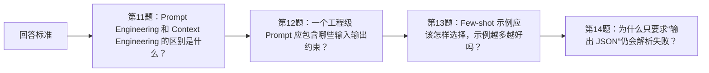

# 面试题（02） - Prompt、Rules 与 Context Engineering（第 11～20 题）

> 读完后，你应能完成以下任务：
> - 绘制“面试题（02） - Prompt、Rules 与 Context Engineering（第 11～20 题） / 回答标准”的关键对象与数据流，解释“原理题：说清机制、输入输出和相近概念的边界。”，并用源码位置、日志或 Trace 标注证据。
> - 为“面试题（02） - Prompt、Rules 与 Context Engineering（第 11～20 题） / 第11题：Prompt Engineering 和 Context Engineering 的区别是什么？”设计正常与异常输入，验证“核心答案： Prompt Engineering 优化目标、约束、示例和输出表达；”，输出首个偏差位置与回归测试结果。
> - 实现“面试题（02） - Prompt、Rules 与 Context Engineering（第 11～20 题） / 第12题：一个工程级 Prompt 应包含哪些输入输出约束？”的最小代码或配置，检验“核心答案： Prompt 负责表达，”，输出命令、结果与 Diff，并说明不适用边界。

<!-- article-progressive-block:start -->
# 一、先建立全局：Prompt、Rules 与 Context Engineering（第 11～20 题） 是什么？

理解“Prompt、Rules 与 Context Engineering（第 11～20 题）”，先要把标题中的对象放进同一条处理链：它接收什么输入，经过哪些状态变化，最终用什么证据判断结果。下表不另造概念，只把作者正文已经解释的章节按依赖顺序连起来。

“Prompt、Rules 与 Context Engineering（第 11～20 题）”的第一个核心判断是：原理题：说清机制、输入输出和相近概念的边界。。先弄清这个判断中的对象和输入输出，后面的实现、故障和验收才有共同语境。

| 顺序 | 章节 | 读完本节应抓住的结论 |
| --- | --- | --- |
| 1 | 回答标准 | 原理题：说清机制、输入输出和相近概念的边界。 |
| 2 | 第11题：Prompt Engineering 和 Context Engineering 的区别是什么？ | 核心答案： Prompt Engineering 优化目标、约束、示例和输出表达； |
| 3 | 第12题：一个工程级 Prompt 应包含哪些输入输出约束？ | 核心答案： Prompt 负责表达， |
| 4 | 第13题：Few-shot 示例应该怎样选择，示例越多越好吗？ | 核心答案： Few-shot 应覆盖最能区分业务边界的少量正反例，数量由回归集决定。 |
| 5 | 第14题：为什么只要求“输出 JSON”仍会解析失败？ | 核心答案： 优先使用模型支持的 JSON Schema 或 Structured Outputs， |
| 6 | 第15题：AGENTS.md、CLAUDE.md 和用户级规则的作用域怎样处理？ | 判断依据： Prompt 负责表达， |

## 1.1 核心对象之间怎样衔接



这张图只表达本文的讲解顺序，不替代正文机制。判断“Prompt、Rules 与 Context Engineering（第 11～20 题）”是否真正掌握，需要能从最后一个结果沿图回到前面每个章节的输入、状态变化和证据。

## 1.2 再看失败：问题最早会出现在哪一步？

在“Prompt、Rules 与 Context Engineering（第 11～20 题）”的对象和顺序已经明确后，再看可观察的失败：数据泄漏、只报均分、裁判未校准或样本不可追溯。定位时不从最后一条错误猜原因，而是沿上图找第一个偏离正文结论的节点。
<!-- article-progressive-block:end -->

# 二、回答标准

- **原理题**：说清机制、输入输出和相近概念的边界。
- **选型题**：给出约束、比较维度、不适用场景和最终依据。

# 三、第11题：Prompt Engineering 和 Context Engineering 的区别是什么？

**核心答案：** Prompt Engineering 优化目标、约束、示例和输出表达；
Context Engineering 决定本轮装入哪些规则、代码、历史、工具结果和证据。
前者解决“怎么说”，后者解决“给什么”。

**判断依据：** Prompt 负责表达，
Rules 负责稳定约束，
Context 负责运行时装配；
三者都必须版本化并用回归样本验证。

**工程实践：** 每个提交都应可独立解释和回退；
兼容性迁移要先扩展、再切流、最后清理旧路径。
面试时还应补充一个失败案例和对应的止损或回滚办法。

# 四、第12题：一个工程级 Prompt 应包含哪些输入输出约束？

**核心答案：** Prompt 负责表达，
Rules 负责稳定约束，
Context 负责运行时装配；
三者都必须版本化并用回归样本验证。

**判断依据：** Prompt 负责表达，
Rules 负责稳定约束，
Context 负责运行时装配；
三者都必须版本化并用回归样本验证。

**工程实践：** 每个提交都应可独立解释和回退；
兼容性迁移要先扩展、再切流、最后清理旧路径。
面试时还应补充一个失败案例和对应的止损或回滚办法。

# 五、第13题：Few-shot 示例应该怎样选择，示例越多越好吗？

**核心答案：** Few-shot 应覆盖最能区分业务边界的少量正反例，数量由回归集决定。
示例太多会增加成本、冲突和位置偏差；
示例与正式输入必须使用同一输出契约。

**判断依据：** Prompt 负责表达，
Rules 负责稳定约束，
Context 负责运行时装配；
三者都必须版本化并用回归样本验证。

并保存足够证据供复现和回滚。
面试时还应补充一个失败案例和对应的止损或回滚办法。

# 六、第14题：为什么只要求“输出 JSON”仍会解析失败？

**核心答案：** 优先使用模型支持的 JSON Schema 或 Structured Outputs，
服务端继续校验类型、枚举、长度和跨字段业务约束。
失败只允许有限修复，不能静默填默认值。

**判断依据：** Prompt 负责表达，
Rules 负责稳定约束，
Context 负责运行时装配；
三者都必须版本化并用回归样本验证。

并保存足够证据供复现和回滚。
面试时还应补充一个失败案例和对应的止损或回滚办法。

# 七、第15题：AGENTS.md、CLAUDE.md 和用户级规则的作用域怎样处理？

**核心答案：** 规则按组织、用户、仓库和子目录分层，
产品定义的高优先级规则先执行，
子目录规则只影响其作用域。
运行时记录实际命中的文件、顺序和哈希，冲突才能复现。

**判断依据：** Prompt 负责表达，
Rules 负责稳定约束，
Context 负责运行时装配；
三者都必须版本化并用回归样本验证。

并保存足够证据供复现和回滚。
面试时还应补充一个失败案例和对应的止损或回滚办法。

# 八、第16题：规则冲突时应该怎样确定优先级并留下证据？

**核心答案：** 规则按组织、用户、仓库和子目录分层，
产品定义的高优先级规则先执行，
子目录规则只影响其作用域。
运行时记录实际命中的文件、顺序和哈希，冲突才能复现。

**判断依据：** Prompt 负责表达，
Rules 负责稳定约束，
Context 负责运行时装配；
三者都必须版本化并用回归样本验证。

并保存足够证据供复现和回滚。
面试时还应补充一个失败案例和对应的止损或回滚办法。

# 九、第17题：如何在 Monorepo 中设计嵌套规则而不互相污染？

**核心答案：** 规则按组织、用户、仓库和子目录分层，
产品定义的高优先级规则先执行，
子目录规则只影响其作用域。
运行时记录实际命中的文件、顺序和哈希，冲突才能复现。

**判断依据：** Prompt 负责表达，
Rules 负责稳定约束，
Context 负责运行时装配；
三者都必须版本化并用回归样本验证。
文本、符号和图关系各自解决不同问题：关键词找字面证据，符号索引找定义引用，依赖图找影响传播。

**工程实践：** 用真实改动任务评估 Recall@K、定位准确率和无关上下文比例，
不能用“看起来相关”代替评测。
面试时还应补充一个失败案例和对应的止损或回滚办法。

# 十、第18题：上下文预算应该怎样分配给规则、代码、历史和工具结果？

**核心答案：** Prompt 负责表达，
Rules 负责稳定约束，
Context 负责运行时装配；
三者都必须版本化并用回归样本验证。

**判断依据：** Prompt 负责表达，
Rules 负责稳定约束，
Context 负责运行时装配；
三者都必须版本化并用回归样本验证。

**工程实践：** 降级策略要写清质量底线，
例如缩小候选集、切换模型或转人工，
而不是静默返回低质量结果。
面试时还应补充一个失败案例和对应的止损或回滚办法。

# 十一、第19题：如何识别并修复上下文污染和过时知识？

**核心答案：** 上下文块必须带来源、版本、时间和优先级。
压缩保留目标、约束、已验证事实、关键错误与下一步；
发现旧分支代码或过期工具结果时，先移除污染来源再重新装配。

**判断依据：** Prompt 负责表达，
Rules 负责稳定约束，
Context 负责运行时装配；
三者都必须版本化并用回归样本验证。

并保存足够证据供复现和回滚。
面试时还应补充一个失败案例和对应的止损或回滚办法。

# 十二、第20题：长任务压缩上下文时，哪些证据绝不能丢？

**核心答案：** 上下文块必须带来源、版本、时间和优先级。
压缩保留目标、约束、已验证事实、关键错误与下一步；
发现旧分支代码或过期工具结果时，先移除污染来源再重新装配。

**判断依据：** Prompt 负责表达，
Rules 负责稳定约束，
Context 负责运行时装配；
三者都必须版本化并用回归样本验证。

并保存足够证据供复现和回滚。
面试时还应补充一个失败案例和对应的止损或回滚办法。

<!-- article-progressive-block:start -->
# 十三、动手验证：先跑通 Prompt、Rules 与 Context Engineering（第 11～20 题），再改变一个变量

前面的章节已经建立问题、概念和机制。现在把“Prompt、Rules 与 Context Engineering（第 11～20 题）”放进同一套基线中运行；本节不再引入新术语，只验证前文结论能否被复现。

## 13.1 基线与候选只允许一个变量不同

验证“Prompt、Rules 与 Context Engineering（第 11～20 题）”时，先固定版本化数据集、切分规则、基线、Rubric、随机参数。候选方案只能改变本次要验证的变量；如果同时更换数据、依赖和配置，即使结果改善，也不能知道是哪一项产生作用。

执行“Prompt、Rules 与 Context Engineering（第 11～20 题）”时，动作是：同输入比较基线与候选的能力、安全、延迟和成本。原始结果不能只保留截图或汇总分数，必须同步保存：逐样本输出、评分理由、置信区间、失败标签、版本，使下一次复查可以在同一输入上重放。

| 实验要素 | 本文要求 |
| --- | --- |
| 固定条件 | 版本化数据集、切分规则、基线、Rubric、随机参数 |
| 唯一变量 | 本次候选方案与基线之间的一项明确差异 |
| 原始证据 | 逐样本输出、评分理由、置信区间、失败标签、版本 |
| 通过阈值 | 目标指标改善，通用能力与安全集不越过回退阈值 |
| 立即停止 | 数据泄漏、只报均分、裁判未校准或样本不可追溯 |

## 13.2 执行前先排除不可比较条件

“Prompt、Rules 与 Context Engineering（第 11～20 题）”开始前先确认下面四项；任一项不成立，都应先修复实验条件，而不是解释结果。

- 基线能够在“Prompt、Rules 与 Context Engineering（第 11～20 题）”的当前环境重复运行。
- 候选只改变一个与“Prompt、Rules 与 Context Engineering（第 11～20 题）”结论直接相关的条件。
- “Prompt、Rules 与 Context Engineering（第 11～20 题）”的基线和候选使用同一批输入、同一版本依赖与同一通过阈值。
- “Prompt、Rules 与 Context Engineering（第 11～20 题）”的原始输出和失败现场不会被重试、格式化或汇总覆盖。

## 13.3 执行后先核对证据完整性

结果出来后先检查证据，再讨论“Prompt、Rules 与 Context Engineering（第 11～20 题）”是否通过。缺少中间状态时，最终输出只能说明现象，不能证明机制。

| 检查项 | 当前文章的判定 |
| --- | --- |
| 输入可追溯 | 版本化数据集、切分规则、基线、Rubric、随机参数 |
| 过程可回放 | 同输入比较基线与候选的能力、安全、延迟和成本 |
| 结果可审计 | 逐样本输出、评分理由、置信区间、失败标签、版本 |

“Prompt、Rules 与 Context Engineering（第 11～20 题）”的一次合格基线对照按以下顺序执行：

1. 保存“Prompt、Rules 与 Context Engineering（第 11～20 题）”基线版本及输入摘要，确认基线本身可以重复运行。
2. 写下“Prompt、Rules 与 Context Engineering（第 11～20 题）”候选方案唯一变化的变量，以及它预期影响的指标。
3. 在同一环境执行“Prompt、Rules 与 Context Engineering（第 11～20 题）”：同输入比较基线与候选的能力、安全、延迟和成本。
4. 为“Prompt、Rules 与 Context Engineering（第 11～20 题）”保存：逐样本输出、评分理由、置信区间、失败标签、版本。
5. 使用“Prompt、Rules 与 Context Engineering（第 11～20 题）”预登记条件判断：目标指标改善，通用能力与安全集不越过回退阈值。
6. 如果“Prompt、Rules 与 Context Engineering（第 11～20 题）”未通过，不修改第二个变量，先恢复基线并保留失败现场。

# 十四、用一张矩阵验证 Prompt、Rules 与 Context Engineering（第 11～20 题） 的关键结论

矩阵按正文顺序列出“Prompt、Rules 与 Context Engineering（第 11～20 题）”的结论。一次实验只选择一行，只改变这一行对应的条件；不要把多行合并成一个无法归因的大实验。

| 正文章节 | 已解释的结论 | 本轮唯一变量 | 必须保存的证据 |
| --- | --- | --- | --- |
| 回答标准 | 原理题：说清机制、输入输出和相近概念的边界。 | 只改变与“回答标准”相关的条件 | 逐样本输出、评分理由、置信区间、失败标签、版本 |
| 第11题：Prompt Engineering 和 Context Engineering 的区别是什么？ | 核心答案： Prompt Engineering 优化目标、约束、示例和输出表达； | 只改变与“第11题：Prompt Engineering 和 Context Engineering 的区别是什么？”相关的条件 | 逐样本输出、评分理由、置信区间、失败标签、版本 |
| 第12题：一个工程级 Prompt 应包含哪些输入输出约束？ | 核心答案： Prompt 负责表达， | 只改变与“第12题：一个工程级 Prompt 应包含哪些输入输出约束？”相关的条件 | 逐样本输出、评分理由、置信区间、失败标签、版本 |
| 第13题：Few-shot 示例应该怎样选择，示例越多越好吗？ | 核心答案： Few-shot 应覆盖最能区分业务边界的少量正反例，数量由回归集决定。 | 只改变与“第13题：Few-shot 示例应该怎样选择，示例越多越好吗？”相关的条件 | 逐样本输出、评分理由、置信区间、失败标签、版本 |
| 第14题：为什么只要求“输出 JSON”仍会解析失败？ | 核心答案： 优先使用模型支持的 JSON Schema 或 Structured Outputs， | 只改变与“第14题：为什么只要求“输出 JSON”仍会解析失败？”相关的条件 | 逐样本输出、评分理由、置信区间、失败标签、版本 |
| 第15题：AGENTS.md、CLAUDE.md 和用户级规则的作用域怎样处理？ | 判断依据： Prompt 负责表达， | 只改变与“第15题：AGENTS.md、CLAUDE.md 和用户级规则的作用域怎样处理？”相关的条件 | 逐样本输出、评分理由、置信区间、失败标签、版本 |

## 14.1 记录本次实际实验

下面的记录用于“Prompt、Rules 与 Context Engineering（第 11～20 题）”当前这一次实验，不是第二套知识目录。先从矩阵选择一个章节，再填写实际值；没有填写的字段表示尚未验证。

```yaml
topic: "Prompt、Rules 与 Context Engineering（第 11～20 题）"
selected_chapter: required
claim_from_article: required
baseline_version: required
changed_condition: exactly_one
execution: "同输入比较基线与候选的能力、安全、延迟和成本"
evidence: "逐样本输出、评分理由、置信区间、失败标签、版本"
pass_when: "目标指标改善，通用能力与安全集不越过回退阈值"
stop_when: "数据泄漏、只报均分、裁判未校准或样本不可追溯"
observed_result: required
first_deviation: null_or_evidence
recovery_replay: required_after_failure
```

## 14.2 边界实验必须证明能够停止和恢复

成功路径只能证明“Prompt、Rules 与 Context Engineering（第 11～20 题）”在当前样本上工作，不能证明它可以进入生产。边界实验需要主动制造：数据泄漏、只报均分、裁判未校准或样本不可追溯，并观察系统是否在产生不可逆副作用前停止。

| 场景 | 只改变什么 | 应保存什么 | 通过标准 |
| --- | --- | --- | --- |
| 正常路径 | 使用已知有效输入 | 逐样本输出、评分理由、置信区间、失败标签、版本 | 目标指标改善，通用能力与安全集不越过回退阈值 |
| 边界路径 | 把一个输入推进到约束临界值 | 临界值前后的输出与指标 | 不静默降级，不把部分结果冒充成功 |
| 明确失败 | 注入：数据泄漏、只报均分、裁判未校准或样本不可追溯 | 原始错误、首个异常阶段和最终状态 | 失败被正确分类且没有扩大副作用 |
| 恢复重放 | 执行：保留基线，隔离失败样本，定位数据、提示、模型或裁判 | 原失败样本的复测证据 | 原样本恢复，正常样本没有回归 |

恢复动作不是简单重启。对于“Prompt、Rules 与 Context Engineering（第 11～20 题）”，第一步是：保留基线，隔离失败样本，定位数据、提示、模型或裁判。完成后使用原始失败样本复测；只验证一个新样本成功，不能证明触发条件已经消失。

“Prompt、Rules 与 Context Engineering（第 11～20 题）”边界实验结束后，应把正常、临界、失败和恢复四类记录放在同一个运行批次中。这样才能区分“候选方案真的修复问题”和“环境变化让问题暂时没有出现”。

# 十五、Prompt、Rules 与 Context Engineering（第 11～20 题） 的结果解释

解释“Prompt、Rules 与 Context Engineering（第 11～20 题）”实验时先看首个偏差，而不是最后一条错误。最后的异常通常只是上游状态错误的结果；从末端反推容易误把症状当根因。

| 观察结果 | 可以支持的判断 | 下一步 |
| --- | --- | --- |
| 主链路没有达到预期 | 数据泄漏、只报均分、裁判未校准或样本不可追溯 | 先执行：保留基线，隔离失败样本，定位数据、提示、模型或裁判 |
| 异常链路无法恢复 | 数据泄漏、只报均分、裁判未校准或样本不可追溯 | 先执行：保留基线，隔离失败样本，定位数据、提示、模型或裁判 |
| 新样本成功但原样本仍失败 | 修复没有覆盖原始触发条件 | 固定原失败输入，恢复基线后重新比较 |
| 指标改善但证据无法回链 | 数据、版本或中间状态没有固定 | 暂停发布，补齐可追溯记录后重跑 |

“Prompt、Rules 与 Context Engineering（第 11～20 题）”只有同时满足“目标指标改善，通用能力与安全集不越过回退阈值”，并且没有出现“数据泄漏、只报均分、裁判未校准或样本不可追溯”，才可以认为主链路通过。这里的“通过”只对当前固定版本、样本和环境有效，不能外推到尚未测试的容量、权限或数据分布。

如果“Prompt、Rules 与 Context Engineering（第 11～20 题）”候选方案与基线差异很小，先检查证据分辨率是否足够；如果差异很大，先排除数据泄漏、环境漂移和版本不一致。两种情况都不能只看一个汇总均值，需要回到逐样本输出和中间状态。

“Prompt、Rules 与 Context Engineering（第 11～20 题）”故障定位完成后，记录“现象、首个偏差、根因、改动、原样本复测”五项。缺少原样本复测时，只能标记为待观察，不能标记为已解决。

# 十六、Prompt、Rules 与 Context Engineering（第 11～20 题） 的发布判断

发布判断需要把“Prompt、Rules 与 Context Engineering（第 11～20 题）”的质量、失败边界和恢复能力放在同一份记录中。以下任一条件缺失，都应停止扩量，而不是用“基本正常”替代证据。

- [ ] “Prompt、Rules 与 Context Engineering（第 11～20 题）”的基线与候选只存在一个计划内变量。
- [ ] “Prompt、Rules 与 Context Engineering（第 11～20 题）”的输入、代码、依赖、配置和数据版本可以追溯。
- [ ] “Prompt、Rules 与 Context Engineering（第 11～20 题）”的正常、临界、失败和恢复样本使用同一套断言。
- [ ] “Prompt、Rules 与 Context Engineering（第 11～20 题）”的原始输出、中间状态和失败现场已经保留。
- [ ] “Prompt、Rules 与 Context Engineering（第 11～20 题）”的日志、Trace、截图和测试数据已经脱敏。
- [ ] “Prompt、Rules 与 Context Engineering（第 11～20 题）”的停止条件、负责人和回滚入口已经演练。
- [ ] “Prompt、Rules 与 Context Engineering（第 11～20 题）”尚未覆盖的输入、权限、容量和外部依赖已经登记。

最终记录至少包含基线版本、唯一变量、原始证据、首个偏差、恢复复测和发布责任人。没有参与本次修改的人如果不能据此重放“Prompt、Rules 与 Context Engineering（第 11～20 题）”的判断，就不能发布。
<!-- article-progressive-block:end -->

# 十七、总结

- **第11题：Prompt Engineering 和 Context Engineering 的区别是什么？**：核心答案： Prompt Engineering 优化目标、约束、示例和输出表达；
- **第12题：一个工程级 Prompt 应包含哪些输入输出约束？**：核心答案： Prompt 负责表达，Rules 负责稳定约束，Context 负责运行时装配；
- **第13题：Few-shot 示例应该怎样选择，示例越多越好吗？**：核心答案： Few-shot 应覆盖最能区分业务边界的少量正反例，数量由回归集决定。
- **第14题：为什么只要求“输出 JSON”仍会解析失败？**：核心答案： 优先使用模型支持的 JSON Schema 或 Structured Outputs，服务端继续校验类型、枚举、长度和跨字段业务约束。
- **第15题：AGENTS.md、CLAUDE.md 和用户级规则的作用域怎样处理？**：判断依据： Prompt 负责表达，Rules 负责稳定约束，Context 负责运行时装配；

## 参考资料

- [AI Engineering Interview Questions](https://github.com/amitshekhariitbhu/ai-engineering-interview-questions)
- [AI Engineering Field Guide](https://github.com/alexeygrigorev/ai-engineering-field-guide)
- [AI Agent Engineer Handbook](https://github.com/harrisliangsu/ai-agent-engineer-handbook)
- [AI Engineer Interview QA](https://github.com/Nareshedagotti/AI-Engineer-Interview-QA)
