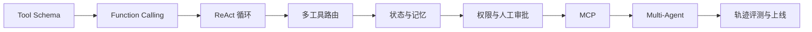

# 01 - Agent 工程：从 Tool Use 到 Multi-Agent

# 一、学习目标与适用边界

本模块只解决一件事：让模型在**受控、可观察、可中止**的条件下调用工具完成动态任务。学完后应能实现单 Agent 工具闭环，处理状态、权限、失败恢复和人工审批，并能判断何时需要 MCP 或 Multi-Agent。

不要因为流程里有大模型就使用 Agent。步骤固定、输入输出明确的任务优先写普通代码或工作流；只有下一步必须根据中间结果动态决定时，Agent 才能抵消它带来的延迟、成本与不确定性。

# 二、学习路径

建议按顺序学习，前一阶段的输出就是后一阶段的输入契约：

| 阶段 | 必须掌握 | 最小产物 |
| --- | --- | --- |
| Tool Use | JSON Schema、参数校验、错误返回 | 一个只允许白名单工具的调用器 |
| ReAct | Thought/Action/Observation、终止条件 | 有最大步数和总超时的执行循环 |
| 状态与记忆 | 会话状态、摘要、长期事实 | 可回放且不会跨租户串数据的状态层 |
| MCP | Client/Server、能力发现、权限边界 | 一个可审计的 MCP Tool 接入 |
| Multi-Agent | Supervisor、交接、并行与归并 | 有明确拆分收益的多 Agent 流程 |

# 三、工程基线

工具定义不能只有名称和描述，还要包含参数类型、必填字段、枚举范围、业务权限和幂等键。模型只负责提出调用意图，服务端仍要独立校验身份、参数和资源归属；删除、付款、发送等高风险操作必须进入人工确认。

每次运行至少记录 `trace_id`、模型与 Prompt 版本、工具入参摘要、工具结果状态、步骤数、Token、费用、总耗时和终止原因。循环同时设置最大步骤、单工具超时、Token 预算、费用预算和全局截止时间，不能只依赖模型自行停止。

Multi-Agent 只在三类边界下拆分：上下文相互污染、任务可并行、权限必须隔离。若只是给同一个 Prompt 换几个角色名称，通常会增加通信成本，却没有工程收益。

# 四、最小实践项目

实现一个“内部工单助手”：先检索知识库，再查询工单状态，必要时生成处理建议。读取操作可自动执行，修改工单必须确认。项目应包含：

- 工具注册表与 Schema 校验，未知工具直接拒绝。
- ReAct 循环、最大步数、超时、重试和失败终态。
- Redis 会话状态与可选长期偏好，按 `tenant_id + user_id` 隔离。
- 一条高风险审批路径，以及取消后不产生副作用的证明。
- 固定评测集，覆盖正确完成、错误参数、工具超时、提示词注入和越权调用。

# 五、常见失败与排查顺序

1. **工具选错**：先检查工具描述是否重叠，再看路由样本和参数 Schema，不要先换模型。
2. **循环不停止**：检查终止条件、Observation 是否可判定、失败是否被当成普通文本继续输入。
3. **重复执行副作用**：检查重试层是否携带幂等键，Checkpoint 恢复点是否位于副作用之后。
4. **记忆污染决策**：区分当前任务状态、会话摘要和长期事实，写入长期记忆前做事实校验与过期管理。
5. **多 Agent 更慢**：统计交接次数、重复上下文 Token 和串行等待，无法证明收益就合并回单 Agent。

# 六、验收标准

- 能用业务约束解释 Agent 与确定性工作流的边界。
- 工具调用具备类型校验、权限、幂等、超时、审计和危险操作确认。
- 运行轨迹可以重放，失败能定位到模型、路由、工具、状态或权限层。
- 评测同时覆盖最终任务成功率、工具选择准确率、参数正确率、平均步骤数和危险操作拦截率。
- Multi-Agent 的拆分有可测量收益，并有共享状态冲突和部分失败的处理方案。

# 七、总结

Agent 工程的核心不是让模型更自由，而是把动态决策装进可验证的执行框架。先做好单 Agent 的工具、状态和护栏，再引入 MCP 与 Multi-Agent。
