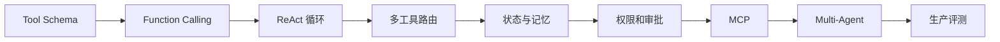

# 01 - Agent 工程：从 Tool Use 到 Multi-Agent

# 一、学习目标

这一模块只讨论“模型如何在受控状态下使用工具完成任务”。学习顺序是：工具 Schema → ReAct 循环 → 多工具路由 → 状态与记忆 → 权限和审批 → MCP → Multi-Agent。固定业务流程优先用普通代码或工作流，只有路径需要动态决策时才使用 Agent。

# 二、学习路径

# 三、验收标准

- 能解释 Agent 与确定性工作流的边界。
- 工具调用具备类型校验、权限、幂等、超时和审计。
- 循环具备最大步骤、Token、成本和全局截止时间。
- Multi-Agent 拆分基于上下文、并行或权限边界，而不是角色扮演。
- 评测同时覆盖最终结果、工具轨迹和危险操作拦截。

# 四、总结

Agent 工程的核心不是让模型更自由，而是让动态决策进入可观察、可中止、可审计的执行框架。
