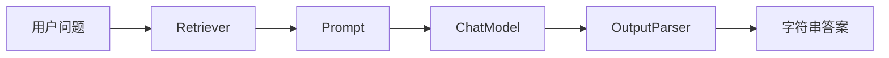

# LangChain（01） - LangChain 入门：从 Runnable 到真实模型调用

> 读完后，你应能：
> - 给定带变量的消息模板，能生成模板检查结果与最终消息列表，并用缺失变量错误证明输入契约真正生效。
> - 给定检索、Prompt、模型和解析四个步骤，能实现一条可运行的 Runnable 管道，并用逐步 Trace 验证前一步输出确实成为后一步输入。
> - 给定 OpenAI 兼容的 Base URL、API Key 和模型名，能在线执行真实 LangChain LCEL 链，并用模型正文、模型名和 Token 用量记录验收连接是否成功。
> - 给定超时、401、404、429 或输出为空的故障，能形成排障记录，并用请求配置、状态码和沙盒输出定位问题所在层级。

## 核心知识清单

- LangChain 解决的是组件接口和编排问题，不负责提升模型本身能力
- `PromptTemplate`、`ChatModel`、`OutputParser` 都实现 Runnable 协议
- LCEL 的 `|` 或 `.pipe()` 表示前一步输出传给后一步
- `invoke`、`batch`、`stream` 是同一条 Runnable 的不同执行方式
- 模型供应商集成独立安装，OpenAI 兼容接口使用 `ChatOpenAI`
- Base URL、API Key、模型名属于运行配置，不应写死在文章源码里
- 简单单次调用不一定需要 LangChain，多步骤组合和可观测性才是主要价值

# 一、LangChain 是什么？

LangChain 是用于组装大模型应用步骤的开源框架。它把 Prompt、模型、检索器、输出解析器等组件收敛到 Runnable 协议，使这些组件能用统一的输入输出方式执行和组合。

如果需求只是“发一句话给模型，再显示答案”，直接调用供应商 SDK 往往更简单。

LangChain 真正有价值的场景，是请求开始出现多个可替换步骤：

1. 把用户输入填进消息模板。
2. 根据问题选择模型或检索器。
3. 调用真实 ChatModel。
4. 把 `AIMessage` 转成字符串或结构化对象。
5. 给整条链增加重试、Trace、流式输出和批处理。

如果这些步骤全部裸写，代码很快会出现三类重复：

- 每个功能都重新处理输入、输出和异常。
- 更换模型时，业务代码也跟着改。
- 调试时只能看到最终错误，看不到失败发生在哪一步。

LangChain 的核心作用不是“让模型更聪明”，而是给这些步骤一个共同协议。

这个协议叫 Runnable。

只要组件遵循 Runnable，就可以用相同方式 `invoke`，也可以通过 LCEL 组合。

# 二、LangChain 的核心包与集成包

当前 LangChain 生态采用拆包结构。

| 包 | 负责什么 | 本文是否使用 |
| --- | --- | --- |
| `langchain` | Agent 等高层入口 | 只解释定位 |
| `langchain-core` / `@langchain/core` | Prompt、Runnable、消息、解析器 | 使用 |
| `langchain-openai` / `@langchain/openai` | OpenAI 与兼容供应商模型 | 使用 |
| `langchain-community` | 社区维护的第三方集成 | 本文不依赖 |

Python 项目通常安装 `langchain` 与 `langchain-openai`。

TypeScript 项目安装 `@langchain/core` 与 `@langchain/openai`。

不要从五年前的文章里复制 `from langchain import ...`，再猜为什么导入失败。

先看当前集成文档，再确认类属于核心包还是供应商包。

本文真实 API 沙盒使用 TypeScript，是因为博客服务端本身运行在 Node.js，可以真正执行与页面源码一致的 LangChain 链。

# 三、LangChain Prompt 不是字符串拼接，而是输入契约

模板最重要的价值不是少写一个格式化函数。

它把“这一步需要哪些变量”变成可以检查的契约。

例如模板需要 `context` 和 `question`，调用方只传 `question` 时，应当立即失败。

失败越靠近输入层，越容易定位；如果等模型返回错误答案才发现缺少资料，代价更高。

## 3.1 可运行实验：LangChain Prompt 模板变量与消息格式

下面的代码不访问模型，也不需要 API Key。

点击运行后应看到两条格式化消息，以及一次明确的缺失变量错误。

```python runnable file=main.py title="LangChain Prompt 输入契约" description="在浏览器中验证模板变量、消息角色和缺失字段错误。"
"""用标准库模拟 ChatPromptTemplate 的输入契约。"""

from __future__ import annotations

from dataclasses import dataclass


@dataclass(frozen=True, slots=True)
class MessageTemplate:
    """保存消息角色和带变量的文本模板。"""

    # 当前消息的角色，例如 system 或 human。
    role: str
    # 使用 str.format 语法的消息模板。
    template: str

    def format(self, values: dict[str, str]) -> dict[str, str]:
        """填充一条消息。

        Args:
            values: 本轮调用提供的模板变量。
        """
        try:
            # 格式化后的消息正文。
            content = self.template.format(**values)
        except KeyError as error:
            # 缺失的变量名。
            missing_name = str(error).strip("'")
            raise ValueError(f"缺少模板变量：{missing_name}") from error
        return {"role": self.role, "content": content}


def main() -> None:
    """格式化正常消息，并演示缺失变量时的快速失败。"""
    # 模板包含的两条消息。
    templates = [
        MessageTemplate("system", "只能根据资料回答。资料：{context}"),
        MessageTemplate("human", "问题：{question}"),
    ]
    # 正常调用使用的完整输入。
    valid_values = {
        "context": "报销应在消费后 30 天内提交。",
        "question": "报销期限是多少？",
    }
    # 格式化后的消息列表。
    messages = [template.format(valid_values) for template in templates]
    print("正常输入：")
    for message in messages:
        print(f"- {message['role']}: {message['content']}")

    try:
        # 故意缺少 context 的错误输入。
        invalid_values = {"question": "报销期限是多少？"}
        templates[0].format(invalid_values)
    except ValueError as error:
        print(f"\n契约检查：{error}")


if __name__ == "__main__":
    main()
```

## 3.2 怎么判断这一层是否写对？

不要只看“代码没有报错”。

至少检查四件事：

- System 与 Human 消息角色是否正确。
- 模板变量是否与调用输入同名。
- 缺失变量是否在调用模型之前失败。
- 最终消息中是否意外包含密钥、内部规则或无关上下文。

# 四、Runnable 与 LCEL 到底做了什么？

Runnable 可以理解成统一的函数盒子。

每个盒子接收一个输入，返回一个输出。

LCEL 负责把盒子连接起来。



<!-- DIAGRAM_DESCRIPTION: 一条从用户问题开始的 LCEL 数据流。问题先进入 Retriever 得到证据，证据和问题一起进入 Prompt，格式化消息交给 ChatModel，最后由 OutputParser 转成字符串答案。 -->

在 Python 里通常写成 `retriever | prompt | model | parser`。

在 TypeScript 里可以写成 `retriever.pipe(prompt).pipe(model).pipe(parser)`。

两种写法表达同一个约束：后一步必须接得住前一步的数据类型。

如果 Retriever 返回字符串，而 Prompt 期待 `{context, question}` 对象，链会在中间失败。

所以看 LCEL 不能只看组件名字，还要看每一步的输入和输出。

# 五、离线实现一条可观察的 LCEL 管道

真实 LangChain 的 Runnable 还支持异步、批处理、流式和配置传播。

先用标准库实现最小版本，可以把数据流看得更清楚。

## 5.1 可运行实验：Retriever 到 Parser 的完整链

这个实验不访问网络，不显示 Base URL 或 Key。

运行结果会逐步打印每个节点的输入和输出。

```python runnable file=main.py title="离线 LCEL 数据流" description="运行 Retriever、Prompt、FakeModel 和 Parser 管道，观察每一步输入输出。"
"""用标准库实现可追踪的最小 Runnable 管道。"""

from __future__ import annotations

from collections.abc import Callable
from dataclasses import dataclass
from typing import Any


@dataclass(frozen=True, slots=True)
class Runnable:
    """包装单个处理步骤，并支持竖线组合。"""

    # Trace 中展示的步骤名。
    name: str
    # 当前步骤实际执行的函数。
    function: Callable[[Any], Any]

    def invoke(self, value: Any) -> Any:
        """执行一步并打印输入输出。

        Args:
            value: 上一步返回的数据。
        """
        print(f"[{self.name}] 输入：{value}")
        # 当前步骤的执行结果。
        result = self.function(value)
        print(f"[{self.name}] 输出：{result}\n")
        return result

    def __or__(self, next_step: "Runnable") -> "Runnable":
        """把当前步骤与下一步骤组合。

        Args:
            next_step: 接收当前输出的后续 Runnable。
        """
        # 组合后用于 Trace 的步骤名。
        combined_name = f"{self.name} | {next_step.name}"

        def run_pipeline(value: Any) -> Any:
            """依次执行当前步骤和后续步骤。

            Args:
                value: 整条组合链的初始输入。
            """
            # 当前 Runnable 的输出。
            current_result = self.invoke(value)
            return next_step.invoke(current_result)

        return Runnable(combined_name, run_pipeline)


def retrieve(question: str) -> dict[str, str]:
    """根据关键词返回演示资料。

    Args:
        question: 用户原始问题。
    """
    # 演示知识库中的制度资料。
    document = "报销应在消费后 30 天内提交。"
    # 是否命中报销主题。
    has_match = "报销" in question
    return {
        "question": question,
        "context": document if has_match else "",
    }


def format_prompt(values: dict[str, str]) -> str:
    """把证据和问题格式化成模型输入。

    Args:
        values: Retriever 返回的问题与证据。
    """
    return f"只能根据资料回答。\n资料：{values['context']}\n问题：{values['question']}"


def fake_model(prompt: str) -> str:
    """根据演示资料返回确定性答案。

    Args:
        prompt: 已格式化的模型输入。
    """
    if "资料：\n" in prompt:
        return "ANSWER: 资料不足，无法回答。"
    return "ANSWER: 报销应在消费后 30 天内提交。"


def parse_output(model_output: str) -> str:
    """删除演示模型的协议前缀。

    Args:
        model_output: FakeModel 返回的原始文本。
    """
    return model_output.removeprefix("ANSWER: ").strip()


def main() -> None:
    """组装并运行一条完整离线管道。"""
    # 四个可独立替换的 Runnable 节点。
    retriever = Runnable("Retriever", retrieve)
    # Prompt 格式化节点。
    prompt = Runnable("Prompt", format_prompt)
    # 离线确定性模型节点。
    model = Runnable("FakeModel", fake_model)
    # 输出解析节点。
    parser = Runnable("OutputParser", parse_output)
    # LCEL 风格的组合链。
    chain = retriever | prompt | model | parser

    print("=== 命中资料 ===")
    # 命中资料时的最终答案。
    matched_answer = chain.invoke("报销期限是多少？")
    print(f"最终答案：{matched_answer}\n")

    print("=== 未命中资料 ===")
    # 未命中资料时的最终答案。
    missed_answer = chain.invoke("年假有几天？")
    print(f"最终答案：{missed_answer}")


if __name__ == "__main__":
    main()
```

## 5.2 从 Trace 里看什么？

命中问题应满足：

- Retriever 返回非空 `context`。
- Prompt 同时包含资料和问题。
- FakeModel 只使用资料里的期限。
- Parser 删除协议前缀，不改变答案含义。

未命中问题应满足：

- Retriever 返回空 `context`。
- 模型层明确拒答。
- Parser 仍能处理拒答文本。

这就是生产排障时需要的最小证据链。

只有最终答案，没有中间输入输出，无法判断问题来自检索、Prompt、模型还是解析器。

# 六、什么时候应该用 LangChain？

可以按组件数量与变化频率做判断。

| 场景 | 是否建议使用 | 原因 |
| --- | --- | --- |
| 固定 Prompt，只调用一次模型 | 通常不需要 | 供应商 SDK 更直接 |
| Prompt、模型、解析器需要独立替换 | 建议 | Runnable 接口降低耦合 |
| 同一条链需要 invoke、batch、stream | 建议 | 执行接口统一 |
| 需要 Tool、Agent 或 LangGraph | 建议 | 能复用生态组件 |
| 团队无法看懂多层抽象 | 暂缓 | 先把数据流和 Trace 建清楚 |

不要因为“以后可能复杂”就先引入十层封装。

先画出真实数据流，再判断哪些步骤需要复用和替换。

# 七、真实模型调用：用 LangChain 验证连接与 LCEL

前两个实验只验证了抽象和数据流，没有证明供应商连接可用。

下面的实验会真正运行：

1. `ChatPromptTemplate` 生成 System 与 Human 消息。
2. `ChatOpenAI` 使用你输入的 Base URL、Key 和模型。
3. LCEL 把模板输出交给真实 ChatModel。
4. `StringOutputParser` 把 `AIMessage` 转成字符串。
5. 页面显示模型正文、模型名和供应商返回的 Token 用量。

## 7.1 安装与本地运行边界

复制源码到本地 TypeScript 项目时，需要安装 `@langchain/core` 和 `@langchain/openai`。

安装命令是 `pnpm add @langchain/core @langchain/openai`。

不要把 Key 写进源码或提交到 Git。

本地应用应通过环境变量或密钥管理服务注入。

在线沙盒则只把 Key 保存在当前页面组件内存，并通过同源请求交给服务端 LangChain。

## 7.2 可运行实验：真实 LangChain API

只有这个代码单元涉及真实模型，因此只有这里显示连接配置。

Base URL 必须是公网 HTTPS 地址。

沙盒拒绝 localhost、私网 IP、云元数据地址和 HTTP 明文地址。

运行时不会记录 Key，也不会把 Key 放进 URL、LocalStorage 或错误日志。

```typescript runnable model-sandbox file=main.ts title="真实 LangChain LCEL" description="服务端执行源码对应的 ChatPromptTemplate、ChatOpenAI 和 StringOutputParser 链。" prompt="请用两句话解释 LangChain 的 Runnable 和 LCEL 分别解决什么问题。"
import { StringOutputParser } from '@langchain/core/output_parsers'
import { ChatPromptTemplate } from '@langchain/core/prompts'
import { ChatOpenAI } from '@langchain/openai'

/** 当前模型连接由页面表单临时注入。 */
interface ModelConnection {
  /** OpenAI 兼容接口根地址。 */
  baseUrl: string
  /** 只用于本次请求的 API Key。 */
  apiKey: string
  /** 供应商支持的模型标识。 */
  model: string
}

/**
 * 通过真实 LangChain LCEL 链回答一个问题。
 * @param connection 页面临时提供的模型连接。
 * @param question 用户在沙盒中输入的问题。
 * @returns StringOutputParser 解析后的模型正文。
 */
async function invokeLangChain(
  connection: ModelConnection,
  question: string
): Promise<string> {
  /** 负责格式化 System 与 Human 消息的 Prompt。 */
  const promptTemplate = ChatPromptTemplate.fromMessages([
    ['system', '你是技术学习助手。回答要准确、简洁，不编造未提供的事实。'],
    ['human', '{question}']
  ])
  /** 使用用户临时连接信息创建的真实 ChatModel。 */
  const chatModel = new ChatOpenAI({
    model: connection.model,
    apiKey: connection.apiKey,
    temperature: 0,
    maxRetries: 0,
    timeout: 45_000,
    configuration: {
      baseURL: connection.baseUrl
    }
  })
  /** LCEL 把消息模板、真实模型和字符串解析器串成一条链。 */
  const chain = promptTemplate.pipe(chatModel).pipe(new StringOutputParser())
  return chain.invoke({ question })
}

export { invokeLangChain }
```

## 7.3 如何判断真实验证成功？

不能只看“出现了一段文字”。

成功记录至少包含：

- 页面状态是“运行成功”。
- 输出区显示实际模型名。
- 返回正文回答了当前 Prompt。
- 如果供应商提供 Usage，Token 数应为非负整数。
- Key 不出现在源码、地址栏、控制台或输出区。

如果供应商不返回 Token Usage，页面会显示“未知”。

这不代表请求失败，只代表兼容接口没有提供该字段。

# 八、Base URL、Key 和模型该怎么填？

OpenAI 官方地址通常是 `https://api.openai.com/v1`。

其他供应商需要填写其 OpenAI 兼容根地址，而不是控制台首页。

模型名必须使用供应商实际支持的标识。

例如同一个 `gpt-4o-mini` 名字，不能假设所有代理都提供。

页面提供常用模型选项，也允许选择“自定义模型”。

如果供应商要求 Azure 专用部署路径或不同认证头，当前通用沙盒不一定适用。

这种情况不能靠反复换 Key 解决，应查供应商自己的 LangChain 集成说明。

# 九、失败时按层排查，不要先改 Prompt

| 现象 | 最可能层级 | 先检查什么 |
| --- | --- | --- |
| 页面提示字段不完整 | 表单输入 | Base URL、Key、模型、Prompt 是否为空 |
| 拒绝 HTTP 或私网地址 | 安全代理 | 是否使用公网 HTTPS API 根地址 |
| 401 或 403 | 供应商认证 | Key 是否有效、是否有模型权限 |
| 404 | Base URL 或模型 | 是否漏了 `/v1`、模型名是否存在 |
| 429 | 配额或限流 | 余额、RPM、TPM 与并发限制 |
| 连接超时 | 网络或上游 | 域名、供应商状态、代理链路 |
| 返回空文本 | 兼容协议 | 是否返回标准 Chat Completions 消息结构 |
| 模型回答错误 | Prompt 或模型能力 | 先保存实际消息，再调整模板或模型 |

认证失败不是 Prompt 问题。

404 也不代表 LangChain 的 LCEL 写错了。

先按层保存证据，再改变单一变量。

# 十、把第一条生产链写对

第一次接入建议按下面顺序：

1. 固定一个短 Prompt 和一个确定的模型。
2. 先运行真实模型沙盒，确认 Base URL、Key、模型三者匹配。
3. 保存模型名、响应正文、Token 用量和错误状态。
4. 再把 Prompt 抽成模板变量。
5. 再增加 `StringOutputParser` 或结构化解析。
6. 再接 Retriever、Tool 或路由。
7. 每增加一步，都保留该步输入输出的 Trace。
8. 最后才增加重试、流式、批处理和动态模型选择。

这套顺序能把“连接问题”和“业务链问题”分开。

如果第一步都不稳定，增加更多 Runnable 只会让错误更难找。

# 十一、上线前验收清单

- [ ] 所有正文代码块都显示对应在线实验。
- [ ] 不调用模型的实验不显示 Base URL、Key 或模型字段。
- [ ] 真实模型实验缺少任一必填字段时不会发请求。
- [ ] Key 输入框使用密码模式，重载页面后不会恢复旧值。
- [ ] Base URL 只接受公网 HTTPS 地址。
- [ ] 供应商重定向不会携带 Key 继续请求。
- [ ] 模型失败不自动重试，避免重复计费。
- [ ] 运行超过 45 秒时由服务端中止。
- [ ] 页面允许用户主动停止请求。
- [ ] 错误信息不会回显 API Key。
- [ ] 输出区能区分模型正文、模型名和 Token 用量。
- [ ] 本地复制源码时仍使用环境变量或密钥服务管理 Key。

# 十二、总结

- LangChain 的核心价值是统一组件接口与编排，不是增强模型知识或推理能力。
- Prompt、ChatModel 与 OutputParser 都可以视为 Runnable；LCEL 负责连接它们的数据流。
- 看一条链时，必须同时检查每一步的输入类型、输出类型和失败位置。
- 单次固定模型调用通常不需要 LangChain；多组件替换、批处理、流式、Tool 和可观测性更适合使用它。
- 离线沙盒用于验证抽象与数据流，真实模型沙盒用于验证 LangChain、供应商连接和响应解析。
- Base URL、Key、模型只在真实模型代码单元出现；Key 只用于当前请求，不应持久化或写入源码。
- 生产排障应先区分表单、安全代理、认证、Base URL、模型、协议与 Prompt 层级。

## 参考资料

- [LangChain Python Overview](https://docs.langchain.com/oss/python/langchain/overview)
- [LangChain ChatOpenAI Integration](https://docs.langchain.com/oss/python/integrations/chat/openai)
- [LangChain JavaScript ChatOpenAI Integration](https://docs.langchain.com/oss/javascript/integrations/chat/openai)
- [LangChain PromptTemplate Reference](https://reference.langchain.com/python/langchain-core/prompts/)
