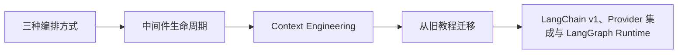

# LangChain（07） - LangChain v1 运行时、中间件与迁移边界

> 读完后，你应能完成以下任务：
> - 绘制“LangChain（07） - LangChain v1 运行时、中间件与迁移边界 / 三种编排方式”的关键对象与数据流，解释“模型需要在有限工具间循环选择时使用 create_agent；”，并用源码位置、日志或 Trace 标注证据。
> - 为“LangChain（07） - LangChain v1 运行时、中间件与迁移边界 / 中间件生命周期”设计正常与异常输入，验证“before_agent 适合初始化运行上下文；”，输出首个偏差位置与回归测试结果。
> - 实现“LangChain（07） - LangChain v1 运行时、中间件与迁移边界 / Context Engineering”的最小代码或配置，检验“消息历史只是上下文的一部分。”，输出命令、结果与 Diff，并说明不适用边界。

> LangChain v1 的核心价值是统一 Model、Message、Tool、Middleware 和 Agent Runtime，而不是让业务代码依赖更多魔法封装。


## 核心知识清单

- LangChain v1、Provider 集成与 LangGraph Runtime
- Model、Message、Tool、Retriever 与结构化输出
- 固定 Chain、Agent Loop 与 Graph 的选择边界
- response_format、context_schema 与 recursion_limit
- before_agent、before_model、wrap_model_call 与 wrap_tool_call
- 消息裁剪、Context Offloading 与 Prompt Caching
- AgentExecutor、ConversationChain 与版本迁移

<!-- article-progressive-block:start -->
# 一、先建立全局：LangChain v1 运行时、中间件与迁移边界 是什么？

理解“LangChain v1 运行时、中间件与迁移边界”，先要把标题中的对象放进同一条处理链：它接收什么输入，经过哪些状态变化，最终用什么证据判断结果。下表不另造概念，只把作者正文已经解释的章节按依赖顺序连起来。

“LangChain v1 运行时、中间件与迁移边界”的第一个核心判断是：模型需要在有限工具间循环选择时使用 create_agent；。先弄清这个判断中的对象和输入输出，后面的实现、故障和验收才有共同语境。

| 顺序 | 章节 | 读完本节应抓住的结论 |
| --- | --- | --- |
| 1 | 三种编排方式 | 模型需要在有限工具间循环选择时使用 create_agent； |
| 2 | 中间件生命周期 | before_agent 适合初始化运行上下文； |
| 3 | Context Engineering | 消息历史只是上下文的一部分。 |
| 4 | 从旧教程迁移 | 迁移顺序是：明确输入输出 Schema， |
| 5 | LangChain v1、Provider 集成与 LangGraph Runtime | LangChain v1 的核心价值是统一 Model、Message、Tool、Middleware 和 Agent Runtime，而不是让业务代码依赖更多魔法封装。 |
| 6 | Model、Message、Tool、Retriever 与结构化输出 | LangChain v1 的核心价值是统一 Model、Message、Tool、Middleware 和 Agent Runtime，而不是让业务代码依赖更多魔法封装。 |

## 1.1 核心对象之间怎样衔接



这张图只表达本文的讲解顺序，不替代正文机制。判断“LangChain v1 运行时、中间件与迁移边界”是否真正掌握，需要能从最后一个结果沿图回到前面每个章节的输入、状态变化和证据。

## 1.2 再看失败：问题最早会出现在哪一步？

在“LangChain v1 运行时、中间件与迁移边界”的对象和顺序已经明确后，再看可观察的失败：字段到模型阶段才报错、Parser 吞掉原始输出、流式中断被当成完整成功。定位时不从最后一条错误猜原因，而是沿上图找第一个偏离正文结论的节点。
<!-- article-progressive-block:end -->

# 二、三种编排方式

固定步骤、无模型决策时使用 LCEL Chain；
模型需要在有限工具间循环选择时使用 `create_agent`；
需要分支、并行、人工中断、持久化恢复或确定性节点时使用 LangGraph。
不要因为“以后可能复杂”就把简单抽取做成 Agent。

`create_agent` 需要显式控制：

- `response_format`：最终结构化结果的 Schema。
- `context_schema`：运行期依赖，如用户、租户和权限上下文。
- `recursion_limit`：防止工具循环失控。
- Tool：严格参数 Schema、错误语义和副作用边界。

`response_format` 约束 Agent 的最终业务结果，
适合把自然语言收敛为可校验的结构化对象；
它不负责约束每次 Tool 的参数。
`context_schema` 定义运行期依赖的类型，
例如 `tenant_id`、用户权限和请求配置，
这些数据由应用注入，
不能让模型从用户文本中自行生成。

两者必须分开：前者是模型输出契约，后者是可信运行上下文契约。
若把租户或权限混进 `response_format`，模型就可能“回答”出一个身份；
若把业务结果塞进 `context_schema`，中间件又无法对最终输出做独立校验。

# 三、中间件生命周期

`before_agent` 适合初始化运行上下文；
`before_model` 可裁剪消息或注入动态规则；
`wrap_model_call` 适合模型路由、重试与追踪；
`wrap_tool_call` 适合参数校验、授权、审批和结果截断；
`after_model` 与 `after_agent` 用于校验和收尾。
观察性逻辑不能悄悄改变业务结果，策略性中间件必须有独立测试。

`wrap_model_call` 包裹一次真实模型调用，
因此可以依据上下文选择模型、记录 Token 与延迟，
并对可重试错误执行有上限的退避。
它不能无条件重试解析失败或安全拒绝，否则会增加成本并把确定性错误伪装成偶发故障。

# 四、Context Engineering

消息历史只是上下文的一部分。
长期事实、检索证据、工具结果和运行配置应各自有来源与预算。
超出窗口时，优先把大结果存入对象存储或虚拟文件系统，只把引用和摘要留给模型；
稳定的前缀可以利用 Prompt Caching，但缓存键必须包含权限与版本。

# 五、从旧教程迁移

遇到 `AgentExecutor`、`ConversationChain` 或隐式 Memory 时，
先核对版本，
不要直接复制。
迁移顺序是：明确输入输出 Schema，
抽离 Tool，
显式定义 Context 和 State，
再迁移到 v1 Agent 或 LangGraph，
最后用固定 Dataset 对比行为。
旧版能运行不代表具有持久化、HIL 或可观测语义。

<!-- article-progressive-block:start -->
# 六、动手验证：先跑通 LangChain v1 运行时、中间件与迁移边界，再改变一个变量

前面的章节已经建立问题、概念和机制。现在把“LangChain v1 运行时、中间件与迁移边界”放进同一套基线中运行；本节不再引入新术语，只验证前文结论能否被复现。

## 6.1 基线与候选只允许一个变量不同

验证“LangChain v1 运行时、中间件与迁移边界”时，先固定Runnable 输入类型、Prompt 变量、依赖版本、模型替身和异常样本。候选方案只能改变本次要验证的变量；如果同时更换数据、依赖和配置，即使结果改善，也不能知道是哪一项产生作用。

执行“LangChain v1 运行时、中间件与迁移边界”时，动作是：逐段 invoke 并记录 Retriever、Prompt、Model、Parser 的输入输出，再比较整链结果。原始结果不能只保留截图或汇总分数，必须同步保存：各 Runnable 的序列化输入输出、Trace、异常类型、预期断言和依赖版本，使下一次复查可以在同一输入上重放。

| 实验要素 | 本文要求 |
| --- | --- |
| 固定条件 | Runnable 输入类型、Prompt 变量、依赖版本、模型替身和异常样本 |
| 唯一变量 | 本次候选方案与基线之间的一项明确差异 |
| 原始证据 | 各 Runnable 的序列化输入输出、Trace、异常类型、预期断言和依赖版本 |
| 通过阈值 | 数据形状逐段匹配，错误停在首个失效边界，整链结果能由中间状态解释 |
| 立即停止 | 字段到模型阶段才报错、Parser 吞掉原始输出、流式中断被当成完整成功 |

## 6.2 执行前先排除不可比较条件

“LangChain v1 运行时、中间件与迁移边界”开始前先确认下面四项；任一项不成立，都应先修复实验条件，而不是解释结果。

- 基线能够在“LangChain v1 运行时、中间件与迁移边界”的当前环境重复运行。
- 候选只改变一个与“LangChain v1 运行时、中间件与迁移边界”结论直接相关的条件。
- “LangChain v1 运行时、中间件与迁移边界”的基线和候选使用同一批输入、同一版本依赖与同一通过阈值。
- “LangChain v1 运行时、中间件与迁移边界”的原始输出和失败现场不会被重试、格式化或汇总覆盖。

## 6.3 执行后先核对证据完整性

结果出来后先检查证据，再讨论“LangChain v1 运行时、中间件与迁移边界”是否通过。缺少中间状态时，最终输出只能说明现象，不能证明机制。

| 检查项 | 当前文章的判定 |
| --- | --- |
| 输入可追溯 | Runnable 输入类型、Prompt 变量、依赖版本、模型替身和异常样本 |
| 过程可回放 | 逐段 invoke 并记录 Retriever、Prompt、Model、Parser 的输入输出，再比较整链结果 |
| 结果可审计 | 各 Runnable 的序列化输入输出、Trace、异常类型、预期断言和依赖版本 |

“LangChain v1 运行时、中间件与迁移边界”的一次合格基线对照按以下顺序执行：

1. 保存“LangChain v1 运行时、中间件与迁移边界”基线版本及输入摘要，确认基线本身可以重复运行。
2. 写下“LangChain v1 运行时、中间件与迁移边界”候选方案唯一变化的变量，以及它预期影响的指标。
3. 在同一环境执行“LangChain v1 运行时、中间件与迁移边界”：逐段 invoke 并记录 Retriever、Prompt、Model、Parser 的输入输出，再比较整链结果。
4. 为“LangChain v1 运行时、中间件与迁移边界”保存：各 Runnable 的序列化输入输出、Trace、异常类型、预期断言和依赖版本。
5. 使用“LangChain v1 运行时、中间件与迁移边界”预登记条件判断：数据形状逐段匹配，错误停在首个失效边界，整链结果能由中间状态解释。
6. 如果“LangChain v1 运行时、中间件与迁移边界”未通过，不修改第二个变量，先恢复基线并保留失败现场。

# 七、用一张矩阵验证 LangChain v1 运行时、中间件与迁移边界 的关键结论

矩阵按正文顺序列出“LangChain v1 运行时、中间件与迁移边界”的结论。一次实验只选择一行，只改变这一行对应的条件；不要把多行合并成一个无法归因的大实验。

| 正文章节 | 已解释的结论 | 本轮唯一变量 | 必须保存的证据 |
| --- | --- | --- | --- |
| 三种编排方式 | 模型需要在有限工具间循环选择时使用 create_agent； | 只改变与“三种编排方式”相关的条件 | 各 Runnable 的序列化输入输出、Trace、异常类型、预期断言和依赖版本 |
| 中间件生命周期 | before_agent 适合初始化运行上下文； | 只改变与“中间件生命周期”相关的条件 | 各 Runnable 的序列化输入输出、Trace、异常类型、预期断言和依赖版本 |
| Context Engineering | 消息历史只是上下文的一部分。 | 只改变与“Context Engineering”相关的条件 | 各 Runnable 的序列化输入输出、Trace、异常类型、预期断言和依赖版本 |
| 从旧教程迁移 | 迁移顺序是：明确输入输出 Schema， | 只改变与“从旧教程迁移”相关的条件 | 各 Runnable 的序列化输入输出、Trace、异常类型、预期断言和依赖版本 |
| LangChain v1、Provider 集成与 LangGraph Runtime | LangChain v1 的核心价值是统一 Model、Message、Tool、Middleware 和 Agent Runtime，而不是让业务代码依赖更多魔法封装。 | 只改变与“LangChain v1、Provider 集成与 LangGraph Runtime”相关的条件 | 各 Runnable 的序列化输入输出、Trace、异常类型、预期断言和依赖版本 |
| Model、Message、Tool、Retriever 与结构化输出 | LangChain v1 的核心价值是统一 Model、Message、Tool、Middleware 和 Agent Runtime，而不是让业务代码依赖更多魔法封装。 | 只改变与“Model、Message、Tool、Retriever 与结构化输出”相关的条件 | 各 Runnable 的序列化输入输出、Trace、异常类型、预期断言和依赖版本 |

## 7.1 记录本次实际实验

下面的记录用于“LangChain v1 运行时、中间件与迁移边界”当前这一次实验，不是第二套知识目录。先从矩阵选择一个章节，再填写实际值；没有填写的字段表示尚未验证。

```yaml
topic: "LangChain v1 运行时、中间件与迁移边界"
selected_chapter: required
claim_from_article: required
baseline_version: required
changed_condition: exactly_one
execution: "逐段 invoke 并记录 Retriever、Prompt、Model、Parser 的输入输出，再比较整链结果"
evidence: "各 Runnable 的序列化输入输出、Trace、异常类型、预期断言和依赖版本"
pass_when: "数据形状逐段匹配，错误停在首个失效边界，整链结果能由中间状态解释"
stop_when: "字段到模型阶段才报错、Parser 吞掉原始输出、流式中断被当成完整成功"
observed_result: required
first_deviation: null_or_evidence
recovery_replay: required_after_failure
```

## 7.2 边界实验必须证明能够停止和恢复

成功路径只能证明“LangChain v1 运行时、中间件与迁移边界”在当前样本上工作，不能证明它可以进入生产。边界实验需要主动制造：字段到模型阶段才报错、Parser 吞掉原始输出、流式中断被当成完整成功，并观察系统是否在产生不可逆副作用前停止。

| 场景 | 只改变什么 | 应保存什么 | 通过标准 |
| --- | --- | --- | --- |
| 正常路径 | 使用已知有效输入 | 各 Runnable 的序列化输入输出、Trace、异常类型、预期断言和依赖版本 | 数据形状逐段匹配，错误停在首个失效边界，整链结果能由中间状态解释 |
| 边界路径 | 把一个输入推进到约束临界值 | 临界值前后的输出与指标 | 不静默降级，不把部分结果冒充成功 |
| 明确失败 | 注入：字段到模型阶段才报错、Parser 吞掉原始输出、流式中断被当成完整成功 | 原始错误、首个异常阶段和最终状态 | 失败被正确分类且没有扩大副作用 |
| 恢复重放 | 执行：隔离失败 Runnable，固定其输入单独重放，再恢复相邻节点契约测试 | 原失败样本的复测证据 | 原样本恢复，正常样本没有回归 |

恢复动作不是简单重启。对于“LangChain v1 运行时、中间件与迁移边界”，第一步是：隔离失败 Runnable，固定其输入单独重放，再恢复相邻节点契约测试。完成后使用原始失败样本复测；只验证一个新样本成功，不能证明触发条件已经消失。

“LangChain v1 运行时、中间件与迁移边界”边界实验结束后，应把正常、临界、失败和恢复四类记录放在同一个运行批次中。这样才能区分“候选方案真的修复问题”和“环境变化让问题暂时没有出现”。

# 八、LangChain v1 运行时、中间件与迁移边界 的结果解释

解释“LangChain v1 运行时、中间件与迁移边界”实验时先看首个偏差，而不是最后一条错误。最后的异常通常只是上游状态错误的结果；从末端反推容易误把症状当根因。

| 观察结果 | 可以支持的判断 | 下一步 |
| --- | --- | --- |
| 主链路没有达到预期 | 字段到模型阶段才报错、Parser 吞掉原始输出、流式中断被当成完整成功 | 先执行：隔离失败 Runnable，固定其输入单独重放，再恢复相邻节点契约测试 |
| 异常链路无法恢复 | 字段到模型阶段才报错、Parser 吞掉原始输出、流式中断被当成完整成功 | 先执行：隔离失败 Runnable，固定其输入单独重放，再恢复相邻节点契约测试 |
| 新样本成功但原样本仍失败 | 修复没有覆盖原始触发条件 | 固定原失败输入，恢复基线后重新比较 |
| 指标改善但证据无法回链 | 数据、版本或中间状态没有固定 | 暂停发布，补齐可追溯记录后重跑 |

“LangChain v1 运行时、中间件与迁移边界”只有同时满足“数据形状逐段匹配，错误停在首个失效边界，整链结果能由中间状态解释”，并且没有出现“字段到模型阶段才报错、Parser 吞掉原始输出、流式中断被当成完整成功”，才可以认为主链路通过。这里的“通过”只对当前固定版本、样本和环境有效，不能外推到尚未测试的容量、权限或数据分布。

如果“LangChain v1 运行时、中间件与迁移边界”候选方案与基线差异很小，先检查证据分辨率是否足够；如果差异很大，先排除数据泄漏、环境漂移和版本不一致。两种情况都不能只看一个汇总均值，需要回到逐样本输出和中间状态。

“LangChain v1 运行时、中间件与迁移边界”故障定位完成后，记录“现象、首个偏差、根因、改动、原样本复测”五项。缺少原样本复测时，只能标记为待观察，不能标记为已解决。

# 九、LangChain v1 运行时、中间件与迁移边界 的发布判断

发布判断需要把“LangChain v1 运行时、中间件与迁移边界”的质量、失败边界和恢复能力放在同一份记录中。以下任一条件缺失，都应停止扩量，而不是用“基本正常”替代证据。

- [ ] “LangChain v1 运行时、中间件与迁移边界”的基线与候选只存在一个计划内变量。
- [ ] “LangChain v1 运行时、中间件与迁移边界”的输入、代码、依赖、配置和数据版本可以追溯。
- [ ] “LangChain v1 运行时、中间件与迁移边界”的正常、临界、失败和恢复样本使用同一套断言。
- [ ] “LangChain v1 运行时、中间件与迁移边界”的原始输出、中间状态和失败现场已经保留。
- [ ] “LangChain v1 运行时、中间件与迁移边界”的日志、Trace、截图和测试数据已经脱敏。
- [ ] “LangChain v1 运行时、中间件与迁移边界”的停止条件、负责人和回滚入口已经演练。
- [ ] “LangChain v1 运行时、中间件与迁移边界”尚未覆盖的输入、权限、容量和外部依赖已经登记。

最终记录至少包含基线版本、唯一变量、原始证据、首个偏差、恢复复测和发布责任人。没有参与本次修改的人如果不能据此重放“LangChain v1 运行时、中间件与迁移边界”的判断，就不能发布。
<!-- article-progressive-block:end -->

# 十、总结

- **三种编排方式**：模型需要在有限工具间循环选择时使用 create_agent；
- **中间件生命周期**：before_agent 适合初始化运行上下文；
- **Context Engineering**：消息历史只是上下文的一部分。
- **从旧教程迁移**：迁移顺序是：明确输入输出 Schema，抽离 Tool，显式定义 Context 和 State，再迁移到 v1 Agent 或 LangGraph，最后用固定 Dataset 对比行为。

## 参考资料

- [LangChain Agents](https://docs.langchain.com/oss/python/langchain/agents)
- [LangChain Middleware](https://docs.langchain.com/oss/python/langchain/middleware/overview)
- [LangChain Runtime](https://docs.langchain.com/oss/python/langchain/runtime)
- [LangChain v1 Migration](https://docs.langchain.com/oss/python/migrate/langchain-v1)
