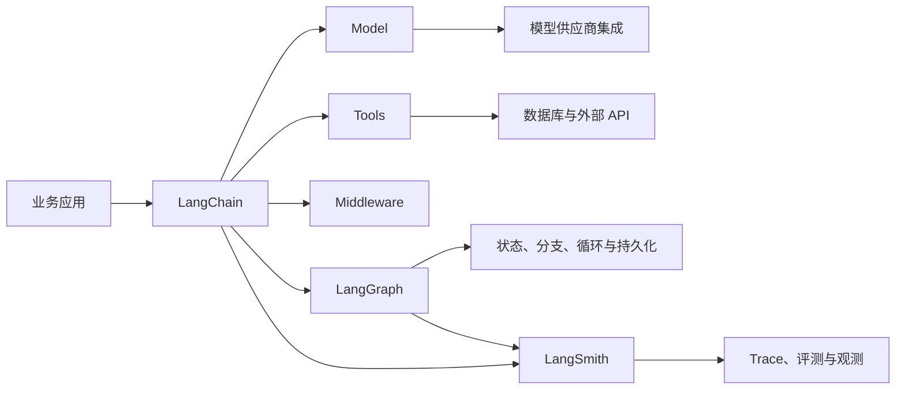

# LangChain（01） - LangChain 基础：定位、核心包与生态

> 读完后，你应能：
> - 用一张职责表解释 LangChain 解决什么问题，并输出“不需要使用 LangChain”的反例记录。
> - 根据项目要使用的能力选择 `langchain`、`langchain-core` 和供应商集成包，并输出带选择依据的依赖清单。
> - 绘制 LangChain、LangGraph、LangSmith、模型供应商与业务代码的关系图，并输出每一层的边界检查结果。

## 核心知识清单

- LangChain 是大模型应用框架，不是模型，也不会提升模型本身的知识和推理能力
- LangChain v1 的高层入口围绕 Agent、Model、Tool、Middleware 等能力组织
- `langchain-core` 保存消息、Runnable、Prompt 和 Tool 等基础契约
- `langchain-openai` 等集成包负责连接具体模型供应商
- LangGraph 承担更复杂的状态、分支、循环和持久化执行
- LangSmith 用于 Trace、评测与线上观测，不参与业务答案生成

# 一、LangChain 是干什么的？

LangChain 是用来构建大模型应用的框架。

它处理的是“模型周围的应用工程”，不是训练模型本身。

一个最小的大模型应用通常只有两步：

1. 把用户问题发给模型。
2. 把模型返回的文本展示出来。

这种场景直接使用模型供应商 SDK 就够了。

当应用继续增长，业务会逐渐出现更多对象：

- System、User、Assistant 和 Tool 消息。
- 可以切换的模型供应商。
- 需要校验的结构化输出。
- 允许模型选择的 Tools。
- 对话历史和运行时上下文。
- 重试、超时、流式输出和回调。
- Trace、评测和人工审批。

LangChain 为这些对象提供相对统一的接口。

统一接口的价值是减少供应商 SDK 与业务代码之间的直接耦合。

例如业务代码不应该到处读取 OpenAI 响应对象的私有字段。

它更适合依赖 LangChain 的消息和模型接口，再由集成包完成协议转换。

## 1.1 LangChain 不负责什么？

LangChain 不会让模型自动拥有最新知识。

它不会替你定义业务权限。

它不会自动判断一次 Tool 调用是否安全。

它也不会替你准备评测数据集或发布标准。

下面这些职责仍然属于应用本身：

| 职责 | 为什么不能交给框架默认决定 |
| --- | --- |
| 数据权限 | 框架不知道当前用户能访问哪些租户和资源 |
| Tool 审批 | 框架不知道转账、删除和发信的业务风险 |
| 回答质量 | 框架不知道什么结果才满足当前业务目标 |
| 成本预算 | 框架不知道单次请求允许消耗多少 Token 和时间 |
| 失败恢复 | 框架不知道哪些副作用已经发生且不能重复执行 |

因此，使用 LangChain 不是把业务逻辑交给框架。

正确理解是：让框架负责通用接口，让业务代码继续负责业务规则。

# 二、什么时候需要 LangChain？

判断是否需要 LangChain，先看应用中是否存在可替换、可组合的步骤。

| 场景 | 建议 | 原因 |
| --- | --- | --- |
| 固定 Prompt，只调用一次模型 | 暂不使用 | 供应商 SDK 更直接 |
| 同一业务需要切换模型 | 可以使用 | 统一 ChatModel 接口减少改动范围 |
| 需要注册多个 Tools | 建议使用 | Tool schema、调用请求与 Agent 生态可以复用 |
| 需要结构化输出 | 建议使用 | 可以复用 schema 与解析能力 |
| 需要分支、循环和持久化 | 使用 LangGraph | 单条顺序链不足以表达状态机 |
| 需要 Trace 与回归评测 | 接入 LangSmith | 运行证据需要独立观测平台 |

不要因为“未来可能复杂”就提前增加很多抽象。

先写出当前请求的输入、输出和失败边界。

如果只有一次模型调用，保持直接调用通常更容易维护。

如果已经出现模型、Tools、Middleware 和状态组合，LangChain 才开始体现价值。

# 三、LangChain 的核心包


- `langchain`：提供 `create_agent`、Agent 和 Middleware 等高层应用入口。
- `langchain-core`（导入名 `langchain_core`）：提供 Message、Document、Prompt、Runnable、Tool 和 Retriever 等基础契约。
- `langchain-openai`（导入名 `langchain_openai`）等供应商包：提供 ChatModel 和 Embeddings 集成。
- `langchain-text-splitters`、`langchain-mcp-adapters`、`langchain-milvus`：分别提供文档分块、MCP Tool 转换和向量库集成。

## 3.1 Python 核心包地图

| 包 | 负责什么 | 典型导入 |
| --- | --- | --- |
| `langchain` | `create_agent`、Middleware 等高层应用入口 | `langchain.agents` |
| `langchain-core` | Message、Document、Prompt、Runnable、Tool、Retriever 等稳定契约 | `langchain_core.messages`、`langchain_core.runnables` |
| `langchain-openai` | `ChatOpenAI` 与 `OpenAIEmbeddings` | `langchain_openai` |
| `langchain-text-splitters` | `RecursiveCharacterTextSplitter` 等文档分块器 | `langchain_text_splitters` |
| `langchain-mcp-adapters` | 把 stdio 或 Streamable HTTP MCP Server 转换为 LangChain Tools | `langchain_mcp_adapters` |
| `langchain-milvus` | `Milvus` VectorStore 与 Retriever 适配 | `langchain_milvus` |
| `langgraph` | 显式状态图、持久化与可恢复执行 | `langgraph.graph` |
| `langchain-community` | 社区 Loader、VectorStore 和第三方集成 | `langchain_community` |
| `pydantic` | Tool 参数和结构化输出的运行时 schema | `pydantic` |

Python 的安装名通常用连字符，导入名则用下划线。例如安装 `langchain-text-splitters` 后，要从 `langchain_text_splitters` 导入。

## 3.2 Python 项目的安装与导入

Python 生态使用 PyPI 包拆分核心能力和供应商集成：

```bash
pip install langchain langchain-core langchain-openai langchain-text-splitters
```

消息类型通常从 `langchain_core.messages` 导入，`ChatOpenAI` 来自 `langchain_openai`，`RecursiveCharacterTextSplitter` 来自 `langchain_text_splitters`。Python 类型注解不会自动校验模型生成的 Tool 参数，仍要使用 Pydantic schema 或工具装饰器的参数契约。

```python
from langchain_core.messages import HumanMessage
from langchain_openai import ChatOpenAI, OpenAIEmbeddings
from langchain_text_splitters import RecursiveCharacterTextSplitter
```

## 3.3 Python 如何按任务选包？

| 当前任务 | 最小依赖集合 |
| --- | --- |
| 只调用 OpenAI 兼容模型 | `langchain-core` + `langchain-openai` |
| 定义 Tool 或结构化输出 | 上述依赖 + `pydantic` |
| 创建 Agent | 上述依赖 + `langchain` |
| 加载并切分文档 | `langchain-core` + 对应 Loader + `langchain-text-splitters` |
| 接入 MCP | `langchain-core` + `langchain-mcp-adapters` |
| 使用 Milvus | `langchain-core` + `langchain-milvus` + Embeddings 集成包 |
| 编写显式状态图 | `langgraph` |


## 3.4 `langchain`：高层应用入口

`langchain` 包提供 Agent 等高层能力。


当前官方 Python 文档把 `create_agent` 作为构建 Agent 的主要入口。

Agent 会把模型、Tools 和运行循环组合在一起。

第一篇只确认它的职责，不立即展开 Agent 循环。

Tools 如何注册，会在下一篇单独实践。

## 3.5 核心包：稳定的基础契约

语言对应的 core 包保存跨供应商复用的基础对象。

常见对象包括：

- 消息类型。
- Prompt 模板。
- Runnable 接口。
- Output Parser。
- Tool 定义。
- Callback 与运行配置。

业务代码依赖这些契约后，更换供应商时不需要重写全部上层逻辑。

但“统一接口”不代表所有供应商能力完全一致。

某些模型不支持 Tool Calling，某些兼容接口也不会返回完整 Token Usage。

能力差异仍要通过集成文档和真实测试确认。

## 3.5 供应商集成包：连接真实模型


`langchain-openai` 负责 OpenAI 和兼容接口的 ChatModel 集成，代码从 `langchain_openai` 导入。

其他模型供应商通常有各自的集成包。

集成包负责把 LangChain 消息转换为供应商请求，再把响应转换回统一消息。

它还会暴露供应商特有配置。

因此，不要只安装 `langchain-core` 就期待能够调用所有模型。

也不要从旧教程复制已经迁移的导入路径。

先查目标版本文档，再确认类属于核心包还是供应商包。

# 四、LangChain 的生态怎么分层？

LangChain 不是一个包包办全部能力。

它与 LangGraph、LangSmith 和各类集成共同构成生态。



<!-- DIAGRAM_DESCRIPTION: 业务应用通过 LangChain 组合模型、Tools 和 Middleware；复杂状态进入 LangGraph；模型由供应商集成连接；LangSmith旁路收集 Trace 与评测证据。 -->

## 4.1 LangGraph：复杂执行流程

LangGraph 适合表达状态、分支、循环和可恢复执行。

当流程需要“调用 Tool 后根据结果决定下一步”，它比单向顺序链更自然。

LangChain 的 Agent 能力本身也建立在 LangGraph 的运行能力之上。

学习顺序上，不应在还没理解模型和 Tool 前直接进入复杂图状态。

## 4.2 LangSmith：运行证据

LangSmith 负责记录和评估运行过程。

它可以保存模型调用、Tool 调用、耗时、错误和评测结果。

LangSmith 不替代 LangChain。

一个负责执行应用逻辑，一个负责观察和评估执行结果。

## 4.3 Integrations：连接外部世界

模型、向量数据库、文档加载器和第三方服务都属于集成层。

集成数量多不代表每个集成都由 LangChain 核心团队维护。

选用前至少确认：

- 维护者是谁。
- 支持哪个 LangChain 版本。
- 是否支持当前运行时。
- 是否覆盖所需能力。
- 失败时能否看到原始错误。

# 五、项目应该安装哪些包？

不要一次安装整个生态。

按当前任务选择最小依赖集合。

| 当前任务 | 最小依赖思路 |
| --- | --- |
| 只调用 OpenAI 兼容模型 | `langchain-core` + `langchain-openai` |
| 定义 schema | 在上面基础上增加 `pydantic` |
| 创建 Agent 并注册 Tools | 增加 `langchain` |
| 编写显式状态图 | 增加 `langgraph` |
| 接入其他供应商 | 替换或增加对应集成包 |

依赖清单应该能回答每个包为什么存在。

无法说明用途的包不应因为教程中出现就直接安装。

# 六、常见误区

## 6.1 把 LangChain 当成模型

LangChain 不生成答案。

真正生成内容的是它连接的模型。

框架只负责准备输入、组织调用和处理输出。

## 6.2 把所有流程都写成 Chain

顺序明确的步骤适合 Chain。

需要循环、暂停、审批和恢复的流程更适合 LangGraph。

业务规则仍应保留清晰的函数与服务边界。

## 6.3 混用不同版本教程

LangChain 的包结构和高层 API 变化较快。

旧文章中的导入路径可能已经迁移。

同一篇实现应固定版本，并只使用对应版本的文档。

# 七、学完如何验收？

- [ ] 能用一句话说明 LangChain 负责模型周围的应用编排。
- [ ] 能给出一个不需要 LangChain 的简单场景。
- [ ] 能区分 `langchain`、`langchain-core` 与供应商集成包。
- [ ] 能说明 LangGraph 负责复杂状态流程。
- [ ] 能说明 LangSmith 负责 Trace 与评测。
- [ ] 能根据目标能力写出最小依赖清单。
- [ ] 能指出权限、审批、预算和发布标准仍属于业务职责。

# 八、下一步学什么？

下一篇只做两件事：

1. 通过 LangChain 接入一个真实 ChatModel。
2. 定义并注册一个 Tool，观察模型返回的 Tool Call。

Prompt、Runnable、LCEL 和 Output Parser 会在后续文章逐层展开。

现在不需要一次理解完整链路。

## 可运行实验：按任务生成最小依赖清单


```python runnable file=main.py title="LangChain 包职责选择器" description="根据任务输出最小依赖集合，并标出每个包的职责。"
TASK_PACKAGES = {
    "model": [("langchain-core", "基础契约"), ("langchain-openai", "ChatOpenAI")],
    "split": [("langchain-core", "Document/Runnable"), ("langchain-text-splitters", "文本分块")],
    "mcp": [("langchain-core", "Tool 契约"), ("langchain-mcp-adapters", "MCP 适配")],
    "milvus": [("langchain-core", "VectorStore 契约"), ("langchain-milvus", "Milvus 适配")],
}

for task, packages in TASK_PACKAGES.items():
    print(f"[{task}]")
    for package, responsibility in packages:
        print(f"- {package}: {responsibility}")
```


运行结果应证明：不同任务需要的包集合不同，不能把整套生态无差别安装。

## 参考资料

- [LangChain Python Overview](https://docs.langchain.com/oss/python/langchain/overview)
- [LangChain Python Tools](https://docs.langchain.com/oss/python/langchain/tools)
- [ChatOpenAI Integration](https://docs.langchain.com/oss/python/integrations/chat/openai)
- [LangGraph Overview](https://docs.langchain.com/oss/python/langgraph/overview)
- [LangSmith Documentation](https://docs.langchain.com/langsmith/home)
