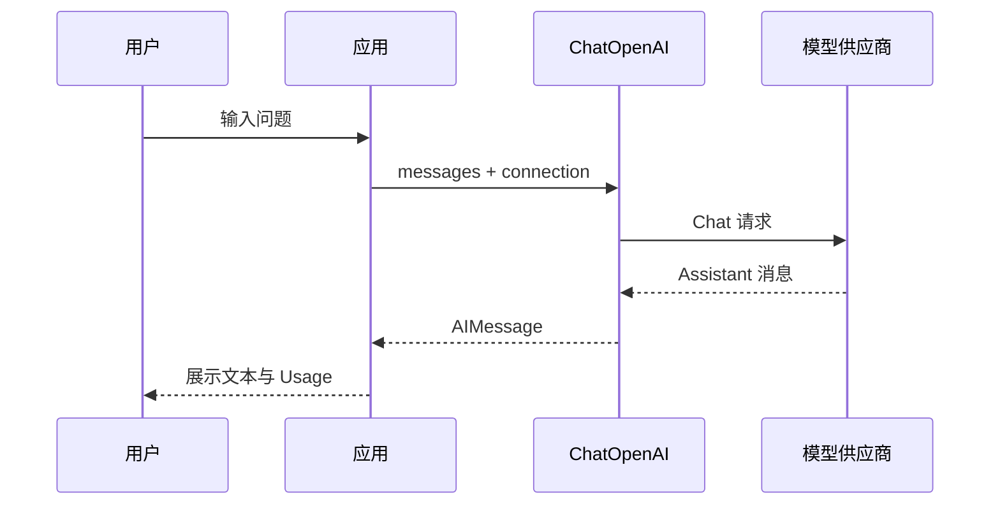
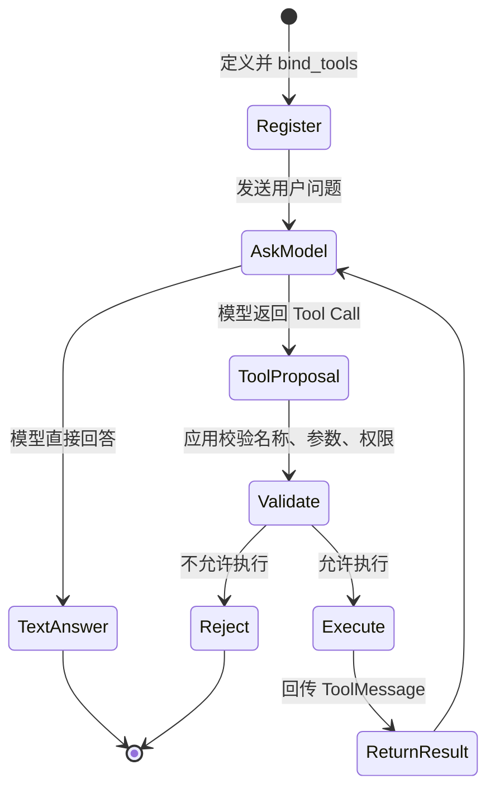

# LangChain（02） - LangChain 接入大模型与注册 Tools

> 读完后，你应能回答：
> - LangChain 接入大模型时需要设置哪些参数？
> - LangChain 怎么注册 Tool，并约束 Tool 的参数？
> - Function Calling、Tool Call 和 Tool 执行是什么关系？

## 核心知识清单

- `ChatOpenAI` 是 LangChain 对 OpenAI 和兼容接口的 ChatModel 集成
- Base URL、API Key 与模型名是连接配置，不属于 Prompt
- Tool 由名称、描述、输入 schema 和执行函数组成
- `bind_tools` 把 Tool schema 暴露给模型，不会自动执行 Tool
- 模型返回 Tool Call 后，应用仍要校验权限、参数和副作用
- Tool 执行结果必须带着对应的调用 ID 回传，完整循环放到 Tool Calling 专题继续学习

# 一、本篇只解决哪两个问题？

只完成两个最小目标：

1. 让 LangChain 成功连接真实大模型。
2. 给模型注册一个 Tool，并看到模型生成 Tool Call。

# 二、langchain 接入大模型需要哪些信息？

模型连接至少需要三个值。

| 配置 | 作用 | 常见错误 |
| --- | --- | --- |
| Base URL | 指向供应商 API 根地址 | 填成控制台首页或漏掉版本路径 |
| API Key | 证明调用身份 | Key 失效、无模型权限或被错误回显 |
| 模型名 | 指定真实模型 | 使用供应商不存在的模型标识 |

这三个值都属于运行配置。

不要把它们写死在文章源码或 Git 仓库中。

在线沙盒只在当前页面内存中保存 Key。

请求通过同源服务端代理发送。

服务端会拒绝 HTTP、localhost、私网 IP 和云元数据地址。

```python runnable model-sandbox file=main.py title="ChatOpenAI 普通调用" description="通过页面临时连接调用真实 ChatModel，观察 AIMessage 与 Token Usage。" prompt="用一句话说明 LangChain 和大模型的关系。"
from langchain_core.messages import HumanMessage
from langchain_openai import ChatOpenAI


model = ChatOpenAI(model="gpt-5.4-mini", temperature=0)
response = model.invoke([HumanMessage(content="LangChain 和大模型是什么关系？")])
print(type(response).__name__)
print(response.content)
print(response.usage_metadata or "供应商没有返回 Token Usage")
```

## 2.1 langchain 为什么使用 `ChatOpenAI`？

本文使用 Python 的 `langchain-openai`。

其中 `ChatOpenAI` 把 LangChain 消息转换成 OpenAI 协议请求。

很多供应商提供 OpenAI 兼容接口，因此也可以通过自定义 Base URL 接入。

“协议兼容”不代表所有功能都兼容。

供应商仍可能缺少以下能力：

- Tool Calling。
- 流式 Tool Call。
- Token Usage。
- 严格结构化输出。
- 某些模型参数。

所以连接成功后还要针对实际功能单独验证。

# 三、一次普通模型调用

一次普通调用的链路很短。



<!-- DIAGRAM_DESCRIPTION: 用户问题由应用交给 ChatOpenAI，ChatOpenAI 调用模型供应商并返回统一 AIMessage，应用展示文本和 Token Usage。 -->

这里还没有 Tool。

模型只能基于输入和自身能力返回消息。

如果问题依赖实时订单、天气或数据库，模型不能凭空读取这些系统。

# 四、Message 有哪些类型？

LangChain 用 Message 统一表达“谁说了什么”和“这条消息携带了什么调用信息”。常见的四种消息不是四个可以随意互换的字符串角色：

| 类型 | 谁产生 | 主要用途 |
| --- | --- | --- |
| `SystemMessage` | 应用 | 约束模型身份、规则、输出边界和安全要求 |
| `HumanMessage` | 用户或应用 | 表达用户问题、任务输入和多模态输入 |
| `AIMessage` | 模型 | 表达模型文本回复、Token 用量和 `tool_calls` |
| `ToolMessage` | 应用执行 Tool 后 | 携带与 `tool_call_id` 对应的 Tool 结果，交回模型继续推理 |

还会遇到 `BaseMessage` 及其扩展类型。它是公共抽象，不代表一类额外的业务角色；某些集成也会携带自定义消息或消息块。实际编排时先保证四种核心消息的顺序和关联 ID 正确，再处理供应商扩展。

一次完整 Tool Calling 对话通常是：

```text
SystemMessage -> HumanMessage -> AIMessage(tool_calls) -> ToolMessage -> AIMessage(final)
```

`AIMessage` 提出调用，`ToolMessage` 只能由应用在完成权限校验和执行后创建。不能把模型返回的 JSON 直接伪装成 `ToolMessage`，也不能漏掉 `tool_call_id`，否则模型无法知道结果对应哪一次调用。

```python runnable file=main.py title="四种 Message 的 Tool Calling 顺序" description="用 LangChain 的真实 Message 类型表示一次 Tool Calling 循环，不访问外部服务。" packages=langchain-core
from langchain_core.messages import AIMessage, HumanMessage, SystemMessage, ToolMessage


messages = [
    SystemMessage(content="你是天气助手。"),
    HumanMessage(content="成都天气如何？"),
    AIMessage(content="", tool_calls=[{"name": "get_weather", "args": {"city": "成都"}, "id": "call-1", "type": "tool_call"}]),
    ToolMessage(content="成都晴，24 摄氏度。", tool_call_id="call-1"),
    AIMessage(content="成都今天晴，24 摄氏度。"),
]
for index, message in enumerate(messages, start=1):
    print(index, type(message).__name__)
```

# 五、LangChain Tool 是什么？

Tool 是应用暴露给模型的一项受控能力。

一个 Tool 至少包含四部分：

| 字段 | 作用 |
| --- | --- |
| `name` | 模型返回 Tool Call 时使用的稳定名称 |
| `description` | 告诉模型什么时候应该选择该 Tool |
| `schema` | 约束 Tool 输入字段、类型和必填项 |
| 执行函数 | 应用确认调用后真正访问外部系统 |

名称应该稳定、明确。

描述应该解释适用条件，不要只重复名称。

schema 是运行时契约，不只是 Python 类型提示。

执行函数必须把不可信参数当成外部输入重新校验。

```python runnable file=main.py title="Tool schema 参数校验" description="用 Pydantic schema 校验 Tool 参数，验证注册契约与执行函数是两件事。" packages=langchain-core,pydantic
from pydantic import BaseModel, ValidationError
from langchain_core.tools import StructuredTool


class WeatherInput(BaseModel):
    city: str


def get_weather(city: str) -> str:
    return f"{city}的教学天气结果：晴，24 摄氏度。"


weather_tool = StructuredTool.from_function(
    get_weather,
    name="get_weather",
    description="查询指定城市天气。",
    args_schema=WeatherInput,
)
validated = weather_tool.args_schema.model_validate({"city": "成都"})
print(weather_tool.name)
print(validated.model_dump())
try:
    weather_tool.args_schema.model_validate({"city": 42})
except ValidationError as error:
    print(type(error).__name__)
```

## 5.1 为什么需要 schema？

模型生成的是调用建议，不是可信程序输入。

它可能遗漏字段。

它可能使用错误类型。

它也可能生成超出权限范围的资源 ID。

Pydantic schema 可以先检查数据形状。

但 schema 不能替代权限检查。

例如 `city` 是合法字符串，不代表当前业务允许查询任意位置的内部数据。

# 六、`bind_tools` 到底做了什么？

`bind_tools` 会把 Tool 的名称、描述和 schema 放进模型请求。

模型看到这些定义后，可以选择：

- 直接返回普通文本。
- 返回一个或多个 Tool Call。

`bind_tools` 不会自动执行 Tool 函数。

这条边界非常重要。

模型只能提出“我想调用 `get_weather`，参数是 `{ city: ... }`”。

应用收到后仍要决定是否执行。

## 6.1 注册不等于执行

下面的状态图把两者分开。



<!-- DIAGRAM_DESCRIPTION: bind_tools 只完成注册；模型产生 Tool Call 后，应用必须校验再执行，并把 ToolMessage 回传给模型形成完整循环。 -->

本文沙盒停在 `ToolProposal`。

它不会访问真实天气接口。

这样可以先验证模型是否理解 Tool schema，又不会产生外部副作用。

# 七、可运行实验：真实模型与 Tool 注册

下面的沙盒会连接真实 ChatModel，把 `get_weather` 的名称、描述和参数 schema 注册给模型，并观察模型返回的 Tool Call。

它只验证“模型提出调用”，不会执行天气函数。

```python runnable model-sandbox mode=tools file=main.py title="LangChain 模型接入与 Tool 注册" description="通过真实 ChatModel 注册 get_weather，并观察模型返回的 Tool Call；实验不会执行外部 Tool。" prompt="请查询成都的天气，并使用已经注册的 get_weather 工具。"
from pydantic import BaseModel, Field
from langchain_core.tools import tool
from langchain_openai import ChatOpenAI


class WeatherInput(BaseModel):
    city: str = Field(description="需要查询天气的城市名称")


@tool(args_schema=WeatherInput)
def get_weather(city: str) -> str:
    """查询指定城市天气。"""
    return f"{city}的教学天气结果：晴，24 摄氏度。"


model = ChatOpenAI(model="gpt-5.4-mini", temperature=0)
model_with_tools = model.bind_tools([get_weather], tool_choice="get_weather")
response = model_with_tools.invoke("请查询成都的天气。")
tool_call = response.tool_calls[0]
print(tool_call["name"])
print(tool_call["args"])
print("本文未执行 Tool")
```

运行后至少检查三项：

1. Tool 名称是 `get_weather`。
2. 参数包含非空 `city`。
3. 输出明确说明本文没有执行 Tool。

# 八、模型返回 Tool Call 后怎么办？

完整执行循环还有四步：

1. 校验 Tool 名称是否在白名单。
2. 用 schema 校验参数，并检查当前用户权限。
3. 执行 Tool，保存副作用和审计记录。
4. 把结果作为 ToolMessage 回传给模型。

本文不展开这四步。

它们会在“完整 Tool Calling 循环”专题中单独学习。

现在只需记住：模型不能直接调用你的数据库或操作系统。

真正执行动作的是应用代码。

# 九、总结

> **LangChain 接入大模型时需要设置哪些参数？** 至少需要 Base URL、API Key 和模型名。`ChatOpenAI` 还可以设置 `temperature`、超时、重试等运行参数；这些属于模型连接与调用配置，不应写进 Prompt，也不能把 API Key 提交到仓库。

> **LangChain 怎么注册 Tool，并约束 Tool 的参数？** 使用 `@tool` 或 `StructuredTool` 定义稳定的名称、描述、Pydantic 输入 schema 和执行函数，再通过 `model.bind_tools([tool])` 把 Tool schema 注册给模型。Pydantic 只校验参数形状，应用仍需检查 Tool 白名单、用户权限和副作用。

> **Function Calling、Tool Call 和 Tool 执行是什么关系？** Function Calling 是模型根据函数或 Tool schema 生成结构化调用请求的能力；LangChain 把一次请求表示在 `AIMessage.tool_calls` 中，这就是 Tool Call。Tool Call 只是模型提出的调用建议，应用校验后才真正执行函数，并使用相同 `tool_call_id` 创建 `ToolMessage`，再交给模型生成最终回答。

## 参考资料

- [LangChain Python Overview](https://docs.langchain.com/oss/python/langchain/overview)
- [LangChain Python Tools](https://docs.langchain.com/oss/python/langchain/tools)
- [ChatOpenAI Integration](https://docs.langchain.com/oss/python/integrations/chat/openai)
- [LangChain Models and Tool Calling](https://docs.langchain.com/oss/python/langchain/models)
- [Pydantic Documentation](https://pydantic.dev/)
