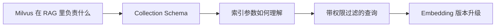

# LangChain（06） - Milvus 与 LangChain：Schema、索引、过滤与版本


## Python 实现地图

Python 使用 `langchain_milvus.Milvus`，并可用 `pymilvus` 管理显式 schema 和索引。database 隔离空间，collection 固定结构，entity 是一条数据；向量字段维度必须与 Embeddings 一致。

```python runnable file=main.py title="Python Milvus schema 检查" description="验证 Embedding 维度与 collection schema。"
schema = {"vector_field": "vector", "dimension": 1536, "index_type": "HNSW"}
embedding_dimension = 1536
if schema["dimension"] != embedding_dimension:
    raise ValueError("Embedding 维度与 schema 不一致")
print(schema)
```


> 读完后，你应能完成以下任务：
> - 绘制“Milvus（01） - Milvus 向量数据库：Schema、索引、过滤与版本 / Milvus 在 RAG 里负责什么”的关键对象与数据流，解释“它不负责解析 PDF、生成 Embedding、验证事实或生成答案。”，并用源码位置、日志或 Trace 标注证据。
> - 为“Milvus（01） - Milvus 向量数据库：Schema、索引、过滤与版本 / Collection Schema”设计正常与异常输入，验证“并用契约测试验证建表和查询。”，输出首个偏差位置与回归测试结果。
> - 实现“Milvus（01） - Milvus 向量数据库：Schema、索引、过滤与版本 / 索引参数如何理解”的最小代码或配置，检验“IVF 用聚类桶缩小搜索范围，nprobe 决定查询多少桶；”，输出命令、结果与 Diff，并说明不适用边界。

> 更新日期：2026/08/11

<!-- article-progressive-block:start -->
# 一、先建立全局：Milvus 与 LangChain：Schema、索引、过滤与版本 是什么？

LangChain 负责把 `Document` 和 Embeddings 组织成 VectorStore 调用，Milvus 负责持久化、索引和相似度检索。两者不是同一个层次：换掉 Milvus 不应改变上层的 `addDocuments`、`similaritySearch` 和 Retriever 契约。

Milvus 可以按三层理解：database 隔离数据库空间，collection 是一组有固定 schema 的实体，entity 是 collection 中的一条记录。向量字段必须声明维度并创建索引，标量字段用于过滤、租户和来源 metadata。Schema 一旦和 Embeddings 维度不匹配，写入或查询都会失败。

理解“Milvus 向量数据库：Schema、索引、过滤与版本”，先要把标题中的对象放进同一条处理链：它接收什么输入，经过哪些状态变化，最终用什么证据判断结果。下表不另造概念，只把作者正文已经解释的章节按依赖顺序连起来。

“Milvus 向量数据库：Schema、索引、过滤与版本”的第一个核心判断是：它不负责解析 PDF、生成 Embedding、验证事实或生成答案。。先弄清这个判断中的对象和输入输出，后面的实现、故障和验收才有共同语境。

| 顺序 | 章节 | 读完本节应抓住的结论 |
| --- | --- | --- |
| 1 | Milvus 在 RAG 里负责什么 | 它不负责解析 PDF、生成 Embedding、验证事实或生成答案。 |
| 2 | Collection Schema | 并用契约测试验证建表和查询。 |
| 3 | 索引参数如何理解 | IVF 用聚类桶缩小搜索范围，nprobe 决定查询多少桶； |
| 4 | 带权限过滤的查询 | 真实服务应封装并校验 ID，避免表达式注入。 |
| 5 | Embedding 版本升级 | 模型、维度、归一化或 query/document 前缀任一变化， |
| 6 | 生产验收 | 无权限 Query 永远不能命中其他租户候选。 |

## 1.1 核心对象之间怎样衔接



这张图只表达本文的讲解顺序，不替代正文机制。判断“Milvus 向量数据库：Schema、索引、过滤与版本”是否真正掌握，需要能从最后一个结果沿图回到前面每个章节的输入、状态变化和证据。

## 1.2 再看失败：问题最早会出现在哪一步？

在“Milvus 向量数据库：Schema、索引、过滤与版本”的对象和顺序已经明确后，再看可观察的失败：漏召回、排序丢失、引用断链或越权命中。定位时不从最后一条错误猜原因，而是沿上图找第一个偏离正文结论的节点。
<!-- article-progressive-block:end -->

# 二、Milvus 在 RAG 里负责什么

Milvus 保存向量及其标量 Metadata，提供 ANN Top K 和过滤。
它不负责解析 PDF、生成 Embedding、验证事实或生成答案。
完整链路仍要有 Loader、Splitter、Embedding、权限、Rerank 和评测。

小规模原型可用内存/FAISS/Chroma；
已有 PostgreSQL 且规模中等可考虑 pgvector；
向量规模、并发和独立扩展需求提高时，专用 Milvus 更有价值。
选型必须结合运维能力。

# 三、Collection Schema

```python
from pymilvus import DataType, MilvusClient

# Collection 中向量字段的固定维度，必须与 Embedding 模型一致。
VECTOR_DIMENSION = 512
# 当前向量索引的逻辑名称。
COLLECTION_NAME = "knowledge_chunks_v1"

# 连接到本地 Milvus 服务的客户端。
client = MilvusClient(uri="http://localhost:19530")
# 当前 Collection 的显式字段定义。
schema = client.create_schema(auto_id=False, enable_dynamic_field=False)
schema.add_field(field_name="chunk_id", datatype=DataType.VARCHAR, is_primary=True, max_length=128)
schema.add_field(field_name="document_id", datatype=DataType.VARCHAR, max_length=128)
schema.add_field(field_name="tenant_id", datatype=DataType.VARCHAR, max_length=64)
schema.add_field(field_name="acl", datatype=DataType.ARRAY, element_type=DataType.VARCHAR, max_capacity=32, max_length=64)
schema.add_field(field_name="embedding_version", datatype=DataType.VARCHAR, max_length=64)
schema.add_field(field_name="text", datatype=DataType.VARCHAR, max_length=8192)
schema.add_field(field_name="vector", datatype=DataType.FLOAT_VECTOR, dim=VECTOR_DIMENSION)

# HNSW 索引的构建参数；上线前应在真实数据上压测。
index_params = client.prepare_index_params()
index_params.add_index(
    field_name="vector",
    index_type="HNSW",
    metric_type="COSINE",
    params={"M": 16, "efConstruction": 200},
)
client.create_collection(
    collection_name=COLLECTION_NAME,
    schema=schema,
    index_params=index_params,
)
```

客户端 API 会随版本演进，
生产项目要锁定 `pymilvus` 与 Milvus 兼容版本，
并用契约测试验证建表和查询。

# 四、索引参数如何理解

- HNSW `M` 越大，图连接更多，通常召回更好，但内存与构建成本上升。
- `efConstruction` 控制建图搜索宽度，影响建库时间和图质量。
- 查询 `ef` 控制搜索范围，越大通常召回越高、延迟越大。
- IVF 用聚类桶缩小搜索范围，`nprobe` 决定查询多少桶；数据分布变化后要关注重建。

使用精确 KNN 或高参数结果作为近似真值，
画 Recall@K 与 P95 曲线，
再选满足 SLO 的点。

# 五、带权限过滤的查询

```python
from typing import Any

# 每次返回给融合/Rerank 层的候选数量。
TOP_K = 50
# HNSW 在线查询的初始搜索宽度。
SEARCH_EF = 128


def search_chunks(
    client: MilvusClient,
    query_vector: list[float],
    tenant_id: str,
    role_id: str,
) -> list[list[dict[str, Any]]]:
    """在租户和角色权限范围内执行向量检索。"""
    # Milvus 标量过滤表达式；外部值应经过白名单/转义封装。
    filter_expression = f'tenant_id == "{tenant_id}" and array_contains(acl, "{role_id}")'
    return client.search(
        collection_name=COLLECTION_NAME,
        data=[query_vector],
        anns_field="vector",
        filter=filter_expression,
        limit=TOP_K,
        search_params={"metric_type": "COSINE", "params": {"ef": SEARCH_EF}},
        output_fields=["chunk_id", "document_id", "text", "embedding_version"],
    )
```

示例直接拼接表达式是为了说明过滤位置；
真实服务应封装并校验 ID，避免表达式注入。
权限过滤不能放在 Top K 返回后。

# 六、Embedding 版本升级

模型、维度、归一化或 query/document 前缀任一变化，
都应创建新 Collection/字段版本：后台重建 → 数量与 ID 对账 → 固定集评测 → 影子查询 → 切读别名 → 观察 → 回收旧版。
混合新旧向量会让距离失去意义。

# 七、生产验收

- 插入数量、源 Chunk 数与主键差集一致。
- 无权限 Query 永远不能命中其他租户候选。
- Recall@K、P50/P95、QPS、索引内存和构建时间达到预算。
- 删除文档后所有向量和缓存不可再检索。
- Trace 保存 Collection、索引参数、Embedding 版本、过滤表达式摘要和原始距离。
- Milvus 不可用时明确降级 BM25 或拒答，而不是静默返回模型常识。

<!-- article-progressive-block:start -->
# 八、动手验证：先跑通 Milvus 向量数据库：Schema、索引、过滤与版本，再改变一个变量

前面的章节已经建立问题、概念和机制。现在把“Milvus 向量数据库：Schema、索引、过滤与版本”放进同一套基线中运行；本节不再引入新术语，只验证前文结论能否被复现。

## 8.1 基线与候选只允许一个变量不同

验证“Milvus 向量数据库：Schema、索引、过滤与版本”时，先固定查询集、语料快照、权限身份、相关性标注。候选方案只能改变本次要验证的变量；如果同时更换数据、依赖和配置，即使结果改善，也不能知道是哪一项产生作用。

执行“Milvus 向量数据库：Schema、索引、过滤与版本”时，动作是：离线回放检索，保存候选、过滤、排序和引用。原始结果不能只保留截图或汇总分数，必须同步保存：Recall@K、NDCG、引用命中率、无答案误答率、Trace，使下一次复查可以在同一输入上重放。

| 实验要素 | 本文要求 |
| --- | --- |
| 固定条件 | 查询集、语料快照、权限身份、相关性标注 |
| 唯一变量 | 本次候选方案与基线之间的一项明确差异 |
| 原始证据 | Recall@K、NDCG、引用命中率、无答案误答率、Trace |
| 通过阈值 | 证据可回链，指标达基线，权限过滤无泄漏 |
| 立即停止 | 漏召回、排序丢失、引用断链或越权命中 |

## 8.2 执行前先排除不可比较条件

“Milvus 向量数据库：Schema、索引、过滤与版本”开始前先确认下面四项；任一项不成立，都应先修复实验条件，而不是解释结果。

- 基线能够在“Milvus 向量数据库：Schema、索引、过滤与版本”的当前环境重复运行。
- 候选只改变一个与“Milvus 向量数据库：Schema、索引、过滤与版本”结论直接相关的条件。
- “Milvus 向量数据库：Schema、索引、过滤与版本”的基线和候选使用同一批输入、同一版本依赖与同一通过阈值。
- “Milvus 向量数据库：Schema、索引、过滤与版本”的原始输出和失败现场不会被重试、格式化或汇总覆盖。

## 8.3 执行后先核对证据完整性

结果出来后先检查证据，再讨论“Milvus 向量数据库：Schema、索引、过滤与版本”是否通过。缺少中间状态时，最终输出只能说明现象，不能证明机制。

| 检查项 | 当前文章的判定 |
| --- | --- |
| 输入可追溯 | 查询集、语料快照、权限身份、相关性标注 |
| 过程可回放 | 离线回放检索，保存候选、过滤、排序和引用 |
| 结果可审计 | Recall@K、NDCG、引用命中率、无答案误答率、Trace |

“Milvus 向量数据库：Schema、索引、过滤与版本”的一次合格基线对照按以下顺序执行：

1. 保存“Milvus 向量数据库：Schema、索引、过滤与版本”基线版本及输入摘要，确认基线本身可以重复运行。
2. 写下“Milvus 向量数据库：Schema、索引、过滤与版本”候选方案唯一变化的变量，以及它预期影响的指标。
3. 在同一环境执行“Milvus 向量数据库：Schema、索引、过滤与版本”：离线回放检索，保存候选、过滤、排序和引用。
4. 为“Milvus 向量数据库：Schema、索引、过滤与版本”保存：Recall@K、NDCG、引用命中率、无答案误答率、Trace。
5. 使用“Milvus 向量数据库：Schema、索引、过滤与版本”预登记条件判断：证据可回链，指标达基线，权限过滤无泄漏。
6. 如果“Milvus 向量数据库：Schema、索引、过滤与版本”未通过，不修改第二个变量，先恢复基线并保留失败现场。

# 九、用一张矩阵验证 Milvus 向量数据库：Schema、索引、过滤与版本 的关键结论

矩阵按正文顺序列出“Milvus 向量数据库：Schema、索引、过滤与版本”的结论。一次实验只选择一行，只改变这一行对应的条件；不要把多行合并成一个无法归因的大实验。

| 正文章节 | 已解释的结论 | 本轮唯一变量 | 必须保存的证据 |
| --- | --- | --- | --- |
| Milvus 在 RAG 里负责什么 | 它不负责解析 PDF、生成 Embedding、验证事实或生成答案。 | 只改变与“Milvus 在 RAG 里负责什么”相关的条件 | Recall@K、NDCG、引用命中率、无答案误答率、Trace |
| Collection Schema | 并用契约测试验证建表和查询。 | 只改变与“Collection Schema”相关的条件 | Recall@K、NDCG、引用命中率、无答案误答率、Trace |
| 索引参数如何理解 | IVF 用聚类桶缩小搜索范围，nprobe 决定查询多少桶； | 只改变与“索引参数如何理解”相关的条件 | Recall@K、NDCG、引用命中率、无答案误答率、Trace |
| 带权限过滤的查询 | 真实服务应封装并校验 ID，避免表达式注入。 | 只改变与“带权限过滤的查询”相关的条件 | Recall@K、NDCG、引用命中率、无答案误答率、Trace |
| Embedding 版本升级 | 模型、维度、归一化或 query/document 前缀任一变化， | 只改变与“Embedding 版本升级”相关的条件 | Recall@K、NDCG、引用命中率、无答案误答率、Trace |
| 生产验收 | 无权限 Query 永远不能命中其他租户候选。 | 只改变与“生产验收”相关的条件 | Recall@K、NDCG、引用命中率、无答案误答率、Trace |

## 9.1 记录本次实际实验

下面的记录用于“Milvus 向量数据库：Schema、索引、过滤与版本”当前这一次实验，不是第二套知识目录。先从矩阵选择一个章节，再填写实际值；没有填写的字段表示尚未验证。

```yaml
topic: "Milvus 向量数据库：Schema、索引、过滤与版本"
selected_chapter: required
claim_from_article: required
baseline_version: required
changed_condition: exactly_one
execution: "离线回放检索，保存候选、过滤、排序和引用"
evidence: "Recall@K、NDCG、引用命中率、无答案误答率、Trace"
pass_when: "证据可回链，指标达基线，权限过滤无泄漏"
stop_when: "漏召回、排序丢失、引用断链或越权命中"
observed_result: required
first_deviation: null_or_evidence
recovery_replay: required_after_failure
```

## 9.2 边界实验必须证明能够停止和恢复

成功路径只能证明“Milvus 向量数据库：Schema、索引、过滤与版本”在当前样本上工作，不能证明它可以进入生产。边界实验需要主动制造：漏召回、排序丢失、引用断链或越权命中，并观察系统是否在产生不可逆副作用前停止。

| 场景 | 只改变什么 | 应保存什么 | 通过标准 |
| --- | --- | --- | --- |
| 正常路径 | 使用已知有效输入 | Recall@K、NDCG、引用命中率、无答案误答率、Trace | 证据可回链，指标达基线，权限过滤无泄漏 |
| 边界路径 | 把一个输入推进到约束临界值 | 临界值前后的输出与指标 | 不静默降级，不把部分结果冒充成功 |
| 明确失败 | 注入：漏召回、排序丢失、引用断链或越权命中 | 原始错误、首个异常阶段和最终状态 | 失败被正确分类且没有扩大副作用 |
| 恢复重放 | 执行：定位解析、召回、过滤、排序或生成阶段，回滚对应版本 | 原失败样本的复测证据 | 原样本恢复，正常样本没有回归 |

恢复动作不是简单重启。对于“Milvus 向量数据库：Schema、索引、过滤与版本”，第一步是：定位解析、召回、过滤、排序或生成阶段，回滚对应版本。完成后使用原始失败样本复测；只验证一个新样本成功，不能证明触发条件已经消失。

“Milvus 向量数据库：Schema、索引、过滤与版本”边界实验结束后，应把正常、临界、失败和恢复四类记录放在同一个运行批次中。这样才能区分“候选方案真的修复问题”和“环境变化让问题暂时没有出现”。

# 十、Milvus 向量数据库：Schema、索引、过滤与版本 的结果解释

解释“Milvus 向量数据库：Schema、索引、过滤与版本”实验时先看首个偏差，而不是最后一条错误。最后的异常通常只是上游状态错误的结果；从末端反推容易误把症状当根因。

| 观察结果 | 可以支持的判断 | 下一步 |
| --- | --- | --- |
| 主链路没有达到预期 | 漏召回、排序丢失、引用断链或越权命中 | 先执行：定位解析、召回、过滤、排序或生成阶段，回滚对应版本 |
| 异常链路无法恢复 | 漏召回、排序丢失、引用断链或越权命中 | 先执行：定位解析、召回、过滤、排序或生成阶段，回滚对应版本 |
| 新样本成功但原样本仍失败 | 修复没有覆盖原始触发条件 | 固定原失败输入，恢复基线后重新比较 |
| 指标改善但证据无法回链 | 数据、版本或中间状态没有固定 | 暂停发布，补齐可追溯记录后重跑 |

“Milvus 向量数据库：Schema、索引、过滤与版本”只有同时满足“证据可回链，指标达基线，权限过滤无泄漏”，并且没有出现“漏召回、排序丢失、引用断链或越权命中”，才可以认为主链路通过。这里的“通过”只对当前固定版本、样本和环境有效，不能外推到尚未测试的容量、权限或数据分布。

如果“Milvus 向量数据库：Schema、索引、过滤与版本”候选方案与基线差异很小，先检查证据分辨率是否足够；如果差异很大，先排除数据泄漏、环境漂移和版本不一致。两种情况都不能只看一个汇总均值，需要回到逐样本输出和中间状态。

“Milvus 向量数据库：Schema、索引、过滤与版本”故障定位完成后，记录“现象、首个偏差、根因、改动、原样本复测”五项。缺少原样本复测时，只能标记为待观察，不能标记为已解决。

# 十一、Milvus 向量数据库：Schema、索引、过滤与版本 的发布判断

发布判断需要把“Milvus 向量数据库：Schema、索引、过滤与版本”的质量、失败边界和恢复能力放在同一份记录中。以下任一条件缺失，都应停止扩量，而不是用“基本正常”替代证据。

- [ ] “Milvus 向量数据库：Schema、索引、过滤与版本”的基线与候选只存在一个计划内变量。
- [ ] “Milvus 向量数据库：Schema、索引、过滤与版本”的输入、代码、依赖、配置和数据版本可以追溯。
- [ ] “Milvus 向量数据库：Schema、索引、过滤与版本”的正常、临界、失败和恢复样本使用同一套断言。
- [ ] “Milvus 向量数据库：Schema、索引、过滤与版本”的原始输出、中间状态和失败现场已经保留。
- [ ] “Milvus 向量数据库：Schema、索引、过滤与版本”的日志、Trace、截图和测试数据已经脱敏。
- [ ] “Milvus 向量数据库：Schema、索引、过滤与版本”的停止条件、负责人和回滚入口已经演练。
- [ ] “Milvus 向量数据库：Schema、索引、过滤与版本”尚未覆盖的输入、权限、容量和外部依赖已经登记。

最终记录至少包含基线版本、唯一变量、原始证据、首个偏差、恢复复测和发布责任人。没有参与本次修改的人如果不能据此重放“Milvus 向量数据库：Schema、索引、过滤与版本”的判断，就不能发布。
<!-- article-progressive-block:end -->

# 十二、总结

- **Milvus 在 RAG 里负责什么**：它不负责解析 PDF、生成 Embedding、验证事实或生成答案。
- **Collection Schema**：客户端 API 会随版本演进，生产项目要锁定 pymilvus 与 Milvus 兼容版本，并用契约测试验证建表和查询。
- **索引参数如何理解**：IVF 用聚类桶缩小搜索范围，nprobe 决定查询多少桶；
- **带权限过滤的查询**：真实服务应封装并校验 ID，避免表达式注入。
- **Embedding 版本升级**：模型、维度、归一化或 query/document 前缀任一变化，都应创建新 Collection/字段版本：后台重建 → 数量与 ID 对账 → 固定集评测 → 影子查询 → 切读别名 → 观察 → 回收旧版。
- **生产验收**：无权限 Query 永远不能命中其他租户候选。

## 可运行实验：检查 Milvus 三层对象和向量索引契约

```python runnable file=main.py title="Milvus Schema 契约检查" description="模拟 database、collection、entity 和向量索引的关系，观察维度错误如何被拒绝。"
DATABASE = "knowledge"
COLLECTION = {"name": "ebook_chunks", "vector_dim": 3, "indexed_fields": ["embedding"]}
ENTITIES = [{"id": 1, "embedding": [0.1, 0.2, 0.3], "source": "chapter-1"}]

def validate_entity(entity: dict) -> None:
    """验证实体向量维度以及向量字段是否有索引。"""
    if len(entity["embedding"]) != COLLECTION["vector_dim"]:
        raise ValueError("embedding dimension does not match collection schema")
    if "embedding" not in COLLECTION["indexed_fields"]:
        raise ValueError("vector field must have an index before search")

for entity in ENTITIES:
    validate_entity(entity)
print(f"database={DATABASE}, collection={COLLECTION['name']}, entities={len(ENTITIES)}, index=ready")
```

真实实验再把内存对象替换为 `langchain-milvus` 或 `pymilvus` 客户端，并用同一 Embeddings 模型保证向量维度一致。

## 参考资料

- [Milvus Overview](https://milvus.io/docs/overview.md)
- [Milvus Index explained](https://milvus.io/docs/index-explained.md)
- [Milvus Filtered search](https://milvus.io/docs/filtered-search.md)

## 参考资料

- [LangChain Retrieval](https://docs.langchain.com/oss/python/langchain/retrieval)
- [Milvus 文档](https://milvus.io/docs)
