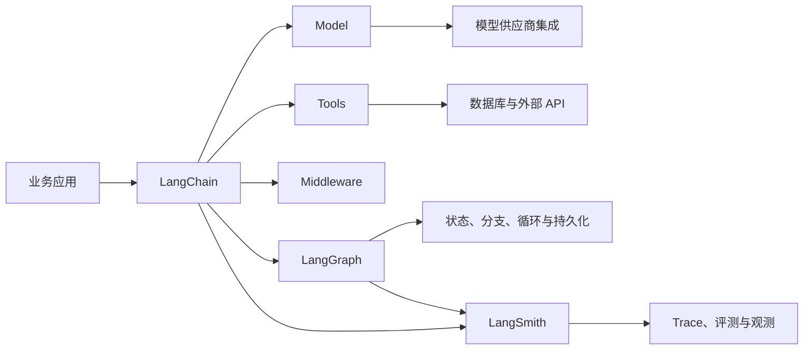

# LangChain（01） - LangChain 是什么、核心包与生态

## 参考资料

- [LangChain JavaScript Overview](https://docs.langchain.com/oss/javascript/langchain/overview)
- [LangChain JavaScript Agents](https://docs.langchain.com/oss/javascript/langchain/agents)
- [ChatOpenAI Integration](https://docs.langchain.com/oss/javascript/integrations/chat/openai)
- [LangGraph Overview](https://docs.langchain.com/oss/javascript/langgraph/overview)
- [LangSmith Documentation](https://docs.langchain.com/langsmith/home)

> 读完后，你应能回答：
> - 什么时候该用 LangChain，什么时候不用？
> - LangChain 有哪些包？
> - LangChain 的生态是什么？

## 核心知识清单

- LangChain 是大模型应用框架，不是模型，也不会提升模型本身的知识和推理能力
- LangChain v1 的高层入口围绕 Agent、Model、Tool、Middleware 等能力组织
- `@langchain/core` 保存消息、Runnable、Prompt 和 Tool 等基础契约
- `@langchain/openai` 等集成包负责连接具体模型供应商
- LangGraph 承担更复杂的状态、分支、循环和持久化执行
- LangSmith 用于 Trace、评测与线上观测，不参与业务答案生成

# 一、什么时候该用 LangChain，什么时候不用？

LangChain 是用来构建大模型应用的框架。

它处理的是“模型周围的应用工程”，不是训练模型本身。

一个最小的大模型应用通常只有两步：

1. 把用户问题发给模型。
2. 把模型返回的文本展示出来。

这种场景直接使用模型供应商 SDK 就够了。

当应用继续增长，业务会逐渐出现更多对象：

- System、User、Assistant 和 Tool 消息。
- 可以切换的模型供应商。
- 需要校验的结构化输出。
- 允许模型选择的 Tools。
- 对话历史和运行时上下文。
- 重试、超时、流式输出和回调。
- Trace、评测和人工审批。

LangChain 为这些对象提供相对统一的接口。

统一接口的价值是减少供应商 SDK 与业务代码之间的直接耦合。

例如业务代码不应该到处读取 OpenAI 响应对象的私有字段。

它更适合依赖 LangChain 的消息和模型接口，再由集成包完成协议转换。

# 二、LangChain 有哪些包？

- `langchain`：提供 `createAgent`、Agent 和 Middleware 等高层应用入口。
- `@langchain/core`：提供 Message、Document、Prompt、Runnable、Tool 和 Retriever 等基础契约。
- `@langchain/openai` 等供应商包：提供 ChatModel 和 Embeddings 集成。
- `@langchain/textsplitters`、`@langchain/mcp-adapters`、`@langchain/milvus`：分别提供文档分块、MCP Tool 转换和向量库集成。

| 包 | 负责什么 | 典型导入 |
| --- | --- | --- |
| `langchain` | `createAgent`、Middleware 等高层应用入口 | `langchain` |
| `@langchain/core` | Message、Document、Prompt、Runnable、Tool、Retriever 等稳定契约 | `@langchain/core/messages`、`@langchain/core/runnables` |
| `@langchain/openai` | `ChatOpenAI` 与 `OpenAIEmbeddings` | `@langchain/openai` |
| `@langchain/textsplitters` | `RecursiveCharacterTextSplitter` 等文档分块器 | `@langchain/textsplitters` |
| `@langchain/mcp-adapters` | 把 stdio 或 HTTP MCP Server 转换为 LangChain Tools | `@langchain/mcp-adapters` |
| `@langchain/milvus` | `Milvus` VectorStore 与 Retriever 适配 | `@langchain/milvus` |
| `@langchain/langgraph` | 显式状态图、持久化与可恢复执行 | `@langchain/langgraph` |
| `@langchain/community` | 社区 Loader、VectorStore 和第三方集成 | `@langchain/community` |
| `zod` | Tool 参数和结构化输出的运行时 schema | `zod` |

这里最容易写错的是文本分块包：TypeScript 的包名是 `@langchain/textsplitters`，与 Python 的 `langchain-text-splitters` 不同。

## 2.1 LangChain 在 TypeScript 项目的安装与导入

TypeScript 生态使用 npm 包拆分核心能力和供应商集成：

```bash
pnpm add langchain @langchain/core @langchain/openai @langchain/textsplitters zod
```

Message、Document 和 Runnable 从 `@langchain/core` 的对应子路径导入，模型、向量库和 MCP 使用独立集成包。TypeScript 类型只在编译期约束代码，Tool 参数仍要用 Zod 做运行时校验。

```typescript
import { HumanMessage } from '@langchain/core/messages'
import { ChatOpenAI, OpenAIEmbeddings } from '@langchain/openai'
import { RecursiveCharacterTextSplitter } from '@langchain/textsplitters'
```

## 2.2 `langchain` 包基础使用

`langchain` 提供 Agent 等高层入口。下面的代码需要已配置模型凭据：

```typescript runnable model-sandbox mode=tools file=main.ts title="langchain Agent 基础使用" description="使用临时模型连接创建 Agent，并观察 Tool Calling。" prompt="请查询成都的天气，并调用 get_weather 工具。"
import { createAgent, tool } from 'langchain'
import { ChatOpenAI } from '@langchain/openai'
import * as z from 'zod'

/** 演示天气工具，实际项目应调用真实天气服务。 */
const getWeather = tool(
  ({ city }) => `${city}今天晴，25°C`,
  {
    name: 'get_weather',
    description: '查询指定城市的天气',
    schema: z.object({ city: z.string() })
  }
)

/** 创建可以调用天气工具的 Agent。 */
const model = new ChatOpenAI({ model: 'gpt-5.4-mini', temperature: 0 })
/** 使用真实 ChatModel 创建 Agent。 */
const agent = createAgent({
  model,
  tools: [getWeather],
  systemPrompt: '你是天气助手，查询天气时必须调用工具。'
})

/** 调用 Agent 并读取最后一条消息。 */
const result = await agent.invoke({ messages: [{ role: 'user', content: '成都天气如何？' }] })
console.log(result.messages.at(-1)?.content)
```

## 2.3 `@langchain/core` 包基础使用

语言对应的 core 包保存跨供应商复用的基础对象。

常见对象包括：

- 消息类型。
- Prompt 模板。
- Runnable 接口。
- Output Parser。
- Tool 定义。
- Callback 与运行配置。

业务代码依赖这些契约后，更换供应商时不需要重写全部上层逻辑。

但“统一接口”不代表所有供应商能力完全一致。

某些模型不支持 Tool Calling，某些兼容接口也不会返回完整 Token Usage。能力差异仍要通过集成文档和真实测试确认。

```typescript runnable file=main.ts title="@langchain/core Message 与 Runnable" description="加载 @langchain/core，运行真实 HumanMessage 与 RunnableLambda。"
import { HumanMessage } from '@langchain/core/messages'
import { RunnableLambda } from '@langchain/core/runnables'

/** 把普通字符串转换为 HumanMessage。 */
const toMessage = (question: string): HumanMessage => new HumanMessage(question.trim())

/** 通过 Runnable 的统一 invoke 接口执行转换。 */
const message = await RunnableLambda.from(toMessage).invoke('  LangChain core 负责什么？  ')
console.log(message.constructor.name)
console.log(message.content)
```

## 2.4 `@langchain/openai` 包基础使用

其他模型供应商通常有各自的集成包。

下面的代码需要设置 `OPENAI_API_KEY`：

```typescript runnable model-sandbox file=main.ts title="@langchain/openai 基础使用" description="使用临时连接调用真实 ChatModel，并查看 AIMessage。" prompt="LangChain 是模型吗？请只用一句话回答。"
import { HumanMessage, SystemMessage } from '@langchain/core/messages'
import { ChatOpenAI } from '@langchain/openai'

/** 创建 OpenAI ChatModel。 */
const model = new ChatOpenAI({ model: 'gpt-5.4-mini', temperature: 0 })
/** 调用模型并接收 AIMessage。 */
const response = await model.invoke([
  new SystemMessage('只用一句话回答。'),
  new HumanMessage('LangChain 是模型吗？')
])

console.log(response.constructor.name)
console.log(response.content)
```

# 三、LangChain 的生态是什么？

LangChain 不是一个包包办全部能力。

它与 LangGraph、LangSmith 和各类集成共同构成生态。



<!-- DIAGRAM_DESCRIPTION: 业务应用通过 LangChain 组合模型、Tools 和 Middleware；复杂状态进入 LangGraph；模型由供应商集成连接；LangSmith旁路收集 Trace 与评测证据。 -->

## 3.1 LangGraph：复杂执行流程

LangGraph 适合表达状态、分支、循环和可恢复执行。

当流程需要“调用 Tool 后根据结果决定下一步”，它比单向顺序链更自然。

LangChain 的 Agent 能力本身也建立在 LangGraph 的运行能力之上。

学习顺序上，不应在还没理解模型和 Tool 前直接进入复杂图状态。

## 3.2 LangSmith：运行证据

LangSmith 负责记录和评估运行过程。

它可以保存模型调用、Tool 调用、耗时、错误和评测结果。

LangSmith 不替代 LangChain。

一个负责执行应用逻辑，一个负责观察和评估执行结果。

## 3.3 Integrations：连接外部世界

模型、向量数据库、文档加载器和第三方服务都属于集成层。

集成数量多不代表每个集成都由 LangChain 核心团队维护。

## 3.4 下一步学什么？

下一篇只做两件事：

1. 通过 LangChain 接入一个真实 ChatModel。
2. 定义并注册一个 Tool，观察模型返回的 Tool Call。

Prompt、Runnable、LCEL 和 Output Parser 会在后续文章逐层展开。

现在不需要一次理解完整链路。

# 四、总结

> **什么时候该用 LangChain，什么时候不用？** 只有固定 Prompt 和一次模型调用时，直接使用模型供应商 SDK 即可；需要统一消息、切换模型、组合 Tools、管理上下文或接入 Trace 时，再使用 LangChain。

> **LangChain 有哪些包？** `langchain` 提供 Agent 等高层入口，`@langchain/core` 提供 Message、Runnable、Prompt 和 Tool 等基础契约，`@langchain/openai` 等集成包负责连接具体模型与外部系统。

> **LangChain 的生态是什么？** LangChain 负责组织大模型应用，LangGraph 负责复杂状态与可恢复执行，Integrations 连接模型和外部数据，LangSmith 负责 Trace、评测与观测。
