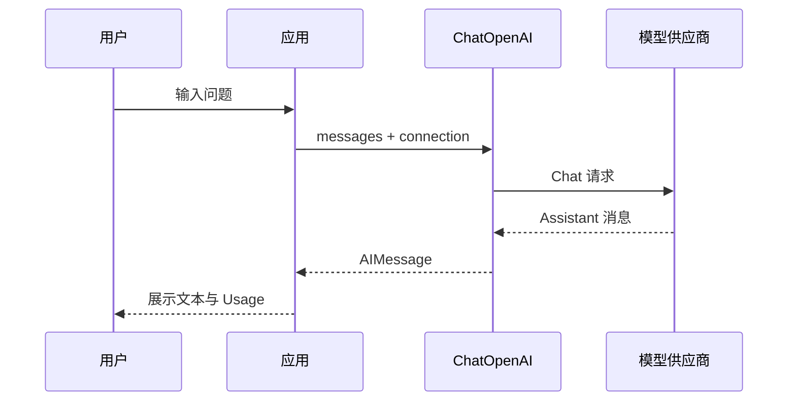
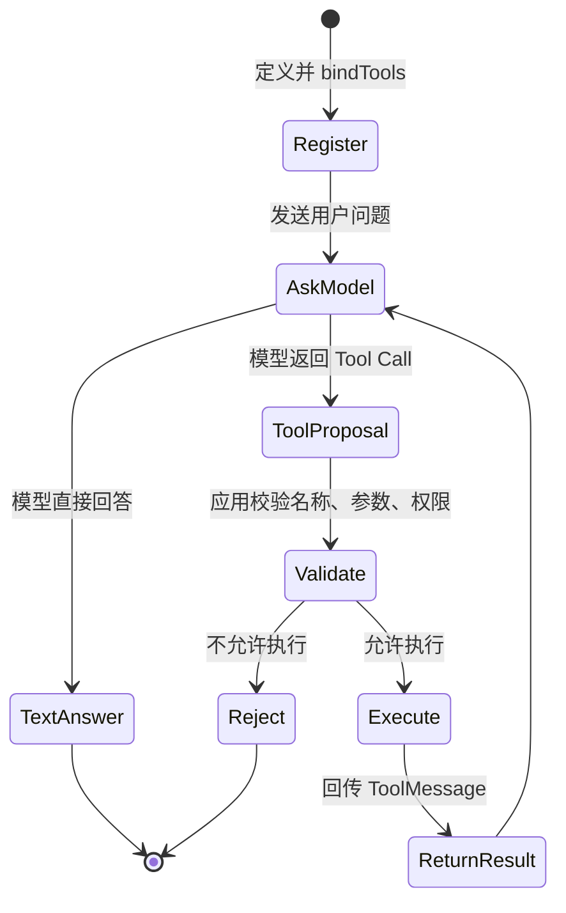

# LangChain（02） - LangChain 接入大模型与注册 Tools

## TypeScript 实现地图

TypeScript 从 `@langchain/core/messages` 导入 `SystemMessage`、`HumanMessage`、`AIMessage`、`ToolMessage`，用 `@langchain/core/tools` 的 `tool` 和 Zod 定义参数。模型通过 `bindTools()` 注册工具；应用执行 `AIMessage.tool_calls` 后，必须用相同 `tool_call_id` 创建 `ToolMessage`。

```typescript runnable file=main.ts title="TypeScript Message 流转" description="观察四种核心 Message 在 Tool Calling 循环中的顺序。"
const messages = ['SystemMessage', 'HumanMessage', 'AIMessage(tool_calls)', 'ToolMessage', 'AIMessage(final)']
messages.forEach((message, index) => console.log(`${index + 1}. ${message}`))
```


> 读完后，你应能回答：
> - LangChain 接入大模型时需要设置哪些参数？
> - LangChain 怎么注册 Tool，并约束 Tool 的参数？
> - Function Calling、Tool Call 和 Tool 执行是什么关系？

## 核心知识清单

- `ChatOpenAI` 是 LangChain 对 OpenAI 和兼容接口的 ChatModel 集成
- Base URL、API Key 与模型名是连接配置，不属于 Prompt
- Tool 由名称、描述、输入 schema 和执行函数组成
- `bindTools` 把 Tool schema 暴露给模型，不会自动执行 Tool
- 模型返回 Tool Call 后，应用仍要校验权限、参数和副作用
- Tool 执行结果必须带着对应的调用 ID 回传，完整循环放到 Tool Calling 专题继续学习

# 一、本篇只解决哪两个问题？

第一篇已经说明 LangChain 的定位、包和生态。

这一篇不进入 Runnable、LCEL 和 Agent 循环。

只完成两个最小目标：

1. 让 LangChain 成功连接真实大模型。
2. 给模型注册一个 Tool，并看到模型生成 Tool Call。

完成这两步后，你会知道模型能力和外部能力如何进入 LangChain。

后续文章再解释它们如何组合成 Chain。

# 二、接入大模型需要哪些信息？

模型连接至少需要三个值。

| 配置 | 作用 | 常见错误 |
| --- | --- | --- |
| Base URL | 指向供应商 API 根地址 | 填成控制台首页或漏掉版本路径 |
| API Key | 证明调用身份 | Key 失效、无模型权限或被错误回显 |
| 模型名 | 指定真实模型 | 使用供应商不存在的模型标识 |

这三个值都属于运行配置。

不要把它们写死在文章源码或 Git 仓库中。

在线沙盒只在当前页面内存中保存 Key。

请求通过同源服务端代理发送。

服务端会拒绝 HTTP、localhost、私网 IP 和云元数据地址。

## 2.1 为什么使用 `ChatOpenAI`？

本文使用 TypeScript 的 `@langchain/openai`。

其中 `ChatOpenAI` 把 LangChain 消息转换成 OpenAI 协议请求。

很多供应商提供 OpenAI 兼容接口，因此也可以通过自定义 Base URL 接入。

“协议兼容”不代表所有功能都兼容。

供应商仍可能缺少以下能力：

- Tool Calling。
- 流式 Tool Call。
- Token Usage。
- 严格结构化输出。
- 某些模型参数。

所以连接成功后还要针对实际功能单独验证。

# 三、先理解一次普通模型调用

一次普通调用的链路很短。



<!-- DIAGRAM_DESCRIPTION: 用户问题由应用交给 ChatOpenAI，ChatOpenAI 调用模型供应商并返回统一 AIMessage，应用展示文本和 Token Usage。 -->

这里还没有 Tool。

模型只能基于输入和自身能力返回消息。

如果问题依赖实时订单、天气或数据库，模型不能凭空读取这些系统。

# 四、Message 有哪些类型？

LangChain 用 Message 统一表达“谁说了什么”和“这条消息携带了什么调用信息”。常见的四种消息不是四个可以随意互换的字符串角色：

| 类型 | 谁产生 | 主要用途 |
| --- | --- | --- |
| `SystemMessage` | 应用 | 约束模型身份、规则、输出边界和安全要求 |
| `HumanMessage` | 用户或应用 | 表达用户问题、任务输入和多模态输入 |
| `AIMessage` | 模型 | 表达模型文本回复、Token 用量和 `tool_calls` |
| `ToolMessage` | 应用执行 Tool 后 | 携带与 `tool_call_id` 对应的 Tool 结果，交回模型继续推理 |

还会遇到 `BaseMessage` 及其扩展类型。它是公共抽象，不代表一类额外的业务角色；某些集成也会携带自定义消息或消息块。实际编排时先保证四种核心消息的顺序和关联 ID 正确，再处理供应商扩展。

一次完整 Tool Calling 对话通常是：

```text
SystemMessage -> HumanMessage -> AIMessage(tool_calls) -> ToolMessage -> AIMessage(final)
```

`AIMessage` 提出调用，`ToolMessage` 只能由应用在完成权限校验和执行后创建。不能把模型返回的 JSON 直接伪装成 `ToolMessage`，也不能漏掉 `tool_call_id`，否则模型无法知道结果对应哪一次调用。

```typescript runnable file=main.ts title="四种 Message 的 Tool Calling 顺序" description="用 LangChain 的真实 Message 类型表示一次 Tool Calling 循环，不访问外部服务。"
import { AIMessage, HumanMessage, SystemMessage, ToolMessage } from '@langchain/core/messages'

const messages = [
  new SystemMessage('你是天气助手。'),
  new HumanMessage('成都天气如何？'),
  new AIMessage({ content: '', tool_calls: [{ name: 'get_weather', args: { city: '成都' }, id: 'call-1', type: 'tool_call' }] }),
  new ToolMessage({ content: '成都晴，24 摄氏度。', tool_call_id: 'call-1' }),
  new AIMessage('成都今天晴，24 摄氏度。')
]
messages.forEach((message, index) => console.log(index + 1, message.constructor.name))
```

# 五、LangChain Tool 是什么？

Tool 是应用暴露给模型的一项受控能力。

一个 Tool 至少包含四部分：

| 字段 | 作用 |
| --- | --- |
| `name` | 模型返回 Tool Call 时使用的稳定名称 |
| `description` | 告诉模型什么时候应该选择该 Tool |
| `schema` | 约束 Tool 输入字段、类型和必填项 |
| 执行函数 | 应用确认调用后真正访问外部系统 |

名称应该稳定、明确。

描述应该解释适用条件，不要只重复名称。

schema 是运行时契约，不只是 TypeScript 类型提示。

执行函数必须把不可信参数当成外部输入重新校验。

## 5.1 为什么需要 schema？

模型生成的是调用建议，不是可信程序输入。

它可能遗漏字段。

它可能使用错误类型。

它也可能生成超出权限范围的资源 ID。

Zod schema 可以先检查数据形状。

但 schema 不能替代权限检查。

例如 `city` 是合法字符串，不代表当前业务允许查询任意位置的内部数据。

```typescript runnable file=main.ts title="Tool schema 参数校验" description="用 Zod schema 校验 Tool 参数，验证注册契约与执行函数是两件事。"
import { tool } from '@langchain/core/tools'
import { z } from 'zod'

const weatherTool = tool(
  async ({ city }) => `${city}的教学天气结果：晴，24 摄氏度。`,
  {
    name: 'get_weather',
    description: '查询指定城市天气。',
    schema: z.object({ city: z.string().min(1) })
  }
)

console.log(weatherTool.name)
console.log(weatherTool.schema.parse({ city: '成都' }))
try {
  weatherTool.schema.parse({ city: 42 })
} catch (error) {
  console.log(error.constructor.name)
}
```

# 六、`bindTools` 到底做了什么？

`bindTools` 会把 Tool 的名称、描述和 schema 放进模型请求。

模型看到这些定义后，可以选择：

- 直接返回普通文本。
- 返回一个或多个 Tool Call。

`bindTools` 不会自动执行 Tool 函数。

这条边界非常重要。

模型只能提出“我想调用 `get_weather`，参数是 `{ city: ... }`”。

应用收到后仍要决定是否执行。

## 6.1 注册不等于执行

下面的状态图把两者分开。



<!-- DIAGRAM_DESCRIPTION: bindTools 只完成注册；模型产生 Tool Call 后，应用必须校验再执行，并把 ToolMessage 回传给模型形成完整循环。 -->

本文沙盒停在 `ToolProposal`。

它不会访问真实天气接口。

这样可以先验证模型是否理解 Tool schema，又不会产生外部副作用。

# 七、可运行实验：真实模型与 Tool 注册

这个沙盒会执行真实 LangChain 模型调用。

它注册一个确定性的 `get_weather` 教学 Tool。

为了稳定观察 Tool Call，服务端会要求模型选择该 Tool。

运行后应看到：

- 实际模型名。
- Token Usage（供应商支持时）。
- `get_weather` Tool 名称。
- 模型生成的 `city` 参数。
- 明确提示“本文未执行 Tool”。

```typescript runnable model-sandbox mode=tools file=main.ts title="LangChain 模型接入与 Tool 注册" description="通过真实 ChatModel 注册 get_weather，并观察模型返回的 Tool Call；实验不会执行外部 Tool。" prompt="请查询成都的天气，并使用已经注册的 get_weather 工具。"
import { tool } from 'langchain'
import { ChatOpenAI } from '@langchain/openai'
import { z } from 'zod'

/** 当前模型连接由页面表单临时注入。 */
interface ModelConnection {
  /** OpenAI 兼容接口根地址。 */
  baseUrl: string
  /** 只用于本次请求的 API Key。 */
  apiKey: string
  /** 供应商支持的模型标识。 */
  model: string
}

/** 教学 Tool 的输入契约。 */
const weatherInputSchema = z.object({
  city: z.string().min(1).describe('需要查询天气的城市名称')
})

/**
 * 定义一个教学天气 Tool；当前实验只验证 Tool Call，不执行该函数。
 */
const getWeather = tool(
  async ({ city }) => `${city}的教学天气结果：晴，24 摄氏度。`,
  {
    name: 'get_weather',
    description: '当用户询问某个城市的天气时使用。',
    schema: weatherInputSchema
  }
)

/**
 * 连接真实模型并注册 Tool。
 * @param connection 页面临时提供的模型连接。
 * @param question 用户在沙盒中输入的问题。
 * @returns 模型提出的第一个 Tool Call。
 */
async function invokeLangChainTools(
  connection: ModelConnection,
  question: string
): Promise<{ name: string; args: Record<string, unknown> }> {
  /** 使用临时连接信息创建的真实 ChatModel。 */
  const chatModel = new ChatOpenAI({
    model: connection.model,
    apiKey: connection.apiKey,
    temperature: 0,
    maxRetries: 0,
    timeout: 45_000,
    configuration: {
      baseURL: connection.baseUrl
    }
  })
  /** 注册天气 Tool，并在教学实验中固定要求模型选择它。 */
  const modelWithTools = chatModel.bindTools([getWeather], {
    tool_choice: 'get_weather'
  })
  /** 模型响应可能包含普通文本或 Tool Calls。 */
  const responseMessage = await modelWithTools.invoke(question)
  /** 当前实验要求的第一个 Tool Call。 */
  const firstToolCall = responseMessage.tool_calls?.[0]
  if (!firstToolCall) {
    throw new Error('模型没有返回 get_weather Tool Call。')
  }
  return {
    name: firstToolCall.name,
    args: firstToolCall.args
  }
}

export { invokeLangChainTools }
```

## 7.1 如何判断实验通过？

不能只看页面显示“运行成功”。

至少检查下面四项：

1. Tool 名称必须是 `get_weather`。
2. 参数必须包含非空 `city`。
3. 输出必须声明 Tool 尚未执行。
4. API Key 不能出现在源码、URL、日志或输出中。

如果模型直接返回天气文本，而没有 Tool Call，说明当前供应商或模型的 Tool Calling 兼容性需要检查。

# 八、模型返回 Tool Call 后怎么办？

完整执行循环还有四步：

1. 校验 Tool 名称是否在白名单。
2. 用 schema 校验参数，并检查当前用户权限。
3. 执行 Tool，保存副作用和审计记录。
4. 把结果作为 ToolMessage 回传给模型。

本文不展开这四步。

它们会在“完整 Tool Calling 循环”专题中单独学习。

现在只需记住：模型不能直接调用你的数据库或操作系统。

真正执行动作的是应用代码。

# 九、常见失败怎么定位？

| 现象 | 优先检查 |
| --- | --- |
| 401 或 403 | API Key、账号权限和模型权限 |
| 404 | Base URL 版本路径和模型名 |
| 429 | 余额、RPM、TPM 与并发限制 |
| 请求超时 | 网络、上游状态和模型响应时间 |
| 模型没有 Tool Call | 模型能力、供应商兼容性与 Tool 描述 |
| Tool 参数缺失 | schema 描述、用户问题和模型能力 |
| Tool 参数越权 | 应用权限校验，而不是继续改 Prompt |

认证失败不是 Prompt 问题。

Tool 参数合法也不代表权限合法。

每次只改变一个条件，保留原始响应再判断根因。

# 十、上线前边界

- [ ] API Key 只通过环境变量或密钥服务注入。
- [ ] Base URL 只允许批准的公网 HTTPS 地址。
- [ ] 模型名来自供应商真实支持列表。
- [ ] 所有 Tool 名称进入白名单。
- [ ] 所有 Tool 参数通过 schema 与业务权限双重校验。
- [ ] 有副作用的 Tool 在执行前进行确认。
- [ ] Tool 调用使用幂等键，避免重试产生重复副作用。
- [ ] Tool Call、执行结果与调用身份进入审计记录。
- [ ] 超时和中止不会把半成品结果当成成功。
- [ ] 错误信息不会回显 API Key。

# 十一、本篇与后续课程的边界

本篇只建立 Model 和 Tool 两个入口。

后续课程按下面顺序继续：

1. Runnable：理解统一输入输出接口。
2. LCEL：理解多个 Runnable 如何组合。
3. Output Parser：理解模型输出如何进入业务类型。
4. Callback 与 Middleware：理解运行时扩展。
5. LangGraph 与 Tool Calling：理解完整循环、状态和恢复。

不要在第二篇一次学习完所有抽象。

先确认模型能连通，再确认 Tool 能注册。

# 十二、总结

> **LangChain 接入大模型时需要设置哪些参数？** 至少需要 Base URL、API Key 和模型名。`ChatOpenAI` 还可以设置 `temperature`、超时、重试等运行参数；这些属于模型连接与调用配置，不应写进 Prompt，也不能把 API Key 提交到仓库。

> **LangChain 怎么注册 Tool，并约束 Tool 的参数？** 使用 `tool` 定义稳定的名称、描述、Zod 输入 schema 和执行函数，再通过 `model.bindTools([tool])` 把 Tool schema 注册给模型。Zod 只校验参数形状，应用仍需检查 Tool 白名单、用户权限和副作用。

> **Function Calling、Tool Call 和 Tool 执行是什么关系？** Function Calling 是模型根据函数或 Tool schema 生成结构化调用请求的能力；LangChain 把一次请求表示在 `AIMessage.tool_calls` 中，这就是 Tool Call。Tool Call 只是模型提出的调用建议，应用校验后才真正执行函数，并使用相同 `tool_call_id` 创建 `ToolMessage`，再交给模型生成最终回答。

## 参考资料

- [LangChain JavaScript Overview](https://docs.langchain.com/oss/javascript/langchain/overview)
- [LangChain JavaScript Tools](https://docs.langchain.com/oss/javascript/langchain/tools)
- [ChatOpenAI Integration](https://docs.langchain.com/oss/javascript/integrations/chat/openai)
- [LangChain Models and Tool Calling](https://docs.langchain.com/oss/javascript/langchain/models)
- [Zod Documentation](https://zod.dev/)
