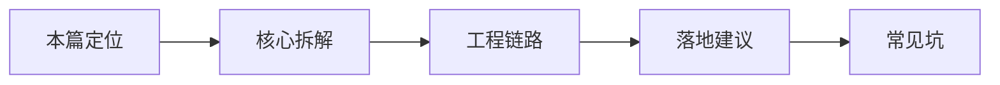

# LangChain（16） - LangChain 整体总结：AI Agent 第一阶段学习完成

## TypeScript 实现地图

TypeScript 路线应能串起 `@langchain/core` 契约、供应商包、`@langchain/textsplitters`、`@langchain/milvus`、`@langchain/mcp-adapters`、LCEL、Memory 与 Agent，并能说明 Zod、camelCase API 和 Node.js 部署边界。

```typescript runnable file=main.ts title="TypeScript 本篇最小实验" description="运行本篇 TypeScript 核心数据流。"
const modules = ['messages', 'tools', 'mcp', 'splitter', 'vectorstore', 'rag', 'memory', 'agent']
console.log(`已完成 ${modules.length} 个模块：${modules.join(' -> ')}`)
```


> 读完后，你应能完成以下任务：
> - 绘制“LangChain（16） - LangChain 整体总结：AI Agent 第一阶段学习完成 / 本篇定位”的关键对象与数据流，解释“这是 LangChain 小阶段总结，帮助你判断自己是否真的掌握了框架本质。”，并用源码位置、日志或 Trace 标注证据。
> - 为“LangChain（16） - LangChain 整体总结：AI Agent 第一阶段学习完成 / 核心拆解”设计正常与异常输入，验证“LangChain 的价值是标准化组件和组合方式。”，输出首个偏差位置与回归测试结果。
> - 实现“LangChain（16） - LangChain 整体总结：AI Agent 第一阶段学习完成 / 工程链路”的最小代码或配置，检验“用 Parser 稳定输出。”，输出命令、结果与 Diff，并说明不适用边界。

## 核心知识清单

- Model、Prompt、Retriever、Tool 与 Message
- Runnable、LCEL 与输入输出契约
- Output Parser 与结构化结果
- Callback、Middleware 与 Trace
- Chain、Agent 与 LangGraph 的选择边界
- Memory、Context 与状态持久化

<!-- article-progressive-block:start -->
# 一、先建立全局：LangChain 整体总结：AI Agent 第一阶段学习完成 是什么？

理解“LangChain 整体总结：AI Agent 第一阶段学习完成”，先要把标题中的对象放进同一条处理链：它接收什么输入，经过哪些状态变化，最终用什么证据判断结果。下表不另造概念，只把作者正文已经解释的章节按依赖顺序连起来。

“LangChain 整体总结：AI Agent 第一阶段学习完成”的第一个核心判断是：这是 LangChain 小阶段总结，帮助你判断自己是否真的掌握了框架本质。。先弄清这个判断中的对象和输入输出，后面的实现、故障和验收才有共同语境。

| 顺序 | 章节 | 读完本节应抓住的结论 |
| --- | --- | --- |
| 1 | 本篇定位 | 这是 LangChain 小阶段总结，帮助你判断自己是否真的掌握了框架本质。 |
| 2 | 核心拆解 | LangChain 的价值是标准化组件和组合方式。 |
| 3 | 工程链路 | 用 Parser 稳定输出。 |
| 4 | 落地建议 | 项目里先裸写最小链路，再决定是否引框架。 |
| 5 | 常见坑 | 用框架掩盖自己没想清流程。 |
| 6 | 和已有主线的关系 | 35 是入门，66-68 是拆解，69 是阶段收束； |

## 1.1 核心对象之间怎样衔接



这张图只表达本文的讲解顺序，不替代正文机制。判断“LangChain 整体总结：AI Agent 第一阶段学习完成”是否真正掌握，需要能从最后一个结果沿图回到前面每个章节的输入、状态变化和证据。

## 1.2 再看失败：问题最早会出现在哪一步？

在“LangChain 整体总结：AI Agent 第一阶段学习完成”的对象和顺序已经明确后，再看可观察的失败：字段到模型阶段才报错、Parser 吞掉原始输出、流式中断被当成完整成功。定位时不从最后一条错误猜原因，而是沿上图找第一个偏离正文结论的节点。
<!-- article-progressive-block:end -->

# 二、LangChain 第一阶段能力的学习定位与边界

这是 LangChain 小阶段总结，帮助你判断自己是否真的掌握了框架本质。

# 三、LangChain 第一阶段能力的真实应用场景

学完 LangChain 后，很多人会记住一堆类名，却说不清项目里为什么用它。正确的总结方式是回到工程问题：prompt 怎么复用，检索怎么接，工具怎么暴露，输出怎么解析，链路怎么追踪。

# 四、LangChain 第一阶段能力的核心对象与机制

- LangChain 的价值是标准化组件和组合方式。它把 prompt、model、retriever、tool、parser 变成可组合的积木。
- 它不替你解决业务边界。权限、工具确认、引用来源、拒答、评测和部署仍然要你自己设计。
- 它适合快速搭多步骤固定流程和复用生态组件，不适合简单到一次模型调用的场景，也不适合强循环状态机。

# 五、LangChain 第一阶段能力的工程链路

- 用 PromptTemplate 管提示词。
- 用 Retriever 接知识库。
- 用 Tool 暴露外部能力。
- 用 Parser 稳定输出。
- 用 Runnable/LCEL 串固定流程。
- 复杂分支交给 LangGraph。

# 六、LangChain 第一阶段能力的落地建议

- 学习 LangChain 要记抽象，不死记版本 API。
- 项目里先裸写最小链路，再决定是否引框架。
- 每条 chain 都要有输入输出契约和 trace。

# 七、LangChain 第一阶段能力的常见故障与误区

- 用框架掩盖自己没想清流程。
- API 版本变化就完全不会改。
- 以为 LangChain 默认会处理安全和评测。

# 八、LangChain 第一阶段能力在学习路线中的位置

35 是入门，66-68 是拆解，69 是阶段收束；后面进入 Nest、LangGraph 和工程化。

# 九、LangChain 第一阶段能力的核心结论

> LangChain 可以总结为“组件标准化 + 链式组合”。它让 prompt、retriever、tool、parser、model 更容易复用，但业务安全、引用、拒答、评测和状态管理仍要自己负责。简单需求裸写，固定多步骤用 chain，复杂循环上 LangGraph。

<!-- article-progressive-block:start -->
# 十、动手验证：先跑通 LangChain 整体总结：AI Agent 第一阶段学习完成，再改变一个变量

前面的章节已经建立问题、概念和机制。现在把“LangChain 整体总结：AI Agent 第一阶段学习完成”放进同一套基线中运行；本节不再引入新术语，只验证前文结论能否被复现。

## 10.1 基线与候选只允许一个变量不同

验证“LangChain 整体总结：AI Agent 第一阶段学习完成”时，先固定Runnable 输入类型、Prompt 变量、依赖版本、模型替身和异常样本。候选方案只能改变本次要验证的变量；如果同时更换数据、依赖和配置，即使结果改善，也不能知道是哪一项产生作用。

执行“LangChain 整体总结：AI Agent 第一阶段学习完成”时，动作是：逐段 invoke 并记录 Retriever、Prompt、Model、Parser 的输入输出，再比较整链结果。原始结果不能只保留截图或汇总分数，必须同步保存：各 Runnable 的序列化输入输出、Trace、异常类型、预期断言和依赖版本，使下一次复查可以在同一输入上重放。

| 实验要素 | 本文要求 |
| --- | --- |
| 固定条件 | Runnable 输入类型、Prompt 变量、依赖版本、模型替身和异常样本 |
| 唯一变量 | 本次候选方案与基线之间的一项明确差异 |
| 原始证据 | 各 Runnable 的序列化输入输出、Trace、异常类型、预期断言和依赖版本 |
| 通过阈值 | 数据形状逐段匹配，错误停在首个失效边界，整链结果能由中间状态解释 |
| 立即停止 | 字段到模型阶段才报错、Parser 吞掉原始输出、流式中断被当成完整成功 |

## 10.2 执行前先排除不可比较条件

“LangChain 整体总结：AI Agent 第一阶段学习完成”开始前先确认下面四项；任一项不成立，都应先修复实验条件，而不是解释结果。

- 基线能够在“LangChain 整体总结：AI Agent 第一阶段学习完成”的当前环境重复运行。
- 候选只改变一个与“LangChain 整体总结：AI Agent 第一阶段学习完成”结论直接相关的条件。
- “LangChain 整体总结：AI Agent 第一阶段学习完成”的基线和候选使用同一批输入、同一版本依赖与同一通过阈值。
- “LangChain 整体总结：AI Agent 第一阶段学习完成”的原始输出和失败现场不会被重试、格式化或汇总覆盖。

## 10.3 执行后先核对证据完整性

结果出来后先检查证据，再讨论“LangChain 整体总结：AI Agent 第一阶段学习完成”是否通过。缺少中间状态时，最终输出只能说明现象，不能证明机制。

| 检查项 | 当前文章的判定 |
| --- | --- |
| 输入可追溯 | Runnable 输入类型、Prompt 变量、依赖版本、模型替身和异常样本 |
| 过程可回放 | 逐段 invoke 并记录 Retriever、Prompt、Model、Parser 的输入输出，再比较整链结果 |
| 结果可审计 | 各 Runnable 的序列化输入输出、Trace、异常类型、预期断言和依赖版本 |

“LangChain 整体总结：AI Agent 第一阶段学习完成”的一次合格基线对照按以下顺序执行：

1. 保存“LangChain 整体总结：AI Agent 第一阶段学习完成”基线版本及输入摘要，确认基线本身可以重复运行。
2. 写下“LangChain 整体总结：AI Agent 第一阶段学习完成”候选方案唯一变化的变量，以及它预期影响的指标。
3. 在同一环境执行“LangChain 整体总结：AI Agent 第一阶段学习完成”：逐段 invoke 并记录 Retriever、Prompt、Model、Parser 的输入输出，再比较整链结果。
4. 为“LangChain 整体总结：AI Agent 第一阶段学习完成”保存：各 Runnable 的序列化输入输出、Trace、异常类型、预期断言和依赖版本。
5. 使用“LangChain 整体总结：AI Agent 第一阶段学习完成”预登记条件判断：数据形状逐段匹配，错误停在首个失效边界，整链结果能由中间状态解释。
6. 如果“LangChain 整体总结：AI Agent 第一阶段学习完成”未通过，不修改第二个变量，先恢复基线并保留失败现场。

# 十一、用一张矩阵验证 LangChain 整体总结：AI Agent 第一阶段学习完成 的关键结论

矩阵按正文顺序列出“LangChain 整体总结：AI Agent 第一阶段学习完成”的结论。一次实验只选择一行，只改变这一行对应的条件；不要把多行合并成一个无法归因的大实验。

| 正文章节 | 已解释的结论 | 本轮唯一变量 | 必须保存的证据 |
| --- | --- | --- | --- |
| 本篇定位 | 这是 LangChain 小阶段总结，帮助你判断自己是否真的掌握了框架本质。 | 只改变与“本篇定位”相关的条件 | 各 Runnable 的序列化输入输出、Trace、异常类型、预期断言和依赖版本 |
| 核心拆解 | LangChain 的价值是标准化组件和组合方式。 | 只改变与“核心拆解”相关的条件 | 各 Runnable 的序列化输入输出、Trace、异常类型、预期断言和依赖版本 |
| 工程链路 | 用 Parser 稳定输出。 | 只改变与“工程链路”相关的条件 | 各 Runnable 的序列化输入输出、Trace、异常类型、预期断言和依赖版本 |
| 落地建议 | 项目里先裸写最小链路，再决定是否引框架。 | 只改变与“落地建议”相关的条件 | 各 Runnable 的序列化输入输出、Trace、异常类型、预期断言和依赖版本 |
| 常见坑 | 用框架掩盖自己没想清流程。 | 只改变与“常见坑”相关的条件 | 各 Runnable 的序列化输入输出、Trace、异常类型、预期断言和依赖版本 |
| 和已有主线的关系 | 35 是入门，66-68 是拆解，69 是阶段收束； | 只改变与“和已有主线的关系”相关的条件 | 各 Runnable 的序列化输入输出、Trace、异常类型、预期断言和依赖版本 |

## 11.1 记录本次实际实验

下面的记录用于“LangChain 整体总结：AI Agent 第一阶段学习完成”当前这一次实验，不是第二套知识目录。先从矩阵选择一个章节，再填写实际值；没有填写的字段表示尚未验证。

```yaml
topic: "LangChain 整体总结：AI Agent 第一阶段学习完成"
selected_chapter: required
claim_from_article: required
baseline_version: required
changed_condition: exactly_one
execution: "逐段 invoke 并记录 Retriever、Prompt、Model、Parser 的输入输出，再比较整链结果"
evidence: "各 Runnable 的序列化输入输出、Trace、异常类型、预期断言和依赖版本"
pass_when: "数据形状逐段匹配，错误停在首个失效边界，整链结果能由中间状态解释"
stop_when: "字段到模型阶段才报错、Parser 吞掉原始输出、流式中断被当成完整成功"
observed_result: required
first_deviation: null_or_evidence
recovery_replay: required_after_failure
```

## 11.2 边界实验必须证明能够停止和恢复

成功路径只能证明“LangChain 整体总结：AI Agent 第一阶段学习完成”在当前样本上工作，不能证明它可以进入生产。边界实验需要主动制造：字段到模型阶段才报错、Parser 吞掉原始输出、流式中断被当成完整成功，并观察系统是否在产生不可逆副作用前停止。

| 场景 | 只改变什么 | 应保存什么 | 通过标准 |
| --- | --- | --- | --- |
| 正常路径 | 使用已知有效输入 | 各 Runnable 的序列化输入输出、Trace、异常类型、预期断言和依赖版本 | 数据形状逐段匹配，错误停在首个失效边界，整链结果能由中间状态解释 |
| 边界路径 | 把一个输入推进到约束临界值 | 临界值前后的输出与指标 | 不静默降级，不把部分结果冒充成功 |
| 明确失败 | 注入：字段到模型阶段才报错、Parser 吞掉原始输出、流式中断被当成完整成功 | 原始错误、首个异常阶段和最终状态 | 失败被正确分类且没有扩大副作用 |
| 恢复重放 | 执行：隔离失败 Runnable，固定其输入单独重放，再恢复相邻节点契约测试 | 原失败样本的复测证据 | 原样本恢复，正常样本没有回归 |

恢复动作不是简单重启。对于“LangChain 整体总结：AI Agent 第一阶段学习完成”，第一步是：隔离失败 Runnable，固定其输入单独重放，再恢复相邻节点契约测试。完成后使用原始失败样本复测；只验证一个新样本成功，不能证明触发条件已经消失。

“LangChain 整体总结：AI Agent 第一阶段学习完成”边界实验结束后，应把正常、临界、失败和恢复四类记录放在同一个运行批次中。这样才能区分“候选方案真的修复问题”和“环境变化让问题暂时没有出现”。

# 十二、LangChain 整体总结：AI Agent 第一阶段学习完成 的结果解释

解释“LangChain 整体总结：AI Agent 第一阶段学习完成”实验时先看首个偏差，而不是最后一条错误。最后的异常通常只是上游状态错误的结果；从末端反推容易误把症状当根因。

| 观察结果 | 可以支持的判断 | 下一步 |
| --- | --- | --- |
| 主链路没有达到预期 | 字段到模型阶段才报错、Parser 吞掉原始输出、流式中断被当成完整成功 | 先执行：隔离失败 Runnable，固定其输入单独重放，再恢复相邻节点契约测试 |
| 异常链路无法恢复 | 字段到模型阶段才报错、Parser 吞掉原始输出、流式中断被当成完整成功 | 先执行：隔离失败 Runnable，固定其输入单独重放，再恢复相邻节点契约测试 |
| 新样本成功但原样本仍失败 | 修复没有覆盖原始触发条件 | 固定原失败输入，恢复基线后重新比较 |
| 指标改善但证据无法回链 | 数据、版本或中间状态没有固定 | 暂停发布，补齐可追溯记录后重跑 |

“LangChain 整体总结：AI Agent 第一阶段学习完成”只有同时满足“数据形状逐段匹配，错误停在首个失效边界，整链结果能由中间状态解释”，并且没有出现“字段到模型阶段才报错、Parser 吞掉原始输出、流式中断被当成完整成功”，才可以认为主链路通过。这里的“通过”只对当前固定版本、样本和环境有效，不能外推到尚未测试的容量、权限或数据分布。

如果“LangChain 整体总结：AI Agent 第一阶段学习完成”候选方案与基线差异很小，先检查证据分辨率是否足够；如果差异很大，先排除数据泄漏、环境漂移和版本不一致。两种情况都不能只看一个汇总均值，需要回到逐样本输出和中间状态。

“LangChain 整体总结：AI Agent 第一阶段学习完成”故障定位完成后，记录“现象、首个偏差、根因、改动、原样本复测”五项。缺少原样本复测时，只能标记为待观察，不能标记为已解决。

# 十三、LangChain 整体总结：AI Agent 第一阶段学习完成 的发布判断

发布判断需要把“LangChain 整体总结：AI Agent 第一阶段学习完成”的质量、失败边界和恢复能力放在同一份记录中。以下任一条件缺失，都应停止扩量，而不是用“基本正常”替代证据。

- [ ] “LangChain 整体总结：AI Agent 第一阶段学习完成”的基线与候选只存在一个计划内变量。
- [ ] “LangChain 整体总结：AI Agent 第一阶段学习完成”的输入、代码、依赖、配置和数据版本可以追溯。
- [ ] “LangChain 整体总结：AI Agent 第一阶段学习完成”的正常、临界、失败和恢复样本使用同一套断言。
- [ ] “LangChain 整体总结：AI Agent 第一阶段学习完成”的原始输出、中间状态和失败现场已经保留。
- [ ] “LangChain 整体总结：AI Agent 第一阶段学习完成”的日志、Trace、截图和测试数据已经脱敏。
- [ ] “LangChain 整体总结：AI Agent 第一阶段学习完成”的停止条件、负责人和回滚入口已经演练。
- [ ] “LangChain 整体总结：AI Agent 第一阶段学习完成”尚未覆盖的输入、权限、容量和外部依赖已经登记。

最终记录至少包含基线版本、唯一变量、原始证据、首个偏差、恢复复测和发布责任人。没有参与本次修改的人如果不能据此重放“LangChain 整体总结：AI Agent 第一阶段学习完成”的判断，就不能发布。
<!-- article-progressive-block:end -->

# 十四、总结

- **本篇定位**：这是 LangChain 小阶段总结，帮助你判断自己是否真的掌握了框架本质。
- **核心拆解**：LangChain 的价值是标准化组件和组合方式。
- **落地建议**：项目里先裸写最小链路，再决定是否引框架。
- **和已有主线的关系**：35 是入门，66-68 是拆解，69 是阶段收束；
- **复述答法**：它让 prompt、retriever、tool、parser、model 更容易复用，但业务安全、引用、拒答、评测和状态管理仍要自己负责。

## 参考资料

- [LangChain 文档](https://docs.langchain.com/oss/javascript/langchain/overview)
- [Dify 文档](https://docs.dify.ai/)
