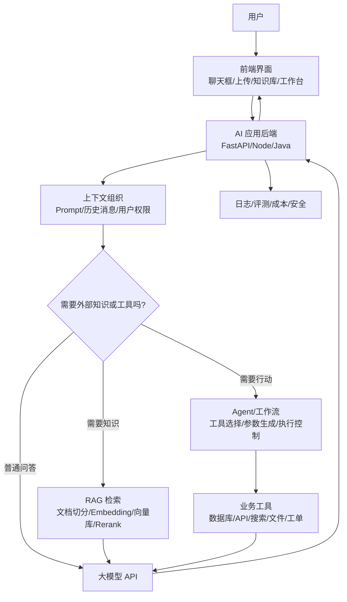

# 工程基础（3）- 大模型应用开发全景图

> 目标：建立一张清晰的地图，知道 LLM、Prompt、RAG、Agent、工作流、微调、部署分别在大模型应用里处于什么位置，后面学习不会迷路。

# 一、本篇先抓住什么

- 大模型应用不是前端直接调模型 API，而是前端、后端、模型、知识库、工具和工程化一起工作。
- Prompt 负责组织任务和上下文，RAG 负责补充外部知识，Agent 负责调用工具完成动作。
- RAG 优先级高于微调，尤其适合企业知识库、客服、制度问答。
- Workflow 更稳定可控，Agent 更灵活但风险更高，真实项目要谨慎选。
- 工程化决定 AI demo 能不能变成生产系统。

# 二、先看整体结构

一个典型大模型应用可以拆成 8 层：

```text
用户界面
  ↓
业务后端
  ↓
Prompt 与上下文组织
  ↓
大模型 API
  ↓
知识增强 RAG
  ↓
工具调用 / Agent / 工作流
  ↓
数据、权限、日志、评测
  ↓
部署、成本、稳定性
```

不要把大模型应用理解成“前端直接调 ChatGPT”。真实系统通常是：

> 前端收集用户意图，后端组织上下文，大模型负责生成和推理，RAG 提供知识，工具调用执行业务动作，工程化保障稳定上线。

# 三、一张 Mermaid 图



这张图后面会反复用到。

# 四、第一层：用户界面

用户界面是 AI 应用的入口。

常见 UI：

- 聊天窗口
- 文件上传
- 知识库管理
- Agent 工作台
- 文档总结页面
- 数据分析页面
- 后台系统里的 AI Copilot

前端要特别关注：

- 流式输出
- loading 状态
- 停止生成
- 重试回答
- 引用来源
- 复制回答
- 多会话
- 错误提示
- 工具调用过程
- 人工确认弹窗

AI 应用不是“一个输入框 + 一个回答”就结束。越接近真实业务，状态越多。

# 五、第二层：业务后端

后端负责把 AI 能力变成服务。

为什么不能前端直接调用大模型？

- API Key 会泄露
- 无法做用户鉴权
- 无法控制 token 成本
- 无法接企业数据库
- 无法记录完整日志
- 无法做文件解析
- 无法统一处理异常
- 无法做权限隔离

AI 应用后端常见接口：

- `POST /chat`
- `POST /chat/stream`
- `POST /files/upload`
- `POST /knowledge/import`
- `GET /sessions`
- `POST /tools/call`
- `GET /logs`

后面学 FastAPI，就是为了能自己写这些接口。

# 六、第三层：Prompt 与上下文组织

Prompt 不是单独一句话，而是“模型执行任务所需的完整上下文”。

通常包括：

- system prompt：系统角色和总规则
- user message：用户问题
- history：历史对话
- retrieved context：RAG 检索到的知识
- tool result：工具调用结果
- output schema：输出格式约束
- safety rule：安全边界

例子：

```text
你是企业知识库助手。
你只能基于给定资料回答。
如果资料不足，回答“当前知识库没有足够信息”。
回答必须包含：
1. 结论
2. 依据
3. 引用来源

用户问题：
{{question}}

知识库资料：
{{retrieved_chunks}}
```

Prompt 工程的本质：

> 把业务需求、数据上下文和输出约束翻译成模型更容易稳定执行的指令。

# 七、第四层：大模型 API

大模型 API 是生成答案的核心能力。

你需要掌握：

- 模型选择
- message 格式
- temperature
- max tokens
- stream
- JSON 输出
- tool calling
- 超时和重试
- token 统计

简单理解几个关键概念：

## 7.1 message

对话不是一整段字符串，而是一组消息：

```json
[
  { "role": "system", "content": "你是一个严谨的知识库助手" },
  { "role": "user", "content": "请总结这份制度" }
]
```

## 7.2 temperature

控制输出随机性。

- 低 temperature：更稳定，适合客服、知识库、代码、结构化输出
- 高 temperature：更发散，适合创意写作、营销文案

## 7.3 token

token 可以理解成模型处理文本的基本单位。

它影响：

- 能输入多少上下文
- 能输出多长回答
- 调用成本
- 响应速度

## 7.4 streaming

流式响应让模型边生成边返回。

前端看到的“打字机效果”通常就是 stream。

# 八、第五层：RAG

RAG 全称是 Retrieval-Augmented Generation，意思是“检索增强生成”。

它解决的问题：

> 大模型本身不知道你的企业私有知识，或者模型知识不够新、不够准。

RAG 的基本流程：

1. 文档解析
2. 文档切分
3. 文本向量化
4. 存入向量数据库
5. 用户提问
6. 问题向量化
7. 检索相关文档片段
8. 可选 rerank
9. 拼进 Prompt
10. 模型基于资料回答

可以这样理解：

> RAG 不是让模型“记住”文档，而是在每次回答前，先把可能相关的资料找出来，临时交给模型参考。

# 九、RAG 和微调的区别

这是面试高频。

| 对比点 | RAG | 微调 |
|---|---|---|
| 主要解决 | 补充知识 | 改变行为或风格 |
| 更新成本 | 低，更新知识库即可 | 高，需要准备数据和训练 |
| 适合场景 | 企业文档问答、FAQ、制度查询 | 固定格式、领域表达、特定任务习惯 |
| 可解释性 | 强，可返回引用来源 | 弱，难说明答案来自哪里 |
| 前期优先级 | 高 | 中低 |

对你当前路线：

**先学 RAG，后面再了解微调。**

大部分企业知识问答场景，优先考虑 RAG，而不是一上来微调。

# 十、第六层：Agent

Agent 可以理解成：

> 让模型根据目标，自主决定是否调用工具，并基于工具结果继续完成任务。

普通聊天：

```text
用户问：今天上海天气怎么样？
模型回答：我不知道实时天气。
```

带工具调用的 Agent：

```text
用户问：今天上海天气怎么样？
模型判断：需要查天气
模型生成工具参数：city=上海
后端调用天气 API
模型拿到结果
模型回答：今天上海天气...
```

Agent 的关键能力：

- 理解任务
- 选择工具
- 生成参数
- 执行工具
- 观察结果
- 继续推理
- 给出最终答案

# 十一、Agent 和 Workflow 的区别

这是学习时很容易混淆的点。

## 11.1 Workflow

Workflow 是提前设计好的流程。

比如：

```text
用户上传论文
  ↓
提取标题和摘要
  ↓
总结核心观点
  ↓
生成思维导图
  ↓
输出 Markdown
```

特点：

- 流程固定
- 可控性强
- 适合生产系统
- 容易排查问题

## 11.2 Agent

Agent 是模型根据任务动态决定步骤。

比如：

```text
用户说：帮我分析这个客户为什么流失
模型可能先查客户资料
再查订单
再查客服记录
再总结原因
再给挽回建议
```

特点：

- 灵活
- 适合开放任务
- 不确定性更高
- 更需要权限和边界控制

实际项目里，很多时候应该优先用 Workflow，必要时再引入 Agent。

# 十二、第七层：工具调用

工具调用是 Agent 落地的基础。

工具可以是：

- 查数据库
- 调业务接口
- 搜索网页
- 读取文件
- 创建工单
- 发消息
- 生成图表
- 执行代码

一个工具通常需要定义：

- 工具名称
- 工具描述
- 参数 schema
- 返回格式
- 权限要求
- 错误处理

例子：

```json
{
  "name": "query_order",
  "description": "根据订单号查询订单状态",
  "parameters": {
    "order_id": "string"
  }
}
```

真正难的不是让模型调用工具，而是：

- 参数是否正确
- 用户是否有权限
- 工具是否会造成危险操作
- 调用失败怎么办
- 是否需要用户确认
- 日志怎么记录

# 十三、第八层：工程化

工程化是 demo 和生产系统的分水岭。

AI 应用常见问题：

- 回答慢
- 回答乱
- JSON 格式坏掉
- 检索不到资料
- 检索到了但模型不用
- 模型胡编
- token 成本太高
- 用户越权访问知识库
- Prompt 被用户注入攻击
- 工具被误调用
- 高并发下超时

所以要做：

- 日志
- 监控
- 成本统计
- 限流
- 超时
- 重试
- 缓存
- 降级
- 权限隔离
- 数据脱敏
- 评测集
- 坏 case 复盘

面试时能讲工程化，会非常加分。

# 十四、常见技术选型

## 14.1 后端

- Python + FastAPI：AI 应用开发常用，生态成熟，上手快
- Node.js：前端同学熟悉，适合轻量应用
- Java / Spring Boot：企业后端常见，适合接现有系统

当前推荐你先学：

**Python + FastAPI**

原因：

- AI 生态最丰富
- 教程和示例多
- RAG、Agent 框架支持好
- 写 demo 快

## 14.2 大模型

常见接入方式：

- 云模型 API
- OpenAI 兼容接口
- 本地模型
- 企业私有化模型服务

你需要重点理解：

- API 调用格式
- 模型能力差异
- token 成本
- 上下文窗口
- 响应速度
- 数据安全

## 14.3 RAG 组件

常见组件：

- 文档解析：unstructured、pypdf、python-docx
- embedding：OpenAI embedding、bge、通义、其他国产 embedding
- 向量库：Chroma、Milvus、pgvector、FAISS
- rerank：bge-reranker、云厂商 rerank
- 框架：LangChain、LlamaIndex

前期不用全学，先把流程跑通。

## 14.4 Agent / 工作流

常见工具：

- Dify
- Coze
- LangChain
- LangGraph
- AutoGen
- CrewAI

推荐顺序：

1. Dify：快速理解 AI 应用流程
2. LangChain：用代码实现 RAG 和工具调用
3. LangGraph：处理更复杂的 Agent 状态
4. Coze：了解智能体平台和发布形态

AutoGen、CrewAI 可以后面作为扩展了解。

# 十五、当前阶段哪些必须学

优先级最高：

- Python 基础
- LLM API
- Prompt
- FastAPI
- 流式响应
- RAG
- 工具调用
- 简单部署

优先级中等：

- LangChain
- Dify
- LangGraph
- Docker
- 成本统计
- 日志评测

后面再深入：

- 微调
- 多模态
- 本地模型性能优化
- 深度学习原理
- 多 Agent 框架

# 十六、学习地图：从问题到技术

| 你想解决的问题 | 对应技术 |
|---|---|
| 让模型回答用户问题 | LLM API + Prompt |
| 让回答按固定格式返回 | Structured Output / JSON Schema |
| 让前端边生成边显示 | Streaming / SSE |
| 让模型知道企业文档 | RAG |
| 让模型引用依据 | RAG + metadata + citation |
| 让模型查订单、查数据库 | Tool Calling |
| 让模型自己决定下一步 | Agent |
| 让流程稳定可控 | Workflow |
| 让系统能上线 | FastAPI + Docker + 日志 + 权限 |
| 让回答越来越准 | 评测集 + 坏 case 分析 |

# 十七、面试官可能怎么问

## 17.1 问题 1：说一下一个 RAG 系统的完整流程。

可以答：

> 离线阶段先解析文档、切分 chunk、生成 embedding，并把向量和元数据存入向量数据库。在线阶段用户提问后，对问题做 embedding，去向量库检索相关 chunk，必要时做 rerank，然后把检索内容、用户问题和输出约束拼成 Prompt 发给大模型。模型回答时最好附引用来源。后续通过日志和评测集分析坏 case，调切分、召回、重排和 Prompt。

## 17.2 问题 2：Agent 和普通聊天机器人有什么区别？

可以答：

> 普通聊天机器人主要根据上下文直接生成回答；Agent 会根据任务决定是否调用工具，比如查数据库、调接口、搜索或创建工单，再基于工具结果继续推理并给出答案。Agent 的难点不只是调用工具，而是权限控制、参数校验、失败兜底、工具调用日志和人工确认。

## 17.3 问题 3：RAG 和微调怎么选？

可以答：

> 如果问题是模型缺少企业私有知识、知识需要频繁更新、需要引用来源，优先 RAG。如果问题是模型输出风格、固定格式或特定任务行为长期不稳定，可以考虑微调。实际企业知识库问答通常先做 RAG，因为更新成本低、可解释性更强。

# 十八、自测清单

读完这篇，你应该能回答：

- 一个大模型应用有哪些层？
- 为什么前端不能直接调用模型 API？
- Prompt 和上下文有什么区别？
- RAG 的完整流程是什么？
- RAG 和微调有什么区别？
- Agent 和 Workflow 有什么区别？
- 工具调用为什么需要权限控制？
- demo 和生产系统差在哪里？

# 十九、学习建议

这篇信息量最大，建议按图来学。

第一遍只看懂这条链路：

```text
用户提问 → 后端组织 Prompt → RAG 检索资料 → 模型生成回答 → 前端流式展示
```

第二遍再补：

```text
工具调用、Agent、Workflow、日志、成本、权限、部署
```

如果你能画出一个“企业知识库 RAG 系统”的流程图，这篇就算过关。

# 二十、下一步

阶段一到这里结束。

接下来进入阶段二：

`04-Python环境配置.md`

目标不是学成 Python 大神，而是尽快做到：

- 能写脚本
- 能调大模型 API
- 能处理文件和 JSON
- 能用 FastAPI 包成接口

# 二十一、总结

- **RAG 和微调的区别**：大部分企业知识问答场景，优先考虑 RAG，而不是一上来微调。
- **Agent 和 Workflow 的区别**：Workflow 是提前设计好的流程。
- **本篇先抓住什么**：大模型应用不是前端直接调模型 API，而是前端、后端、模型、知识库、工具和工程化一起工作。
- **先看整体结构**：一个典型大模型应用可以拆成 8 层：

## 参考资料

- [Hugging Face LLM Course](https://huggingface.co/learn/llm-course/chapter1/1)
- [Attention Is All You Need](https://arxiv.org/abs/1706.03762)
