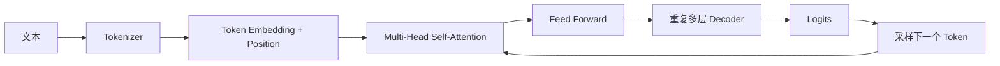

# 大模型基础（07） - Transformer、Attention 与自回归生成

> 从 Q/K/V 到逐 Token 生成，理解模型为什么能利用上下文、为什么长输入会变慢，以及 KV Cache 优化了什么。

## 学习目标

- 解释 Q/K/V、缩放点积注意力、多头和因果 Mask 的作用。
- 区分 Prefill、Decode、TTFT、TPOT 与 KV Cache 的性能含义。
- 判断何时需要检索、工具或结构化约束来弥补模型边界。

## 一、Transformer 数据流

自注意力为每个位置生成 Query、Key、Value。`softmax(QK^T / sqrt(d))V` 先计算“应该关注谁”，再聚合被关注位置的信息。多头让不同子空间分别学习指代、顺序、主题和局部关系；残差与归一化帮助深层训练稳定。

## 二、为什么是 Decoder-only

因果 Mask 禁止当前位置读取未来 Token。模型先并行完成已有 Prompt 的 Prefill，再在 Decode 阶段反复预测下一个 Token。输入越长，Prefill 计算和首 Token 延迟通常越高；输出越长，Decode 时间越长。

## 三、KV Cache

每次生成只新增一个位置。缓存历史 Key/Value 后无需重复计算全部前缀，代价是显存随序列长度和并发增长。生产压测要记录 TTFT、TPOT、输入/输出 Token 和 KV Cache 占用，不能只看平均 tokens/s。

## 四、能力边界

Attention 能聚合上下文，不等于模型拥有事实校验、数据库查询或可靠规划能力。需要最新事实时使用检索，需要副作用时使用受控工具，需要确定格式时使用 Schema/解析器。

## 五、最小验证

固定 Prompt 比较不同上下文长度的 TTFT，记录相同输出预算下的延迟、显存和质量。再改变 temperature/top_p，观察多次采样的稳定性；不要把一次生成当作模型确定行为。

## 参考资料

- [Attention Is All You Need](https://arxiv.org/abs/1706.03762)
- [Hugging Face KV Cache](https://huggingface.co/docs/transformers/main/en/kv_cache)
