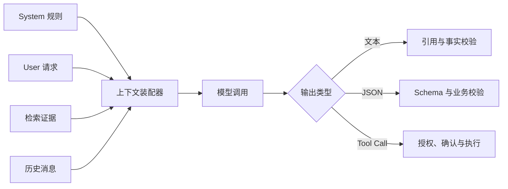

# 大模型基础（10） - 模型能力、消息协议与 API 稳定调用

> 模型 API 不是“传入字符串、返回字符串”。生产调用必须同时管理消息权限、输出形态、采样参数、失败语义和可观测数据。

> 读完你能：为问答、抽取、多模态和工具调用选择正确接口，并设计可重试、可取消、可审计的调用链。

## 核心知识清单

- 问答、摘要、分类、抽取与多模态能力边界
- System、User、Assistant 与 Tool 消息协议
- 文本、结构化输出与工具调用请求
- temperature、top_p、stop 与输出预算
- 非流式、流式、批处理与异步调用
- 超时、限流、内容过滤与指数退避
- API Key、日志脱敏与数据驻留

## 先按输出契约选择能力

| 任务 | 首选输出 | 程序必须验证 |
| --- | --- | --- |
| 问答、摘要 | 文本 + 引用 | 证据是否支持结论 |
| 分类、抽取 | JSON Schema | 类型、枚举、范围和必填字段 |
| 查询或写操作 | Tool Call | 身份、权限、参数和副作用确认 |
| 图片、音频理解 | 多模态消息 | 文件类型、大小、隐私和识别置信度 |

Embedding 模型只生成向量，不直接回答问题；聊天模型可以提出工具调用，但真实数据库查询、发信和文件修改仍由应用执行。把模型建议误当成已执行结果，是常见的业务一致性漏洞。

## 消息不是同一权限级别

System 放稳定规则和拒绝边界，User 保存当前请求，Assistant 保存模型输出，Tool 保存程序执行结果。历史消息、检索文档和 Tool Result 都可能包含不可信文本，不能覆盖系统规则。生产系统还应给每条外部内容标记来源、时间和可信级别。

## 稳定调用策略

1. 为连接、首 Token、总响应分别设置超时，用户取消后向下游传播取消信号。
2. 只重试限流、临时网络和服务端错误；认证失败、内容过滤、非法参数不能盲目重试。
3. 指数退避必须加入随机抖动，并设置最大次数与总时间预算。
4. 写操作使用幂等键或执行记录，避免响应丢失后重试造成重复副作用。
5. Trace 记录模型版本、Prompt 版本、输入输出 Token、TTFT、总延迟和标准化错误类型；日志不保存密钥和未经脱敏的敏感正文。

## 采样参数怎么定

抽取、分类和工具参数生成更看重稳定性，应使用低随机性并依赖 Schema；创意生成可以提高随机性，但必须用评测确认收益。`temperature` 和 `top_p` 都会改变采样分布，通常固定一个、调整另一个。`stop` 适合协议边界，但不能替代完整 JSON 校验。

## 参考资料

- [OpenAI Text Generation](https://platform.openai.com/docs/guides/text-generation)
- [OpenAI Structured Outputs](https://platform.openai.com/docs/guides/structured-outputs)
- [OpenAI Function Calling](https://platform.openai.com/docs/guides/function-calling)
- [OpenAI Rate Limits](https://platform.openai.com/docs/guides/rate-limits)

