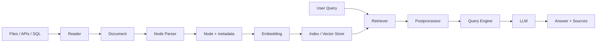

# LlamaIndex（01） - LlamaIndex 入门：从 Document 到 Query Engine

> 读完后，你应能：
> - 给定三份带来源字段的原始文档，能生成 Document 与 Node 清单，并用节点数量、字符区间和 metadata 回链结果验证切分没有丢失来源。
> - 给定一个查询和若干 Node，能实现可运行的索引与 Top-K 检索实验，并用逐项分数解释候选为什么进入结果集。
> - 给定 OpenAI 兼容 Base URL、API Key 和模型名，能通过真实 LlamaIndex `BaseLLM` 契约发起调用，并保存包含模型正文、模型名和 Token 用量的运行记录验收连接。
> - 给定“该用 LangChain 还是 LlamaIndex”的项目条件，能输出选型记录，并用数据接入、检索定制、工作流复杂度和团队现状四项证据支持结论。

# 一、LlamaIndex 解决的到底是什么问题？

如果应用只需要把一句 Prompt 发给模型，直接使用供应商 SDK 就够了。

当模型必须回答公司文档、数据库记录或业务 API 里的问题时，事情会多出一条数据链路：

1. 从文件、数据库或 API 读取原始数据。
2. 把原始数据整理成带来源信息的 Document。
3. 把 Document 切成适合检索的 Node。
4. 为 Node 建立索引。
5. 根据问题召回相关 Node。
6. 把证据和问题交给模型生成答案。
7. 保存引用、分数、耗时和错误信息。

LlamaIndex 的核心价值，是给这条“让模型使用你的数据”的链路提供统一对象和组合方式。

官方把这类工作称为 context augmentation 或 context engineering。

重点不是把所有数据都塞进 Prompt。

重点是在正确时间选择正确数据，并保留足够证据解释选择过程。

## 1.1 它和 RAG 是什么关系？

RAG 是一种架构方法。

LlamaIndex 是实现这种方法的一套框架。

两者不是同一个层级：

| 名称 | 它是什么 | 主要回答什么问题 |
| --- | --- | --- |
| RAG | 检索增强生成架构 | 怎样用外部证据约束模型回答 |
| LlamaIndex | 数据与上下文工程框架 | 怎样接入、处理、索引、检索和查询数据 |
| Milvus | 向量数据库 | 怎样保存向量并执行近邻检索 |
| Neo4j | 图数据库 | 怎样保存关系并执行受控多跳查询 |

所以 LlamaIndex 应当是独立一级模块。

它会调用切分器、Embedding 和向量库，但不等于其中任何一个组件。

## 1.2 一张图看懂完整链路



这张图里有两条不同路径。

离线路径把数据变成可检索资产。

在线路径把问题变成候选证据，再生成答案。

如果线上回答错了，必须先判断错误来自哪条路径。

# 二、先认清五个核心对象

LlamaIndex 的高层 API 看起来很短，但短代码背后仍是五个不同职责。

## 2.1 Document 保存原始语义和来源

Document 不是一个裸字符串。

它通常包含正文、文档标识和 metadata。

metadata 可以保存文件名、租户、更新时间、权限标签或业务主键。

这些字段有三个用途：

- 检索时做过滤。
- 回答时生成引用。
- 更新或删除时定位原始数据。

如果建库时丢掉 metadata，后面即使召回文本，也很难完成权限控制和来源回链。

## 2.2 Node 是真正进入索引的检索单元

一份 Document 往往太长，不能直接作为一个候选。

Node 是从 Document 切出的片段。

它除了文本，还应保留：

- 来源 Document ID。
- 在原文中的字符或页码范围。
- 可过滤 metadata。
- 与父节点、前后节点的关系。

Node 太大，候选里会混入无关内容。

Node 太小，单个候选又可能缺少回答问题所需的上下文。

切分不是“固定一个字符数就结束”，而是要结合文档结构和查询类型验证。

## 2.3 Ingestion Pipeline 负责稳定加工数据

Ingestion Pipeline 把多个数据变换按顺序串起来。

常见步骤包括：

1. 清洗正文。
2. 解析章节结构。
3. 切分 Node。
4. 补充标题、页码和权限字段。
5. 计算 Embedding。
6. 写入 Doc Store 与 Vector Store。

生产环境还要加入去重、缓存、版本和失败重试。

同一输入和同一配置应产生可复现结果。

否则每次重建索引都会改变 Node ID，增量删除和离线评测会失去基准。

## 2.4 Index 与 Retriever 不是同一件事

Index 负责组织和访问已经处理的数据。

Retriever 负责根据本次查询选择候选。

同一个 Index 可以配不同 Retriever 参数。

例如客服问答可能使用 Top-K 召回加权限过滤。

研究助手可能使用更大的候选集，再经过重排。

不要把 `topK` 当成索引的永久属性。

它属于一次查询的召回策略。

## 2.5 Query Engine 负责把检索与回答接起来

Query Engine 通常完成三件事：

1. 调用 Retriever 获取候选 Node。
2. 把候选交给响应合成器组织 Prompt。
3. 调用 LLM 生成带来源的回答。

Query Engine 返回的不应只有最终字符串。

调试时还需要候选 Node、分数和来源信息。

只保存最终答案，会让坏案例排查退化成猜测。

# 三、先跑通 Document 到 Node，不需要 API Key

下面的实验只验证数据契约。

它不下载 LlamaIndex，也不调用模型。

这样做是为了先看清 Document 和 Node 应保存哪些信息。

真实项目里可以把同样的验收条件用于 LlamaIndex Node Parser 的回归测试。

## 3.1 可运行实验：切分并验证来源回链

```python runnable file=main.py title="Document 到 Node" description="运行确定性切分器，检查 Node 是否保留来源、区间和租户字段。"
from dataclasses import dataclass
from typing import Dict, List


@dataclass(frozen=True)
class Document:
    """保存一份原始文档及其可过滤来源信息。"""

    document_id: str
    text: str
    metadata: Dict[str, str]


@dataclass(frozen=True)
class Node:
    """保存进入检索索引的片段和原文字符范围。"""

    node_id: str
    document_id: str
    text: str
    start: int
    end: int
    metadata: Dict[str, str]


def split_document(document: Document, chunk_size: int, overlap: int) -> List[Node]:
    """按稳定区间切分文档，并继承来源 metadata。"""
    if chunk_size <= 0:
        raise ValueError("chunk_size 必须大于 0")
    if overlap < 0 or overlap >= chunk_size:
        raise ValueError("overlap 必须位于 0 到 chunk_size 之间")

    # 相邻片段每次向前移动的真实字符数。
    step = chunk_size - overlap
    # 当前文档生成的全部检索节点。
    nodes: List[Node] = []

    for start in range(0, len(document.text), step):
        # 当前片段不能越过原文末尾。
        end = min(start + chunk_size, len(document.text))
        # 稳定 Node ID 由来源与字符范围组成，便于增量更新。
        node_id = f"{document.document_id}:{start}-{end}"
        nodes.append(
            Node(
                node_id=node_id,
                document_id=document.document_id,
                text=document.text[start:end],
                start=start,
                end=end,
                metadata=dict(document.metadata),
            )
        )
        if end == len(document.text):
            break

    return nodes


# 待切分的最小业务文档。
source_document = Document(
    document_id="policy-2026-08",
    text="退款申请需在签收后七天内提交。数字商品激活后不支持无理由退款。",
    metadata={"tenant": "shop-a", "source": "refund-policy.md"},
)
# 使用容易人工复核的字符窗口运行切分。
result_nodes = split_document(source_document, chunk_size=18, overlap=5)

for node in result_nodes:
    print(node.node_id, node.metadata["source"], repr(node.text))

# 回链检查确保每个 Node 文本都能从原文区间恢复。
assert all(source_document.text[node.start:node.end] == node.text for node in result_nodes)
# 权限检查确保租户字段没有在切分时丢失。
assert all(node.metadata["tenant"] == "shop-a" for node in result_nodes)
print(f"验收通过：{len(result_nodes)} 个 Node 均可回链到原文")
```

## 3.2 运行后要看什么？

不要只看“代码没有报错”。

至少检查四项：

- Node ID 是否稳定包含来源和区间。
- `source` 是否能用于显示引用。
- `tenant` 是否能用于检索过滤。
- Node 文本是否等于原文对应区间。

把 `overlap` 改成等于 `chunk_size`，程序应明确报错。

这条异常路径证明配置校验真正生效。

# 四、Index 建好了，为什么仍可能检索错？

“成功写入向量库”只证明数据存在。

它没有证明查询能找到正确证据。

检索效果同时受这些因素影响：

- Node 是否切在自然语义边界。
- Embedding 模型是否适合当前语言和领域。
- 查询是否需要改写或分解。
- Top-K 是否太小或太大。
- metadata 过滤是否误删正确候选。
- 相似度分数是否可以跨查询直接比较。

## 4.1 一个最小检索器包含哪些步骤？

最小检索器仍有四步：

1. 用与建库相同的规则向量化查询。
2. 从索引中计算候选相似度。
3. 应用租户、权限和时间过滤。
4. 按分数排序并截取 Top-K。

真实 Embedding 需要模型。

为了让机制实验在浏览器直接运行，下面使用可解释的词频向量。

它不能代替语义 Embedding。

它的价值是让过滤、打分和排序过程完全可见。

## 4.2 可运行实验：看清 Top-K 候选为什么入选

```python runnable file=main.py title="可解释的 Node 检索" description="运行词频向量检索，观察权限过滤、余弦分数和 Top-K 排序。"
import math
import re
from dataclasses import dataclass
from typing import Dict, List, Tuple


@dataclass(frozen=True)
class SearchNode:
    """保存最小检索实验中的文本和租户字段。"""

    node_id: str
    text: str
    tenant: str


def tokenize(text: str) -> List[str]:
    """把中英文文本转成可重复比较的字符与单词单元。"""
    # 英文使用完整单词，中文使用单字，便于标准库直接运行。
    return re.findall(r"[a-zA-Z0-9]+|[\u4e00-\u9fff]", text.lower())


def vectorize(text: str) -> Dict[str, float]:
    """把文本转换为归一化词频向量。"""
    # 当前文本每个单元出现的次数。
    counts: Dict[str, float] = {}
    for token in tokenize(text):
        counts[token] = counts.get(token, 0.0) + 1.0

    # L2 范数用于把不同长度文本放到同一尺度。
    norm = math.sqrt(sum(value * value for value in counts.values())) or 1.0
    return {token: value / norm for token, value in counts.items()}


def cosine(left: Dict[str, float], right: Dict[str, float]) -> float:
    """计算两个稀疏向量的余弦相似度。"""
    # 只遍历较短向量，减少无意义查找。
    shorter, longer = (left, right) if len(left) <= len(right) else (right, left)
    return sum(value * longer.get(token, 0.0) for token, value in shorter.items())


def retrieve(query: str, nodes: List[SearchNode], tenant: str, top_k: int) -> List[Tuple[SearchNode, float]]:
    """先执行租户过滤，再按相似度返回 Top-K。"""
    if top_k <= 0:
        raise ValueError("top_k 必须大于 0")

    # 查询和建库必须使用同一种向量化规则。
    query_vector = vectorize(query)
    # 只允许当前租户的 Node 进入打分阶段。
    allowed_nodes = [node for node in nodes if node.tenant == tenant]
    # 每个候选同时保留 Node 与可解释分数。
    scored_nodes = [(node, cosine(query_vector, vectorize(node.text))) for node in allowed_nodes]
    return sorted(scored_nodes, key=lambda item: item[1], reverse=True)[:top_k]


# 两个租户共用物理索引，但查询必须逻辑隔离。
indexed_nodes = [
    SearchNode("a-refund", "退款申请需要在签收后七天内提交", "shop-a"),
    SearchNode("a-shipping", "订单发货后可以查看物流状态", "shop-a"),
    SearchNode("b-refund", "会员订单支持三十天退款", "shop-b"),
]
# 当前查询只允许访问 shop-a。
results = retrieve("退款需要几天内申请", indexed_nodes, tenant="shop-a", top_k=2)

for node, score in results:
    print(f"{node.node_id}: score={score:.4f} text={node.text}")

# 正确退款条款应排在物流条款之前。
assert results[0][0].node_id == "a-refund"
# 其他租户即使文字更相近也不能进入结果。
assert all(node.tenant == "shop-a" for node, _ in results)
print("验收通过：相关性排序正确，租户过滤未泄漏")
```

## 4.3 为什么这个实验故意不用真实 Embedding？

机制实验与效果实验要分开。

这个实验验证的是检索数据流：

- 查询向量和文档向量使用同一规则。
- 权限过滤发生在候选返回之前。
- 分数参与排序。
- Top-K 只截取已经过滤和排序的候选。

真实效果评测应换成目标 Embedding 模型，并使用标注查询集计算 Recall@K、MRR 或 nDCG。

两种实验回答的问题不同，不能互相替代。

# 五、Query Engine 怎样把证据交给模型？

Retriever 返回候选后，Query Engine 还要决定怎样组织证据。

常见策略包括：

- Compact：尽量把候选压进较少的模型调用。
- Refine：让模型逐段读取并更新已有答案。
- Tree Summarize：分层汇总大量候选。

策略选择会影响成本、延迟和答案完整度。

候选很少时，Compact 通常更直接。

候选很多且需要综合时，分层或逐步策略更合适。

无论选择哪种方式，都要保留 Source Node。

没有来源的正确答案也无法完成审计。

## 5.1 为什么真实模型实验只放在这里？

Document、Node、过滤和排序都能离线验证。

只有答案生成真正需要 LLM。

因此只有本节显示 Base URL、API Key 和模型选择。

页面不会把 Key 写入源码、地址栏或本地存储。

服务端还会拒绝 HTTP、localhost、私网地址、跨主机跳转和超时请求。

## 5.2 可运行实验：通过 LlamaIndex 契约调用真实模型

```typescript runnable model-sandbox framework=llamaindex file=main.ts title="真实 LlamaIndex BaseLLM" description="服务端通过 LlamaIndex BaseLLM 与 Settings.withLLM 执行 OpenAI 兼容模型调用。" prompt="请用两句话解释 LlamaIndex 中 Document、Node 和 Query Engine 的职责关系。"
import {
  BaseLLM,
  Settings,
  type ChatResponse,
  type ChatResponseChunk,
  type LLMChatParamsNonStreaming,
  type LLMChatParamsStreaming,
  type LLMMetadata,
  type MessageContent
} from 'llamaindex'

/** 页面在运行时临时注入的模型连接。 */
interface ModelConnection {
  /** OpenAI 兼容接口根地址。 */
  baseUrl: string
  /** 只用于本次请求的 API Key。 */
  apiKey: string
  /** 供应商支持的模型标识。 */
  model: string
}

/** OpenAI 兼容响应中本实验读取的字段。 */
interface ChatCompletionBody {
  /** 第一个候选应包含助手文本。 */
  choices?: Array<{ message?: { content?: string } }>
}

/**
 * 把 LlamaIndex 多模态消息收敛为当前实验使用的文本。
 * @param content LlamaIndex 标准消息正文。
 * @returns 可发送给文本模型的字符串。
 */
function toText(content: MessageContent): string {
  if (typeof content === 'string') return content
  return content
    .filter((part) => part.type === 'text')
    .map((part) => part.text)
    .join('\n')
}

/** 使用 OpenAI 兼容接口实现 LlamaIndex 的统一 LLM 契约。 */
class CompatibleLlamaIndexLLM extends BaseLLM {
  /** LlamaIndex 用于预算与记录的模型元数据。 */
  readonly metadata: LLMMetadata

  /** 当前请求独占的临时连接。 */
  private readonly connection: ModelConnection

  /**
   * 创建模型适配器。
   * @param connection 页面临时提供的模型连接。
   */
  constructor(connection: ModelConnection) {
    super()
    this.connection = connection
    this.metadata = {
      model: connection.model,
      temperature: 0,
      topP: 1,
      contextWindow: 128_000,
      tokenizer: undefined,
      structuredOutput: false
    }
  }

  /** 声明流式调用返回类型。 */
  chat(params: LLMChatParamsStreaming): Promise<AsyncIterable<ChatResponseChunk>>

  /** 声明非流式调用返回类型。 */
  chat(params: LLMChatParamsNonStreaming): Promise<ChatResponse>

  /**
   * 执行一次非流式 Chat Completions 请求。
   * @param params LlamaIndex 组装的标准消息。
   * @returns LlamaIndex 标准助手消息。
   */
  async chat(
    params: LLMChatParamsStreaming | LLMChatParamsNonStreaming
  ): Promise<AsyncIterable<ChatResponseChunk> | ChatResponse> {
    if (params.stream) throw new Error('本实验只支持非流式调用')

    /** 供应商标准 Chat Completions 地址。 */
    const endpoint = `${this.connection.baseUrl.replace(/\/$/, '')}/chat/completions`
    /** 使用 LlamaIndex 消息发起的真实供应商请求。 */
    const response = await fetch(endpoint, {
      method: 'POST',
      headers: {
        Authorization: `Bearer ${this.connection.apiKey}`,
        'Content-Type': 'application/json'
      },
      body: JSON.stringify({
        model: this.connection.model,
        messages: params.messages.map((message) => ({
          role: message.role,
          content: toText(message.content)
        })),
        temperature: 0,
        stream: false
      })
    })
    if (!response.ok) throw new Error(`模型请求失败：HTTP ${response.status}`)

    /** 解析后的兼容接口响应。 */
    const body = await response.json() as ChatCompletionBody
    /** 第一个候选的助手正文。 */
    const content = body.choices?.[0]?.message?.content?.trim()
    if (!content) throw new Error('模型没有返回文本')

    return {
      message: { role: 'assistant', content },
      raw: body
    }
  }
}

/**
 * 在 LlamaIndex 请求作用域中调用真实模型。
 * @param connection 页面临时提供的连接。
 * @param question 用户可编辑的问题。
 * @returns 模型生成的文本答案。
 */
async function invokeLlamaIndex(connection: ModelConnection, question: string): Promise<string> {
  /** 当前请求独占的 LLM 适配器。 */
  const llm = new CompatibleLlamaIndexLLM(connection)
  /** withLLM 避免并发请求互相覆盖全局模型。 */
  const response = await Settings.withLLM(llm, () => Settings.llm.chat({
    messages: [
      { role: 'system', content: '请准确回答，不要编造未提供的事实。' },
      { role: 'user', content: question }
    ]
  }))
  return toText(response.message.content)
}

export { invokeLlamaIndex }
```

## 5.3 怎样判断真实调用成功？

验收不能只写“返回 200”。

至少保存这些证据：

- 页面状态显示运行成功。
- 输出区显示实际模型名。
- 模型正文回答了当前问题。
- 供应商返回 Usage 时，输入、输出和总 Token 均为非负整数。
- API Key 没有出现在源码、URL、控制台和输出区。

如果供应商没有返回 Usage，页面会显示“未知”。

这代表协议字段缺失，不等于请求失败。

# 六、LlamaIndex 与 LangChain 怎么选？

不要用“哪个更火”做选型。

先看项目主要复杂度在哪里。

| 项目条件 | 更适合优先考虑 | 原因 |
| --- | --- | --- |
| 文档接入、解析、索引和检索定制很多 | LlamaIndex | 数据对象和索引链路是核心抽象 |
| 多工具、模型路由和通用步骤编排很多 | LangChain | Runnable 与集成生态更贴近编排问题 |
| 需要显式状态图、暂停恢复和人工审批 | LangGraph | 状态迁移和持久化比单条查询链更重要 |
| 只是一次简单模型调用 | 供应商 SDK | 引入框架只会增加依赖和调试层级 |

## 6.1 可以同时使用吗？

可以，但必须有清晰边界。

一种常见分工是：

- LlamaIndex 管理数据接入、索引和 Retriever。
- LangGraph 管理长流程状态和人工审批。
- 业务服务管理权限、幂等和事务。

不要让两个框架同时管理同一份会话状态或重试策略。

否则一次失败可能被重复重试，或者 Trace 被拆成两套无法关联的记录。

## 6.2 选型记录至少写什么？

一份可复核的选型记录应包含：

1. 主要复杂度来自数据链还是工作流。
2. 必须接入的数据源和存储。
3. 需要定制的切分、检索与重排步骤。
4. 团队已经维护的框架和观测系统。
5. 最小原型的延迟、质量和依赖体积。
6. 退出框架时需要替换哪些接口。

写清退出成本很重要。

框架是实现手段，不应变成无法替换的业务边界。

# 七、常见失败应该从哪一层排查？

| 现象 | 更可能的层级 | 第一条证据 |
| --- | --- | --- |
| 建库后没有 Node | Reader 或 Node Parser | 输入 Document 数和 Pipeline 输出数 |
| 正确文档始终召回不到 | 切分、Embedding 或查询表达 | 标注查询的 Recall@K |
| 召回了其他租户数据 | metadata 与过滤 | 实际 Filter 和候选 metadata |
| 候选正确但答案错误 | Prompt 或响应合成 | 最终发送给模型的消息 |
| 更新后仍引用旧内容 | Doc Store、Vector Store 或版本 | 文档版本与 Node ID |
| 401 或 403 | 模型认证 | Base URL、Key 权限与模型权限 |
| 404 | 接口路径或模型名 | 最终请求地址和供应商模型列表 |
| 429 | 配额与并发 | RPM、TPM、余额和重试次数 |
| 请求越来越慢 | 候选数量或模型上下文 | Retriever、Rerank、LLM 分段耗时 |

## 7.1 为什么不能先改 Prompt？

如果 Retriever 根本没有返回正确 Node，再好的 Prompt 也无法补出缺失证据。

正确排查顺序通常是：

1. 确认目标数据已经进入 Document。
2. 确认目标内容进入 Node。
3. 确认权限过滤后目标 Node 仍存在。
4. 确认 Retriever 把目标 Node 排进 Top-K。
5. 确认 Query Engine 把目标 Node 发给模型。
6. 最后才检查 Prompt 和模型输出。

每一步都应保存输入、输出、耗时和版本。

# 八、上线前怎样验收最小闭环？

## 8.1 离线建库验收

- Reader 读取数量与源数据清单一致。
- 每个 Node 都能回链到 Document 和原始位置。
- metadata 包含租户、来源、版本和权限字段。
- 同一输入与同一配置重复运行产生稳定 Node ID。
- 删除源文档后，对应 Node 能完整删除。

## 8.2 在线检索验收

- 标注查询集保存期望文档或 Node。
- 统计 Recall@K、MRR 或 nDCG，而不是只看单个案例。
- 权限拒绝样例无法召回其他租户数据。
- 候选、分数、Filter 和版本可在 Trace 中查看。
- 空召回有明确降级，不让模型假装引用资料。

## 8.3 生成回答验收

- 答案中的关键事实能映射到 Source Node。
- 引用链接能够打开原始文档或定位页码。
- 模型超时、限流和空响应都有明确错误状态。
- 重试不会重复计费或重复执行业务副作用。
- 日志、Trace 和错误信息不会记录 API Key。

# 九、总结

- LlamaIndex 是面向数据和上下文工程的独立框架，应与 LangChain 并列，而不是塞进 RAG 附录。
- Document 保存原始语义和来源，Node 是进入索引的检索单元，metadata 决定过滤、引用和增量更新能力。
- Ingestion Pipeline 负责稳定加工数据，Index 负责组织数据，Retriever 负责本次查询的候选选择。
- Query Engine 把检索、响应合成和 LLM 调用接起来，但排障时必须保留 Source Node 与分数。
- 离线机制实验不需要 API Key；只有真实 LLM 调用才需要 Base URL、Key 和模型配置。
- 选型时先判断主要复杂度来自数据链还是工作流，不要因为框架知名度引入不必要依赖。
- 上线前必须分别验收建库、检索和生成，不能用“一次回答成功”替代异常路径、权限和质量评测。

参考资料：

- [LlamaIndex Python Framework：Introduction](https://developers.llamaindex.ai/python/framework/)
- [LlamaIndex.TS Framework：Introduction](https://developers.llamaindex.ai/typescript/framework/)
- [LlamaIndex.TS：RAG Tutorial](https://developers.llamaindex.ai/typescript/framework/tutorials/rag/)
