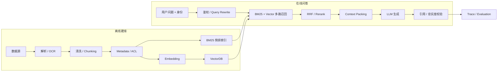

# 01 - 企业级知识库：从数据接入到可信问答

# 一、学习目标

这一模块按“数据流入 → 处理 → 检索 → 生成 → 治理”组织。企业知识库不是向量数据库 Demo，而是一套包含数据质量、权限、版本、引用、评测、稳定性和成本约束的检索生成系统。

# 二、全链路架构

# 三、技术选型基线

| 层 | 起步方案 | 规模化方案 | 关键判断 |
| --- | --- | --- | --- |
| Chunking | 递归 + 标题 | 结构化/父子/语义分块 | Recall 与条件完整率 |
| Embedding | 中文/多语言开源模型 | 托管或自部署批量服务 | 语言、许可、吞吐、成本 |
| VectorDB | pgvector/FAISS | Milvus/Elasticsearch Vector | 规模、过滤、运维、HA |
| 稀疏检索 | SQLite FTS/简单 BM25 | Elasticsearch/OpenSearch | 专有词、分词和过滤 |
| Rerank | 无或小模型 | Cross-Encoder 服务 | nDCG、P95、候选成本 |

# 四、验收标准

- 权限过滤下推到每条召回路，跨租户泄漏率为零。
- 切分、Embedding、索引和 Prompt 都有版本，可灰度与回滚。
- 检索层用 Recall@K/MRR，生成层用忠实度、引用和拒答验收。
- ES、VectorDB 或 Rerank 故障时有明确降级。
- 成本按解析、Embedding、存储、检索、Rerank 和生成拆分。

# 五、总结

可信企业知识库依赖全链路契约和治理；任何单点组件都不能替代权限、评测和版本控制。
