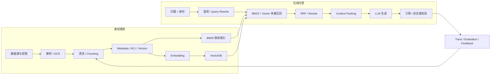

# 01 - 企业级知识库：从数据接入到可信问答

# 一、学习目标与系统边界

本模块按“数据流入 → 处理 → 检索 → 生成 → 治理”组织。学完后应能设计离线建库与在线问答两条链路，选择 Chunking、Embedding、VectorDB 和混合检索方案，并用权限、版本、评测、稳定性和成本约束系统。

企业知识库不是“文档转向量后问一句”的 Demo。若解析丢表格、切分破坏条件、索引没有权限字段或回答无法回溯来源，模型再强也只是把错误表达得更流畅。

# 二、全链路架构

# 三、学习顺序与关键产物

| 阶段 | 要解决的问题 | 最小可验收产物 |
| --- | --- | --- |
| 数据接入 | 来源、格式、权限、增量更新 | 带 `document_id/version/acl` 的原始文档清单 |
| 解析切分 | 表格、标题、条件和上下文是否保留 | 可回溯到页码与章节的 Chunk |
| 索引构建 | 语义词、精确词和过滤如何兼顾 | 稠密向量索引 + BM25 索引 + 版本清单 |
| 在线检索 | 多路结果如何融合和重排 | 带各阶段分数与过滤原因的候选集 |
| 生成校验 | 答案是否只使用证据 | 逐句引用、无证据拒答和引用有效性检查 |
| 生产治理 | 如何升级、回滚和控制成本 | 评测集、SLO、告警、灰度与回滚记录 |

# 四、技术选型基线

| 层 | 轻量起步 | 规模化方案 | 决策指标 |
| --- | --- | --- | --- |
| Chunking | 递归 + 标题切分 | 结构化、父子或语义分块 | Recall@K、条件完整率、重复率 |
| Embedding | 中文/多语言开源模型 | 托管或自部署批量服务 | 语言、许可、维度、吞吐、成本 |
| VectorDB | pgvector/FAISS | Milvus/Elasticsearch Vector | 数据量、过滤、更新、HA、团队运维能力 |
| 稀疏检索 | SQLite FTS/基础 BM25 | Elasticsearch/OpenSearch | 专有词、分词、字段权重、过滤性能 |
| Rerank | 无或小型 Cross-Encoder | 独立批量服务 | nDCG@K、P95、候选数与单次成本 |

不要脱离数据规模比较 VectorDB。百万级以内、过滤简单且团队已有 PostgreSQL 时，pgvector 往往更省运维；需要大规模分片、高吞吐向量检索时再评估 Milvus；已重度使用 Elasticsearch 且需要 BM25、过滤与向量同栈时，可优先验证 ES 混合检索。结论必须由压测和故障演练确认。

# 五、权限、版本与数据治理

ACL 必须在 **BM25、Vector、缓存和 Rerank 前**全部下推，不能先全库召回再在答案阶段删除。索引字段至少包含 `tenant_id`、资源 ACL、来源、文档版本、Chunk 版本、Embedding 模型版本和更新时间。

离线更新采用可重入任务：先写新版本索引，完成抽样校验后原子切换别名，失败则保留旧版本。删除文档时同步清理稀疏索引、向量索引、缓存和评测样本引用，避免“正文删了但向量仍可召回”。

# 六、稳定性与成本

在线链路为每一阶段设置超时预算。Rerank 故障可降级为融合排序，向量库异常可暂时保留 BM25，模型超时可返回检索摘要或明确失败；任何降级都要标记，不能伪装成完整答案。

成本按解析/OCR、Embedding、存储、检索、Rerank、LLM 和观测拆分。通过增量建库、内容哈希去重、Embedding 批处理、候选集限额、上下文预算和冷热分层优化，而不是简单缩短所有 Chunk。

# 七、常见失败与排查顺序

1. **完全召回不到**：确认解析结果和权限过滤，再查分词、Embedding 和索引版本。
2. **召回了错误片段**：检查 Chunk 边界、metadata、Query Rewrite、融合权重和 Rerank。
3. **证据正确但答案错误**：检查 Context Packing、Prompt、引用映射和生成后校验。
4. **偶发跨租户结果**：立即停用相关入口，审计每条召回路和缓存键，不接受仅在生成后过滤。
5. **升级后质量下降**：用相同评测集对比 Chunk、Embedding、索引和 Prompt 版本，逐层定位。

# 八、验收标准

- 权限过滤下推到所有召回和缓存路径，跨租户泄漏测试为零。
- 切分、Embedding、索引和 Prompt 都有版本，可灰度、回放与回滚。
- 检索层至少评估 Recall@K、MRR/nDCG，生成层评估忠实度、引用正确率和拒答准确率。
- ES、VectorDB、Rerank 或 LLM 故障都有明确降级，并记录降级率与恢复时间。
- 每个答案能回溯到文档、版本、页码或章节；证据不足时明确拒答。

# 九、总结

可信企业知识库依赖全链路的数据契约和治理。先保证权限、可追溯与评测，再谈召回算法和模型效果。
