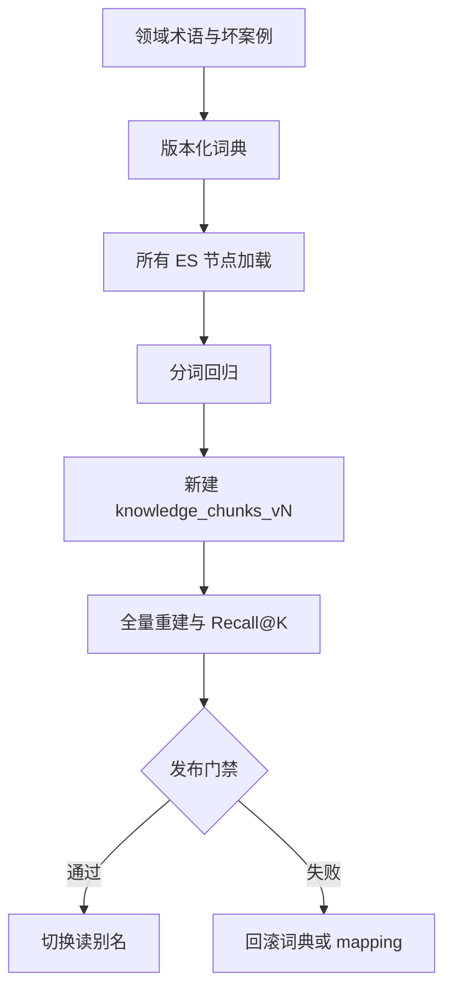

# 基础设施实战（3）- IK 分词器工程化：词典、重建与灰度发布

> 读完你能：围绕“IK 分词器工程化：词典、重建与灰度发布”理解“索引配置”与“词典生命周期”，并结合正文示例完成实践与排障。


IK 可以改善中文词边界，但插件并不自动带来好召回。真正的工程工作是管理插件兼容性、领域词典版本、索引重建和回归评测。若产品名、缩写和错误码更适合精确匹配，应使用 `keyword` 子字段，不要把所有问题都推给词典。




## 一、索引配置

```http
PUT /knowledge_chunks_v2
{
  "mappings": {
    "dynamic": "strict",
    "properties": {
      "tenant_id": {"type": "keyword"},
      "acl_groups": {"type": "keyword"},
      "error_codes": {"type": "keyword", "normalizer": "lowercase"},
      "title": {
        "type": "text",
        "analyzer": "ik_max_word",
        "search_analyzer": "ik_smart",
        "fields": {"raw": {"type": "keyword"}}
      },
      "content": {
        "type": "text",
        "analyzer": "ik_max_word",
        "search_analyzer": "ik_smart"
      }
    }
  }
}
```

索引与查询使用不同 analyzer 是一种起点，不是通用真理。`ik_max_word` 可能制造大量词元并增加索引体积，`ik_smart` 也可能把领域短语拆错，必须用真实金标集决定。

## 二、词典生命周期

词典文件至少记录 `dictionary_version`、术语来源、负责人、上线日期和回滚版本。远程词典服务需要超时、缓存与内容哈希；任何节点加载失败都应阻止切换新索引。热更新只影响后续分析，既有文档的词元不会自动变化，因此词典变更通常需要重建。

```text
# domain.dic
Visual Worktree
离线建库
多路召回
PAY-1042
```

用 `_analyze` 同时验证索引和查询分词：

```http
POST /knowledge_chunks_v2/_analyze
{
  "field": "content",
  "text": ["Visual Worktree 离线建库失败，错误码 PAY-1042"]
}
```

## 三、可执行的集群一致性检查

```text
# requirements.txt
elasticsearch>=8,<10
```

```python
from __future__ import annotations

import os

from elasticsearch import Elasticsearch


# ES 地址来自部署环境。
ELASTICSEARCH_URL = os.getenv("ELASTICSEARCH_URL", "http://localhost:9200")
# 新索引名称用于验证最终 mapping 生效后的分词结果。
INDEX_NAME = os.getenv("INDEX_NAME", "knowledge_chunks_v2")
# 关键领域短语及必须保留的最小词元集合。
EXPECTED_TERMS = {
    "Visual Worktree 离线建库": {"visual worktree", "离线", "建库"},
    "错误码 PAY-1042": {"pay-1042"},
}


def verify_analyzer(client: Elasticsearch) -> None:
    """验证关键术语分词；client 是已鉴权的 Elasticsearch 客户端。"""

    for text, expected_tokens in EXPECTED_TERMS.items():
        # 当前样本由索引 content 字段的 search_analyzer 处理。
        response = client.indices.analyze(
            index=INDEX_NAME,
            body={"field": "content", "text": text},
        )
        # 实际词元统一为小写集合，便于判断必需术语是否缺失。
        actual_tokens = {token["token"].lower() for token in response["tokens"]}
        if not expected_tokens <= actual_tokens:
            raise RuntimeError(
                f"analyzer regression: text={text!r}, actual={sorted(actual_tokens)}"
            )


# 客户端在脚本运行期复用连接。
es_client = Elasticsearch(ELASTICSEARCH_URL, request_timeout=5)
verify_analyzer(es_client)
```

## 四、何时不用 IK

- 订单号、错误码、邮箱和版本号：独立抽取为 `keyword`。
- 多语言知识库：优先评估通用 analyzer、语言字段分流或专用搜索服务。
- 领域术语变化极快：将同义词、精确字段和查询改写组合使用，避免每天重建大索引。
- 仅靠向量召回已满足需求：不要为“技术栈齐全”增加插件运维成本；但仍需用真实错误码问题验证。

## 五、验收

所有节点插件版本一致；词典哈希可追踪；分词回归和权限内 Recall@10 达标；新索引完成文档数与 Chunk 数对账；别名切换可回滚；索引体积与 P95 没有超过预算。
