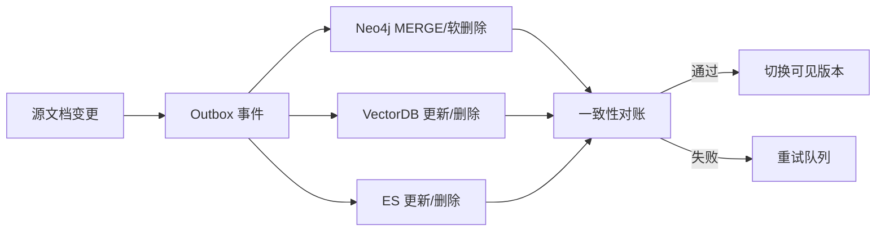

# 基础设施实战（6）- Neo4j 增量更新与安全删除：保持 GraphRAG 一致

> 读完你能：围绕“Neo4j 增量更新与安全删除：保持 GraphRAG 一致”理解“数据模型与删除语义”与“可运行的幂等写入”，并结合正文示例完成实践与排障。


GraphRAG 同时依赖原文、Chunk、向量索引和图关系。直接执行 `DETACH DELETE` 虽然能删节点，却可能留下向量库孤儿记录、缓存旧答案和无法审计的数据空洞。生产更新要围绕稳定 ID、版本和可重试事件设计。




## 一、数据模型与删除语义

- `document_id`、`entity_id` 使用业务稳定 ID，不依赖 Neo4j 内部节点 ID。
- `version` 用于拒绝乱序事件；`updated_at` 用于审计，不代替版本比较。
- 用户删除默认写入 `deleted_at` 形成墓碑；完成下游清理并超过恢复窗口后再物理删除。
- 权限关系变化也要发布事件，因为图谱、ES 和向量库都保存可见性字段。

## 二、可运行的幂等写入

```text
# requirements.txt
neo4j>=5,<7
```

```python
from __future__ import annotations

import os
from dataclasses import dataclass

from neo4j import Driver, GraphDatabase


# Neo4j 连接配置从环境变量加载，生产环境应使用 Secret 管理。
NEO4J_URI = os.getenv("NEO4J_URI", "neo4j://localhost:7687")
# 数据库用户名只用于当前示例连接。
NEO4J_USER = os.getenv("NEO4J_USER", "neo4j")
# 密码没有安全默认值，缺失时立即失败。
NEO4J_PASSWORD = os.environ["NEO4J_PASSWORD"]


@dataclass(frozen=True)
class EntityEvent:
    """保存实体变更事件；version 保证重复和乱序消费安全。"""

    # 业务域内稳定实体 ID。
    entity_id: str
    # 当前租户 ID，用于查询过滤和隔离。
    tenant_id: str
    # 实体显示名称。
    name: str
    # 单调递增的源数据版本。
    version: int
    # 是否为删除事件。
    deleted: bool


def apply_entity_event(driver: Driver, event: EntityEvent) -> None:
    """幂等应用实体事件；driver 是连接池，event 是源系统变更。"""

    # 参数化 Cypher 避免拼接注入，并只接受更新版本大于现有版本的事件。
    query = """
    MERGE (entity:Entity {tenant_id: $tenant_id, entity_id: $entity_id})
    ON CREATE SET entity.version = -1
    WITH entity
    WHERE $version > entity.version
    SET entity.name = $name,
        entity.version = $version,
        entity.deleted_at = CASE WHEN $deleted THEN datetime() ELSE null END
    RETURN entity.entity_id AS entity_id
    """
    # 当前事件参数与 Cypher 字段一一对应。
    parameters = {
        "tenant_id": event.tenant_id,
        "entity_id": event.entity_id,
        "name": event.name,
        "version": event.version,
        "deleted": event.deleted,
    }
    driver.execute_query(query, parameters_=parameters, database_="neo4j")


def main() -> None:
    """创建驱动并写入一条示例事件。"""

    # 驱动内部维护连接池，应用生命周期内应复用。
    driver = GraphDatabase.driver(NEO4J_URI, auth=(NEO4J_USER, NEO4J_PASSWORD))
    try:
        # 示例事件可重复执行，第二次不会造成重复节点。
        event = EntityEvent("product-42", "tenant-a", "知识库产品", 3, False)
        apply_entity_event(driver, event)
    finally:
        driver.close()


if __name__ == "__main__":
    main()
```

首次部署先创建唯一约束：

```cypher
CREATE CONSTRAINT entity_tenant_id_unique IF NOT EXISTS
FOR (entity:Entity)
REQUIRE (entity.tenant_id, entity.entity_id) IS UNIQUE;
```

## 三、跨存储一致性

Neo4j、ES、VectorDB 无法共享普通 ACID 事务。推荐源库事务内同时写 Outbox，消费者分别更新三套索引，每个消费者以 `event_id` 去重，以 `version` 抵御乱序。后台对账任务比较每个版本的文档数、Chunk 数、实体数和内容哈希；未通过前不切换读别名。

物理清理顺序可采用：停止新引用 → 写墓碑并从查询中过滤 → 删除 ES/向量 Chunk → 删除图关系和节点 → 清缓存 → 写审计完成事件。任何一步失败都可依据墓碑重试。

## 四、权限与成本

- 所有节点和关系都携带 `tenant_id`，查询入口强制注入租户条件；不能依赖调用者记得写。
- 高敏实体可只保存脱敏摘要，原文保留在受控对象存储。
- 不要把所有 Chunk 都复制成图节点。图中保留实体与关系，Chunk 通过稳定 ID 回链，可显著降低存储和遍历成本。
- 对深度、返回节点数和查询超时设上限，避免模型生成无界 Cypher。

## 五、验收

重复事件不产生重复节点；乱序旧版本不覆盖新版本；删除后图、ES、向量库和缓存均不可命中；跨租户查询返回零条；对账失败可定位到具体 `document_id` 和索引版本。
