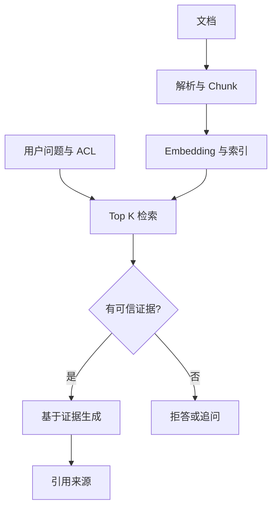

# 企业级知识库（43）- 项目：从最小 RAG 到可上线知识库

> 读完你能：讲清一个企业知识库问答项目的完整闭环，跑通一个最小可运行版本，并知道怎么把它扩成可验收项目。

# 一、与进阶篇的分工

本篇保留为企业知识库 RAG 的基础项目：适合做第一个可演示闭环。进阶项目请读 91《企业级知识库项目》，那里会升级到多模态解析、对象存储、混合检索、权限过滤、引用回跳和量化评测。

# 二、为什么先做这个项目

如果你只能做一个 AI 项目放简历，选它。原因很实在：

- **闭环清晰**：上传文档 → 检索 → 回答 → 引用来源，每一步都看得见、讲得清。
- **面试高频**：企业落地最多的就是知识库问答，面试官几乎一定会问 RAG。
- **能体现全栈**：前端（聊天 UI、引用展示）、后端（接口、检索）、RAG（切分、检索、grounding）、工程化（日志、评测）全覆盖。
- **可信度好讲**：引用来源 + 资料不足时拒答，是体现工程深度的天然抓手。

# 三、完整闭环长什么样




```text
离线入库（一次）：
  文档 → 解析文本 → 切分 chunk → 生成 embedding → 存向量库（带元数据）

在线问答（每次提问）：
  用户问题 → 检索 topK chunk → 拼进 prompt → 模型基于资料回答 → 返回引用来源
              ↓ 检索为空
            明确拒答，不编造
```

这个项目的灵魂是最后那条分支：**检索不到资料就老实说不知道**。一个会编造的知识库，企业不敢用。

# 四、可运行 Demo：先跑通最小闭环

```text
# requirements.txt
# 示例仅使用 Python 3.10+ 标准库，无第三方依赖。
```

把下面代码保存为 `main.py`，执行 `python main.py`。这里用词元重合模拟检索，只验证“召回、引用、拒答”契约；生产环境再替换成真实 Embedding、BM25 与模型生成。

```python
from __future__ import annotations

import re
from dataclasses import dataclass


# 最小命中分数，零命中时必须拒答。
MINIMUM_SCORE = 1
# 返回给生成层的最大证据数量。
TOP_K = 2


@dataclass(frozen=True)
class Chunk:
    """保存一段可引用知识及其来源。"""

    # 跨检索稳定的 Chunk 标识。
    chunk_id: str
    # 可直接作为证据的正文。
    text: str
    # 用户可回跳的来源文件。
    source: str
    # 允许访问该 Chunk 的权限组。
    acl_groups: frozenset[str]


# 演示知识库，生产环境由离线索引提供。
CHUNKS = [
    Chunk("finance#1", "报销单应在费用发生后十个工作日内提交。", "财务手册", frozenset({"staff"})),
    Chunk("hr#1", "试用期员工也可以申请公司培训。", "人事制度", frozenset({"staff", "hr"})),
]


def tokenize(text: str) -> set[str]:
    """提取英文词和单个汉字，用于可复现的零依赖教学检索。"""

    # 小写词元集合只用于当前 Demo 的粗粒度匹配。
    return set(re.findall(r"[a-z0-9]+|[\u4e00-\u9fff]", text.lower()))


def retrieve(query: str, user_groups: frozenset[str]) -> list[Chunk]:
    """在权限内召回证据；query 是问题，user_groups 来自可信鉴权。"""

    # 查询词元在当前请求内只计算一次。
    query_tokens = tokenize(query)
    # 候选保存分数与 Chunk，未授权数据不会进入打分。
    candidates: list[tuple[int, Chunk]] = []
    for chunk in CHUNKS:
        if chunk.acl_groups.isdisjoint(user_groups):
            continue
        # 当前教学分数是查询与证据的词元交集数量。
        score = len(query_tokens & tokenize(chunk.text))
        if score >= MINIMUM_SCORE:
            candidates.append((score, chunk))
    candidates.sort(key=lambda item: item[0], reverse=True)
    return [chunk for _, chunk in candidates[:TOP_K]]


def answer(query: str, user_groups: frozenset[str]) -> str:
    """返回带引用的证据或拒答；两个参数分别是问题和可信权限组。"""

    # 命中结果已经过权限过滤，可进入后续模型上下文。
    hits = retrieve(query, user_groups)
    if not hits:
        return "现有资料不足，无法确认。"
    # Demo 直接返回证据；生产版应让模型基于同一组证据生成结构化答案。
    evidence = "\n".join(f"- {hit.text}（来源：{hit.source}）" for hit in hits)
    return f"根据知识库：\n{evidence}"


if __name__ == "__main__":
    # 三个问题分别验证财务命中、人事命中和知识外拒答。
    questions = ["报销多久提交", "试用期能参加培训吗", "年假有几天"]
    for question in questions:
        print(question)
        print(answer(question, frozenset({"staff"})))
```

跑完应看到两条带来源证据和一条资料不足拒答。把这三条路径讲清楚，项目的核心闭环才成立。

# 五、MVP 功能拆解（按这个顺序做）

| 模块 | 先做（MVP） | 再做（进阶） |
|---|---|---|
| 文档管理 | 上传 Markdown/TXT，查看解析状态 | PDF/Word、批量导入 |
| 切分 | 按标题/段落切 chunk | 表格切分、chunk 预览、overlap |
| 检索问答 | topK 检索 + 基于资料回答 | 混合检索、rerank、query 改写 |
| 引用来源 | 展示文件名 + 片段 | 点击定位原文 |
| 评测 | 维护 20 条问题集 | 命中率、正确率、坏 case 标签 |
| 工程化 | 日志、错误态、测试 | 权限隔离、限流、成本统计 |

先把这个最小闭环接上前端聊天框并保存 Trace，再逐项增加解析器、真实检索、流式输出和评测；每增加一层都保留可独立验收的输入与输出。

# 六、企业级版本怎么升级

MVP 跑通后，企业级版本重点补 5 块：

| 升级点 | 为什么要做 |
|---|---|
| 多格式解析 | PDF、Word、Excel、图片、表格都要进知识库 |
| 父子分块 | 小块负责召回，大块负责回答上下文 |
| 混合检索 | 编号/术语靠 BM25，口语问法靠向量 |
| 权限过滤 | 检索阶段按部门、角色、密级过滤 |
| 原文定位 | 引用能回跳到文件、页码、表格或图片 |

如果要继续做进阶版，可阅读“工程基础”模块的《进阶：企业级 RAG 项目拆解》。该文会把文档解析、图文表资产、权限、评测和上线指标串成完整项目。

# 七、接口设计参考

```
POST /api/knowledge/upload      上传文件
GET  /api/knowledge/documents   文档列表
POST /api/rag/chat              知识库问答
GET  /api/rag/logs/:requestId   查看单次检索和生成日志
```

# 八、验收标准（也是演示脚本）

演示时按这个顺序走，最有说服力：

1. 上传一份制度文档 → 展示解析状态
2. 问一个能命中的问题（"报销几天内提交"）→ 回答 + 引用来源
3. 问一个知识库没有的问题（"年假几天"）→ 明确说资料不足
4. 打开日志 → 展示这次检索命中了哪些 chunk、得分多少

第 3 步是亮点：主动展示"我不会瞎编"，比第 2 步答对更能打动面试官。

# 九、工程上真正会踩的坑

- **chunk 切太大**：一段塞几百字，检索命中了但答案被淹没。按句/小段切，配合 overlap。
- **检索为空还硬答**：模型会拿不相关资料编一个答案。`if not hits: 拒答` 是硬性兜底。
- **引用来源对不上正文**：回答用了 A 资料却标 B 来源。citation 必须从实际命中的 chunk 元数据生成，不能事后补。
- **没有评测集**：改了切分参数不知道是变好还是变坏。哪怕只有 20 条问题，也要能跑个命中率。

# 十、简历怎么写

> 独立实现企业知识库 RAG 助手，支持文档入库、chunk 切分、语义检索、引用来源、流式问答和坏 case 评测。前端展示检索来源、生成状态和错误重试；后端记录 requestId、检索命中、模型耗时和 token 成本。引入资料不足拒答机制，将编造率控制在可接受范围。

如果要写成企业级版本，可以这样升级：

> 设计企业级知识库 RAG 系统，支持多格式文档解析、父子分块、BM25+向量混合检索、rerank 精排、权限过滤和原文定位；回答引用可回跳到文件页码、表格或图片证据。维护包含正负样本的评测集，跟踪 Hit Rate@K、拒答准确率和坏 case 回归，保证知识库不是只跑通 demo，而是可持续调优。

# 十二、总结

- **企业级版本怎么升级**：MVP 跑通后，企业级版本重点补 5 块：
- **简历怎么写**：独立实现企业知识库 RAG 助手，支持文档入库、chunk 切分、语义检索、引用来源、流式问答和坏 case 评测。
- **为什么先做这个项目**：如果你只能做一个 AI 项目放简历，选它。
- **工程上真正会踩的坑**：chunk 切太大：一段塞几百字，检索命中了但答案被淹没。

<!-- knowledge-lab-merged -->

# 动手实践：43 企业知识库 RAG 项目

一个本地可运行的真实企业 RAG 工作台：文档入库、Markdown 批量导入、chunk 切分、本地 embedding、Qdrant 向量数据库检索、基于资料回答、引用来源和检索 Trace。

当前版本不依赖 OpenAI Key。embedding 使用本地 hashing 向量模型，向量存储使用 Docker 中的 Qdrant，适合先讲清企业 RAG 工程闭环；后续可把 `LocalEmbeddingModel` 换成 OpenAI / bge / m3e 等真实 embedding 模型。

## 环境

- Python 3.10+
- Docker Desktop
- Qdrant：通过 `docker compose` 启动，无需手动安装

## 启动

```bash
cd /Users/imber/Desktop/ai-lab/worktrees/knowledge-categories/imber-blog/src/content/knowledge/03-AI大模型应用开发/02-企业级知识库/03-企业知识库项目/01-项目-企业知识库RAG/lab
docker compose up -d qdrant
python3 main.py
```

浏览器打开：

```text
http://127.0.0.1:8043
```

Qdrant REST：

```text
http://127.0.0.1:6333
```

## 导入 agent 小册

页面点击 `导入 AI 应用手册`，会从当前仓库位置自动解析并读取完整的 AI 大模型应用开发目录：

```text
03-AI大模型应用开发
```

导入规则兼容新版目录结构：

- `**/*.md`
- `**/09-附录/*.md`
- 排除当前项目的 `lab/`

导入后会重建 Qdrant collection：

```text
agent_manual_chunks
```

本次验证导入结果：

```text
导入数量会根据当前 `knowledge/Agent` 目录中的文章实时变化。
```

## 测试

```bash
python3 -m unittest discover -s tests -v
python3 -m py_compile main.py rag_core.py
node --check static/app.js
```

## 演示问题

导入 `agent小册` 后可以问：

```text
语义相近的文本为什么向量也相近？
引用来源为什么不能让模型自己报？
RAG 回答为什么要引用来源？
检索与重排 Rerank 有什么区别？
```

验证结果示例：

- `语义相近的文本为什么向量也相近？` 命中 `22-Embedding向量化.md`
- `引用来源为什么不能让模型自己报？` 命中 `25-RAG回答生成与引用来源.md`

## 接口

| 方法 | 路径 | 说明 |
|---|---|---|
| GET | `/health` | 服务健康检查，返回文档数、chunk 数、Qdrant 状态 |
| GET | `/api/knowledge/documents` | 文档列表 |
| POST | `/api/knowledge/documents` | 新增文档，JSON 字段：`title/source/text` |
| POST | `/api/knowledge/import-agent-manual` | 批量导入本地 AI 应用知识集（路径保留兼容） |
| POST | `/api/rag/chat` | 知识库问答，JSON 字段：`question/topK` |
| GET | `/api/rag/logs` | 最近问答日志 |
| GET | `/api/rag/logs/:requestId` | 单次问答日志 |

## 代码结构

| 文件 | 作用 |
|---|---|
| `docker-compose.yml` | 启动 Qdrant 向量数据库 |
| `rag_core.py` | RAG 核心：Markdown 清洗、切分、本地 embedding、Qdrant client、检索、拒答、引用、日志 |
| `main.py` | 标准库 HTTP 服务、API 路由、静态页面服务、agent 小册导入 |
| `static/` | 前端工作台 |
| `data/sample-docs/` | 首次启动时的样例企业文档 |
| `tests/` | 核心逻辑、API、向量导入测试 |

## 后续升级

- 把 `LocalEmbeddingModel` 换成真实 embedding 模型。
- 给 Markdown 解析增加标题层级、chunk overlap 和 chunk 预览。
- 加评测集，记录命中率、拒答率和坏 case。
- 接入真实 LLM，让 `_compose_answer` 从“拼接资料”升级为“基于资料生成自然语言回答”。
