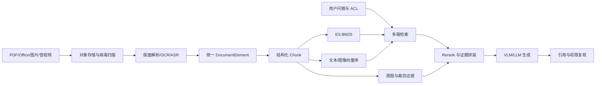

# 企业级知识库（91）- 多模态 RAG：版面、图片、表格与文本的证据闭环

> 读完你能：围绕“多模态 RAG：版面、图片、表格与文本的证据闭环”理解“全链路架构”与“统一元素而不是直接拼纯文本”，并结合正文示例完成实践与排障。


多模态 RAG 不是“把图片丢给视觉模型”。企业文档的答案常同时依赖段落、表格单元格、截图标注和页码关系；如果解析时丢掉版面结构，后续再强的模型也无法还原证据。

## 一、全链路架构




## 二、统一元素而不是直接拼纯文本

解析输出建议包含 `element_id`、`document_id`、`page`、`bbox`、`element_type`、`text`、`asset_uri`、`parent_id`、`reading_order`、`acl_groups` 和解析置信度。表格要保存行列坐标与合并单元格，图片要保存标题、邻近段落和裁剪位置，才能实现页级引用回跳。

```text
# requirements.txt
pydantic>=2,<3
```

```python
from __future__ import annotations

from typing import Literal

from pydantic import BaseModel, Field, model_validator


class DocumentElement(BaseModel):
    """统一描述文本、表格、图片和音频转写元素。"""

    # 跨重建稳定的元素主键。
    element_id: str
    # 原始文档稳定主键。
    document_id: str
    # 元素所在页码；音频等无页资源允许为空。
    page: int | None = Field(default=None, ge=1)
    # 元素类型决定后续切分和 Embedding 策略。
    element_type: Literal["text", "table", "image", "transcript"]
    # OCR、ASR 或原生解析得到的可检索文本。
    text: str
    # 页面坐标，顺序为 x1、y1、x2、y2。
    bbox: tuple[float, float, float, float] | None = None
    # 原图或音频片段的受控对象存储地址。
    asset_uri: str | None = None
    # 当前元素可见的权限组，在召回阶段下推过滤。
    acl_groups: frozenset[str]
    # 解析置信度，用于低质量元素人工复核。
    confidence: float = Field(ge=0.0, le=1.0)

    @model_validator(mode="after")
    def validate_visual_evidence(self) -> "DocumentElement":
        """校验视觉元素可回跳；self 包含当前元素全部字段。"""

        if self.element_type in {"table", "image"} and self.asset_uri is None:
            # 表格和图片必须保留视觉证据，不能只保存模型生成的描述。
            raise ValueError("visual element requires asset_uri")
        return self
```

## 三、切分与 Embedding 策略

| 元素 | 切分方式 | Embedding | 必留证据 |
| --- | --- | --- | --- |
| 正文 | 按标题层级和语义边界，保留少量重叠 | 多语言文本模型 | 页码、段落、标题路径 |
| 表格 | 表头与行组共同成块，宽表按业务列拆分 | 表格转规范文本后做文本向量 | 原表截图、行列坐标 |
| 图片/图表 | 图片说明 + 邻近段落 + OCR 文字 | 文本向量；确有图搜图需求再加视觉向量 | 裁剪图、bbox |
| 音视频 | ASR 按说话人和时间窗切分 | 文本向量 | 起止时间、媒体地址 |

Embedding 先以“能否在真实问题集上召回正确证据”选型，再比较吞吐、维度、最大长度、语言覆盖、私有化成本。不要一开始就维护两套视觉向量；如果用户只用文字提问，图片描述和 OCR 往往已覆盖主要价值。

## 四、在线检索与校验

1. 先基于用户、租户和权限组构造不可由模型修改的过滤器。
2. 并行执行 BM25、文本向量、结构化表格查询；只有图像相似需求才开启视觉向量路。
3. 用稳定 `element_id` 去重，RRF 融合，再让跨编码器或 VLM 对少量候选精排。
4. Context 同时传规范文本和受控图片，限制总像素、图片数和 Token。
5. 答案中的每个关键结论必须引用 `element_id`；引用服务再次校验权限后返回页码和裁剪图。
6. 若 OCR 置信度低、证据冲突或引用覆盖不足，明确拒答或转人工复核。

## 五、稳定性、成本与安全

- 解析器和 OCR 都要版本化；升级后并行重建新索引，以金标集验收后切别名。
- 文件先做类型嗅探、病毒扫描、解压炸弹限制和沙箱解析，不能只信扩展名。
- OCR/VLM 是主要成本项：对内容哈希去重，先用原生文本层，低置信页才 OCR，候选精排后才调用 VLM。
- 对象地址使用短期签名 URL，日志不记录原图；敏感图片先脱敏再进入外部模型。
- 监控每种模态的解析成功率、低置信率、Recall@K、引用覆盖率、P95 和单文档/单问成本。

## 六、截图策略


## 七、验收清单

- 扫描 PDF、跨页表格、图表、纯文本和音频各有不少于一组金标问题。
- 任一答案可回跳到页码、表格行或时间片，而不是只显示文件名。
- 删除或降权后，ES、向量库、对象存储引用和缓存同步失效。
- 无权限用户无法从标题、缩略图、命中数、错误信息或模型答案推断文档存在。
- 单路解析或检索失败时可降级，证据不足时不生成确定性答案。

多模态 RAG 的分水岭不是支持多少文件格式，而是能否把每个结论闭环到可验证、可授权、可回放的证据。
