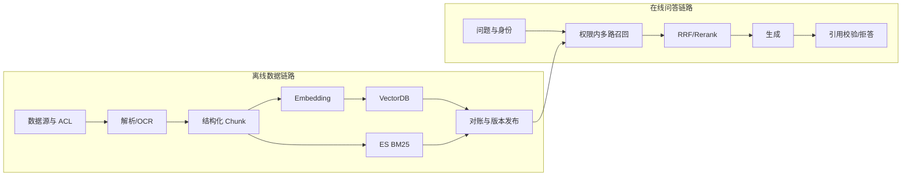

# 企业级知识库（92）- RAG 全链路：离线建库到在线问答

> 主分类：企业级知识库；关联标签：工程基础、RAG 优化、LangChain 实战、Evaluation
>
> 读完你能：设计一套可增量更新、可权限过滤、可引用和可评测的 RAG，把解析、分块、Embedding、ES/Milvus 多路召回、Rerank、生成校验串成完整系统。
> 更新日期：2026/08/11

# 一、两条链路必须解耦

离线建库：

`数据源 → 解析/OCR → 清洗 → 结构化分块 → Metadata/权限 → Embedding → 稀疏/向量索引 → 索引验收 → 发布版本`

在线问答：

`鉴权 → 问题规范化/改写 → 多路召回 → 权限过滤 → RRF → Rerank → Context Packing → 生成 → 引用与忠实度校验 → 反馈/Trace`

离线失败不应拖慢每次问答；在线请求也不能临时解析全量文档。两条链路通过稳定的 Chunk Schema 与索引版本连接。



> DIAGRAM_DESCRIPTION：架构图必须分离离线与在线链路，包含 ACL、解析、Chunk、Embedding、VectorDB、ES、索引对账、多路召回、RRF/Rerank、生成、引用校验和拒答。

# 二、先定义 Chunk 数据契约

```text
# requirements.txt
# 本文核心契约与融合算法仅使用 Python 3.10+ 标准库。
# 接入生产存储时再按选型加入 elasticsearch、pymilvus、pgvector 或对应 SDK。
```

```python
from dataclasses import dataclass, field


@dataclass(frozen=True)
class ChunkRecord:
    """定义离线索引与在线检索共同依赖的 Chunk 契约。"""

    # 跨重建稳定的 Chunk 主键。
    chunk_id: str
    # 原始文档稳定主键。
    document_id: str
    # 当前文档内容版本。
    document_version: str
    # 父块主键，用于小块召回后扩展上下文。
    parent_id: str | None
    # 可直接作为证据展示的正文。
    text: str
    # 标题层级路径。
    heading_path: list[str]
    # 原文页码；无页码来源允许为空。
    page_number: int | None
    # 可回跳的来源地址。
    source_uri: str
    # 租户边界。
    tenant_id: str
    # 允许访问该 Chunk 的角色集合。
    acl: list[str] = field(default_factory=list)
    # 生成向量所用模型版本。
    embedding_version: str = ""
    # 内容哈希，用于幂等和变更检测。
    content_hash: str = ""
```

稳定主键可由 `document_id + document_version + heading_path + normalized_text_hash` 生成。只用“第几个 Chunk”作 ID，会在文档头部插入一段后导致后续所有 ID 漂移，增量删除和引用回跳都失效。

# 三、解析与清洗：保留结构比得到纯文本重要

解析结果至少要保留标题、段落、列表、表格、代码块、页码和图片说明。常见处理：

- PDF：检测扫描件并进入 OCR；处理页眉页脚、双栏顺序和跨页表格。
- Word：保留标题级别、表格单元格和批注边界。
- Markdown/HTML：去导航广告，保留标题树、代码块和链接。
- 数据库/飞书：保存记录主键、更新时间和权限，不只导出显示文本。

清洗不能删除业务意义。连续空白可归一化，但代码缩进、表格行列、错误码大小写可能都要保留。

# 四、分块策略不是一个固定数字

推荐先结构化再长度约束：

1. 按文档标题、条款、函数或表格边界得到语义单元。
2. 单元过大时按段落和句子递归切分。
3. 单元过小时与同标题相邻块合并。
4. 为子块附带标题路径，避免正文脱离主题。
5. 小块用于召回，命中后按 `parent_id` 扩展完整上下文。

分块验收不看平均长度，而看：句子截断率、标题继承率、表格破坏率、重复率、孤立代词比例和标注问题的 Recall@K。

# 五、Embedding 与离线向量化

索引和查询必须使用同一模型、维度、归一化和文本前缀。中文优先选经过中文或多语言训练的模型；选型要用自己的问题和文档评测，不凭榜单决定。

```python
import hashlib
from collections.abc import Callable, Iterable

# 批量调用 Embedding 的最大条数，应结合服务限制和显存调整。
EMBEDDING_BATCH_SIZE = 64
# 当前索引使用的 Embedding 版本。
EMBEDDING_VERSION = "bge-small-zh-v1.5@local-v1"


def stable_content_hash(text: str) -> str:
    """对规范化正文生成稳定哈希，用于跳过未变化 Chunk。"""
    # 去除首尾空白并统一换行后的正文。
    normalized_text = "\n".join(line.rstrip() for line in text.strip().splitlines())
    return hashlib.sha256(normalized_text.encode("utf-8")).hexdigest()


def embed_in_batches(
    texts: list[str],
    embed_batch: Callable[[list[str]], list[list[float]]],
) -> Iterable[tuple[str, list[float]]]:
    """按固定批次生成向量，并校验返回数量。"""
    for start in range(0, len(texts), EMBEDDING_BATCH_SIZE):
        # 当前准备发送给 Embedding 服务的文本批次。
        batch_texts = texts[start:start + EMBEDDING_BATCH_SIZE]
        # 当前批次返回的向量列表。
        batch_vectors = embed_batch(batch_texts)
        if len(batch_vectors) != len(batch_texts):
            raise ValueError("Embedding 返回数量与输入文本数量不一致")
        yield from zip(batch_texts, batch_vectors, strict=True)
```

离线建库可以完全本地：文档、Embedding 模型和 Milvus/FAISS 都在本机；但只有向量库本地而 Embedding 仍调用云 API，不算完整离线。

# 六、双索引与增量发布

同一 `chunk_id` 同时写入：

- Elasticsearch：正文、标题、精确词、权限和 BM25 倒排索引。
- Milvus/向量库：Dense Vector、Chunk 主键和可下推的权限字段。

增量更新按文档执行差集：新增 Chunk 写入两库，内容变化更新两库，已删除 Chunk 从两库删除。写入不是跨数据库事务，应维护 ingestion job 和 outbox/reconciliation：只有两侧计数、ID 与版本校验通过，索引版本才能标记为 ready。

Embedding 升级使用新索引版本并行重建，完成评测后切换读别名；不要把不同维度或模型向量写进同一字段。

VectorDB 选型不要只看基准榜单：

| 方案 | 适合场景 | 权限过滤与混合检索 | 主要代价 |
| --- | --- | --- | --- |
| FAISS | 单机离线验证、只读小索引 | 过滤需应用层补充，不负责 BM25 | 高可用与增量运维需自建 |
| pgvector | 已使用 PostgreSQL、规模可控、需要事务元数据 | SQL 过滤自然，可配 PostgreSQL 全文检索 | 大规模 ANN 与独立扩缩容需压测 |
| Milvus | 向量规模大、需要独立扩缩容 | 支持标量过滤，BM25 通常另接 ES | 组件与运维复杂度更高 |
| Elasticsearch | 希望在一套引擎做倒排、过滤和向量 | 混合查询与 ACL 过滤直接 | 向量成本、召回与集群资源需实测 |

最终决策至少比较 Recall@K、过滤后延迟、写入吞吐、备份恢复、索引重建时长、团队运维经验和三年总成本。

# 七、在线多路召回

```python
from dataclasses import dataclass

# 每条召回路进入融合层的默认候选数量。
RETRIEVAL_TOP_K = 50
# RRF 平滑常量。
RRF_K = 60


@dataclass(frozen=True)
class RetrievalHit:
    """统一不同检索器返回的候选数据。"""

    # 稳定的 Chunk 主键。
    chunk_id: str
    # 当前召回路名称。
    route: str
    # 当前召回路中的原始分数，只用于路内分析。
    raw_score: float
    # 当前召回路中的一基排名。
    rank: int


def fuse_hits(route_hits: dict[str, list[RetrievalHit]]) -> list[tuple[str, float, set[str]]]:
    """使用 RRF 融合多路候选并保留贡献路由。"""
    # 每个 Chunk 累加的融合分数。
    fused_scores: dict[str, float] = {}
    # 每个 Chunk 的命中路由集合。
    hit_routes: dict[str, set[str]] = {}

    for route, hits in route_hits.items():
        for hit in hits[:RETRIEVAL_TOP_K]:
            fused_scores[hit.chunk_id] = fused_scores.get(hit.chunk_id, 0.0) + 1 / (RRF_K + hit.rank)
            hit_routes.setdefault(hit.chunk_id, set()).add(route)

    return sorted(
        [(chunk_id, score, hit_routes[chunk_id]) for chunk_id, score in fused_scores.items()],
        key=lambda item: item[1],
        reverse=True,
    )
```

权限过滤要下推到 ES 和向量库。融合后再过滤会让无权限候选挤掉有权限候选，还可能泄露侧信道信息。

# 八、Rerank 与 Context Packing

Rerank 输入是问题和几十条候选，输出更精确的相关性顺序。Context Packing 还要处理：

- 同一父文档相邻块合并，避免重复标题消耗 Token。
- 不同证据来源的覆盖，不能让一个长文档占满上下文。
- 保留原始 `chunk_id/source/page`，引用由程序映射，不能让模型编造。
- 把外部文档明确包在“非可信资料”区，抵御文档内 Prompt Injection。
- 超过预算时按相关性和边际信息量选择，不做无脑字符串截断。

# 九、生成与引用校验

模型输出建议使用结构化 Schema：

```json
{
  "answer": "退款审核通过后通常三个工作日原路退回。",
  "citations": ["refund-policy#section-3"],
  "insufficient_evidence": false
}
```

程序逐项校验：引用 ID 必须来自本次 Context；每个关键结论至少有一条证据；证据不足时必须拒答或追问。高风险业务还要做数值、日期、实体一致性检查，必要时走规则引擎或人工审核。

# 十、分层验收指标

| 阶段 | 核心指标 |
| --- | --- |
| 解析 | 成功率、OCR 失败率、表格/页码保留率 |
| 分块 | 截断率、重复率、平均/分位 Token、标题继承率 |
| 索引 | 源文档与 Chunk 数对账、双库 ID 差集、版本完整率 |
| 召回 | Recall@K、MRR、路由贡献率、零结果率 |
| 重排 | nDCG@K、正确证据首位率 |
| 生成 | 忠实度、引用准确率、拒答准确率 |
| 系统 | P50/P95、Token、单问成本、超时/降级率 |
| 安全 | 越权命中率、Prompt Injection 成功率、删除传播时延 |

# 十一、上线清单

- 固定一套真实问题、正确证据、不可回答问题和权限隔离问题。
- 索引、Embedding、Rerank、Prompt 都有版本并进入 Trace。
- 新索引通过离线评测、影子流量和小流量后再切别名。
- ES 或向量库单路故障时有降级，证据不足不强行回答。
- 用户反馈能回到具体 Query、候选、证据、模型输出和版本。
- 删除文档后，两套索引、缓存和引用页都不可再访问。

# 十二、参考资料

- [LangChain：Retrieval](https://docs.langchain.com/oss/python/langchain/retrieval)
- [Milvus：Overview](https://milvus.io/docs/overview.md)
- [Elasticsearch：Hybrid search](https://www.elastic.co/docs/solutions/search/hybrid-search)
- [Elasticsearch：RRF](https://www.elastic.co/docs/reference/elasticsearch/rest-apis/reciprocal-rank-fusion)

# 十三、总结

- 企业 RAG 是离线数据工程与在线检索生成的组合，不是“接一个向量库”。
- Chunk 契约、版本、权限、双索引对账和引用 ID 是全链路稳定性的核心。
- 所有优化都应落到分层评测，不能用最终回答掩盖解析或召回问题。
