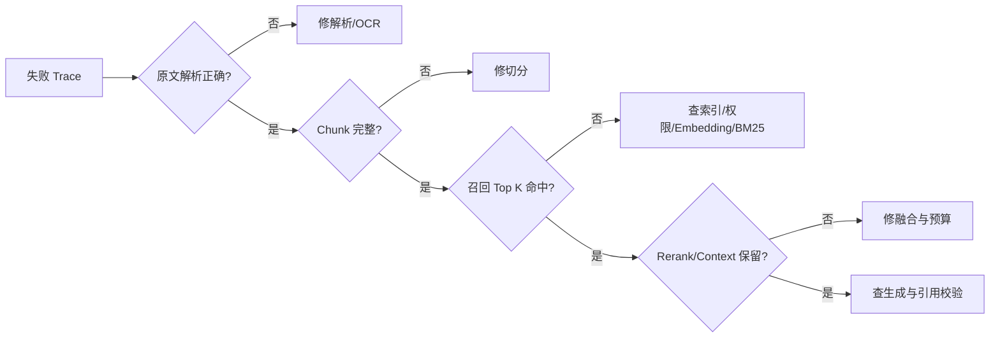

# 企业级知识库（93）- RAG 生产排障：坏案例与修复手册

> 读完你能：把 RAG 错误定位到解析、切分、索引、召回、融合、重排、上下文或生成层，并用可复现证据修复，而不是盲调 Prompt。
> 更新日期：2026/08/11




# 一、先保存一条请求的完整证据链

没有 Trace 的坏案例无法复现。每次请求至少记录：

- `trace_id`、租户/权限摘要、问题原文和改写问题。
- 索引版本、Embedding/Rerank/生成模型版本、Prompt 版本。
- 每路候选的 `chunk_id`、原始分数、排名、过滤原因和耗时。
- 融合与 Rerank 后的顺序、最终 Context 和引用映射。
- 结构化回答、校验结果、Token、费用和总延迟。

隐私字段和密钥不能进入 Trace；正文可按策略脱敏或只保存稳定哈希与受控回放引用。

# 二、第一问：正确证据在哪一层丢了

按漏斗定位：

1. 原文是否解析出来。
2. 正确段落是否形成完整 Chunk。
3. Chunk 是否写入正确索引版本。
4. 权限条件下是否应该可见。
5. 是否进入任一召回路 Top K。
6. 是否在 RRF、去重或 Rerank 后掉出。
7. 是否被 Context Packing 截掉。
8. 已进入 Context 时，模型是否正确引用和回答。

前一层没有证据，修改后一层 Prompt 不会解决根因。

# 三、十二类高频坏案例

## 3.1 PDF 内容顺序错乱

**现象**：答案把双栏 PDF 左右两列拼在一起。

**检查**：渲染原页，对照解析块的坐标、阅读顺序和页码。

**修复**：使用布局感知解析；按坐标重建段落；扫描件走 OCR；给表格和正文使用不同解析策略。

## 3.2 Chunk 切断关键条件

**现象**：召回“可以退款”，却丢了下一句“定制商品除外”。

**检查**：查看命中块的前后邻居和标题路径。

**修复**：按条款/段落切分；使用父子块；命中子块后扩展相邻块；用条件完整性评测而不只看字符长度。

## 3.3 Chunk 太大导致主题稀释

**现象**：一整章向量只有宽泛主题，细节问题排不到前面。

**修复**：小块召回、父块补上下文；按标题层级切；比较不同粒度的 Recall@K 与引用定位精度。

## 3.4 Embedding 不一致

**现象**：重建后相似度异常或向量库报维度错误。

**检查**：索引/查询模型名、版本、维度、归一化和 query/document 前缀。

**修复**：版本化向量字段；全量并行重建后切换读别名；禁止新旧向量混写。

## 3.5 错误码只靠向量搜不到

**现象**：“E401”召回登录概念，却没有精确错误码文档。

**修复**：增加 ES/BM25、`keyword` 精确词字段和业务词典；错误码类 Query 动态提高稀疏路权重。

## 3.6 BM25 中文分词错误

**现象**：业务专有词被切碎，或者 `term` 查询全文字段始终无结果。

**检查**：调用 `_analyze`，确认索引与查询分析器；查看 Query DSL 和 `explain`。

**修复**：维护业务词典；精确值使用 keyword；自然语言使用 match/multi_match；词典变更按需求重建索引。

## 3.7 多路都能召回，融合后正确项掉出

**检查**：去重是否使用稳定 `chunk_id`；RRF `rank_window_size` 是否小于各路候选；同一文档的重复块是否挤占排名。

**修复**：修正主键和窗口；融合后做父文档去重；用标注集调窗口，不直接相加原始分数。

## 3.8 Rerank 把正确证据排低

**检查**：候选传给模型时是否被截断；Rerank 模型是否支持目标语言和领域；问题改写是否丢失实体。

**修复**：保留标题和关键 metadata；替换或微调模型；混合使用精确匹配保护；对 Rerank 单独评估 nDCG/MRR。

## 3.9 正确证据在 Context，模型仍编造

**检查**：回答中的每个事实是否有引用；文档中是否包含指令注入；Context 是否重复冲突。

**修复**：结构化输出；引用 ID 由程序校验；资料区标记为非可信数据；证据不足强制拒答；高风险字段做规则校验。

## 3.10 文档已更新，仍回答旧内容

**检查**：源版本、索引别名、双库 ID 差集、缓存键中的知识库版本。

**修复**：稳定文档 ID + 增量删除；双索引对账；发布后原子切读别名；缓存键携带索引版本并主动失效。

## 3.11 权限泄漏

**现象**：无权限用户看不到正文，但能从答案、标题、高亮或命中数量推断机密文档。

**修复**：权限过滤下推到每条召回；缓存键包含权限摘要；生成前只允许可见证据；建立跨租户自动化攻击用例。

## 3.12 延迟突然升高

**检查**：把 P95 拆成查询改写、各路检索、Rerank、生成；查看并发、候选数、超时和重试。

**修复**：召回并行但限制并发；设置分层超时；Rerank 只处理小候选集；单路故障降级；缓存只复用权限和版本完全一致的结果。

# 四、自动检查 Trace 的最小代码

```text
# requirements.txt
# 检查脚本仅使用 Python 3.10+ 标准库，无第三方依赖。
```

```python
from dataclasses import dataclass

# 最终上下文至少需要的证据数量。
MINIMUM_CONTEXT_HITS = 1


@dataclass(frozen=True)
class TraceCheck:
    """保存一项 Trace 自动检查的结果。"""

    # 检查项稳定名称。
    name: str
    # 检查是否通过。
    passed: bool
    # 失败时提供的定位说明。
    detail: str


def validate_rag_trace(trace: dict) -> list[TraceCheck]:
    """检查 RAG 请求的索引版本、证据和引用基本一致性。"""
    # 实际进入模型上下文的 Chunk 主键集合。
    context_ids = {item.get("chunk_id") for item in trace.get("context", []) if item.get("chunk_id")}
    # 模型结构化输出声明的引用主键集合。
    citation_ids = set(trace.get("answer", {}).get("citations", []))
    # 当前请求各召回路使用的索引版本集合。
    index_versions = {item.get("index_version") for item in trace.get("retrievals", [])}

    return [
        TraceCheck(
            name="single_index_version",
            passed=len(index_versions) == 1 and None not in index_versions,
            detail=f"检索链路出现索引版本：{sorted(str(version) for version in index_versions)}",
        ),
        TraceCheck(
            name="context_not_empty",
            passed=len(context_ids) >= MINIMUM_CONTEXT_HITS,
            detail="没有证据进入最终 Context",
        ),
        TraceCheck(
            name="citations_in_context",
            passed=citation_ids.issubset(context_ids),
            detail=f"越界引用：{sorted(citation_ids - context_ids)}",
        ),
    ]
```

它只做契约检查，不能代替语义忠实度评测，但可以快速拦截索引混用、空 Context 和引用幻觉。

# 五、建立坏案例回归集

每次线上反馈转成一条版本化样本：问题、用户权限、期望证据、可接受答案要点、必须拒答条件和故障标签。修复后先跑该样本，再跑全量集防止局部优化破坏其他问题。

回归集应覆盖：精确码、同义问法、多跳、表格、时间敏感、冲突文档、不可回答、恶意文档、跨租户和长问题。每次索引、Embedding、Rerank、Prompt 或模型升级都运行同一套集。

# 六、错误预算与降级

- ES 超时：可降级向量路，但明确记录稀疏召回缺失。
- 向量库超时：可降级 BM25，口语化问题可能召回下降。
- Rerank 超时：使用 RRF 顺序，不阻断全部请求。
- 生成模型超时：返回证据列表或可重试状态，不伪造空答案。
- 两路均无可信证据：拒答或追问，不能用模型常识替代企业知识。

# 七、验收清单

- 任一坏案例都能在 Trace 中定位“正确证据最后出现在哪一层”。
- 修复有对应回归样本和指标前后对比。
- 权限过滤、删除传播和 Prompt Injection 有独立安全测试。
- 索引/模型/Prompt 版本可回放，升级可以回滚。
- P95 和成本按阶段拆分，降级结果对用户可解释。

# 八、总结

- RAG 排障先找证据在哪一层丢失，再修该层，不能第一反应调 Prompt。
- 解析、切分、Embedding、BM25、融合、Rerank、生成都有独立症状和指标。
- Trace、坏案例回归集、版本化和降级策略共同决定生产系统是否可维护。
