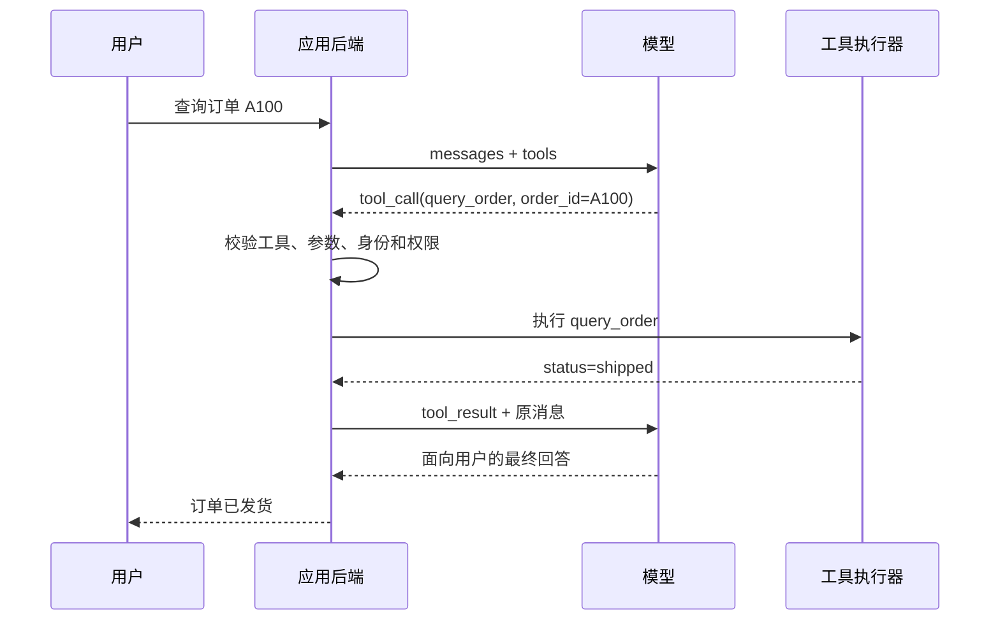

# Tool 与 Function Calling（01） - Function Calling 与 Tool Calling：模型只生成调用请求

> 读完后，你应能完成以下任务：
> - 给定一条用户请求和两个工具定义，能画出“模型提议、代码校验、工具执行、结果回传、模型总结”的时序图，并用消息记录证明模型没有直接执行函数。
> - 给定一次 `tool_call` 响应，能提取调用 ID、工具名和 JSON 参数，生成对应 `tool_result` 消息，并用完整消息日志和第二次模型响应验证调用闭环已经结束。
> - 给定普通结构化输出和工具调用两个方案，能填写选型表，并用“是否需要外部副作用、结果由谁产生”解释为什么不能混用。
> - 在文章沙盒运行正常、未知工具和越权三个样本，用输出证明未通过代码校验的模型提议不会产生业务副作用。

# 一、先把最容易误解的地方说清楚

Function Calling 这个名字很容易让人以为“模型会调用你的函数”。

实际上，模型只能生成一份调用请求。

请求里通常有三类数据：

- 调用哪个工具。
- 传入什么参数。
- 用哪个调用 ID 关联后续结果。

真正执行函数的是你的应用代码。

这条边界决定了权限、参数校验、超时、重试和审计应该放在哪里。

如果把模型输出直接交给数据库、Shell 或支付接口，问题不是 Prompt 写得不够好，而是执行边界根本不存在。

## 1.1 Function Calling 和 Tool Calling 是什么关系

在早期接口和部分 SDK 中，这类能力常叫 Function Calling。

随着模型能调用内置搜索、代码执行器、MCP 工具和自定义函数，很多平台改用更宽的 Tool Calling。

可以这样理解：

| 名称 | 关注范围 | 本文采用的理解 |
| --- | --- | --- |
| Function Calling | 模型为一个自定义函数生成名称和参数 | Tool Calling 的一种实现 |
| Tool Calling | 模型请求使用某项外部能力 | 包含函数、搜索、MCP 和平台内置工具 |
| Tool Execution | 代码真正访问数据库、文件或第三方系统 | 永远不由模型输出本身完成 |

不同供应商的字段名会变化，但责任边界不应变化。

## 1.2 一次完整调用里有哪些角色



图里有两个模型请求。

第一次请求用于决定是否需要工具以及需要什么参数。

第二次请求把真实工具结果交给模型，让它生成最终回答。

省略第二次请求时，应用通常只能展示原始 JSON，模型也无法基于真实结果继续推理。

# 二、工具定义只是模型可见的能力说明

应用会把工具定义随模型请求一起发送。

一个工具定义通常包含：

- 稳定且唯一的名称。
- 清楚说明使用时机的描述。
- 参数的 JSON Schema。
- 某些平台支持的严格模式或工具选择策略。

下面是一个简化定义：

```json
{
  "type": "function",
  "function": {
    "name": "query_order",
    "description": "读取当前用户拥有的订单状态；只有用户询问具体订单时使用",
    "parameters": {
      "type": "object",
      "properties": {
        "order_id": {
          "type": "string",
          "description": "订单编号，例如 A100"
        }
      },
      "required": ["order_id"],
      "additionalProperties": false
    }
  }
}
```

这份 Schema 有两个消费者。

模型用名称、描述和字段说明判断该不该调用、应该生成哪些参数。

应用代码用同一份契约校验模型返回值。

只服务模型、不服务代码校验的 Schema 不是真正的执行契约。

## 2.1 description 会影响选择，但不是权限规则

`description` 应该写清：

- 这个工具解决什么问题。
- 什么情况下应该使用。
- 什么情况下不要使用。
- 参数中容易混淆的业务含义。

但不要写“只有管理员可以调用”后就省略服务端鉴权。

模型看到的文字只能帮助选择，不能证明当前请求有权限。

## 2.2 参数是非可信输入

即使模型支持严格 Schema，后端仍要验证：

- JSON 能否解析。
- 必填字段是否存在。
- 类型、长度、枚举和格式是否正确。
- 对象是否属于当前租户或当前用户。
- 本次调用是否需要人工确认。

因为模型生成的参数可能错误，用户输入也可能通过 Prompt 注入影响工具选择。

# 三、模型响应为什么不能直接执行

下面是一份简化的模型响应：

```json
{
  "tool_calls": [
    {
      "id": "call_01",
      "type": "function",
      "function": {
        "name": "query_order",
        "arguments": "{\"order_id\":\"A100\"}"
      }
    }
  ]
}
```

注意 `arguments` 在不少接口中是 JSON 字符串，而不是已经可信的对象。

应用至少要执行以下步骤：

1. 解析 JSON，解析失败就记录协议错误。
2. 在注册表查找工具，未知工具直接拒绝。
3. 按 Schema 校验字段，而不是使用宽松默认值掩盖错误。
4. 从服务端会话读取身份，不接受模型生成 `user_id` 冒充调用者。
5. 执行资源级权限判断，例如订单是否属于当前用户。
6. 对写操作执行确认、幂等和审计策略。
7. 执行工具并捕获超时、限流和依赖错误。
8. 把结果和原调用 ID 一起回传给模型。

## 3.1 调用 ID 解决什么问题

一次模型响应可能包含多个工具调用。

调用 ID 用来把每个结果关联回对应请求。

如果并行执行两个工具后只按完成顺序回传文本，模型可能把天气结果当成订单结果。

因此结果消息至少应保存：

- 原调用 ID。
- 工具名。
- 成功或失败状态。
- 经过数据分级处理的结果正文。
- Trace ID、耗时和重试次数等应用侧元数据。

# 四、它和结构化输出有什么区别

结构化输出与工具调用都可能返回 JSON，但目标不同。

| 判断问题 | 结构化输出 | Tool Calling |
| --- | --- | --- |
| JSON 用来做什么 | 表达模型生成的业务结果 | 请求应用使用外部能力 |
| 是否必须执行外部函数 | 否 | 通常是 |
| 结果由谁产生 | 模型 | 数据库、API、文件系统或确定性代码 |
| 是否需要回传结果 | 通常不需要 | 需要，才能完成闭环 |
| 是否可能产生副作用 | 不应直接产生 | 可能，因此必须治理 |

抽取简历字段、分类工单和生成固定格式摘要，优先考虑结构化输出。

查询实时订单、发送邮件、创建工单和读取文件，才属于工具调用。

不要为了“接口看起来统一”把所有 JSON 输出包装成虚假工具。

# 五、tool choice 应该怎样使用

不同平台通常提供三类选择策略：

- 让模型自行判断是否调用。
- 强制调用某个工具。
- 禁止调用工具，只生成普通回答。

自动选择适合普通对话入口。

强制调用适合调用目的已经由业务流程确定、只希望模型抽取参数的场景。

禁止调用适合降级、只读预览和安全隔离阶段。

`tool_choice` 仍然不是授权机制。

即使业务强制模型调用 `refund_order`，代码仍要检查权限、订单状态和人工确认。

# 六、可运行源码：证明模型只提议

下面的示例不连接真实模型，而是固定三份模型提议。

这样可以在不需要 API Key 的沙盒中验证最重要的执行边界。

### main.py

```python
"""演示 Tool Calling 中模型提议与代码执行的责任边界。"""

from __future__ import annotations

import json
from dataclasses import dataclass
from typing import Any, Callable


@dataclass(frozen=True, slots=True)
class ToolContext:
    """保存服务端确认的调用身份和权限。"""

    # 当前登录用户由服务端会话提供，不能取自模型参数。
    user_id: str
    # 当前用户拥有的权限集合用于确定性授权。
    permissions: frozenset[str]


@dataclass(frozen=True, slots=True)
class ToolDefinition:
    """保存一个可执行工具及其服务端策略。"""

    # 工具名称必须与发给模型的 Schema 名称一致。
    name: str
    # 执行工具需要的最小权限。
    required_permission: str
    # 工具处理函数只接收校验后的参数和服务端上下文。
    handler: Callable[[dict[str, Any], ToolContext], dict[str, Any]]


# 模拟数据库只保存属于 user-1 的一张订单。
ORDER_DATABASE = {"A100": {"owner": "user-1", "status": "已发货"}}


def query_order(arguments: dict[str, Any], context: ToolContext) -> dict[str, Any]:
    """读取当前用户拥有的订单；arguments 是校验后的工具参数。"""

    # 模型提出的订单号仍要执行类型和空值校验。
    order_id = arguments.get("order_id")
    if not isinstance(order_id, str) or not order_id:
        return {"ok": False, "error": "invalid_order_id"}
    # 数据库中的订单记录用于对象级权限判断。
    order = ORDER_DATABASE.get(order_id)
    if order is None or order["owner"] != context.user_id:
        return {"ok": False, "error": "not_found_or_forbidden"}
    return {"ok": True, "order_id": order_id, "status": order["status"]}


# 注册表是后端唯一允许执行的工具白名单。
TOOL_REGISTRY = {
    "query_order": ToolDefinition(
        name="query_order",
        required_permission="read:orders",
        handler=query_order,
    )
}


def execute_tool_call(tool_call: dict[str, Any], context: ToolContext) -> dict[str, Any]:
    """校验并执行一份模型 tool_call；context 来自可信服务端。"""

    # 调用 ID 用于把结果关联回原模型响应。
    call_id = tool_call.get("id")
    # 工具名来自模型，只能用于查询白名单。
    tool_name = tool_call.get("name")
    # JSON 参数仍是非可信字符串。
    raw_arguments = tool_call.get("arguments")
    # 注册表中不存在的工具绝不能动态反射执行。
    definition = TOOL_REGISTRY.get(tool_name) if isinstance(tool_name, str) else None
    if definition is None:
        return {"call_id": call_id, "ok": False, "error": "tool_not_allowed"}
    if definition.required_permission not in context.permissions:
        return {"call_id": call_id, "ok": False, "error": "permission_denied"}
    try:
        # 解析后的参数对象仍会在具体处理函数中做业务校验。
        arguments = json.loads(raw_arguments) if isinstance(raw_arguments, str) else None
    except json.JSONDecodeError:
        return {"call_id": call_id, "ok": False, "error": "invalid_json"}
    if not isinstance(arguments, dict):
        return {"call_id": call_id, "ok": False, "error": "invalid_arguments"}
    # 只有白名单、权限和 JSON 校验都通过后才进入真实处理函数。
    tool_result = definition.handler(arguments, context)
    return {"call_id": call_id, **tool_result}


def main() -> None:
    """运行成功、未知工具和无权限三种模型提议。"""

    # 有权限上下文用于验证正常读取和未知工具拒绝。
    allowed_context = ToolContext("user-1", frozenset({"read:orders"}))
    # 无权限上下文用于证明模型提议不能绕过服务端授权。
    denied_context = ToolContext("user-1", frozenset())
    # 三个调用样本覆盖正常、未知工具和越权路径。
    scenarios = [
        (
            "正常读取",
            {"id": "call-1", "name": "query_order", "arguments": '{"order_id":"A100"}'},
            allowed_context,
        ),
        (
            "未知工具",
            {"id": "call-2", "name": "delete_order", "arguments": '{"order_id":"A100"}'},
            allowed_context,
        ),
        (
            "没有权限",
            {"id": "call-3", "name": "query_order", "arguments": '{"order_id":"A100"}'},
            denied_context,
        ),
    ]
    for scenario_name, tool_call, context in scenarios:
        # 每行输出同时保留场景、模型提议和服务端决定。
        result = execute_tool_call(tool_call, context)
        print(f"{scenario_name}: proposal={tool_call['name']} result={result}")


if __name__ == "__main__":
    main()
```

预期结果应满足：

```text
正常读取: ... 'ok': True ... 'status': '已发货'
未知工具: ... 'error': 'tool_not_allowed'
没有权限: ... 'error': 'permission_denied'
```

三个场景使用相同的执行入口。

差异来自注册表和服务端权限，而不是模型是否“听话”。

# 七、接入真实模型时怎么替换

把示例中的固定 `tool_call` 换成真实模型响应时，保留以下边界：

1. SDK 层只负责发送消息、工具定义并解析协议字段。
2. 注册表层把工具名映射到明确处理函数，禁止 `eval` 和动态导入。
3. 校验层处理 Schema、身份、租户、资源权限和人工确认。
4. 执行层设置超时、重试、幂等键和依赖隔离。
5. 消息层按调用 ID 回传工具结果，再请求模型生成最终回答。
6. Trace 同时记录模型提议、授权决定、执行结果和最终回答。

真实模型可能选择不调用工具。

这不是协议错误，需要根据业务决定允许普通回答、强制工具或要求澄清。

# 八、常见故障怎么定位

| 现象 | 先检查什么 | 常见根因 | 修复方向 |
| --- | --- | --- | --- |
| 模型从不调用工具 | 首次请求里的工具列表 | 描述含糊或工具未发送 | 保存原始请求并改进名称、描述和示例 |
| 参数一直解析失败 | 原始 `arguments` 字符串 | Schema 与 SDK 字段不一致 | 使用同一 Schema 生成定义和校验器 |
| 工具执行了但模型不知道结果 | 第二次模型请求 | 没回传调用 ID 或工具结果 | 保存完整消息序列并按协议回传 |
| 用户能读取别人的数据 | 服务端身份和 SQL 条件 | 把模型参数当成当前用户 | 身份从会话注入，查询强制带租户和所有者条件 |
| 重试创建了两条记录 | 幂等键和执行日志 | 写工具没有去重 | 用稳定调用 ID 或业务键实现幂等 |

# 九、验收清单

- [ ] 能从 Trace 区分模型提议和真实工具执行。
- [ ] 所有工具都来自服务端注册表。
- [ ] 所有参数都经过解析、Schema 和业务校验。
- [ ] 身份和权限不接受模型生成值。
- [ ] 每个工具结果都关联原调用 ID。
- [ ] 写操作有确认、幂等和审计策略。
- [ ] 工具失败会回传受控错误，不会伪装成成功结果。
- [ ] 最终回答来自工具结果回传后的模型请求。

# 十、总结

- Function Calling 和 Tool Calling 描述的是模型生成调用请求，不是模型直接执行函数。
- 工具定义既帮助模型选择，也应该成为应用参数校验的契约来源。
- 完整链路至少包含提议、校验、执行、结果回传和最终回答五个阶段。
- 结构化输出生成业务 JSON，工具调用请求外部能力，两者不能只因都返回 JSON 就混用。
- 安全边界位于服务端注册表、身份、权限、确认和幂等代码中，而不在 Prompt 承诺中。

## 10.1 参考资料

- [OpenAI Cookbook: How to call functions with chat models](https://github.com/openai/openai-cookbook/blob/main/examples/How_to_call_functions_with_chat_models.ipynb)
- [LangChain Tools](https://docs.langchain.com/oss/python/langchain/tools)
- [JSON Schema](https://json-schema.org/learn/getting-started-step-by-step)
