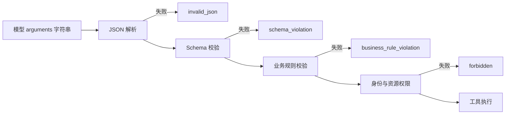

# Tool 与 Function Calling（02） - Tool Schema 与参数校验：把模型输出变成可信输入

> 读完后，你应能完成以下任务：
> - 给定一个业务函数签名，能写出包含类型、必填、枚举、长度和 `additionalProperties` 的 Tool Schema，并用五组正常与异常参数的测试报告验证约束实际生效。
> - 给定两个功能重叠的工具，能重写名称和描述，输出“该用、不要用、参数含义”对照表，并通过固定问题集比较误选率。
> - 给定模型生成的 JSON 参数，能实现“解析、结构校验、业务校验、权限校验”四层入口，并用分层错误日志证明失败发生在工具执行之前。
> - 在文章沙盒运行订单查询示例，输出四条路径的执行结果，验证未知字段、非法枚举、越权订单和合法参数不会混成同一种错误。

# 一、为什么 Schema 不是接口装饰

Tool Schema 同时服务两个对象。

模型根据它决定：

- 有哪些工具。
- 哪个工具适合当前问题。
- 参数应该叫什么。
- 参数大概应该长什么样。

应用根据它决定：

- 模型返回值能不能解析。
- 字段是否完整。
- 类型和取值是否允许。
- 是否存在未声明字段。

如果只把 Schema 当成给模型看的提示，应用就会接受一份未经验证的外部输入。

如果只把 Schema 当成后端校验，描述写得含糊，模型又会频繁选错工具。

## 1.1 从业务函数直接抄参数为什么不够

假设后端已有函数：

```text
query_orders(customer_id, status, limit)
```

只有字段名还不能形成可靠契约。

还需要回答：

- `customer_id` 是任意字符串，还是 `C` 开头的业务编号？
- `status` 能传哪些枚举？
- `limit` 的上下限是多少？
- 多传 `tenant_id` 时应该忽略还是拒绝？
- 当前用户是否能访问这个客户？

前四项适合进入结构 Schema。

最后一项必须由服务端业务权限判断完成。

# 二、先写一份最小但完整的 Schema

```json
{
  "type": "object",
  "properties": {
    "customer_id": {
      "type": "string",
      "pattern": "^C[0-9]{4}$",
      "description": "客户编号，例如 C1001"
    },
    "status": {
      "type": "string",
      "enum": ["pending", "paid", "shipped", "cancelled"],
      "description": "需要筛选的订单状态"
    },
    "limit": {
      "type": "integer",
      "minimum": 1,
      "maximum": 20,
      "description": "最多返回多少条订单"
    }
  },
  "required": ["customer_id", "limit"],
  "additionalProperties": false
}
```

这里每个约束都解决具体失败：

| 约束 | 拦截的问题 |
| --- | --- |
| `type` | 把字符串 `"10"` 当整数使用 |
| `required` | 漏掉执行所需字段 |
| `enum` | 模型创造不存在的业务状态 |
| `minimum` / `maximum` | 一次请求拉取过多数据 |
| `pattern` | 把自然语言名字误当业务编号 |
| `additionalProperties: false` | 拼错字段被静默忽略 |

## 2.1 不要为模型“自动纠错”所有参数

将 `customerId` 自动改成 `customer_id` 看起来友好，但会掩盖契约漂移。

更稳妥的处理是：

1. 记录原始模型输出。
2. 返回明确的参数错误。
3. 把失败样本加入固定评测集。
4. 修正 Schema 描述或模型适配层。

只有明确登记的版本迁移才适合做字段转换。

否则同一个拼写错误可能在不同服务中被转换成不同结果。

# 三、名称和描述决定模型怎样选

名称优先使用稳定的动词加对象：

- `get_order` 表示读取单张订单。
- `list_orders` 表示按条件列出多张订单。
- `create_refund_request` 表示创建退款申请，而不是直接退款。

避免名称：

- `process_data`，不知道处理什么。
- `order_tool`，不知道是读还是写。
- `do_refund`，不知道是申请、审核还是付款。

## 3.1 描述要同时写正向和反向边界

差的描述：

```text
查询订单。
```

更好的描述：

```text
读取当前用户拥有的单张订单状态；仅在用户提供明确订单编号时使用。
不要用于列出全部订单，也不能修改、取消或退款。
```

这段描述告诉模型四件事：

- 动作是读取。
- 对象是单张订单。
- 前置条件是明确订单号。
- 修改类需求不能使用。

描述仍然不能替代权限校验，但能降低错误选择率。

# 四、参数进入执行器前要过四层门



四层不能合成一个 `invalid_arguments`。

错误分类越清楚，越容易判断应该修模型提示、Schema、业务规则还是授权逻辑。

## 4.1 JSON 解析层

这一层只回答：参数是不是合法 JSON 对象。

不要在这里读取数据库，也不要补业务默认值。

## 4.2 Schema 校验层

这一层回答：字段、类型和静态约束是否符合协议。

失败样本可以稳定进入契约测试。

## 4.3 业务规则层

这一层回答：参数组合在当前业务状态下是否合理。

例如已经取消的订单不能再筛选为待发货。

这类规则通常不能完整写进 JSON Schema。

## 4.4 权限层

这一层回答：当前服务端身份能否访问具体资源。

权限所需的 `tenant_id`、`user_id` 和角色应从会话或令牌中读取。

不要要求模型生成这些可信身份字段。

# 五、默认值应该放在哪里

默认值有三种来源：

| 默认值类型 | 例子 | 应放位置 |
| --- | --- | --- |
| 展示偏好 | 默认返回 10 条 | 应用参数归一化层 |
| 安全上限 | 最多返回 20 条 | 服务端强约束 |
| 业务身份 | 当前租户 | 服务端上下文注入 |

Schema 中写 `default` 不代表所有模型供应商都会自动返回该字段。

应用必须明确决定：缺失时补默认值，还是要求模型重试。

安全上限即使存在默认值，也必须在执行前再次裁剪或拒绝。

# 六、可运行源码：让错误停在正确的层

示例只使用 Python 标准库，模拟必要的 Schema 约束。

### main.py

```python
"""验证 Tool 参数的结构、业务和资源权限边界。"""

from __future__ import annotations

import json
import re
from dataclasses import dataclass
from typing import Any


@dataclass(frozen=True, slots=True)
class RequestContext:
    """保存由服务端认证得到的用户与可访问客户。"""

    # 当前登录用户仅用于审计，不接受模型覆盖。
    user_id: str
    # 允许访问的客户编号集合用于对象级授权。
    allowed_customer_ids: frozenset[str]


# 订单状态枚举与真实业务状态机保持一致。
ALLOWED_STATUSES = {"pending", "paid", "shipped", "cancelled"}
# 客户编号格式用于在数据库查询前拒绝明显错误输入。
CUSTOMER_ID_PATTERN = re.compile(r"^C[0-9]{4}$")
# 工具允许出现的字段集合用于拒绝拼错或注入字段。
ALLOWED_FIELDS = {"customer_id", "status", "limit"}


def parse_arguments(raw_arguments: str) -> tuple[dict[str, Any] | None, str | None]:
    """解析模型参数字符串并返回对象或明确错误码。"""

    try:
        # 解析结果在进入后续校验前仍然是不可信数据。
        parsed_value = json.loads(raw_arguments)
    except json.JSONDecodeError:
        return None, "invalid_json"
    if not isinstance(parsed_value, dict):
        return None, "arguments_must_be_object"
    return parsed_value, None


def validate_schema(arguments: dict[str, Any]) -> str | None:
    """验证静态字段、类型、枚举和范围约束。"""

    # 未声明字段通常意味着拼写错误或提示注入尝试。
    unexpected_fields = set(arguments) - ALLOWED_FIELDS
    if unexpected_fields:
        return f"unexpected_fields:{sorted(unexpected_fields)}"
    # 客户编号是执行查询所需的必填字符串。
    customer_id = arguments.get("customer_id")
    if not isinstance(customer_id, str) or CUSTOMER_ID_PATTERN.fullmatch(customer_id) is None:
        return "invalid_customer_id"
    # limit 必须是整数，布尔值虽然属于 int 子类也不能接受。
    limit = arguments.get("limit")
    if isinstance(limit, bool) or not isinstance(limit, int) or not 1 <= limit <= 20:
        return "invalid_limit"
    # 可选状态存在时必须来自业务枚举。
    status = arguments.get("status")
    if status is not None and status not in ALLOWED_STATUSES:
        return "invalid_status"
    return None


def authorize(arguments: dict[str, Any], context: RequestContext) -> str | None:
    """验证当前服务端身份能否访问参数指定的客户。"""

    # customer_id 已经通过结构校验，可以用于资源权限判断。
    customer_id = arguments["customer_id"]
    if customer_id not in context.allowed_customer_ids:
        return "forbidden_customer"
    return None


def prepare_tool_execution(raw_arguments: str, context: RequestContext) -> dict[str, Any]:
    """依次执行解析、Schema 和权限校验，成功后返回安全参数。"""

    # 解析层结果包含参数对象或协议错误。
    arguments, parse_error = parse_arguments(raw_arguments)
    if parse_error is not None or arguments is None:
        return {"ok": False, "stage": "parse", "error": parse_error}
    # Schema 层错误表示模型输出不符合工具契约。
    schema_error = validate_schema(arguments)
    if schema_error is not None:
        return {"ok": False, "stage": "schema", "error": schema_error}
    # 授权层使用服务端上下文，不信任模型提供身份。
    authorization_error = authorize(arguments, context)
    if authorization_error is not None:
        return {"ok": False, "stage": "authorization", "error": authorization_error}
    return {"ok": True, "stage": "ready", "arguments": arguments}


def main() -> None:
    """运行合法、未知字段、非法枚举和越权四类参数。"""

    # 当前用户只允许查询客户 C1001。
    context = RequestContext("user-1", frozenset({"C1001"}))
    # 固定样本用于证明不同错误停在不同校验层。
    samples = {
        "合法参数": '{"customer_id":"C1001","status":"paid","limit":10}',
        "未知字段": '{"customer_id":"C1001","limit":10,"tenant_id":"t2"}',
        "非法枚举": '{"customer_id":"C1001","status":"done","limit":10}',
        "越权客户": '{"customer_id":"C2002","limit":10}',
    }
    for sample_name, raw_arguments in samples.items():
        # 输出保留样本名、失败阶段和错误码，便于回归比较。
        result = prepare_tool_execution(raw_arguments, context)
        print(f"{sample_name}: {result}")


if __name__ == "__main__":
    main()
```

预期判断：

- 合法参数进入 `ready`。
- 未知字段和非法枚举停在 `schema`。
- 越权客户停在 `authorization`。
- 所有失败都发生在真实工具执行之前。

# 七、怎样评测工具描述是否有效

不要只凭感觉修改描述。

准备一份固定问题集：

- 明确应该调用当前工具的问题。
- 明确应该调用其他工具的问题。
- 不需要任何工具的问题。
- 信息不足、应该先追问的问题。
- 带有恶意指令或越权意图的问题。

记录每条样本的：

- 期望工具。
- 实际工具。
- 参数是否符合 Schema。
- 是否应该追问。
- 最终是否执行。

每次只改变工具名称、描述或 Schema 中的一项，才能判断变化来自哪里。

# 八、常见错误怎么修

| 错误 | 为什么危险 | 修复方式 |
| --- | --- | --- |
| 所有字段都可选 | 模型生成残缺请求后才在深层报错 | 真正必需字段写入 `required` |
| 允许额外字段 | 拼写错误被静默忽略 | 默认关闭 `additionalProperties` |
| 枚举只写在描述中 | 代码无法稳定校验 | 同时写入 Schema `enum` |
| 把当前用户作为模型参数 | 用户可诱导模型伪造身份 | 从服务端上下文注入 |
| 工具描述只写名词 | 模型不知道何时使用 | 写动作、条件和反向边界 |
| 所有错误返回同一句话 | 无法判断协议、业务还是权限问题 | 保存阶段和稳定错误码 |

# 九、总结

- Tool Schema 既是模型选择依据，也是应用执行前的参数契约。
- 名称和描述负责降低误选，结构约束负责让错误可检测。
- JSON 解析、Schema、业务规则和权限是不同校验层，不能混成一个模糊错误。
- 身份、租户和资源权限必须来自服务端上下文，不能由模型生成。
- 工具描述要通过固定问题集评测，而不是上线后靠偶发反馈猜测。

## 9.1 参考资料

- [LangChain Tools](https://docs.langchain.com/oss/python/langchain/tools)
- [JSON Schema: object](https://json-schema.org/understanding-json-schema/reference/object)
- [OpenAI Cookbook: Function calling](https://github.com/openai/openai-cookbook/blob/main/examples/How_to_call_functions_with_chat_models.ipynb)
