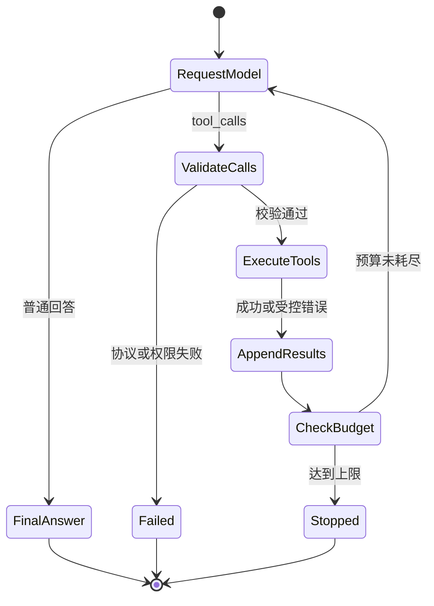

# Tool 与 Function Calling（03） - 完整 Tool Calling 循环：执行、回传与停止

> 读完后，你应能完成以下任务：
> - 给定一条模型工具请求，能实现“请求模型、执行工具、回传结果、再次请求模型”的循环，并用消息 Trace 证明每个调用和结果通过调用 ID 对应。
> - 给定工具超时、重复调用和连续空转三个故障，能设置最大步数、超时、幂等键和停止原因，并用运行日志证明循环会停止而不是无限消耗 Token。
> - 给定包含两个工具调用的模型响应，能选择串行或并行策略，输出决策表，并说明存在数据依赖或写副作用时为什么不能盲目并行。
> - 在文章沙盒运行订单查询闭环，输出三个场景的停止日志，验证正常任务以 `final_answer` 结束，未知工具和超步数分别以明确状态终止。

# 一、一次 tool call 不是一个完整应用

第一篇已经说明模型只生成调用请求。

但真实应用还要把工具结果送回模型。

因此 Tool Calling 不是一条函数调用语句，而是一个受控循环：

```text
用户消息
  -> 模型响应
  -> 0 个或多个 tool_call
  -> 代码校验并执行
  -> tool_result 消息
  -> 再次请求模型
  -> 最终回答或下一轮 tool_call
```

循环成立必须有三个出口：

- 模型返回最终回答。
- 应用发现不可恢复错误。
- 应用达到步骤、时间或成本上限。

没有出口的 Agent 循环只是一个没有停止条件的 `while True`。

## 1.1 为什么工具结果必须回到消息历史

模型不会自动知道你的 Python 函数返回了什么。

应用要追加两类信息：

- 模型原始的工具调用请求。
- 与调用 ID 对应的工具结果。

如果只追加结果文本、不保留调用请求，后续请求可能违反供应商协议，也无法审计模型为什么调用该工具。

如果只保留调用请求、不追加结果，模型只能再次请求同一个工具或凭空猜答案。

# 二、把循环拆成五个稳定阶段



五个阶段分别是：

1. 请求模型并保存原始响应。
2. 识别普通回答或工具调用。
3. 校验和执行每个工具。
4. 追加结构化工具结果。
5. 检查预算后进入下一轮。

这些阶段应该在 Trace 中拥有独立 Span。

否则工具慢、模型慢和循环空转都会表现成同一个“接口超时”。

# 三、消息契约必须保留调用 ID

一轮消息可以抽象成：

```json
[
  {"role": "user", "content": "订单 A100 到哪了？"},
  {
    "role": "assistant",
    "tool_calls": [
      {"id": "call-1", "name": "query_order", "arguments": {"order_id": "A100"}}
    ]
  },
  {
    "role": "tool",
    "tool_call_id": "call-1",
    "name": "query_order",
    "content": {"status": "shipped"}
  },
  {"role": "assistant", "content": "订单 A100 已发货。"}
]
```

不同 SDK 的对象名称不同，但关联关系相同。

## 3.1 工具错误也要回传吗

可恢复错误可以作为工具结果回传，例如：

- 查询没有结果。
- 参数需要用户补充。
- 下游暂时限流。

模型可以据此追问或换方案。

不可恢复或安全错误不应只交给模型自行处理，例如：

- 工具不在白名单。
- 当前身份没有权限。
- 写操作缺少人工确认。
- 达到全局成本上限。

这些情况应由应用停止循环并返回确定性状态。

# 四、停止条件要在运行前定义

至少设置以下预算：

| 预算 | 防止什么问题 | 典型停止状态 |
| --- | --- | --- |
| 最大模型轮数 | 模型反复调用同一工具 | `max_steps_exceeded` |
| 单工具超时 | 一个依赖占满请求时间 | `tool_timeout` |
| 总运行时间 | 多个步骤累计超时 | `deadline_exceeded` |
| 最大工具调用数 | 并行或递归调用爆炸 | `tool_budget_exceeded` |
| 最大 Token / 成本 | 任务价值低于调用成本 | `cost_budget_exceeded` |

预算不是报错后的补丁。

它们是循环协议的一部分，应该进入运行配置和 Trace。

## 4.1 怎样识别空转

即使没达到最大步数，也可以提前识别：

- 连续两次生成相同工具名和相同参数。
- 工具已经返回确定性错误，模型仍原样重试。
- 消息没有新增有效信息。
- 同一幂等键的写操作被重复请求。

空转检测可以减少延迟和成本，但不能替代硬上限。

# 五、多个工具调用怎样执行

模型可能在一次响应中给出多个调用。

适合并行：

- 查询两个互不依赖的数据源。
- 多个只读工具没有共享限流瓶颈。
- 结果顺序可通过调用 ID 恢复。

必须串行：

- 第二个调用依赖第一个结果。
- 多个调用修改同一资源。
- 写操作需要逐项确认。
- 工具共享事务或严格速率限制。

并行是执行器决策，不应仅因为模型一次返回多个调用就自动开启。

## 5.1 写工具为什么需要幂等键

网络超时可能发生在工具已经写入、但应用还没收到结果之后。

如果直接重试，就可能重复创建工单或重复退款。

幂等键可以来自：

- 稳定的业务请求 ID。
- 当前运行 ID 加工具调用 ID。
- 业务对象和动作构成的唯一键。

工具执行器应保存幂等键对应的最终结果，并在重试时直接回放。

# 六、可运行源码：一个会停止的工具循环

示例使用固定模型脚本模拟三种响应，不需要 API Key。

重点是消息追加、调用 ID 和停止状态。

### main.py

```python
"""演示带消息回传、失败分类和最大步数的 Tool Calling 循环。"""

from __future__ import annotations

from dataclasses import dataclass
from typing import Any


@dataclass(frozen=True, slots=True)
class RunResult:
    """保存工具循环的最终状态和可审计消息。"""

    # status 区分正常回答、协议失败和预算停止。
    status: str
    # answer 只在模型真正生成最终回答时有值。
    answer: str | None
    # messages 保存每轮模型请求所需的完整历史。
    messages: tuple[dict[str, Any], ...]


# 模拟订单数据库提供确定性的工具结果。
ORDER_DATABASE = {"A100": {"status": "shipped"}}


def scripted_model(messages: list[dict[str, Any]], mode: str) -> dict[str, Any]:
    """根据消息历史返回可预测的模型响应；mode 控制故障场景。"""

    # 工具结果消息用于判断循环是否已经完成一次执行。
    tool_messages = [message for message in messages if message.get("role") == "tool"]
    if mode == "unknown_tool":
        return {
            "role": "assistant",
            "tool_calls": [{"id": "call-x", "name": "drop_database", "arguments": {}}],
        }
    if mode == "loop_forever":
        return {
            "role": "assistant",
            "tool_calls": [
                {"id": f"call-{len(tool_messages) + 1}", "name": "query_order", "arguments": {"order_id": "A100"}}
            ],
        }
    if not tool_messages:
        return {
            "role": "assistant",
            "tool_calls": [{"id": "call-1", "name": "query_order", "arguments": {"order_id": "A100"}}],
        }
    # 最后一条工具结果用于生成面向用户的最终回答。
    latest_tool_result = tool_messages[-1]["content"]
    return {"role": "assistant", "content": f"订单 A100 状态是 {latest_tool_result['status']}。"}


def execute_tool(tool_call: dict[str, Any]) -> dict[str, Any]:
    """执行白名单中的只读订单工具；tool_call 来自模型。"""

    # 模型工具名只能用于白名单分派。
    tool_name = tool_call.get("name")
    if tool_name != "query_order":
        return {"ok": False, "error": "tool_not_allowed"}
    # 参数对象在示例中仍执行类型和必填校验。
    arguments = tool_call.get("arguments")
    order_id = arguments.get("order_id") if isinstance(arguments, dict) else None
    if not isinstance(order_id, str) or not order_id:
        return {"ok": False, "error": "invalid_arguments"}
    # 查询结果不存在时返回受控业务错误。
    order = ORDER_DATABASE.get(order_id)
    if order is None:
        return {"ok": False, "error": "order_not_found"}
    return {"ok": True, **order}


def run_tool_loop(user_message: str, mode: str, max_steps: int = 3) -> RunResult:
    """运行最多 max_steps 轮模型调用，并返回明确终止状态。"""

    # 消息历史从当前用户请求开始。
    messages: list[dict[str, Any]] = [{"role": "user", "content": user_message}]
    for step_number in range(1, max_steps + 1):
        # 当前模型响应必须原样追加，保留工具提议证据。
        assistant_message = scripted_model(messages, mode)
        messages.append(assistant_message)
        # 没有工具调用表示模型已经生成最终回答。
        tool_calls = assistant_message.get("tool_calls")
        if not tool_calls:
            return RunResult("final_answer", assistant_message.get("content"), tuple(messages))
        for tool_call in tool_calls:
            # 工具结果通过原调用 ID 与模型提议对应。
            tool_result = execute_tool(tool_call)
            if tool_result.get("error") == "tool_not_allowed":
                return RunResult("tool_not_allowed", None, tuple(messages))
            messages.append(
                {
                    "role": "tool",
                    "tool_call_id": tool_call["id"],
                    "name": tool_call["name"],
                    "content": tool_result,
                }
            )
        print(f"mode={mode} step={step_number} tool_calls={len(tool_calls)}")
    return RunResult("max_steps_exceeded", None, tuple(messages))


def main() -> None:
    """运行正常回答、未知工具和无限循环三个场景。"""

    # 三个模式分别验证三个互斥终止出口。
    modes = ("normal", "unknown_tool", "loop_forever")
    for mode in modes:
        # 每个场景使用全新消息历史，避免跨运行状态污染。
        result = run_tool_loop("查询订单 A100", mode)
        print(f"mode={mode} status={result.status} messages={len(result.messages)} answer={result.answer}")


if __name__ == "__main__":
    main()
```

运行结果必须出现三个不同终止状态：

```text
mode=normal status=final_answer
mode=unknown_tool status=tool_not_allowed
mode=loop_forever status=max_steps_exceeded
```

如果第三个场景持续运行，说明最大步数没有真正控制循环。

# 七、接入真实 SDK 时保留哪些接口

建议把实现拆成以下边界：

| 模块 | 输入 | 输出 | 不负责什么 |
| --- | --- | --- | --- |
| Model Client | 消息、工具定义、模型配置 | 普通回答或工具提议 | 不执行业务工具 |
| Tool Registry | 工具名 | 定义和处理器 | 不做模型请求 |
| Policy Engine | 身份、工具、参数、风险 | 允许、拒绝或待确认 | 不相信 Prompt 承诺 |
| Tool Executor | 已授权调用 | 工具结果或分类错误 | 不决定下一个步骤 |
| Loop Controller | 消息和预算 | 最终状态 | 不绕过前述边界 |

模块化后可以分别测试：

- 模型适配是否正确解析协议。
- 策略是否阻断越权和副作用。
- 工具是否支持超时和幂等。
- 循环是否在所有出口稳定停止。

# 八、Trace 至少记录什么

一次运行至少记录：

- `run_id` 和会话 ID。
- 模型、Prompt 和工具定义版本。
- 每轮模型耗时与 Token。
- 工具调用 ID、名称和脱敏参数摘要。
- 授权决定和确认记录。
- 工具耗时、重试和结果状态。
- 最终停止原因。

不要只记录最终回答。

最终回答错误时，需要沿消息链找到第一个错误工具选择、参数或结果。

# 九、常见故障与排查

| 现象 | 第一个检查点 | 修复方式 |
| --- | --- | --- |
| 模型反复调用相同工具 | 每轮工具名和参数摘要 | 加重复调用检测和最大步数 |
| 工具成功但模型继续说没结果 | 工具结果消息和调用 ID | 按供应商协议回传完整结果 |
| 超时后重复创建资源 | 幂等键和工具最终状态 | 先查询原调用状态，再决定重试 |
| 多工具结果对应错位 | 调用 ID 与结果映射 | 不用数组位置或完成顺序猜关系 |
| 一个工具失败导致所有结果丢失 | 执行策略和错误分类 | 明确部分成功、全失败和补偿策略 |
| 成本突然升高 | 轮数、工具数和 Token 分段 | 设置预算并对空转提前停止 |

# 十、总结

- Tool Calling 是受控循环，不是一次函数调用。
- 模型工具提议和工具结果都要进入消息历史，并通过调用 ID 对应。
- 最终回答、不可恢复错误和预算耗尽是三个必要出口。
- 多工具是否并行由依赖和副作用决定，不由模型返回形式决定。
- 最大步数、超时、幂等、重复检测和 Trace 共同保证循环可停止、可恢复、可审计。

## 10.1 参考资料

- [OpenAI Cookbook: Function calling loop](https://github.com/openai/openai-cookbook/blob/main/examples/How_to_call_functions_with_chat_models.ipynb)
- [LangChain Tools](https://docs.langchain.com/oss/python/langchain/tools)
- [LangGraph Durable Execution](https://docs.langchain.com/oss/python/langgraph/durable-execution)
