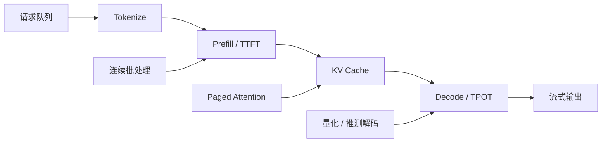

# AI 大模型应用面试题（12）- 长上下文与推理优化（第 111～120 题）

> 读完你能：围绕“长上下文与推理优化（第 111～120 题）”理解“第111题：Transformer 处理超长上下文时，主要瓶颈在哪里？”与“第112题：KV Cache 缓存了什么，为什么能加速自回归生成？”，并结合正文示例完成实践与排障。

> 推理优化不是罗列量化名词，而是先分清 Prefill、Decode、显存和调度瓶颈，再选择手段。

## 第111题：Transformer 处理超长上下文时，主要瓶颈在哪里？

**答案：** Prefill 阶段标准注意力的计算与注意力矩阵随序列长度近似二次增长；Decode 阶段每生成一个 Token 都要读取历史 KV，常受显存带宽限制。长上下文还会占用大量 KV Cache，降低可并发请求数。因此要分别测 TTFT、TPOT、吞吐和 KV 占用，不能只看总响应时间。

## 第112题：KV Cache 缓存了什么，为什么能加速自回归生成？

**答案：** 每层缓存历史 Token 的 Key 和 Value，新 Token 只计算自己的 Q/K/V，再让 Q 读取历史 K/V，避免每一步重算整段前缀。KV 显存约与“层数 × Token 数 × KV 头数 × 头维度 × 2 × 字节数”成正比。优化手段包括 GQA/MQA、低精度 KV、分页管理、Prefix Cache 和限制最大上下文，但都要验证质量与命中率。

## 第113题：Paged Attention 解决了什么问题？

**答案：** 连续分配 KV Cache 会因请求长度未知产生预留浪费和内存碎片。Paged Attention 把 KV 拆成固定大小块，通过逻辑块表映射到非连续物理块，使请求按需增长、块可复用，也便于连续批处理。它主要提升显存利用率和吞吐，不会改变模型本身的注意力语义。

## 第114题：模型量化有哪些常见方式，怎样选择？

**答案：** 权重量化把 FP16/BF16 权重降到 INT8/INT4；权重激活量化还压缩激活；KV 量化针对长上下文缓存。PTQ 部署快，QAT 成本高但通常更稳。选型不能只看模型文件大小，应在目标 GPU 上比较任务质量、首 Token 延迟、生成吞吐、显存、内核支持和并发；某些低比特方案若缺少高效内核，反而更慢。

## 第115题：连续批处理为什么能提升吞吐？

**答案：** 不同请求生成长度不同，静态批处理要等待最长请求。连续批处理在每个调度步把已完成请求移出，并插入新请求，提高 GPU 利用率。代价是调度复杂度和单请求延迟波动。生产上应按优先级、最大等待时间、Token 预算和租户配额调度，同时监控队列时间与 TPOT。

## 第116题：Speculative Decoding 的原理和适用条件是什么？

**答案：** 小草稿模型先提出多个候选 Token，大模型并行验证，接受的连续 Token 可一次推进，从而减少大模型串行 Decode 次数。收益取决于草稿接受率、验证开销和硬件利用率；草稿模型过弱或输出极短时可能得不偿失。它保持目标模型分布，不等于用小模型直接替代大模型。

## 第117题：Agent 如何突破上下文窗口上限？

**答案：** 不是无限扩窗，而是把状态分层：近期对话保留原文，中期轨迹压缩成结构化摘要，长期事实写入带来源和 TTL 的 Memory，大文件通过检索按需加载，工具结果只保留必要字段。压缩前保存原始事件以便回放，摘要要标注事实、决策和未完成事项。关键指标是任务成功率、压缩率、错误遗忘率和单轮 Token。

## 第118题：如何设计低延迟业务下的 Prompt 压缩方案？

**答案：** 先删静态重复说明和无关工具 Schema，再用规则裁剪历史，最后才调用小模型做摘要。固定前缀保持稳定以利用 Prefix Cache；检索证据按相关性和来源去重，保留标题、关键段和引用 ID。设置 Token 预算器，超预算时按“安全规则 > 用户目标 > 当前状态 > 证据 > 历史闲聊”降级，并分别测压缩耗时和任务回归。

## 第119题：LLM 推理加速有哪些层次？

**答案：** 模型层有蒸馏、量化、稀疏和更小模型路由；算子层有 Flash Attention、融合算子和编译；服务层有 KV/Prefix Cache、连续批处理、Paged Attention、推测解码与并行；应用层有 Prompt 压缩、输出上限、缓存和异步工具。优化顺序应是先 Profiling，再处理最大瓶颈，最后用质量、P95、吞吐和单请求成本共同验收。

## 第120题：如何定位线上推理服务突然变慢？

**答案：** 按请求拆解排队、Tokenize、Prefill、Decode、网络和工具耗时，比较 TTFT、TPOT、输入/输出 Token、批大小、KV 使用率和缓存命中。再检查流量结构、长请求比例、模型版本、GPU 降频/OOM、实例扩缩容和上游限流。先用 Trace 判断慢在哪一段，再调并发或模型；盲目扩容可能只把瓶颈移到队列或下游。

## 面试速查表

例如，线上总耗时上升并不等于模型 Decode 变慢，应先按下表定位证据：

| 主要症状 | 优先指标 | 常用手段 | 主要风险 |
| --- | --- | --- | --- |
| 首 Token 慢 | 排队时间、TTFT、输入 Token | Prompt 压缩、Prefix Cache、扩 Prefill 能力 | 压缩丢失关键约束 |
| 逐 Token 慢 | TPOT、显存带宽、GPU 利用率 | 量化、推测解码、优化算子 | 质量回归或内核不匹配 |
| 并发上不去 | KV 占用、批大小、OOM | GQA/MQA、Paged Attention、KV 量化 | 长请求被限流 |
| 吞吐高但 P95 差 | 队列长度、调度等待 | 优先级队列、Token 预算、实例隔离 | GPU 利用率下降 |

## 参考资料

- [vLLM：Paged Attention](https://docs.vllm.ai/en/latest/design/paged_attention/)
- [Hugging Face：KV Cache](https://huggingface.co/docs/transformers/kv_cache)
- [PyTorch：Scaled Dot Product Attention](https://docs.pytorch.org/docs/stable/generated/torch.nn.functional.scaled_dot_product_attention.html)

## 总结

长上下文的核心约束是 Prefill 计算、Decode 带宽和 KV 显存。优化必须对应具体瓶颈，并用质量、延迟、吞吐和成本一起验收。

