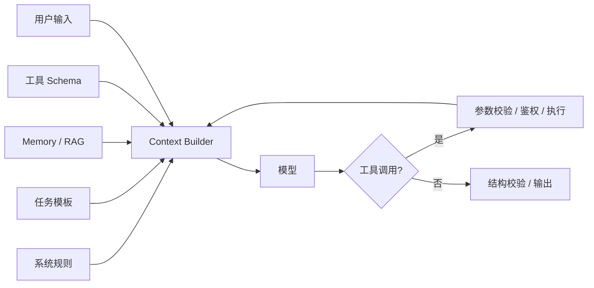

# AI 大模型应用面试题（13）- Context、Prompt 与 Harness（第 121～130 题）

> 读完你能：围绕“Context、Prompt 与 Harness（第 121～130 题）”理解“第121题：提示词工程和上下文工程有什么区别？”与“第122题：如何设计工程级分层 Prompt？”，并结合正文示例完成实践与排障。

> Prompt 只是输入的一部分，生产级效果取决于上下文装配、工具执行、状态管理和结果校验组成的 Harness。

## 第121题：提示词工程和上下文工程有什么区别？

**答案：** Prompt Engineering 关注指令怎样表达，包括角色、目标、约束、示例和输出格式；Context Engineering 关注每次推理到底装入哪些信息，包括系统规则、用户状态、历史、检索证据、工具 Schema、Token 预算和优先级。前者优化“怎么说”，后者治理“给什么”。生产问题通常先检查上下文是否正确、最新且获授权，再优化措辞。

## 第122题：如何设计工程级分层 Prompt？

**答案：** 建议分为平台安全规则、产品角色与边界、任务模板、动态业务上下文、用户输入、输出契约六层。静态层版本化并做哈希，动态层使用结构化标签隔离，禁止字符串随意拼接。冲突时按明确优先级处理；发布前用正常、边界、注入和回归样本评测。Prompt 中不要放真实密钥，也不要依赖模型完成权限判断。

## 第123题：Prompt Injection 的根因是什么，怎样降低风险？

**答案：** 根因是模型会同时解释“指令”和“不可信数据”，而两者最终都进入 Token 序列。防护要靠系统边界：把网页、文档和工具返回标成不可信数据；工具使用最小权限、参数校验和高风险审批；检索先做 ACL；输出再经过 Schema 与策略校验。仅增加一句“忽略恶意指令”不是安全边界。

## 第124题：上下文装配器应该怎样设计？

**答案：** 输入是用户与租户、会话状态、候选证据和可用工具，输出是带来源清单和 Token 统计的确定性消息序列。装配顺序通常是强约束、当前目标、必要状态、去重证据、近期历史。每段记录来源、版本、优先级和 Token；超预算按策略裁剪并写 Trace。这样才能回放某次错误回答，而不是只保存最终 Prompt 文本。

## 第125题：如何让模型稳定输出 JSON？

**答案：** 优先使用模型支持的 Structured Outputs 或 JSON Schema，而不是只在 Prompt 中展示示例。服务端仍要用 Pydantic/JSON Schema 校验类型、枚举、长度和业务约束；失败时只把校验错误反馈给模型做有限次数修复。解析失败不能静默填默认值，否则会把模型错误伪装成合法业务数据。

## 第126题：Function Calling 的工作原理是什么？

**答案：** 应用把工具名称、描述和参数 Schema 发给模型；模型返回工具调用意图与结构化参数，真正执行工具的是宿主程序；宿主校验、鉴权、执行后把结果回传，模型再生成答复。模型没有自动获得系统权限。可靠实现必须处理未知工具、参数越界、超时、幂等、重试、副作用审批和结果截断。

## 第127题：什么是 Harness Engineering？

**答案：** Harness 是包围模型的运行时系统，负责上下文、工具、状态、循环、权限、预算、错误恢复、观测与评测。相同模型放在不同 Harness 中，任务成功率可能差异很大。核心原则是把不可接受的行为变成代码约束，把可恢复状态持久化，把每一步变成可观察事件，而不是继续堆叠 Prompt。

## 第128题：Agent Skill 和 MCP 的本质区别是什么？

**答案：** Skill 通常是可复用的任务知识与工作流，告诉 Agent 在什么场景按什么步骤做；MCP 是客户端与外部能力之间的协议，标准化工具、资源和 Prompt 的发现与调用。Skill 可以调用 MCP 工具，也可以只使用本地文件或命令；MCP Server 提供能力，不负责决定完整业务流程。两者分别解决“怎么做”和“怎样连接”。

## 第129题：Skill 很多时，怎样保证路由命中率？

**答案：** 不应把全部 Skill 正文塞进上下文。先用短描述、标签、权限和输入类型做候选召回，再对 Top K 做语义或规则重排，最后按需加载完整说明。描述要包含触发条件和反例，名称不能重叠；建立包含应命中、不应命中和多 Skill 组合的路由集，监控 Top-1、Recall@K、误触发率和 Token 成本。

## 第130题：AI 生成的 Skill 上线前怎样验收并持续维护？

**答案：** 先做静态检查：权限、危险命令、依赖、密钥和路径边界；再在隔离环境跑成功、失败、重试、并发和注入用例；最后由领域负责人审查输出和副作用。上线后版本化 Skill、保留输入输出 Trace，监控命中率、成功率、人工接管率与成本。模型或工具接口变化时跑回归集，不能让生成内容直接获得生产权限。

## 可运行示例：带校验的工具调用闭环

```text
# requirements.txt
openai>=1.99.0
pydantic>=2.11.0
```

```python
import json
import os
from typing import Any

from openai import OpenAI
from pydantic import BaseModel, Field


class WeatherArguments(BaseModel):
    """校验天气工具参数，city 为用户要查询的城市。"""

    city: str = Field(min_length=1, max_length=50)  # 城市名称，限制长度避免异常参数。


def get_weather(arguments: WeatherArguments) -> dict[str, str]:
    """返回演示天气数据；arguments 是已通过 Schema 校验的工具参数。"""

    return {"city": arguments.city, "condition": "sunny"}


client = OpenAI()  # 使用 OPENAI_API_KEY 创建官方 SDK 客户端。
model = os.environ["OPENAI_MODEL"]  # 从环境读取已授权模型，避免在代码中固化易变化名称。
tools: list[dict[str, Any]] = [  # 声明模型可选择的最小权限工具集合。
    {
        "type": "function",
        "name": "get_weather",
        "description": "查询指定城市的天气",
        "parameters": WeatherArguments.model_json_schema(),
        "strict": True,
    }
]
response = client.responses.create(  # 第一次调用只允许模型提出工具请求。
    model=model,
    input="深圳今天天气如何？",
    tools=tools,
)

for output_item in response.output:  # 遍历输出，显式处理每个工具调用事件。
    if output_item.type != "function_call":
        continue
    tool_arguments = WeatherArguments.model_validate_json(output_item.arguments)  # 校验模型参数。
    tool_result = get_weather(tool_arguments)  # 宿主程序执行工具，模型不直接获得权限。
    final_response = client.responses.create(  # 把可信工具结果回传给同一响应链。
        model=model,
        previous_response_id=response.id,
        input=[
            {
                "type": "function_call_output",
                "call_id": output_item.call_id,
                "output": json.dumps(tool_result, ensure_ascii=False),
            }
        ],
    )
    print(final_response.output_text)
```

## 参考资料

- [OpenAI：Function Calling](https://developers.openai.com/api/docs/guides/function-calling)
- [Model Context Protocol：Specification](https://modelcontextprotocol.io/specification/latest)
- [OWASP：LLM Prompt Injection Prevention](https://cheatsheetseries.owasp.org/cheatsheets/LLM_Prompt_Injection_Prevention_Cheat_Sheet.html)


