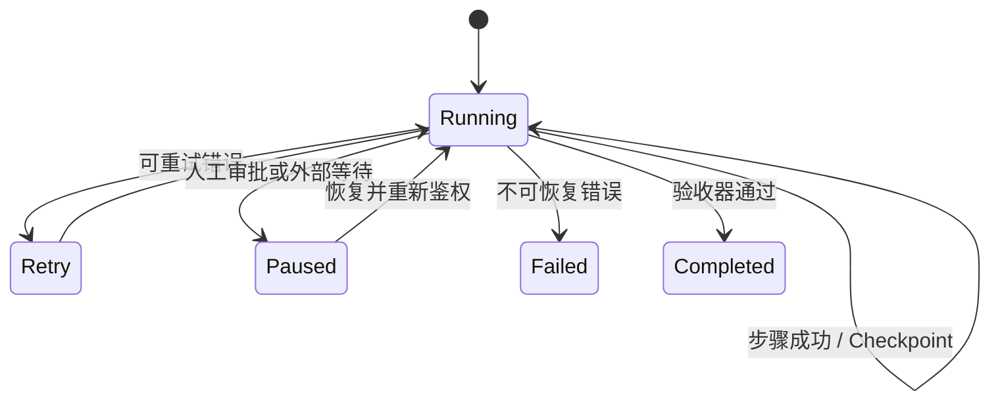

# AI 大模型应用面试题（16）- Agent 可靠性、评测与意图识别（第 151～160 题）

> 读完你能：围绕“Agent 可靠性、评测与意图识别（第 151～160 题）”理解“第151题：Agent 跑长任务时怎样防止跑偏、绕路和死循环？”与“第152题：多步任务执行到一半失败怎样处理？”，并结合正文示例完成实践与排障。

> 可靠 Agent 的关键不是“模型更聪明”，而是边界可控、状态可恢复、结果可评测。

## 第151题：Agent 跑长任务时怎样防止跑偏、绕路和死循环？

**答案：** 把用户目标转成可检查的完成条件和阶段计划；每轮限制工具集合、最大步骤、Token、时间和成本；状态记录已完成项、失败原因与剩余工作。检测连续相同动作、无状态进展和重复错误，触发重规划、换工具或人工介入。结束前执行独立验收命令，不能让模型仅凭自述判定完成。

## 第152题：多步任务执行到一半失败怎样处理？

**答案：** 每步定义输入、输出、幂等键和副作用，完成后持久化事件或 Checkpoint。无副作用步骤可指数退避重试；写操作先查询现状，避免重复执行；跨系统事务用 Saga 补偿或人工处理，不能假设回滚一定成功。恢复时从最后一个已确认状态继续，并把错误分类为可重试、需降级和需人工。

## 第153题：Agent 如何支持暂停、恢复和续跑？

**答案：** 将执行状态从进程内存移到持久化存储，至少保存 Thread/Run ID、图节点、业务状态、消息、工具调用 ID、版本和等待原因。暂停发生在明确边界，恢复前重新校验权限、外部资源和工具幂等状态。模型、Prompt 或图版本变化时要迁移或固定旧版本，避免旧 Checkpoint 在新逻辑下误执行。

## 第154题：怎样理解 Checkpoint 机制？

**答案：** Checkpoint 是某个执行时刻可恢复状态的不可变快照，不只是聊天记录。它使故障恢复、人工审批、时间旅行调试和分支重跑成为可能。快照应关联版本、父检查点和写入序号，并采用并发控制防止两个 Worker 覆盖。敏感字段需加密和按租户隔离，保留周期也要符合删除要求。

## 第155题：怎样保证工具调用可靠？

**答案：** 调用前做工具白名单、Schema、权限、额度和业务前置条件校验；调用中设置超时、取消、熔断和 Trace；调用后校验返回类型、业务状态和副作用。读操作可有限重试，写操作必须带幂等键并先查后做。高风险工具采用预览、人工批准和最小权限凭证，工具输出按不可信输入处理。

## 第156题：如何量化一个 Agent 的性能？

**答案：** 核心是任务成功率和约束违规率，再拆成步骤完成率、工具选择/参数正确率、平均步骤数、人工接管率、P50/P95、Token 与成本。对开放任务使用基于验收器的结果评分，不要只让模型评价语言质量。指标必须按任务类型、难度和版本分桶，否则总体均值会掩盖关键回归。

## 第157题：怎样从 0 到 1 建立 Agent 自动化评测体系？

**答案：** 从线上高频、失败和高风险案例构建小而可信的 Golden Set，保存输入、环境夹具、期望结果和禁止行为；为确定项写代码 Evaluator，为语义项制定 Rubric 并抽样人工校准。CI 跑快速回归，候选版本跑全量和对照，线上做 Trace 抽样与反馈回流。评测集要版本化并防止 Prompt 针对测试集过拟合。

## 第158题：智能体怎样做意图识别？

**答案：** 先定义互斥或可组合的意图 Taxonomy、槽位和兜底类别。明显规则用关键词/正则或业务状态直接判断，模糊语义用分类模型或 LLM Structured Output，低置信度进入澄清。多轮场景同时看当前输入与有效会话状态，但不能让旧意图覆盖用户最新指令。输出需包含意图、置信度、槽位和证据。

## 第159题：怎样提升意图识别准确率？

**答案：** 先看混淆矩阵定位边界重叠、长尾或标注问题；合并无法稳定区分的类别，补充困难负例和多表达样本。对高频确定意图使用规则，对相似意图加入领域实体和上下文，再校准置信度与澄清阈值。上线监控未知率、澄清率、误路由业务损失和类别漂移，而不只看离线 Accuracy。

## 第160题：意图识别的“三层漏斗”怎样设计？

**答案：** 第一层用权限、渠道、命令和高精度规则快速截获确定请求；第二层用轻量分类器召回候选意图；第三层让能力更强的模型结合上下文判别、抽取槽位，仍不确定则澄清或转人工。各层都输出理由和置信度，阈值按误路由成本设置。漏斗价值是同时控制延迟、成本与精度，不是固定必须三种模型。

## 可运行示例：可恢复的 LangGraph 状态机

```text
# requirements.txt
langgraph>=1.0,<2.0
```

```python
from typing import Literal, TypedDict

from langgraph.checkpoint.memory import InMemorySaver
from langgraph.graph import END, START, StateGraph


class TaskState(TypedDict):
    """保存任务步骤和运行状态，作为节点之间的持久化契约。"""

    step: int  # 当前已完成的步骤数。
    status: str  # 当前任务状态，用于决定是否结束。


def execute_step(state: TaskState) -> TaskState:
    """执行一个可重复步骤；state 是恢复后读取的最新任务状态。"""

    next_step = state["step"] + 1  # 计算下一步骤，避免在节点内修改原状态。
    next_status = "done" if next_step >= 3 else "running"  # 三步完成，便于演示终止条件。
    return {"step": next_step, "status": next_status}


def route_next(state: TaskState) -> Literal["execute_step", "__end__"]:
    """根据任务状态选择继续或结束；state 是节点提交后的状态。"""

    return END if state["status"] == "done" else "execute_step"


workflow = StateGraph(TaskState)  # 创建显式状态图，约束所有节点共享的数据结构。
workflow.add_node("execute_step", execute_step)
workflow.add_edge(START, "execute_step")
workflow.add_conditional_edges("execute_step", route_next)
checkpointer = InMemorySaver()  # 演示进程内检查点；生产应替换为持久化实现。
graph = workflow.compile(checkpointer=checkpointer)  # 编译带检查点能力的可执行图。
config = {"configurable": {"thread_id": "interview-demo"}}  # 稳定线程 ID 用于恢复同一任务。
result = graph.invoke({"step": 0, "status": "running"}, config=config)  # 执行并自动保存状态。
print(result)
```

## 参考资料

- [LangGraph：Persistence](https://docs.langchain.com/oss/python/langgraph/persistence)
- [LangSmith：Evaluation](https://docs.langchain.com/langsmith/evaluation)


