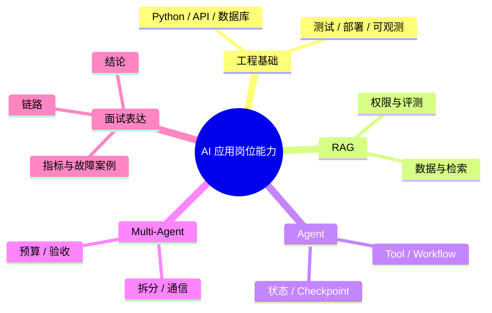

# AI 大模型应用面试题（17）- Multi-Agent 与岗位准备（第 161～170 题）

> 读完你能：围绕“Multi-Agent 与岗位准备（第 161～170 题）”理解“第161题：怎样理解多智能体协作？”与“第162题：Multi-Agent 动态派生怎样设计？”，并结合正文示例完成实践与排障。

> 最后一组把协作架构和面试表达放在一起：既要能设计系统，也要能用证据说明自己真正做过什么。

## 第161题：怎样理解多智能体协作？

**答案：** Multi-Agent 是把目标拆给拥有不同上下文、工具或权限的执行单元，通过协议汇总结果。价值来自并行、专业化和上下文隔离，不来自“多开几个模型”。必须明确任务所有者、共享状态、消息格式、冲突裁决、预算和终止条件。若任务高度串行或状态强耦合，单 Agent 加确定性工具通常更稳。

## 第162题：Multi-Agent 动态派生怎样设计？

**答案：** Supervisor 根据任务图和能力目录创建临时子任务，派生请求包含目标、输入快照、允许工具、预算、截止时间和验收器。子 Agent 只能返回结构化结果与证据，不能任意修改全局状态；Supervisor 根据完成度继续派生或停止。设置最大深度、总并发和总成本，避免递归扩散。

## 第163题：多个 Agent 在真实业务中怎样通信？

**答案：** 同进程可通过带版本的共享 State 与事件队列通信，跨服务通常使用消息总线或任务表。消息至少包含 Task ID、发送者、接收者、类型、幂等键、Payload Schema、因果/父事件和时间。大文件存对象存储，只在消息里传引用。需要 At-least-once 时消费者必须幂等，并对超时、重复、乱序和死信做处理。

## 第164题：什么场景适合 Multi-Agent？

**答案：** 适合可清晰拆分、子任务上下文相对独立、能并行或需要权限隔离，并且结果可自动验收的任务，如研究资料并行收集、代码实现与独立审查。不要用于简单问答、严格串行步骤、共享状态频繁冲突或没有验收标准的任务。选型应以单 Agent 基线为对照，证明成功率或耗时收益覆盖额外 Token 和协调成本。

## 第165题：如何客观比较 Codex 和 Claude Code？

**答案：** 先按同一仓库、任务、权限和验收脚本做受控对比，再看任务成功率、有效补丁率、测试通过率、人工纠正次数、运行时间、成本、上下文管理、工具/MCP、隔离与团队流程。不要用一次主观体验下结论，也不要把模型能力和产品 Harness 混为一谈。产品能力变化快，面试中说明比较日期和版本，并引用双方官方文档。

## 第166题：被问“用过哪些 Agent 框架”时，怎样证明深度？

**答案：** 用“场景—选型—实现—指标—事故”回答：任务为何需要框架，状态和工具如何建模，如何持久化与观测，上线指标怎样，遇到什么失败并如何修复。例如能讲清 Reducer 冲突、Checkpoint 迁移或工具幂等，比列出 LangChain、LangGraph、AutoGen 等名字更可信。

## 第167题：非名校背景如何证明自己适合 AI 应用开发？

**答案：** 用可复现项目替代泛泛证书：仓库包含架构说明、最小可运行代码、评测集、Trace、故障案例和成本数据；能现场解释离线建库、在线检索、权限、降级与测试。再持续贡献文档、Issue 或开源修复。学历是筛选因素之一，但工程证据、基础知识和问题复盘更能降低面试官的不确定性。

## 第168题：两个月准备 AI 应用开发岗位，怎样安排？

**答案：** 前两周补 Python、HTTP、异步、SQL/Redis/ES 和 LLM API；第 3～4 周做可评测 RAG；第 5～6 周做带 Tool、状态、Checkpoint 和安全边界的 Agent；第 7 周补部署、Trace、评测与压测；第 8 周整理简历、故障复盘并模拟系统设计。目标不是覆盖所有框架，而是完成一个能运行、能测、能解释取舍的纵深项目。

## 第169题：AI 应用开发的长期学习路线怎样规划？

**答案：** 依次掌握工程基础、模型调用与 Prompt、Embedding/RAG、Tool/Workflow、状态化 Agent、评测可观测、安全与生产部署。每层都用一个小项目验证，并记录输入输出、指标和失败案例。模型训练原理学到能解释能力边界即可，除非岗位明确需要算法训练；应用岗更看重数据链路、系统设计和交付质量。

## 第170题：怎样高效准备“大厂 Agent/RAG 题集”？

**答案：** 不按公司和年份重复背题，先把题归入模型、RAG、Agent、评测、生产五条主线，再为每题准备 30 秒结论、3 分钟链路和一个项目证据。对带错误前提的问题先纠正假设，对系统设计题主动覆盖权限、数据一致性、指标、降级与成本。最后用录音或白板演练，检查能否被连续追问三层。

## 参考资料

- [OpenAI Developers：Codex use cases](https://developers.openai.com/codex/use-cases)
- [Anthropic：Claude Code 官方仓库](https://github.com/anthropics/claude-code)
- [Microsoft：AutoGen 官方仓库](https://github.com/microsoft/autogen)

