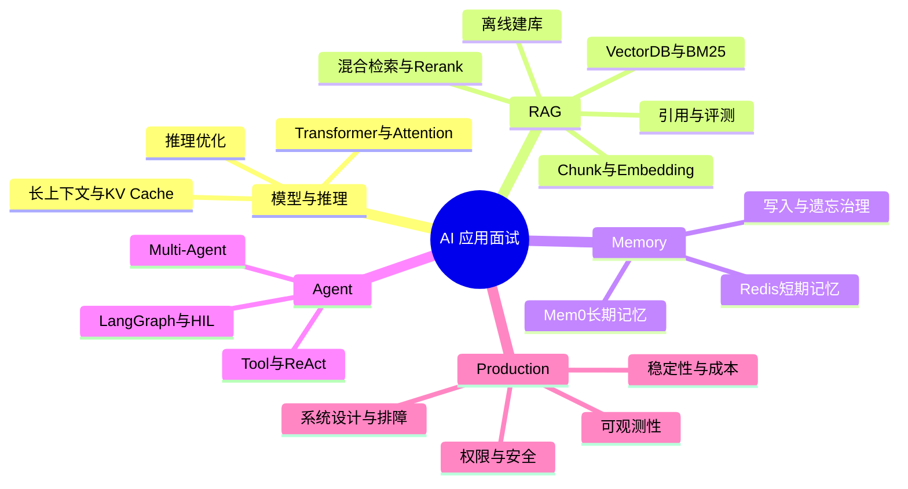

# 01 - AI 大模型应用面试题：170 题学习与验收路线

# 一、学习目标

这组题不是名词解释集合，而是覆盖模型、RAG、Memory、Agent 与生产工程的 170 道问答。学完后应能先独立回答和画链路，再用正文答案检查是否遗漏原理、实现、取舍、指标与故障处理。第 101～170 题来自《AI 应用开发面试题》清单的去重与纠错结果，不重复制造“换标题的同一道题”。

# 二、知识地图

# 三、阅读顺序

1. 01–05：RAG 架构、解析分块、Embedding、VectorDB、ES/BM25、Rerank 与评测。
2. 06：Redis 短期记忆、Mem0 长期记忆和记忆治理。
3. 07–08：Tool Use、ReAct、Multi-Agent、LangGraph 与人工介入。
4. 09–10：生产安全、可观测性、系统设计和坏案例排障。
5. 11–12：模型底层、训练机制、长上下文、KV Cache 与推理优化。
6. 13–14：Context/Prompt/Harness、Skill/MCP 与 RAG 进阶数据工程。
7. 15–17：Agent 架构选型、可靠性评测、Multi-Agent 与岗位准备。

# 四、工程题答题框架

遇到“如何设计/优化/排障”时，按以下顺序组织答案：

1. **目标与边界**：用户是谁、数据是否敏感、SLO 和成本约束是什么。
2. **数据流与契约**：输入、状态、索引、模型、工具与输出怎样传递，关键字段是什么。
3. **方案与取舍**：为什么选当前方案，替代方案何时更合适。
4. **异常与降级**：超时、空召回、模型失败、越权和重复执行如何处理。
5. **指标与验证**：用哪些离线集、在线指标、压测和故障演练证明有效。

例如回答“如何优化 RAG”不能只说换 Embedding。应先区分解析失败、权限误过滤、召回缺失、排序错误、上下文截断和生成幻觉，再给对应指标与修改点。

# 五、答案质量标准

合格答案至少包含 Why、How、What：为什么需要、核心实现、最终效果与风险。框架类问题不能只背 API，要能解释底层数据流；选型题不能只报产品名，要给数据规模、过滤能力、延迟、运维和成本条件；安全题必须覆盖身份、资源权限、输入输出和审计。

以下回答应判定不合格：

- “使用向量数据库提升准确率”：没有说明召回目标、过滤和评测。
- “加重试保证稳定性”：没有区分可重试错误、幂等和重试风暴。
- “Multi-Agent 适合复杂任务”：没有说明拆分边界、共享状态和额外成本。
- “使用缓存降低费用”：没有说明缓存键、权限、时效和失效策略。

# 六、训练方法

每个专题先挑一道系统题画图，再挑一道实现题写伪代码或关键 Query，最后挑一道故障题按证据链排查。口述控制在 2–5 分钟：先给结论，再展开链路、权衡和指标。

建立错题记录时不要抄整段答案，只记三类缺口：不知道的原理、说不清的数据流、没有量化证据的项目经验。下一轮复习只重答这些缺口，并把答案映射回实际项目中的 Trace、压测、评测集或事故复盘。

# 七、验收方式

- 每题不看答案先画链路，能在 30 秒内给出结论和边界。
- 每个专题至少完成一题可运行代码、Query DSL 或架构图。
- 系统设计题必须包含权限、版本、降级、回滚、监控和成本。
- 排障题先定位失败层，再提出修改；不允许用“换更大模型”代替根因分析。
- 随机抽取 20 题，答案中的关键结论、指标和项目证据能够被追问两层。

# 八、总结

面试准备的目标不是记住 170 段文本，而是建立稳定的工程推理框架：能画清链路、说明取舍、定位失败，并用数据证明方案有效。
