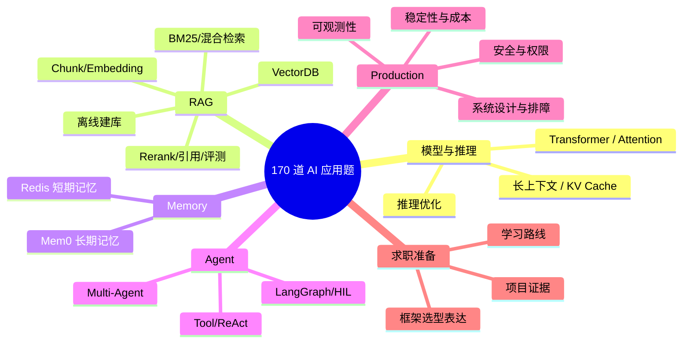

# 01 - AI 大模型应用面试题：170 题学习与验收路线

> 主分类：AI 大模型应用面试题；关联标签：工程基础、企业级知识库、Agent 工程、LangGraph、Evaluation

这组题不是名词解释集合，而是按真实工程链路组织的 170 道问答。推荐先独立回答，再用文中答案检查是否覆盖原理、实现、取舍、指标和故障处理。第 101～170 题由桌面《AI 应用开发面试题》清单去重、纠错后补充，不重复制造“换标题的同一道题”。

> DIAGRAM_DESCRIPTION：思维导图必须覆盖 RAG 离线与在线链路、分块与 Embedding、VectorDB、BM25 混合检索、Memory、Agent、LangGraph、权限、评测、稳定性、成本和排障。

## 阅读顺序

1. 01–05：RAG 架构、解析分块、Embedding、VectorDB、ES/BM25、Rerank 与评测。
2. 06：Redis 短期记忆、Mem0 长期记忆和记忆治理。
3. 07–08：Tool Use、ReAct、Multi-Agent、LangGraph 与人工介入。
4. 09–10：生产安全、可观测性、系统设计和坏案例排障。
5. 11–12：模型底层、训练机制、长上下文、KV Cache 与推理优化。
6. 13–14：Context/Prompt/Harness、Skill/MCP 与 RAG 进阶数据工程。
7. 15–17：Agent 架构选型、可靠性评测、Multi-Agent 与岗位准备。

## 答题标准

一个合格答案至少包含：为什么需要、核心链路、关键数据契约、可量化指标、常见失败和取舍。涉及系统设计时先说权限与数据边界，再说模型和框架；涉及优化时先定位证据在哪一层丢失，再修改对应层。

## 验收方式

- 每题用 2–5 分钟口述，不看答案先画链路。
- 每个专题至少选择一题写可运行代码或 Query DSL。
- 系统设计题必须给出降级、回滚、成本和安全方案。
- 错题回到对应主线文章补知识，不重复背标准句。
