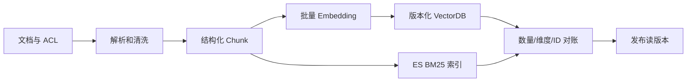

# RAG（03） - RAG 离线建库：解析、切分、向量化与索引

> 读完你能：围绕“RAG 离线建库：解析、切分、向量化与索引”理解“每一步保存什么”与“可执行示例”，并结合正文示例完成实践与排障。


RAG 的离线链路负责把原始资料变成可检索索引，它不应该出现在每次问答请求里。稳定的顺序是：**加载文档 → 清洗 → 切分 Chunk
→ 补充 Metadata → 计算 Embedding → 写入索引**。




# 一、每一步保存什么

| 阶段     | 核心产物              | 关键检查                   |
| -------- | --------------------- | -------------------------- |
| 解析     | 正文、标题、页码      | 是否丢表格、代码和层级     |
| 切分     | 可独立理解的 Chunk    | 是否在句子或函数中间断开   |
| Metadata | 来源、版本、权限      | 能否定位证据并做权限过滤   |
| 向量化   | 固定维度向量          | 文档与查询是否使用同一模型 |
| 索引     | Chunk、向量、Metadata | 新增、更新、删除能否同步   |

生产系统通常使用 Embedding 服务和 Milvus、Elasticsearch 或 pgvector。下面的纯 Python 示例用稳定哈希向量替代真实 Embedding，只用于跑通数据契约；它不是语义模型。

# 二、可执行示例

把代码保存为 `build_index.py` 后执行 `python build_index.py`，会生成下一课可直接读取的
`rag-index.json`。

```text
# requirements.txt
# 本教学脚本仅使用 Python 3.10+ 标准库，无第三方依赖。
```

```python
import hashlib
import json
import math
import re
from pathlib import Path

# 哈希向量的固定维度；生产环境应替换为真实 Embedding 的输出维度。
VECTOR_DIMENSION = 64
# 每个 Chunk 允许的最大字符数。
CHUNK_SIZE = 48
# 索引输出文件位置。
INDEX_PATH = Path("rag-index.json")
# 用于演示离线建库的原始文档。
DOCUMENTS = [
    {"source": "refund.md", "text": "耳机签收后七天内，商品完好且配件齐全可以申请退款。"},
    {"source": "shipping.md", "text": "退款审核通过后，款项通常在三个工作日内原路退回。"},
]


def tokenize(text: str) -> list[str]:
    """把中英文文本转换为稳定的检索词元。"""
    # 文本中的英文单词和单个中文字符。
    tokens = re.findall(r"[a-z0-9]+|[\u4e00-\u9fff]", text.lower())
    return tokens


def embed(text: str) -> list[float]:
    """生成可复现的教学向量，生产环境应调用真实 Embedding 模型。"""
    # 当前文本累加得到的稀疏哈希向量。
    vector = [0.0] * VECTOR_DIMENSION
    for token in tokenize(text):
        # 词元的稳定哈希值，用于决定向量位置。
        token_hash = int(hashlib.sha256(token.encode("utf-8")).hexdigest(), 16)
        vector[token_hash % VECTOR_DIMENSION] += 1.0

    # 向量的 L2 范数，用于归一化后直接计算余弦相似度。
    norm = math.sqrt(sum(value * value for value in vector)) or 1.0
    return [value / norm for value in vector]


def split_text(text: str) -> list[str]:
    """按固定上限切分文本，真实项目应优先保留标题和语义边界。"""
    # 按中文句号得到的非空句子。
    sentences = [sentence.strip() for sentence in text.split("。") if sentence.strip()]
    return [sentence[:CHUNK_SIZE] for sentence in sentences]


# 最终写入磁盘的 Chunk 索引记录。
index_records = []
for document in DOCUMENTS:
    for chunk_index, chunk_text in enumerate(split_text(document["text"]), start=1):
        # 同时保存证据、来源和向量，在线链路不再重复解析文档。
        index_records.append({
            "id": f"{document['source']}#{chunk_index}",
            "source": document["source"],
            "text": chunk_text,
            "vector": embed(chunk_text),
        })

INDEX_PATH.write_text(json.dumps(index_records, ensure_ascii=False, indent=2), encoding="utf-8")
print(f"已写入 {len(index_records)} 个 Chunk：{INDEX_PATH}")
```

# 三、生产化检查

- 文档更新时按稳定 `document_id` 删除旧 Chunk，再写入新版本。
- 权限字段必须在入库时保存，检索前过滤，不能生成答案后再隐藏。
- 更换 Embedding 模型或维度时重建索引，不能混用新旧向量。
- 保存来源和页码，在线答案才能给出可核验引用。
- Embedding 选型用真实问题集比较 Recall@K、语言覆盖、最大长度、吞吐、维度、私有化能力和单 Chunk 成本。
- FAISS 适合单机验证，pgvector 适合数据规模可控且希望复用 PostgreSQL，Milvus 适合独立的大规模向量服务，Elasticsearch 适合统一混合检索；最终以过滤能力、运维能力和压测结果决定。

# 五、总结

- **每一步保存什么**：生产系统通常使用 Embedding 服务和 Milvus、Elasticsearch 或 pgvector。
- **可执行示例**：把代码保存为 buildindex.py 后执行 python buildindex.py，会生成下一课可直接读取的
- **生产化检查**：文档更新时按稳定 documentid 删除旧 Chunk，再写入新版本。

## 参考资料

- [LangChain Retrieval](https://docs.langchain.com/oss/python/langchain/retrieval)
- [Milvus 文档](https://milvus.io/docs)
