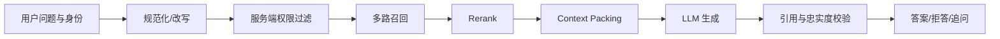

# RAG（04） - RAG 在线问答：检索、组装证据与生成

> 读完你能：围绕“RAG 在线问答：检索、组装证据与生成”理解“检索和生成要分开验收”与“可执行示例”，并结合正文示例完成实践与排障。


在线链路只处理当前请求：**理解问题 → 查询改写 → 权限过滤 → 召回 → 重排 → 组装 Context
→ 模型生成 → 引用校验**。它读取离线索引，但不重新解析和向量化全部文档。




# 一、检索和生成要分开验收

检索阶段先回答“正确证据有没有进入 Top
K”，生成阶段再回答“答案是否忠于证据”。如果证据没召回，调整 Prompt 通常无效；如果证据正确而答案编造，才应检查生成规则和模型。

# 二、可执行示例

先运行上一课生成 `rag-index.json`，再把下面代码保存为 `ask_index.py`，执行
`python ask_index.py "耳机多久可以退款"`。示例会输出 Top
2 证据和可直接交给模型的 Prompt，不依赖第三方包或 API Key。

```text
# requirements.txt
# 本教学脚本仅使用 Python 3.10+ 标准库，无第三方依赖。
```

```python
import hashlib
import json
import math
import re
import sys
from pathlib import Path

# 必须与离线索引保持一致的向量维度。
VECTOR_DIMENSION = 64
# 在线召回保留的证据数量。
TOP_K = 2
# 离线链路生成的索引文件。
INDEX_PATH = Path("rag-index.json")


def tokenize(text: str) -> list[str]:
    """使用与离线链路相同的规则切分查询。"""
    # 查询中的英文单词和单个中文字符。
    tokens = re.findall(r"[a-z0-9]+|[\u4e00-\u9fff]", text.lower())
    return tokens


def embed(text: str) -> list[float]:
    """生成与离线索引兼容的教学查询向量。"""
    # 查询累加得到的哈希向量。
    vector = [0.0] * VECTOR_DIMENSION
    for token in tokenize(text):
        # 词元的稳定哈希值。
        token_hash = int(hashlib.sha256(token.encode("utf-8")).hexdigest(), 16)
        vector[token_hash % VECTOR_DIMENSION] += 1.0

    # 查询向量的 L2 范数。
    norm = math.sqrt(sum(value * value for value in vector)) or 1.0
    return [value / norm for value in vector]


def cosine(left_vector: list[float], right_vector: list[float]) -> float:
    """计算两个已归一化向量的余弦相似度。"""
    return sum(left * right for left, right in zip(left_vector, right_vector, strict=True))


# 命令行传入的用户问题。
question = " ".join(sys.argv[1:]).strip() or "耳机多久可以退款"
# 从离线文件读取的全部索引记录。
index_records = json.loads(INDEX_PATH.read_text(encoding="utf-8"))
# 当前问题对应的查询向量。
query_vector = embed(question)
# 按相似度从高到低排列的候选证据。
ranked_records = sorted(
    index_records,
    key=lambda record: cosine(query_vector, record["vector"]),
    reverse=True,
)[:TOP_K]
# 带来源标记的上下文，方便模型输出引用。
context = "\n".join(f"[{record['id']}] {record['text']}" for record in ranked_records)
# 交给模型的最小问答提示词；证据不足时明确要求拒答。
prompt = f"""仅根据证据回答问题；证据不足就回答无法确认，并引用证据编号。

证据：
{context}

问题：{question}
"""

print(prompt)
```

# 三、在线链路的关键保护

- 在召回前应用租户、用户和文档权限过滤。
- Prompt 中把检索内容视为资料，不允许其中的指令覆盖系统规则。
- 保存 Query、候选、最终证据和引用，才能定位召回还是生成故障。
- 设置最低相关性阈值，证据不足时拒答或追问，不要强行生成。
- 对召回、Rerank、生成分别设置超时与降级；ES 或 VectorDB 单路失败时允许降级，但两路都无可信证据必须拒答。
- Trace 记录索引、Embedding、Rerank 和 Prompt 版本，并按租户脱敏，避免无法复现坏案例或泄露正文。

# 五、总结

- **在线链路的关键保护**：在召回前应用租户、用户和文档权限过滤。
- **检索和生成要分开验收**：检索阶段先回答“正确证据有没有进入 Top
- **可执行示例**：先运行上一课生成 rag-index.json，再把下面代码保存为 askindex.py，执行

## 参考资料

- [LangChain Retrieval](https://docs.langchain.com/oss/python/langchain/retrieval)
- [Milvus 文档](https://milvus.io/docs)
