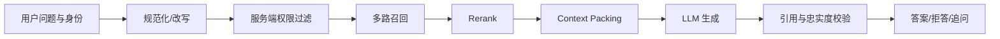

# RAG（04） - RAG 在线问答：检索、组装证据与生成

> 读完后，你应能解释“一、检索和生成要分开验收”，复现“二、可执行示例”的最小实现，并用“requirements.txt”检查结果与失败边界。


在线链路只处理当前请求：**理解问题 → 查询改写 → 权限过滤 → 召回 → 重排 → 组装 Context
→ 模型生成 → 引用校验**。它读取离线索引，但不重新解析和向量化全部文档。




# 一、检索和生成要分开验收

检索阶段先回答“正确证据有没有进入 Top
K”，生成阶段再回答“答案是否忠于证据”。如果证据没召回，调整 Prompt 通常无效；如果证据正确而答案编造，才应检查生成规则和模型。

# 二、可执行示例

先运行上一课生成 `rag-index.json`，再把下面代码保存为 `ask_index.py`，执行
`python ask_index.py "耳机多久可以退款"`。示例会输出 Top
2 证据和可直接交给模型的 Prompt，不依赖第三方包或 API Key。

```text
# requirements.txt
# 本教学脚本仅使用 Python 3.10+ 标准库，无第三方依赖。
```

```python
import hashlib
import json
import math
import re
import sys
from pathlib import Path

# 必须与离线索引保持一致的向量维度。
VECTOR_DIMENSION = 64
# 在线召回保留的证据数量。
TOP_K = 2
# 离线链路生成的索引文件。
INDEX_PATH = Path("rag-index.json")


def tokenize(text: str) -> list[str]:
    """使用与离线链路相同的规则切分查询。"""
    # 查询中的英文单词和单个中文字符。
    tokens = re.findall(r"[a-z0-9]+|[\u4e00-\u9fff]", text.lower())
    return tokens


def embed(text: str) -> list[float]:
    """生成与离线索引兼容的教学查询向量。"""
    # 查询累加得到的哈希向量。
    vector = [0.0] * VECTOR_DIMENSION
    for token in tokenize(text):
        # 词元的稳定哈希值。
        token_hash = int(hashlib.sha256(token.encode("utf-8")).hexdigest(), 16)
        vector[token_hash % VECTOR_DIMENSION] += 1.0

    # 查询向量的 L2 范数。
    norm = math.sqrt(sum(value * value for value in vector)) or 1.0
    return [value / norm for value in vector]


def cosine(left_vector: list[float], right_vector: list[float]) -> float:
    """计算两个已归一化向量的余弦相似度。"""
    return sum(left * right for left, right in zip(left_vector, right_vector, strict=True))


# 命令行传入的用户问题。
question = " ".join(sys.argv[1:]).strip() or "耳机多久可以退款"
# 从离线文件读取的全部索引记录。
index_records = json.loads(INDEX_PATH.read_text(encoding="utf-8"))
# 当前问题对应的查询向量。
query_vector = embed(question)
# 按相似度从高到低排列的候选证据。
ranked_records = sorted(
    index_records,
    key=lambda record: cosine(query_vector, record["vector"]),
    reverse=True,
)[:TOP_K]
# 带来源标记的上下文，方便模型输出引用。
context = "\n".join(f"[{record['id']}] {record['text']}" for record in ranked_records)
# 交给模型的最小问答提示词；证据不足时明确要求拒答。
prompt = f"""仅根据证据回答问题；证据不足就回答无法确认，并引用证据编号。

证据：
{context}

问题：{question}
"""

print(prompt)
```

# 三、在线链路的关键保护

- 在召回前应用租户、用户和文档权限过滤。
- Prompt 中把检索内容视为资料，不允许其中的指令覆盖系统规则。
- 保存 Query、候选、最终证据和引用，才能定位召回还是生成故障。
- 设置最低相关性阈值，证据不足时拒答或追问，不要强行生成。
- 对召回、Rerank、生成分别设置超时与降级；ES 或 VectorDB 单路失败时允许降级，但两路都无可信证据必须拒答。
- Trace 记录索引、Embedding、Rerank 和 Prompt 版本，并按租户脱敏，避免无法复现坏案例或泄露正文。

# 五、总结

- **在线链路的关键保护**：在召回前应用租户、用户和文档权限过滤。
- **检索和生成要分开验收**：检索阶段先回答“正确证据有没有进入 Top
- **可执行示例**：先运行上一课生成 rag-index.json，再把下面代码保存为 askindex.py，执行

## 参考资料

- [LangChain Retrieval](https://docs.langchain.com/oss/python/langchain/retrieval)
- [Milvus 文档](https://milvus.io/docs)

<!-- knowledge-scenario-inlined:AA-10 -->

## 可运行实验：Multi-Query、Rewrite 与 HyDE

调整参数并注入失败，重点对比正常路径、保护条件和失败诊断；运行源码与文章保存在同一个 Markdown 文件。

```html runnable file=index.html title="Multi-Query、Rewrite 与 HyDE" description="调整参数并对比正常路径与典型失败路径"
<!doctype html>
<html lang="zh-CN">
<head>
  <meta charset="utf-8">
  <meta name="viewport" content="width=device-width,initial-scale=1">
  <title>AA-10 在线实验</title>
  <style>
    :root{color-scheme:dark;font-family:Inter,system-ui,sans-serif}*{box-sizing:border-box}body{margin:0;background:#0f1211;color:#e7ece9;font-size:13px}.shell{padding:16px}.top{display:flex;justify-content:space-between;gap:16px;margin-bottom:14px}h1{margin:3px 0;font-size:18px}.id,.value{color:#68e0b5;font-family:ui-monospace,monospace}.summary{margin:4px 0;color:#a5afa9}.run{border:0;border-radius:6px;background:#68e0b5;color:#07110d;padding:8px 14px;font-weight:700}.grid{display:grid;grid-template-columns:minmax(220px,.8fr) minmax(0,1.8fr);gap:12px}.panel{border:1px solid #29322e;background:#141817;padding:12px}.control{display:grid;gap:5px;margin-bottom:11px}.head{display:flex;justify-content:space-between;gap:8px}select,input{width:100%;accent-color:#68e0b5;background:#0d100f;color:#e7ece9}.toggle{display:flex;justify-content:space-between;border-top:1px solid #29322e;padding-top:9px}.toggle input{width:18px}.metrics{display:grid;grid-template-columns:repeat(4,minmax(0,1fr));gap:7px}.metric{border:1px solid #29322e;padding:8px}.metric b{display:block;color:#68e0b5;font-size:16px}.stages{display:flex;gap:6px;overflow:auto;margin:10px 0}.stage{border:1px solid #8a6230;padding:7px;min-width:90px}.stage.ok{border-color:#367a61}.stage.fail{border-color:#8b4545}table{width:100%;border-collapse:collapse}td{border-top:1px solid #29322e;padding:7px}.diagnosis{margin-top:9px;border-left:3px solid #68e0b5;background:#101412;padding:9px;line-height:1.5}.danger{border-color:#ef7f7f}@media(max-width:680px){.top,.grid{display:grid;grid-template-columns:1fr}.metrics{grid-template-columns:repeat(2,1fr)}}
  </style>
</head>
<body>
  <main class="shell">
    <header class="top"><div><div class="id">AA-10 · DETERMINISTIC LAB</div><h1 id="title"></h1><p class="summary" id="summary"></p></div><button class="run" id="run">运行实验</button></header>
    <section class="grid"><div class="panel"><div id="controls"></div><label class="toggle"><span>注入典型故障</span><input id="failure" type="checkbox"></label></div><div class="panel"><div class="metrics" id="metrics"></div><div class="stages" id="stages"></div><table><tbody id="rows"></tbody></table><div class="diagnosis" id="diagnosis"></div></div></section>
  </main>
  <script>
    const scenario = { title: 'Multi-Query、Rewrite 与 HyDE', summary: '比较原始 Query、多查询、改写和假设文档检索的召回与去重。', controls: [
    { key: 'strategy', label: '查询策略', type: 'select', value: 'multi', options: [['raw', '原始 Query'], ['rewrite', 'Query Rewrite'], ['multi', 'Multi-Query'], ['hyde', 'HyDE']] },
    { key: 'variants', label: '生成查询数', type: 'range', min: 1, max: 8, value: 4, suffix: ' 条' },
    { key: 'dedupe', label: '候选去重', type: 'select', value: 'id', options: [['none', '不去重'], ['id', '按 Chunk ID'], ['semantic', '按语义相似度']] }
  ] };
    const controls = document.querySelector('#controls');
    const failure = document.querySelector('#failure');
    document.querySelector('#title').textContent = scenario.title;
    document.querySelector('#summary').textContent = scenario.summary;
    function renderControl(control) {
      const label = document.createElement('label'); label.className = 'control';
      const head = document.createElement('span'); head.className = 'head'; head.innerHTML = '<span>' + control.label + '</span><span class="value" data-value="' + control.key + '"></span>'; label.appendChild(head);
      const input = document.createElement(control.type === 'select' ? 'select' : 'input'); input.dataset.key = control.key;
      if (control.type === 'select') control.options.forEach(option => { const item = document.createElement('option'); item.value = option[0]; item.textContent = option[1]; item.selected = option[0] === control.value; input.appendChild(item); });
      else { input.type = 'range'; input.min = control.min; input.max = control.max; input.step = control.step || 1; input.value = control.value; }
      input.addEventListener('input', updateValues); label.appendChild(input); return label;
    }
    function updateValues() { scenario.controls.forEach(control => { const input = controls.querySelector('[data-key="' + control.key + '"]'); document.querySelector('[data-value="' + control.key + '"]').textContent = control.type === 'select' ? input.options[input.selectedIndex].text : input.value + (control.suffix || ''); }); }
    function readValues() { const values = {}; scenario.controls.forEach(control => { const input = controls.querySelector('[data-key="' + control.key + '"]'); values[control.key] = control.type === 'range' ? Number(input.value) : input.value; }); values.failure = failure.checked; return values; }
    function stage(name, state, detail) { return { name, state, detail }; }
    const aiStage = stage;
    function clamp(value, minimum, maximum) { return Math.min(maximum, Math.max(minimum, value)); }
    function simulate(values) { const fail = values.failure;
      /** 不同查询策略的基础召回分。 */
      const baseRecall = { raw: 62, rewrite: 74, multi: 86, hyde: 82 }[values.strategy];
      /** 查询变体带来的候选总数。 */
      const rawCandidates = values.variants * 8;
      /** 去重策略减少后的候选数。 */
      const candidates = values.dedupe === 'none' ? rawCandidates : values.dedupe === 'id' ? Math.round(rawCandidates * 0.72) : Math.round(rawCandidates * 0.58);
      /** 变体数量和故障对召回率的修正。 */
      const recall = clamp(baseRecall + Math.min(values.variants, 4) * 2 - (fail ? 18 : 0), 0, 98);
      return { metrics: [[values.variants, '查询变体'], [rawCandidates, '原始候选'], [candidates, '去重候选'], [recall + '%', '估算 Recall']], stages: [aiStage('理解意图', fail ? 'fail' : 'ok', values.strategy), aiStage('生成查询', 'ok', values.variants), aiStage('并行召回', 'ok', rawCandidates), aiStage('候选去重', values.dedupe === 'none' ? 'warn' : 'ok', candidates), aiStage('覆盖检查', recall >= 80 ? 'ok' : 'warn', recall + '%')], rows: [['策略差异', values.strategy === 'hyde' ? '先生成假设答案再检索，可能放大模型偏见' : values.strategy === 'multi' ? '从同义词、业务实体和时间条件扩展查询' : '只改写或直接使用原问题'], ['去重键', values.dedupe === 'id' ? '同一 Chunk ID 只保留一次' : values.dedupe === 'semantic' ? '相近候选聚类，保留最高分证据' : '重复证据会浪费 Rerank 预算'], ['故障注入', fail ? '改写丢失“3 天未到账”时间约束' : '关键实体和约束均保留']], diagnosis: recall >= 80 && values.dedupe !== 'none' && !fail ? '查询扩展提高覆盖率，候选去重控制了后续成本。' : '需要修复意图保持或候选去重。', danger: fail };
     }
    function render() { const result = simulate(readValues()); document.querySelector('#metrics').innerHTML = result.metrics.map(item => '<div class="metric"><b>' + item[0] + '</b><span>' + item[1] + '</span></div>').join(''); document.querySelector('#stages').innerHTML = result.stages.map(item => '<div class="stage ' + item.state + '"><b>' + item.name + '</b><div>' + item.detail + '</div></div>').join(''); document.querySelector('#rows').innerHTML = result.rows.map(item => '<tr><td>' + item[0] + '</td><td>' + item[1] + '</td></tr>').join(''); const diagnosis = document.querySelector('#diagnosis'); diagnosis.textContent = result.diagnosis; diagnosis.className = 'diagnosis' + (result.danger ? ' danger' : ''); }
    scenario.controls.forEach(control => controls.appendChild(renderControl(control))); updateValues(); document.querySelector('#run').addEventListener('click', render); render();
  </script>
</body>
</html>
```
