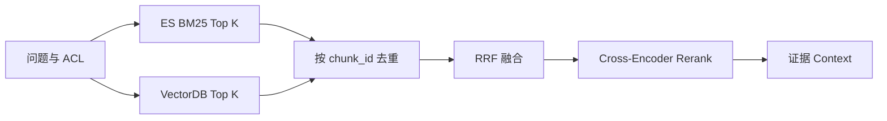

# 企业级知识库（8）- 混合检索与 RRF：融合关键词和语义召回

> 读完你能：围绕“混合检索与 RRF：融合关键词和语义召回”理解“RRF 怎么计算”与“可执行示例”，并结合正文示例完成实践与排障。


BM25 擅长产品型号、错误码和专有名词，向量检索擅长同义表达和自然语言意图。企业知识库通常同时召回两路结果，再用
**RRF（Reciprocal Rank Fusion）** 按名次融合，而不是直接相加两种不可比较的原始分数。




# 一、RRF 怎么计算

一篇文档在某路排名为 `rank` 时，贡献分数为
`1 / (k + rank)`。同一文档在多路都靠前，融合分数就更高。常量 `k`
用于降低头部名次差距，常见起点是 60，但最终应根据评测集调参。

# 二、可执行示例

下面示例只保留混合检索的核心：一路按精确词元重合排序，一路按教学向量排序，最后用 RRF 融合。保存为
`hybrid_search.py` 后直接执行 `python hybrid_search.py`。

```text
# requirements.txt
# 本教学脚本仅使用 Python 3.10+ 标准库，无第三方依赖。
```

```python
import hashlib
import math
import re

# 教学向量的固定维度。
VECTOR_DIMENSION = 64
# 每一路进入融合的候选数量。
CANDIDATE_LIMIT = 3
# RRF 的排名平滑常量。
RRF_K = 60
# 演示混合检索的文档集合。
DOCUMENTS = {
    "doc-1": "错误码 E401 表示访问令牌已经失效",
    "doc-2": "登录凭证过期后需要重新获取令牌",
    "doc-3": "退款审核通常需要三个工作日",
}
# 教学用同义表达映射，用于模拟语义模型能识别的近义关系。
SEMANTIC_ALIASES = {
    "登录凭证": "令牌",
    "失效": "过期",
    "无法认证": "重新获取令牌",
}


def tokenize(text: str) -> list[str]:
    """提取英文词、编号和中文双字词元。"""
    # 小写化后的英文词和编号。
    latin_tokens = re.findall(r"[a-z]+\d*|\d+", text.lower())
    # 去掉标点后的连续中文字符。
    chinese_text = "".join(re.findall(r"[\u4e00-\u9fff]", text))
    # 用相邻双字保留更多中文词义。
    chinese_tokens = [chinese_text[index:index + 2] for index in range(max(0, len(chinese_text) - 1))]
    return latin_tokens + chinese_tokens


def embed(text: str) -> list[float]:
    """生成可复现的教学向量，生产环境应换成真实 Embedding。"""
    # 使用少量显式同义词模拟真实模型的语义归一化能力。
    normalized_text = text
    for source_text, target_text in SEMANTIC_ALIASES.items():
        normalized_text = normalized_text.replace(source_text, target_text)

    # 文本对应的哈希向量。
    vector = [0.0] * VECTOR_DIMENSION
    for token in tokenize(normalized_text):
        # 词元的稳定哈希值。
        token_hash = int(hashlib.sha256(token.encode("utf-8")).hexdigest(), 16)
        vector[token_hash % VECTOR_DIMENSION] += 1.0

    # 向量归一化所需的 L2 范数。
    norm = math.sqrt(sum(value * value for value in vector)) or 1.0
    return [value / norm for value in vector]


def lexical_score(query: str, document: str) -> float:
    """计算查询词元在文档中的重合数，演示稀疏召回职责。"""
    # 去重后的查询词元。
    query_tokens = set(tokenize(query))
    # 去重后的文档词元。
    document_tokens = set(tokenize(document))
    return float(len(query_tokens & document_tokens))


def vector_score(query: str, document: str) -> float:
    """计算查询与文档教学向量的余弦相似度。"""
    # 当前查询对应的归一化向量。
    query_vector = embed(query)
    # 当前文档对应的归一化向量。
    document_vector = embed(document)
    return sum(left * right for left, right in zip(query_vector, document_vector, strict=True))


def rank_documents(query: str, score_function) -> list[str]:
    """使用指定评分函数返回一条召回链的文档排名。"""
    # 当前召回链按得分降序排列的文档编号。
    ranked_ids = sorted(
        DOCUMENTS,
        key=lambda document_id: score_function(query, DOCUMENTS[document_id]),
        reverse=True,
    )
    return ranked_ids[:CANDIDATE_LIMIT]


def reciprocal_rank_fusion(rankings: list[list[str]]) -> list[tuple[str, float]]:
    """使用 RRF 融合多条只包含名次的召回结果。"""
    # 每篇候选文档累加后的 RRF 分数。
    fused_scores: dict[str, float] = {}
    for ranking in rankings:
        for rank, document_id in enumerate(ranking, start=1):
            fused_scores[document_id] = fused_scores.get(document_id, 0.0) + 1 / (RRF_K + rank)

    return sorted(fused_scores.items(), key=lambda item: item[1], reverse=True)


# 同时包含错误码和自然语言意图的用户查询。
query = "E401 无法认证怎么办"
# 关键词召回结果，生产环境通常由 Elasticsearch BM25 提供。
lexical_ranking = rank_documents(query, lexical_score)
# 向量召回结果，生产环境通常由向量数据库提供。
vector_ranking = rank_documents(query, vector_score)
# 两路排名通过 RRF 得到的最终顺序。
fused_ranking = reciprocal_rank_fusion([lexical_ranking, vector_ranking])

print("关键词召回：", lexical_ranking)
print("向量召回：", vector_ranking)
print("RRF 融合：", fused_ranking)
```

这个脚本中的“关键词重合”和“哈希向量”只为零依赖演示数据流。生产环境应替换成 BM25 和真实 Embedding，但 RRF 输入仍然只是两组文档排名。

# 三、调优顺序

1. 先用标注问题集分别评估关键词和向量召回的 Recall@K。
2. 确认两路有互补结果，再调候选数量和 RRF 常量。
3. 融合后候选仍多时增加 Cross-Encoder Rerank。
4. 最后评估答案忠实度，不能用生成效果掩盖检索缺陷。
5. 分别记录每路贡献率、零结果率和 P95；某一路长期没有增益，应删除该复杂度和成本。
6. 缓存键必须包含租户、权限摘要、查询规范化版本和索引版本，避免跨权限复用候选。

# 五、总结

- **RRF 怎么计算**：一篇文档在某路排名为 rank 时，贡献分数为
- **可执行示例**：下面示例只保留混合检索的核心：一路按精确词元重合排序，一路按教学向量排序，最后用 RRF 融合。
- **调优顺序**：先用标注问题集分别评估关键词和向量召回的 Recall@K。

## 参考资料

- [LangChain Retrieval](https://docs.langchain.com/oss/python/langchain/retrieval)
- [Milvus 文档](https://milvus.io/docs)
