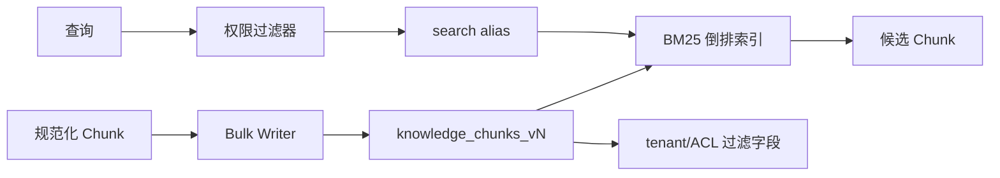

# RAG（06） - Elasticsearch 知识库索引：BM25、权限与零停机发布

## 核心知识清单

- BM25 正文检索与 exact_terms 精确过滤
- tenant_id、ACL 与检索前权限过滤
- document_id、chunk_id、source 与 version
- Alias、索引版本与零停机切换
- 更新、删除与缓存失效
- Recall@K、P95 延迟与分词回归

> 读完后，你应能解释“BM25 正文检索与 exactterms 精确过滤”，复现“tenantid、ACL 与检索前权限过滤”的最小实现，并用“documentid、chunkid、source 与 version”检查结果与失败边界。


Elasticsearch 在 RAG 中负责错误码、产品型号、专有名词和短语匹配。它不是向量库的“备用方案”，而是多路召回中的独立证据源。生产索引必须同时解决字段语义、权限过滤、版本发布和删除传播。




## 一、先定义索引契约

```http
PUT /knowledge_chunks_v1
{
  "settings": {
    "number_of_shards": 1,
    "number_of_replicas": 1,
    "analysis": {
      "analyzer": {
        "knowledge_zh": {
          "type": "custom",
          "tokenizer": "standard",
          "filter": ["lowercase"]
        }
      }
    }
  },
  "mappings": {
    "dynamic": "strict",
    "properties": {
      "chunk_id": {"type": "keyword"},
      "document_id": {"type": "keyword"},
      "document_version": {"type": "keyword"},
      "tenant_id": {"type": "keyword"},
      "acl_groups": {"type": "keyword"},
      "title": {"type": "text", "analyzer": "knowledge_zh", "fields": {"raw": {"type": "keyword"}}},
      "content": {"type": "text", "analyzer": "knowledge_zh"},
      "source_uri": {"type": "keyword", "index": false},
      "updated_at": {"type": "date"}
    }
  }
}
```

`dynamic: strict` 会让未知字段直接失败，避免拼错权限字段却静默入库。`source_uri` 只用于引用回跳，不参与检索。分片数按数据规模与节点数压测决定，不要照抄固定值。

建立读写别名：

```http
POST /_aliases
{
  "actions": [
    {"add": {"index": "knowledge_chunks_v1", "alias": "knowledge_chunks_read"}},
    {"add": {"index": "knowledge_chunks_v1", "alias": "knowledge_chunks_write", "is_write_index": true}}
  ]
}
```

## 二、带权限的 BM25 查询

```text
# requirements.txt
elasticsearch>=8,<10
```

```python
from __future__ import annotations

import os
from dataclasses import dataclass

from elasticsearch import Elasticsearch


# ES 服务地址由部署环境注入。
ELASTICSEARCH_URL = os.getenv("ELASTICSEARCH_URL", "http://localhost:9200")
# 查询只访问读别名，重建索引时无需修改应用配置。
READ_ALIAS = "knowledge_chunks_read"
# 默认候选数量，最终值应由 Recall@K 与延迟共同确定。
DEFAULT_TOP_K = 20


@dataclass(frozen=True)
class SearchContext:
    """保存服务端鉴权后得到的租户和权限组。"""

    # 当前租户的稳定标识。
    tenant_id: str
    # 用户有权访问的权限组集合。
    acl_groups: tuple[str, ...]


def search_bm25(
    client: Elasticsearch,
    query: str,
    context: SearchContext,
    top_k: int = DEFAULT_TOP_K,
) -> list[dict[str, object]]:
    """执行权限内 BM25 检索；query 是问题，context 是可信权限上下文。"""

    # 查询体把租户和 ACL 放入 filter，过滤条件不参与相关性打分。
    search_body = {
        "size": top_k,
        "_source": ["chunk_id", "document_id", "title", "content", "source_uri"],
        "query": {
            "bool": {
                "must": [
                    {
                        "multi_match": {
                            "query": query,
                            "fields": ["title^2", "content"],
                            "type": "best_fields",
                        }
                    }
                ],
                "filter": [
                    {"term": {"tenant_id": context.tenant_id}},
                    {"terms": {"acl_groups": list(context.acl_groups)}},
                ],
            }
        },
    }
    # 原始命中保留 `_score`，供后续融合和 Trace 分析。
    response = client.search(index=READ_ALIAS, body=search_body)
    return list(response["hits"]["hits"])


# 进程级客户端应复用连接池，示例仅展示创建方式。
es_client = Elasticsearch(ELASTICSEARCH_URL, request_timeout=3)
```

ACL 为空时应按业务语义显式拒绝或只查公开组，不能删除 `terms` 条件后扩大范围。服务端从身份令牌计算 `SearchContext`，不接受模型传入租户和权限组。

## 三、写入、更新与删除

- 使用稳定 `chunk_id` 作为 `_id`，Bulk API 重试不会制造重复数据。
- 文档更新先写新 `document_version`，对账成功后删除旧版本；或者构建完整新索引再切别名。
- 删除事件必须覆盖 ES、VectorDB、缓存和对象存储引用；删除失败进入重试队列。
- 大规模删除避免在线执行无界 `_delete_by_query`，优先索引重建或按路由分批处理。

## 四、稳定性与成本

1. 新 mapping/analyzer 发布：建 `v2` → Bulk 重建 → 分词与召回评测 → 对账 → 原子切换读别名 → 保留短期回滚窗口。
2. 监控 Bulk 拒绝、刷新耗时、查询 P95、段数量、堆内存和权限过滤后候选数。
3. 原文放对象存储，ES 只保存检索所需 Chunk 与引用字段；避免复制大附件。
4. 小规模索引不要过度分片；副本数依据可用性目标和节点数决定。
5. 混合检索先分别测 BM25 与向量 Recall@K，再调融合，不能只看最终回答“似乎不错”。

## 五、验收

同一问题在正确租户能召回目标 Chunk，跨租户零命中；错误码与专有名词命中稳定；新旧索引切换无请求错误；删除文档后所有索引和缓存不可命中；Trace 能记录索引版本、查询耗时、候选 ID 和分数。

## 参考资料

- [LangChain Retrieval](https://docs.langchain.com/oss/python/langchain/retrieval)
- [Milvus 文档](https://milvus.io/docs)
