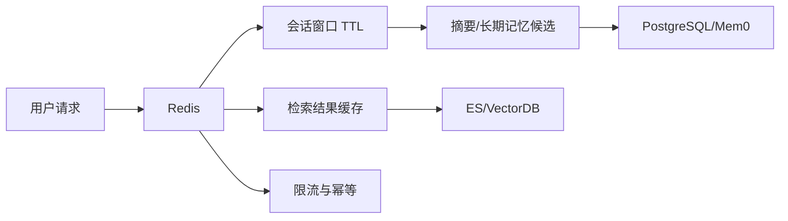

# RAG（09） - Redis 在 AI 系统中的边界：短期记忆、缓存与限流

> 读完你能：围绕“Redis 在 AI 系统中的边界：短期记忆、缓存与限流”理解“数据职责”与“可运行的短期记忆”，并结合正文示例完成实践与排障。


Redis 适合保存有 TTL、可重建、需要低延迟访问的数据，不应成为长期记忆或知识原文的唯一来源。AI 系统最常见的错误是把完整对话无限塞进 List，既失控又无法按权限与版本准确失效。




## 一、数据职责

| 数据 | Redis 结构 | TTL | 关键约束 |
| --- | --- | --- | --- |
| 最近消息窗口 | List/Stream | 会话级 | 限制轮数和总 Token |
| 会话摘要 | String/Hash | 小时或天 | 携带摘要模型版本 |
| 检索缓存 | String | 分钟级 | 键包含权限与索引版本 |
| 限流 | String + 原子脚本 | 秒/分钟 | 按租户、用户、模型分层 |
| 任务幂等 | String `SET NX EX` | 大于任务超时 | 保存幂等 ID，不充当锁续约协议 |

长期偏好、事实记忆和审计记录进入持久化存储；Redis 数据丢失后系统应能继续工作，只是缓存命中率或短期上下文下降。

## 二、可运行的短期记忆

```text
# requirements.txt
redis>=5,<7
pydantic>=2,<3
```

```python
from __future__ import annotations

import json
import os
from hashlib import sha256

from pydantic import BaseModel
from redis import Redis


# Redis 地址从运行环境读取，生产环境使用 TLS 与 Secret。
REDIS_URL = os.getenv("REDIS_URL", "redis://localhost:6379/0")
# 单会话最多保存的消息条数，防止上下文无限增长。
MAX_MESSAGES = 12
# 会话无活动后的过期秒数。
SESSION_TTL_SECONDS = 60 * 60


class ChatMessage(BaseModel):
    """保存一条最小会话消息。"""

    # 消息角色仅由服务端映射为 user 或 assistant。
    role: str
    # 脱敏后的消息正文。
    content: str


def build_session_key(tenant_id: str, user_id: str, session_id: str) -> str:
    """构造租户隔离键；三个参数分别标识租户、用户和会话。"""

    return f"ai:session:{tenant_id}:{user_id}:{session_id}:messages"


def append_message(client: Redis, key: str, message: ChatMessage) -> None:
    """原子追加并裁剪消息；client 是连接，key 是隔离后的会话键。"""

    # 序列化结果只包含声明字段，不写入令牌或权限对象。
    serialized_message = message.model_dump_json()
    # Pipeline 保证追加、裁剪和续期作为一组发送，减少中间状态窗口。
    pipeline = client.pipeline(transaction=True)
    pipeline.rpush(key, serialized_message)
    pipeline.ltrim(key, -MAX_MESSAGES, -1)
    pipeline.expire(key, SESSION_TTL_SECONDS)
    pipeline.execute()


def build_retrieval_cache_key(
    tenant_id: str,
    permission_groups: tuple[str, ...],
    index_version: str,
    query: str,
) -> str:
    """生成检索缓存键；权限、索引版本或问题变化都会产生新键。"""

    # 排序后的权限摘要避免集合顺序变化造成无意义未命中。
    permission_fingerprint = sha256(
        json.dumps(sorted(permission_groups)).encode("utf-8")
    ).hexdigest()[:16]
    # 问题摘要避免把敏感原文直接暴露在 Redis 键中。
    query_fingerprint = sha256(query.encode("utf-8")).hexdigest()[:16]
    return (
        f"ai:retrieval:{tenant_id}:{permission_fingerprint}:"
        f"{index_version}:{query_fingerprint}"
    )


# Redis 客户端启用自动响应解码，便于读取 JSON 字符串。
redis_client = Redis.from_url(REDIS_URL, decode_responses=True)
```

## 三、与 Mem0 的分工

Redis 保存当前会话“刚说过什么”；Mem0 或自建长期记忆层负责从多次会话中抽取、去重、衰减和召回“长期有效事实”。长期记忆写入前应区分用户明确声明、模型推断和临时上下文，敏感信息默认不持久化，并支持查看、纠正和删除。

## 四、生产安全与稳定性

- 使用 ACL 创建最小权限账号，按环境和业务隔离 key prefix；公网不可直连。
- 配置内存上限和符合业务的淘汰策略。幂等键、会话和缓存不要混在无法区分的实例策略里。
- 热点租户设独立限流；大 Value 记录大小分布，避免网络和主线程阻塞。
- 高可用部署仍要演练故障切换；短期记忆丢失时向用户解释上下文已重置。
- Prompt、答案和检索结果可能含隐私，按字段脱敏或只存 ID；日志不输出 Value。

## 五、验收

会话窗口不会超过条数与 Token 上限；TTL 会续期并最终回收；权限或索引版本变化后缓存不复用；跨租户键不可访问；Redis 不可用时系统可降级为无短期记忆模式；长期记忆删除能从持久层、向量索引与缓存全部传播。

## 参考资料

- [LangChain Retrieval](https://docs.langchain.com/oss/python/langchain/retrieval)
- [Milvus 文档](https://milvus.io/docs)
