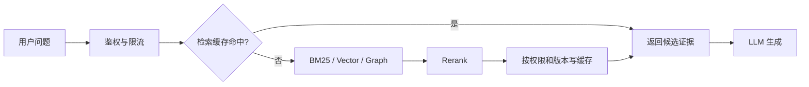

# RAG（09） - Redis 检索缓存、语义缓存与限流

> Redis 在 RAG 中负责保护在线热路径，不负责保存对话记忆。短期记忆的主文在[记忆系统（05） - Redis Agent Memory](/knowledge/03-AI大模型应用开发/05-记忆系统/05-Redis-Agent-Memory：短期状态、长期召回与事件流)。

> 读完你能：设计不会跨租户、跨权限或跨索引版本复用的检索缓存，区分精确缓存与语义缓存，并为检索和模型调用设置可降级的限流策略。

## 核心知识清单

- 精确检索缓存与语义缓存的边界
- tenant、ACL、索引和模型版本进入缓存键
- TTL、主动失效与版本化失效
- 缓存穿透、击穿、雪崩和热点保护
- 分层限流、幂等与降级
- 命中率、错误复用率、延迟和成本评测

## Redis 在 RAG 链路中的位置



缓存位于服务端鉴权之后。无论命中还是未命中，返回的 Chunk 都要再次校验当前用户权限，因为缓存生成后 ACL 可能已经变化。Redis 不可用时应降级为直查检索系统，而不是让整个问答服务失败。

## 三种缓存不要混用

| 类型 | 命中条件 | 适用数据 | 主要风险 |
| --- | --- | --- | --- |
| 精确检索缓存 | 规范化问题完全相同 | Chunk ID、分数、索引版本 | 键缺少 ACL 或版本导致越权、过期 |
| 语义检索缓存 | 问题向量相似度超过阈值 | 可复用的候选证据 | 相似问题约束不同，错误复用 |
| 生成答案缓存 | 问题、证据、模型和 Prompt 均相同 | 低风险、确定性回答 | 旧答案掩盖知识更新 |

企业知识库优先缓存“检索候选”，再用当前权限过滤和当前模型生成。直接缓存最终答案虽然省钱，但失效维度更多，涉及价格、政策、库存、审批状态时通常不值得冒险。

## 缓存键必须表达可见性与版本

```text
rag:retrieval:{tenant}:{acl_hash}:{index_version}:{retriever_version}:{query_hash}
```

- `tenant` 防止租户间复用。
- `acl_hash` 是排序后权限集合的摘要，权限变化即自然未命中。
- `index_version` 在离线建库发布后切换，不需要扫描删除全部旧键。
- `retriever_version` 包含 Embedding、BM25、融合和 Rerank 配置版本。
- `query_hash` 避免把敏感问题原文暴露在键名和监控里。

仅用问题文本作为键是严重缺陷：相同问题在不同租户、角色和索引版本下可能对应完全不同的证据。

## 可运行完整示例：验证缓存隔离和版本失效

下面用内存字典模拟 Redis 的键语义。它不伪装成真实网络连接，但可以直接观察租户、ACL 或索引版本变化时为什么必须未命中。

```text
# requirements.txt
# 零第三方依赖，仅使用 Python 3.10+ 标准库。
```

```python
from dataclasses import dataclass
from hashlib import sha256


@dataclass(frozen=True)
class RetrievalContext:
    """保存检索缓存的隔离维度；每个字段都会参与缓存键计算。"""

    # 当前请求所属的租户标识。
    tenant_id: str
    # 当前用户已经授权的权限组。
    permission_groups: tuple[str, ...]
    # 当前在线读取的知识索引版本。
    index_version: str
    # 检索、融合和重排配置的联合版本。
    retriever_version: str


def fingerprint(value: str) -> str:
    """返回不可逆短摘要；value 是不应直接出现在 Redis 键中的原文。"""
    return sha256(value.encode("utf-8")).hexdigest()[:16]


def build_cache_key(context: RetrievalContext, query: str) -> str:
    """构造严格隔离的缓存键；context 是权限和版本上下文，query 是原始问题。"""
    # 排序后的权限组文本，避免权限集合顺序造成无意义未命中。
    normalized_permissions: str = ",".join(sorted(context.permission_groups))
    # 权限摘要用于隔离不同可见范围，同时避免在键中暴露组名。
    permission_hash: str = fingerprint(normalized_permissions)
    # 规范化问题摘要用于精确缓存，本示例只演示大小写和首尾空格归一化。
    query_hash: str = fingerprint(query.strip().lower())
    return (
        f"rag:retrieval:{context.tenant_id}:{permission_hash}:"
        f"{context.index_version}:{context.retriever_version}:{query_hash}"
    )


def read_cache(cache: dict[str, list[str]], key: str) -> list[str] | None:
    """读取候选 Chunk ID；cache 是模拟存储，key 是已经完成隔离的缓存键。"""
    return cache.get(key)


# 模拟 Redis 中保存的检索候选缓存。
retrieval_cache: dict[str, list[str]] = {}
# 租户 A 的普通员工检索上下文。
employee_context = RetrievalContext("tenant-a", ("employee",), "index-v1", "retriever-v3")
# 同一租户管理员拥有不同权限，不能复用普通员工结果。
admin_context = RetrievalContext("tenant-a", ("admin",), "index-v1", "retriever-v3")
# 新索引发布后即使问题不变也必须重新检索。
new_index_context = RetrievalContext("tenant-a", ("employee",), "index-v2", "retriever-v3")
# 本次演示反复使用的用户问题。
question = "退款审批规则是什么？"

employee_key = build_cache_key(employee_context, question)
retrieval_cache[employee_key] = ["chunk-public-policy"]

print("same context:", read_cache(retrieval_cache, employee_key))
print("different ACL:", read_cache(retrieval_cache, build_cache_key(admin_context, question)))
print("new index:", read_cache(retrieval_cache, build_cache_key(new_index_context, question)))
```

预期只有相同上下文命中；权限或索引版本变化均返回 `None`。生产实现可用 `SETEX` 写入短 TTL，并为热点键增加随机抖动，避免大量键同时过期。

## 语义缓存必须有拒绝条件

语义缓存先用 Embedding 找相似历史问题，再判断是否复用。相似度阈值不能凭感觉设置，应在真实查询对上统计错误复用率。以下情况默认绕过：

- 问题包含“今天、当前、最新、余额、库存”等强时效词。
- 涉及审批、权限、金额、法律或医疗等高风险结论。
- 当前索引、Embedding、Retriever、Prompt 或模型版本已变化。
- 命中结果的来源已删除、过期或不再满足当前 ACL。
- 查询虽然语义相近，但数字、时间范围、地域或产品型号不同。

语义缓存返回的仍应是候选证据，而不是未经核验的最终事实。

## 限流与热点保护

至少按 `tenant_id + user_id + route + model_tier` 分层限流。只按 IP 限流会误伤企业出口 NAT，也无法控制单个高成本租户。Redis 中可使用 Lua 或官方限流组件保证“检查并扣减”原子化。

- 网关限制总请求，保护应用实例。
- 检索层限制高成本 MultiQuery、GraphRAG 和 Rerank。
- 模型层按 Token 预算和模型等级限流。
- 后台建库按租户限制并发，避免影响在线查询。

缓存击穿时，同一热点查询只允许一个请求回源，其余请求短暂等待或使用仍可接受的 stale 结果。锁值必须带随机 token，并用 Lua 校验后释放；不要用不安全的 `SETNX` 加直接 `DEL`。

## 生产验收

1. 跨租户、跨角色请求绝不命中同一个缓存键。
2. 索引、Embedding、Retriever 或权限版本变化后自然失效。
3. Redis 故障时可降级直查，Trace 明确记录 cache bypass。
4. 同时记录命中率、错误复用率、P95 延迟、回源率和单位成功成本。
5. 压测热点键、批量过期、缓存穿透和主从切换，不只验证正常命中。
6. 知识删除后，缓存最长在约定 TTL 内消失；高风险删除使用主动失效。

## 参考资料

- [Redis：LangCache semantic caching](https://redis.io/docs/latest/develop/ai/context-engine/langcache/)
- [Redis：Rate limiting algorithms](https://redis.io/tutorials/howtos/ratelimiting/)
- [Redis：Agent memory](https://redis.io/docs/latest/develop/use-cases/agent-memory/)
