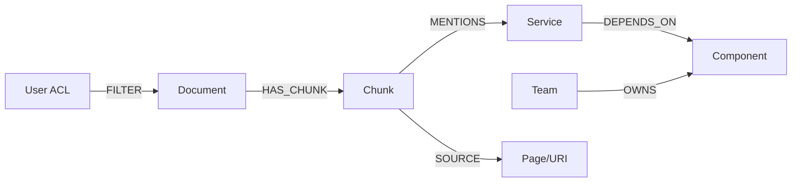

# 基础设施实战（5）- Neo4j GraphRAG：受控多跳检索与证据回链

> 读完你能：围绕“Neo4j GraphRAG：受控多跳检索与证据回链”理解“建模原则”与“参数化写入与查询”，并结合正文示例完成实践与排障。


向量检索擅长找语义相近 Chunk，知识图谱擅长回答显式关系问题，例如“服务 A 依赖哪些组件，这些组件由谁维护”。GraphRAG 的价值不是把所有文本变成节点，而是用稳定实体和关系补足多跳结构，再回链到原始证据。




## 一、建模原则

- 节点使用 `(tenant_id, entity_id)` 唯一约束，名称只是可变属性。
- 关系类型使用受控枚举，禁止模型随意创造标签和关系名。
- `Chunk` 保存证据 ID 与摘要，不复制完整附件；原文由对象存储提供。
- 每条实体/关系记录来源 Chunk、抽取模型版本和置信度，低置信关系需要复核。

```cypher
CREATE CONSTRAINT service_identity IF NOT EXISTS
FOR (service:Service)
REQUIRE (service.tenant_id, service.entity_id) IS UNIQUE;

CREATE CONSTRAINT chunk_identity IF NOT EXISTS
FOR (chunk:Chunk)
REQUIRE (chunk.tenant_id, chunk.chunk_id) IS UNIQUE;
```

## 二、参数化写入与查询

```text
# requirements.txt
neo4j>=5,<7
```

```python
from __future__ import annotations

from dataclasses import dataclass

from neo4j import Driver


# 多跳查询允许的最大依赖深度，避免无界遍历。
MAX_GRAPH_DEPTH = 3
# 单次最多返回的证据数量，限制上下文成本。
MAX_EVIDENCE_COUNT = 20


@dataclass(frozen=True)
class GraphSearchContext:
    """保存 GraphRAG 查询所需的可信身份条件。"""

    # 当前租户稳定标识。
    tenant_id: str
    # 用户可访问的权限组。
    acl_groups: tuple[str, ...]


def find_dependency_evidence(
    driver: Driver,
    service_id: str,
    context: GraphSearchContext,
) -> list[dict[str, object]]:
    """查询服务依赖及证据；service_id 是实体 ID，context 是权限上下文。"""

    # Cypher 模板固定关系和深度，模型只能提供经过校验的实体 ID。
    query = f"""
    MATCH (service:Service {{tenant_id: $tenant_id, entity_id: $service_id}})
          -[:DEPENDS_ON*1..{MAX_GRAPH_DEPTH}]->(component:Component)
    MATCH (chunk:Chunk)-[:MENTIONS]->(component)
    MATCH (document:Document)-[:HAS_CHUNK]->(chunk)
    WHERE document.tenant_id = $tenant_id
      AND any(group IN document.acl_groups WHERE group IN $acl_groups)
    OPTIONAL MATCH (team:Team)-[:OWNS]->(component)
    RETURN DISTINCT component.entity_id AS component_id,
           component.name AS component_name,
           team.name AS owner,
           chunk.chunk_id AS chunk_id,
           chunk.source_uri AS source_uri
    LIMIT $limit
    """
    # 参数来自服务端实体解析和鉴权结果，不拼接用户自然语言。
    parameters = {
        "tenant_id": context.tenant_id,
        "service_id": service_id,
        "acl_groups": list(context.acl_groups),
        "limit": MAX_EVIDENCE_COUNT,
    }
    # 结果转换为普通字典，便于与 BM25/向量候选统一融合。
    records, _, _ = driver.execute_query(
        query,
        parameters_=parameters,
        database_="neo4j",
    )
    return [record.data() for record in records]
```

示例为了固定深度把常量插入查询模板；它不是用户输入。自然语言应先解析为受控意图和实体 ID，不要让 LLM 直接生成并执行任意 Cypher。

## 三、与混合检索协作

推荐顺序是：BM25/向量召回种子 Chunk → 实体链接 → 有界图扩展 → 取回支持关系的 Chunk → 与原候选融合和 Rerank。图谱返回“关系”，最终给模型的仍应是有页码、版本和 ACL 的原始证据。

图召回单独评估：实体链接准确率、多跳路径命中率、证据回链率和权限泄漏率。不要只看最终答案，否则无法区分错误来自实体抽取、图关系、证据回链还是生成。

## 四、安全、稳定与成本

- 查询模板白名单化，限制关系类型、深度、返回量和超时；执行只读账号。
- 所有入口强制租户与 ACL 条件，缓存键包含权限摘要和图谱版本。
- 关系抽取只处理对业务有价值的实体类型，控制 LLM 成本和图规模。
- 图数据库不可用时可降级为 BM25 + 向量，但 Trace 明确记录图召回缺失。
- 定期对账孤儿 Chunk、无来源关系、低置信边和已删除文档引用。

## 五、验收

至少准备一跳、两跳、同名实体、跨租户和关系已过期五类问题；每条图路径都能回到可见 Chunk；无界 Cypher 无法执行；索引删除后图节点与关系按版本清理；图召回对最终 Recall 的增益大于其延迟与维护成本。

## 参考资料

- [LangChain Retrieval](https://docs.langchain.com/oss/python/langchain/retrieval)
- [Milvus 文档](https://milvus.io/docs)
