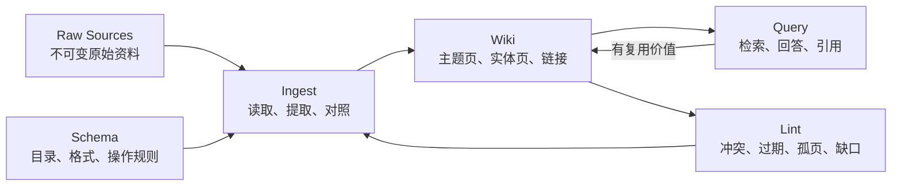

# RAG（37） - LLM Wiki：持续知识编译与 RAG 对比

> LLM Wiki 不是新的向量数据库，而是一种由 LLM 持续维护结构化知识制品的模式：原始资料保持不变，模型把跨来源结论编译进相互链接的 Wiki，再让后续查询复用已经完成的整理。

> 读完你能：解释 LLM Wiki 与传统 RAG 的数据流差异，设计 Raw Sources、Wiki、Schema 三层结构，并判断何时单用 Wiki、单用 RAG 或组合两者。

## 核心知识清单

- Raw Sources、Wiki 与 Schema 三层架构
- Ingest、Query 与 Lint 三类操作
- 查询时检索与摄取时持续知识编译
- 来源回链、冲突标记和人工审阅
- Wiki 索引与 BM25、向量检索的组合
- 更新成本、查询成本、时效和错误传播

## 为什么传统 RAG 还不够

传统 RAG 在每次提问时检索原始 Chunk，再临时拼接答案。它擅长从大量、频繁变化的资料中找到局部证据，但复杂问题可能每次都要重新发现相同关系。例如回答“过去三个版本的退款规则为什么改变”，系统要重复找到版本文档、识别时间线、处理冲突并生成结论。

Karpathy 提出的 LLM Wiki 把一部分工作前移到摄取阶段：新资料进入后，LLM 不只建立索引，还更新主题页、实体页、对比页、交叉链接与冲突说明。下次查询先读已经整理过的 Wiki，复用持续积累的综合结果。这里的“编译”是工程类比，不表示模型生成内容天然正确。



读图时重点看两条闭环：新来源经 Ingest 更新持久 Wiki，高价值 Query 与 Lint 发现的缺口又回到维护流程；Schema 则持续约束每次写入的目录、格式和审核规则。

## 三层结构与三类操作

**Raw Sources** 是事实依据，如制度原文、会议纪要和论文。它们应保留来源 URL、采集时间、内容哈希、权限与版本，模型不得覆盖原文。

**Wiki** 是 LLM 生成的派生层，包含概念、实体、时间线、对比和索引页面。每条重要结论必须回链 Source ID，并记录 `verified`、`needs_review` 或 `disputed` 等状态，不能把模型综合结果冒充原始事实。

**Schema** 是维护契约，可放在 `AGENTS.md` 或专用规则文件中，规定目录、页面模板、引用格式、允许修改的范围、冲突处理和审批门禁。没有 Schema，模型只是一次性写摘要，不是可治理的 Wiki 维护者。

三类基本操作分别是：`Ingest` 把新来源整合进已有页面；`Query` 基于 Wiki 回答并把高价值分析回填为候选页面；`Lint` 检查冲突、过期声明、孤立页面、断链和知识缺口。企业场景还应增加发布审批、权限同步、删除传播和回滚。

## LLM Wiki 与 RAG 怎么选

| 对比项 | 查询时 RAG | LLM Wiki |
| --- | --- | --- |
| 主要处理时机 | 用户提问时检索和组装 | 新资料进入时增量整理 |
| 持久产物 | Chunk、索引和查询日志 | 可读、互链、持续修订的页面 |
| 强项 | 大规模查找、最新原文、精确引用 | 跨来源综合、关系积累、浏览学习 |
| 主要成本 | 每次查询的召回、重排和长上下文 | 每次摄取的多页更新、审阅和一致性检查 |
| 主要风险 | 漏召回、错召回、上下文噪声 | 错误被写回并传播、旧结论未及时修订 |
| 权限要点 | 每一路召回前执行 ACL 过滤 | 页面继承来源权限，混合来源取最严格权限 |

选择原则不是二选一：几十到几百页、领域稳定且强调阅读积累时，可先用 `index.md + 全文搜索`；资料规模大、查询长尾多或需要严格定位原文时，给 Raw 与 Wiki 分别建立检索索引。常见生产组合是先检索 Wiki 获得综合背景，再检索 Raw Sources 校验关键事实和引用。

## 组合链路：先综合，再核验

```text
问题
  -> 检索 Wiki 页面：获得术语、关系和候选结论
  -> 从 Wiki 的 Source ID 扩展到原始资料
  -> 对 Raw Sources 做 BM25 + 向量检索
  -> Rerank 并执行 ACL 过滤
  -> 生成带原文引用的回答
  -> 高价值新分析进入待审队列，通过后回填 Wiki
```

这条链路把 Wiki 当作“可维护的语义中间层”，把 Raw Sources 当作最终证据层。回答可以引用 Wiki 帮助解释，但涉及金额、日期、权限、法规等关键事实时，必须回到原始来源核验。

## 可运行完整示例：观察知识如何积累

下面的纯 Python 示例不调用真实 LLM，而是用确定性规则展示核心差异：传统 RAG 每次从原始资料重新拼答案；Wiki Ingest 会把来源和结论持久化，发现不一致时进入审阅状态。

```python
from dataclasses import dataclass, field


@dataclass(frozen=True)
class Source:
    """保存不可变原始来源；source_id 用于引用，claim 是示例事实。"""

    # 原始资料的稳定标识，用于引用和删除传播。
    source_id: str
    # 从原文中抽取、等待综合的示例事实。
    claim: str


@dataclass
class WikiPage:
    """保存 LLM Wiki 派生页面；title 是主题，claims 按来源保留结论。"""

    # Wiki 页面的稳定主题名称。
    title: str
    # 来源标识到事实文本的映射，避免综合后丢失证据链。
    claims: dict[str, str] = field(default_factory=dict)
    # 页面是否存在待人工判断的来源冲突。
    needs_review: bool = False


def ingest(page: WikiPage, source: Source) -> None:
    """把一个来源增量写入 Wiki；page 是派生页，source 是不可变依据。"""
    # 写入新来源前，页面已经存在的事实文本集合。
    existing_claims: set[str] = set(page.claims.values())
    # 不同来源给出不同文本时先标记冲突，不自动覆盖历史结论。
    if existing_claims and source.claim not in existing_claims:
        page.needs_review = True
    page.claims[source.source_id] = source.claim


def query(page: WikiPage) -> str:
    """返回带来源的 Wiki 摘要；page 是已经增量维护的派生页。"""
    # 按来源稳定排序后的可追溯事实列表。
    cited_claims: list[str] = [
        f"{claim} [{source_id}]"
        for source_id, claim in sorted(page.claims.items())
    ]
    # 页面当前的发布状态，冲突未处理时禁止伪装成确定结论。
    review_status: str = "需要人工审阅" if page.needs_review else "可发布"
    return f"{page.title}：{'；'.join(cited_claims)}。状态：{review_status}"


# 当前演示使用的退款规则 Wiki 页面。
refund_page = WikiPage(title="退款时限")
# 版本一制度原文，作为第一份不可变来源。
policy_v1 = Source(source_id="policy-v1", claim="签收后 7 天内可退款")
# 版本二制度原文，与旧版本存在需要解释的变化。
policy_v2 = Source(source_id="policy-v2", claim="签收后 14 天内可退款")

ingest(refund_page, policy_v1)
print(query(refund_page))
ingest(refund_page, policy_v2)
print(query(refund_page))
```

预期第二次输出同时保留两个来源，并把状态改为“需要人工审阅”。真实系统应进一步抽取生效时间和适用范围，不能把所有文本差异都判为业务冲突。

## 生产落地的五个门禁

1. **可追溯**：每条 Wiki 声明保存 Source ID、原文位置、提取时间和模型版本。
2. **可审阅**：新增、覆盖、合并和删除使用结构化 Diff；高风险领域必须人工批准。
3. **权限安全**：Wiki 页引用多个来源时采用最严格 ACL；检索前过滤，禁止生成后再删敏感内容。
4. **可回滚**：Raw 不可变，Wiki 用 Git 或版本表记录变更；删除来源时执行影响分析和级联重建。
5. **可评测**：分别测来源引用正确率、冲突发现率、过期声明率、Wiki 检索 Recall@K，以及最终回答忠实度。

## 常见误区

- **把摘要目录叫 LLM Wiki**：只有摘要，没有跨页更新、引用和 Lint，不会形成知识复利。
- **让模型直接改原文**：派生结论污染事实层后，无法审计也无法重建。
- **认为不用检索**：页面增加后仍需要索引；区别是检索对象可以包含已编译的 Wiki，而不只是 Raw Chunk。
- **自动回填所有回答**：错误回答会成为下一轮输入。应先进入候选区，通过证据校验和审批再发布。
- **忽略时态与权限**：新版结论未必覆盖旧场景，低权限来源也不能提升到所有人可读的综合页。

## 学完验收

- 能画出 Raw Sources、Wiki、Schema 与 Ingest、Query、Lint 的关系。
- 能说明 RAG 是查询时知识装配，LLM Wiki 是摄取时持续知识编译，两者可以组合。
- 能为一个 Wiki 声明追溯到原始来源，并演示冲突、权限或删除如何传播。
- 能用评测数据决定继续使用索引文件，还是引入 BM25、向量检索和 Rerank。

## 参考资料

- [Andrej Karpathy：LLM Wiki 原始 idea file](https://gist.github.com/karpathy/442a6bf555914893e9891c11519de94f)
- [Retrieval-Augmented Generation 原始论文](https://arxiv.org/abs/2005.11401)
- [Anthropic：Contextual Retrieval](https://www.anthropic.com/news/contextual-retrieval)
