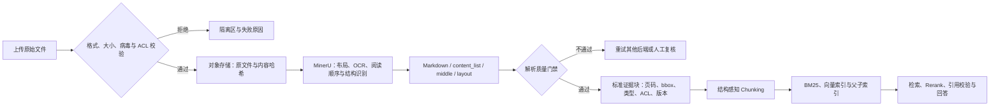

# 文档切分（02） - MinerU 文档解析：从复杂文件到可检索证据

> 读完后，你应能完成以下任务：
> - 绘制“RAG（32） - MinerU 文档解析：从复杂文件到可检索证据 / MinerU 在 RAG 链路中的职责边界”的关键对象与数据流，解释“RAG 的第一处高风险不是向量检索，而是文档解析。”，并用源码位置、日志或 Trace 标注证据。
> - 为“RAG（32） - MinerU 文档解析：从复杂文件到可检索证据 / 解析后端的选择依据”设计正常与异常输入，验证“MinerU 3.4.5 的 CLI 默认后端是 hybrid-engine，也可显式选择 pipeline、vlm-engine 及对应 HTTP Client。”，输出首个偏差位置与回归测试结果。
> - 实现“RAG（32） - MinerU 文档解析：从复杂文件到可检索证据 / 解析产物如何转换为证据”的最小代码或配置，检验“content_list.json 中的文本块包含 text、text_level、page_idx 和 bbox；”，输出命令、结果与 Diff，并说明不适用边界。

> 本文面向需要把 PDF、图片和 Office 文档接入企业知识库的开发者。读完后，你应能选择 MinerU 解析后端，把解析结果转换为带页码、坐标和权限的证据块，并用可量化指标判断数据能否进入索引。

# 一、MinerU 在 RAG 链路中的职责边界

RAG 的第一处高风险不是向量检索，而是文档解析。双栏 PDF 的阅读顺序错乱、扫描件没有 OCR、表格被拆成无意义文本、页眉页脚反复进入索引，都会让后面的 Chunking、Embedding 和 Rerank 建立在错误数据上。

MinerU 负责把 `PDF / 图片 / DOCX / PPTX / XLSX` 转换为 Markdown、按阅读顺序排列的 JSON 和布局中间结果。它能识别标题、正文、列表、图片、表格、公式与代码等内容，并保留页码和边界框。它不负责以下工作：

- 不决定知识库的 Chunk 大小、重叠率和父子关系；
- 不生成 Embedding，也不写入 Milvus、Elasticsearch 等索引；
- 不替业务系统完成租户权限、版本发布和删除传播；
- 不保证每个解析块都正确，生产链路仍需质量门禁和抽样评测。

因此正确数据流是“解析产物先验收，再标准化、切分和索引”，而不是把生成的 Markdown 直接整篇向量化。



`DIAGRAM_DESCRIPTION`：图中必须从文件安全与 ACL 校验开始，经过原文件留存、MinerU 解析、解析质量门禁和标准证据块，再进入 Chunking 与索引；校验失败要进入隔离或更换后端，不能静默写入知识库。

# 二、解析后端的选择依据

MinerU 3.4.5 的 CLI 默认后端是 `hybrid-engine`，也可显式选择 `pipeline`、`vlm-engine` 及对应 HTTP Client。选择依据应是文档类型、资源、质量样本和延迟预算，而不是只看一次演示。

| 后端 | 适用输入 | 主要优势 | 主要代价与边界 |
| --- | --- | --- | --- |
| `pipeline` | 规则较稳定的文本 PDF、CPU 环境 | 结果稳定、无生成式幻觉，可在 CPU/GPU 运行 | 复杂跨栏、视觉语义和特殊版式可能不如 VLM |
| `vlm-engine` | 扫描件、复杂版式、视觉语义强的文档 | 结构理解能力强，可接 vLLM、LMDeploy、MLX 生态 | 模型资源、延迟与容量成本更高 |
| `hybrid-engine` | 既有原生文本又有复杂视觉结构的文档 | 原生文本提取与视觉解析结合，降低纯 VLM 幻觉 | 组件更多，需要同时治理 pipeline 与模型侧资源 |
| `*-http-client` | 解析服务独立部署或集中使用 GPU | 业务容器保持轻量，统一扩缩容和模型版本 | 增加网络超时、排队、鉴权和服务可用性问题 |

Hybrid 的 `effort=medium` 适合多数日常文档；需要图片分析或最高解析强度时再用 `high`。不要把所有文档固定到最重后端：先按文件类型、是否扫描、历史失败标签路由，再通过同一评测集比较准确率、P95 延迟和单页成本。

# 三、解析产物如何转换为证据

MinerU 会按后端和文件类型生成不同产物。知识库接入时至少要区分下面四类：

| 产物 | 适合做什么 | 不应该怎么用 |
| --- | --- | --- |
| `*.md` | 人工阅读、快速预览、保留标题层级 | 直接整篇作为一个 Chunk |
| `*_content_list.json` | 按阅读顺序消费文本、表格、图片、公式与代码 | 丢掉 `page_idx`、`bbox` 后只留纯文本 |
| `*_content_list_v2.json` | 按页消费统一的 `type + content` 结构 | 在格式仍标记为开发中时绑定不可迁移的业务模型 |
| `*_middle.json` | 二次开发、布局定位、分析模型结果 | 作为在线检索的高频直接输入 |
| `*_layout.pdf`、`*_span.pdf` | 抽样质检阅读顺序、漏字和布局框 | 当成最终知识内容入库 |

`content_list.json` 中的文本块包含 `text`、`text_level`、`page_idx` 和 `bbox`；表格可能包含 HTML `table_body`，图片可带 caption 与 footnote。标准化时应保留原始结构，而不是立即把所有类型压成一段字符串。

推荐的证据块最少包含：

```json
{
  "document_id": "policy-2026-08",
  "parser": "mineru",
  "parser_version": "3.4.5",
  "source_hash": "sha256:...",
  "page": 6,
  "bbox": [62, 480, 946, 904],
  "block_type": "table",
  "heading_path": ["退款规则", "例外情况"],
  "content": "<table>...</table>",
  "tenant_id": "tenant-a",
  "acl": ["role:finance"],
  "parse_status": "accepted"
}
```

这里页码对外展示时通常使用 `page_idx + 1`；索引内部可保留从 0 开始的原值。`bbox` 用于点击引用后定位原文区域，`source_hash + parser_version` 用于判断是否需要重建，`acl` 必须从原文件继承并在每一路召回前过滤。

# 四、最小可运行示例：解析并生成 RAG 证据块

示例使用 Python 3.10+ 和 MinerU 3.4.5。它先调用官方 CLI 生成解析产物，再把稳定的 `content_list.json` 转换为 JSONL 证据块。示例只处理文本、表格和公式，图片描述可沿用同一模式扩展。

文件结构：

```text
mineru-rag-demo/
├── input/
│   └── policy.pdf
├── output/
└── normalize.py
```

安装与解析：

```bash
python -m venv .venv
source .venv/bin/activate
python -m pip install --upgrade pip
python -m pip install uv
uv pip install "mineru[all]==3.4.5"

# CPU 环境显式使用 pipeline；输出目录中会生成 Markdown 和 JSON 等产物。
mineru -p input/policy.pdf -o output -b pipeline
```

将下面代码保存为 `normalize.py`：

```python
from __future__ import annotations

import argparse
import hashlib
import json
from pathlib import Path
from typing import Any


# 允许进入本示例知识库的结构块类型。
SUPPORTED_BLOCK_TYPES: frozenset[str] = frozenset({"text", "table", "equation"})


def calculate_sha256(file_path: Path) -> str:
    """计算原文件哈希；file_path 是上传后不可变的原文件路径。"""
    # 按块读取时使用的缓冲区大小，避免把大文件一次载入内存。
    buffer_size: int = 1024 * 1024
    # 保存当前文件的 SHA-256 计算器。
    digest = hashlib.sha256()
    with file_path.open("rb") as source_file:
        while chunk := source_file.read(buffer_size):
            digest.update(chunk)
    return digest.hexdigest()


def extract_content(block: dict[str, Any]) -> str:
    """提取可检索正文；block 是 MinerU content_list 中的单个结构块。"""
    # 保存当前结构块的 MinerU 类型。
    block_type: str = str(block.get("type", ""))
    if block_type in {"text", "equation"}:
        return str(block.get("text", "")).strip()
    if block_type == "table":
        # 表格主体优先保留 HTML 结构，标题和脚注作为检索补充文本。
        table_parts: list[str] = [
            *[str(item) for item in block.get("table_caption", [])],
            str(block.get("table_body", "")),
            *[str(item) for item in block.get("table_footnote", [])],
        ]
        return "\n".join(part.strip() for part in table_parts if part.strip())
    return ""


def normalize_blocks(
    blocks: list[dict[str, Any]],
    document_id: str,
    source_hash: str,
    tenant_id: str,
    acl: list[str],
) -> list[dict[str, Any]]:
    """生成可追溯证据块；blocks 是解析结果，其余参数定义文档身份和权限。"""
    # 保存随标题块逐步更新的章节路径，用于后续结构感知切分。
    heading_path: list[str] = []
    # 保存最终可写入 Chunking 阶段的标准证据块。
    evidence_blocks: list[dict[str, Any]] = []

    for block_index, block in enumerate(blocks):
        # 保存当前结构块的类型，缺失时使用空字符串并拒绝入库。
        block_type: str = str(block.get("type", ""))
        # 保存当前文本层级；大于 0 表示标题块。
        text_level: int = int(block.get("text_level", 0) or 0)
        # 保存从当前结构块提取出的检索正文。
        content: str = extract_content(block)

        if block_type == "text" and text_level > 0 and content:
            # 标题路径只保留当前层级之前的祖先，再追加当前标题。
            heading_path = heading_path[: text_level - 1] + [content]
            continue
        if block_type not in SUPPORTED_BLOCK_TYPES or not content:
            continue

        # 保存 MinerU 从 0 开始的页码；缺失页码会被拒绝，避免伪造引用。
        page_index: Any = block.get("page_idx")
        if not isinstance(page_index, int) or page_index < 0:
            raise ValueError(f"block {block_index} has invalid page_idx")

        evidence_blocks.append(
            {
                "block_id": f"{document_id}:{block_index}",
                "document_id": document_id,
                "source_hash": f"sha256:{source_hash}",
                "parser": "mineru",
                "parser_version": "3.4.5",
                "page": page_index + 1,
                "bbox": block.get("bbox"),
                "block_type": block_type,
                "heading_path": list(heading_path),
                "content": content,
                "tenant_id": tenant_id,
                "acl": acl,
                "parse_status": "accepted",
            }
        )
    return evidence_blocks


def main() -> None:
    """读取 MinerU 产物并写出 JSONL；命令行参数指定原文件、解析结果和权限。"""
    # 保存命令行参数解析器及每个输入参数的用途说明。
    parser = argparse.ArgumentParser(description="Normalize MinerU content list for RAG")
    parser.add_argument("--source", type=Path, required=True, help="immutable source file")
    parser.add_argument("--content-list", type=Path, required=True, help="MinerU content_list.json")
    parser.add_argument("--output", type=Path, required=True, help="target JSONL file")
    parser.add_argument("--document-id", required=True, help="stable business document id")
    parser.add_argument("--tenant-id", required=True, help="tenant used by retrieval filters")
    parser.add_argument("--acl", action="append", required=True, help="repeatable ACL principal")
    # 保存用户传入且已经通过 argparse 基础校验的参数。
    arguments = parser.parse_args()

    # 保存 MinerU 平铺内容列表；顶层必须是数组。
    raw_blocks: Any = json.loads(arguments.content_list.read_text(encoding="utf-8"))
    if not isinstance(raw_blocks, list):
        raise ValueError("content_list root must be an array")

    # 保存已经补齐来源、位置、版本和权限的标准证据块。
    evidence_blocks: list[dict[str, Any]] = normalize_blocks(
        blocks=raw_blocks,
        document_id=arguments.document_id,
        source_hash=calculate_sha256(arguments.source),
        tenant_id=arguments.tenant_id,
        acl=arguments.acl,
    )
    if not evidence_blocks:
        raise ValueError("no searchable evidence blocks were produced")

    arguments.output.parent.mkdir(parents=True, exist_ok=True)
    with arguments.output.open("w", encoding="utf-8") as output_file:
        for evidence_block in evidence_blocks:
            output_file.write(json.dumps(evidence_block, ensure_ascii=False) + "\n")
    print(f"accepted_blocks={len(evidence_blocks)} output={arguments.output}")


if __name__ == "__main__":
    main()
```

MinerU 的实际输出目录会按输入和后端形成子目录，先用 `find output -name '*_content_list.json'` 找到目标文件，再执行：

```bash
python normalize.py \
  --source input/policy.pdf \
  --content-list output/policy/pipeline/policy_content_list.json \
  --output output/policy.evidence.jsonl \
  --document-id policy-2026-08 \
  --tenant-id tenant-a \
  --acl role:finance
```

预期输出形如 `accepted_blocks=42 output=output/policy.evidence.jsonl`。这里的 `42` 只是示意，真实数量取决于文档。成功标准不是命令退出码为 0，而是抽样记录能回到正确页码和区域，标题路径正确，权限字段完整，表格没有被压成不可读文本。

# 五、从证据块到 Chunk 的实现原则

标准证据块仍不是最终 Chunk。后续切分应使用结构信息：

1. 同一 `heading_path` 下合并相邻短文本，但不跨章节硬拼；
2. 表格、公式和代码块作为原子内容，超长表格按表头重复的行组切分；
3. Chunk 保存覆盖的页码范围和所有源块 ID，引用时能反查 `bbox`；
4. 父块保留完整章节，子块用于召回，命中子块后按预算扩展父上下文；
5. 页眉、页脚、页码和低置信噪声进入审计记录，不默认进入索引；
6. 删除或重解析时按 `document_id + parser_version + source_hash` 定位整批旧索引。

Markdown 适合保持人类可读结构，JSON 适合保留机器所需位置与类型。生产系统通常同时保存两者：Markdown 用于预览，标准证据 JSON 用于 Chunking、引用和重建。

# 六、生产部署、权限与稳定性

本地 CLI 适合验证，不适合直接承接高并发上传。服务化时可使用 `mineru-api` 的异步 `/tasks`，再用 `mineru-router` 聚合多个服务或 GPU。官方文档明确说明 API 的任务状态默认是单进程内存数据：服务重启、热重载或多进程后不保证还能查询历史任务。因此业务系统必须自己持久化任务状态，不能把 MinerU 内存任务表当业务数据库。

推荐的生产职责如下：

| 层级 | 必须承担的职责 |
| --- | --- |
| 上传网关 | MIME 与扩展名双检、大小和页数限制、病毒扫描、租户身份、内容哈希 |
| 任务服务 | 幂等键、持久状态、超时、有限重试、死信、取消与优先级 |
| MinerU Worker | 固定解析版本和后端、资源隔离、结构化日志、健康检查与模型预热 |
| 对象存储 | 原文件、解析产物、可视化质检文件和生命周期策略 |
| 质量门禁 | 页数覆盖、文本覆盖、顺序、表格/公式抽样、异常比例和人工复核 |
| 索引发布 | ACL 前置过滤、蓝绿索引、增量更新、删除传播与可回滚别名 |

重试必须区分错误类型：文件损坏和密码保护属于确定性失败，不应无限重试；GPU OOM 可降低并发或改用其他后端；远程服务超时只能有限重试，并使用同一幂等键避免生成重复版本。

# 七、解析质量如何评测

不要只统计“解析成功率”。至少维护一组覆盖文本 PDF、扫描件、双栏、表格、公式、印章和 Office 文件的金标样本，并按文档类型分层观察：

- **页覆盖率**：有有效内容的页数 / 应解析页数；
- **文本覆盖与字符错误率**：发现整页丢失、OCR 错字和乱码；
- **阅读顺序准确率**：双栏、标题、正文、脚注顺序是否正确；
- **结构准确率**：标题层级、列表、表格、公式和图片说明是否分类正确；
- **引用可定位率**：回答引用能否回到正确页码与 `bbox`；
- **隔离率**：多少文档因质量门禁进入复核，原因分布是什么；
- **延迟与容量**：每页耗时、任务排队时间、P50/P95/P99、GPU/CPU 利用率和峰值内存；
- **索引影响**：替换解析器前后 Recall@K、引用正确率和回答忠实度是否提升。

解析器评测和最终 RAG 评测要关联：解析结构更漂亮但检索与引用没有改善，不足以支持全量迁移。

# 八、常见故障与排查

| 现象 | 根因 | 定位方法 | 修复与预防 |
| --- | --- | --- | --- |
| 双栏正文左右交错 | 阅读顺序或布局识别错误 | 查看 `layout.pdf` 中编号，抽查对应 `content_list` 顺序 | 切换后端或强度；把该版式加入回归集 |
| 扫描 PDF 输出几乎为空 | 使用原生文本提取但页面只有图片 | 检查 PDF 文本层、页覆盖率和 OCR 日志 | 使用 `auto/ocr` 或视觉后端；空页比例触发门禁 |
| 表格能看但检索命不中 | 表格被转成无表头的长字符串 | 检查 `table_body`、caption、Chunk 切分和查询样本 | 保留 HTML 结构，分片时重复表头，单独建立表格文本表示 |
| 引用只能到文档不能到页 | 标准化时丢弃 `page_idx` 与 `bbox` | 随机抽取索引记录反查原产物 | 把位置字段设为入库必填，缺失时拒绝发布 |
| 重启后异步任务“消失” | 把 MinerU 单进程内存任务状态当持久队列 | 对照业务任务表、服务重启时间和 `/tasks` 返回 | 外置任务数据库与队列，结果写对象存储，使用幂等键恢复 |
| 同一文档出现两套索引 | 上传重试或解析版本变化未做幂等发布 | 对比内容哈希、解析版本和索引别名 | 以哈希和版本生成构建 ID，发布时原子切换别名并删除旧版本 |

## 验收清单

- [ ] 原文件、内容哈希、解析器版本和完整解析产物可以追溯。
- [ ] 文件进入 MinerU 前完成类型、大小、病毒、租户和 ACL 校验。
- [ ] 双栏、扫描件、表格、公式和 Office 文档都有金标样本。
- [ ] `page_idx`、`bbox`、块类型、标题路径与 ACL 在索引中没有丢失。
- [ ] 解析失败会隔离或切换后端，不会静默写入空 Chunk。
- [ ] 重解析、删除和权限变化可以定位并替换整批旧索引。
- [ ] 异步任务状态由业务系统持久化，服务重启后仍能恢复或重投。
- [ ] 上线前比较 Recall@K、引用正确率、P95 延迟和单页资源成本。

# 九、总结

- MinerU 解决的是复杂文件到结构化解析产物的问题，不替代 Chunking、Embedding、索引和权限系统。
- 解析后端应按版式、资源和质量样本选择；CPU 稳定场景可从 pipeline 开始，复杂视觉文档再评估 hybrid 或 VLM。
- `content_list.json` 适合生成证据块，`middle.json` 适合二次开发，Markdown 适合预览；关键位置与结构字段不能在标准化时丢失。
- 解析产物必须经过质量门禁，再转换为带页码、坐标、来源哈希、解析版本和 ACL 的标准证据块。
- MinerU API 的内存任务状态不是持久队列，生产系统要自行负责幂等、状态、重试、对象存储和发布回滚。
- 验收应同时观察解析质量、检索召回、引用正确率、延迟和成本，不能用“命令执行成功”代替数据质量证明。

## 参考资料

- [MinerU 官方仓库与安装说明](https://github.com/opendatalab/MinerU)
- [MinerU 官方使用指南：CLI、API 与 Router](https://opendatalab.github.io/MinerU/zh/usage/quick_usage/)
- [MinerU 官方输出文件说明](https://opendatalab.github.io/MinerU/zh/reference/output_files/)
- [MinerU 官方 CLI 参数](https://opendatalab.github.io/MinerU/zh/usage/cli_tools/)
