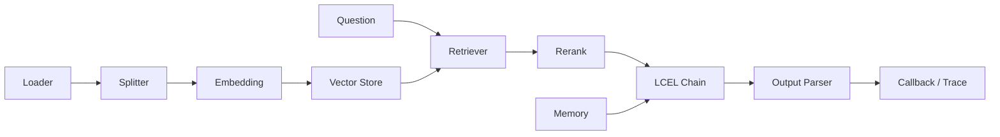

# 01 - LangChain 实战：LCEL、Retrieval 与 Memory

# 一、学习目标

这一模块学习 LangChain 的可组合能力，不把框架 API 当作架构本身。先理解 Runnable 与 LCEL，再接入 Loader/Splitter、Embedding、Retriever、Rerank、Output Parser 和 Memory，最后通过 Callback/Trace 观察每个阶段。

# 二、组件关系

# 三、验收标准

- 每个 Runnable 的输入输出 Schema 明确。
- 索引与查询使用同一 Embedding 模型、维度和前缀。
- Memory 区分线程状态与跨会话长期记忆。
- 示例锁定依赖版本，并说明框架升级边界。
- 能在不依赖 LangChain 的情况下解释底层数据流。

# 四、总结

LangChain 的价值是组合与适配；生产质量仍由数据契约、权限、评测和可观测性决定。
