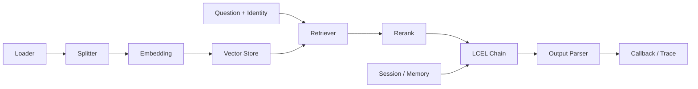

# 01 - LangChain 实战：LCEL、Retrieval 与 Memory

# 一、学习目标与框架边界

本模块学习 LangChain 的组合与适配能力：用 Runnable/LCEL 连接数据加载、检索、Prompt、模型、解析和观测组件。学完后应能构建一条可测试、可替换、可追踪的 RAG Chain，并正确处理结构化输出、短期状态和长期记忆。

LangChain 是框架，不是应用架构。权限、索引版本、超时、缓存、评测和故障降级仍由业务系统负责。若只是一次模型调用，直接使用模型 SDK 通常更清晰；当组件需要组合、并行、分支或统一观测时再引入 LCEL。

# 二、组件关系

# 三、推荐学习顺序

| 阶段 | 核心问题 | 最小实践 |
| --- | --- | --- |
| Runnable/LCEL | 组件怎样通过统一契约组合 | 输入校验 → Prompt → 模型 → Parser |
| Retrieval | 文档怎样入库并带权限召回 | Loader → Splitter → Embedding → Retriever |
| 输出与分支 | 解析失败、空召回怎样处理 | Schema 校验、重试、fallback 与拒答 |
| Memory | 哪些状态只属于本线程，哪些可跨会话 | 滑动窗口 + 摘要 + 长期事实检索 |
| Callback | 每一步的输入、耗时和失败怎样追踪 | 统一 `trace_id` 的链路事件 |

# 四、数据契约与工程基线

每个 Runnable 都应声明输入输出形状。Retriever 输出的不应只是字符串，而应保留 `document_id`、`chunk_id`、`source`、`acl`、`score` 和索引版本；Parser 输出必须经过 Schema 与业务规则双重校验，解析成功不代表业务值合法。

索引与查询必须使用相同的 Embedding 模型、维度、归一化方式和查询前缀。升级模型时新建索引版本并回放评测集，不能把新向量直接混入旧索引。

Memory 要区分三层：本次 Chain 的临时变量、线程内对话状态、跨会话长期事实。长期记忆只写入经过确认的稳定信息，并包含租户、用户、来源、时间和过期策略；历史消息过长时应摘要或检索，不要无限拼接。

# 五、最小实践项目

实现一个“文档问答 Chain”：读取两份带权限的 Markdown，切分并建立本地索引；查询时先执行 ACL 过滤和 Top-K 检索，再输出结构化答案与引用。项目必须包含：

- Runnable 输入输出类型与一条正常链路测试。
- 空召回、解析失败、模型超时三条显式 fallback。
- Callback 记录检索数量、各阶段耗时、Token 和最终状态。
- 同一评测集下更换 Chunk 参数前后的 Recall@K 与引用正确率对比。
- 不依赖 LangChain 的数据流说明，证明理解的不是 API 记忆。

# 六、常见失败与排查顺序

1. **Chain 可运行但结果不稳定**：固定模型参数、Prompt、依赖和评测输入，再判断是哪一段变化。
2. **组件连接时报类型错误**：打印每个 Runnable 的真实输入输出，避免把 `Document[]`、字符串和字典隐式混用。
3. **Memory 越来越贵**：检查是否把完整历史重复注入多个分支，按 Token 预算做截断、摘要和检索。
4. **Parser 经常失败**：优先使用结构化输出能力，再做 Schema 校验和有限重试；不要用正则修补任意 JSON。
5. **升级后 API 失效**：锁定依赖，查迁移说明，用适配层隔离框架对象，避免业务层到处直接调用版本相关 API。

# 七、验收标准

- 能说明何时直接用模型 SDK，何时使用 LangChain/LCEL。
- 每个 Runnable 的输入输出、超时、错误与 fallback 明确。
- Retriever 保留权限和来源元数据，回答引用可以回溯。
- Memory 不跨租户、不无限增长，长期记忆有写入与遗忘规则。
- Callback/Trace 能定位到具体组件，并能用固定评测集验证版本升级。

# 八、总结

LangChain 的价值是让组件可组合、可替换、可观察。先把数据契约和失败路径写清楚，再用 LCEL 减少编排代码，而不是让框架掩盖系统边界。
