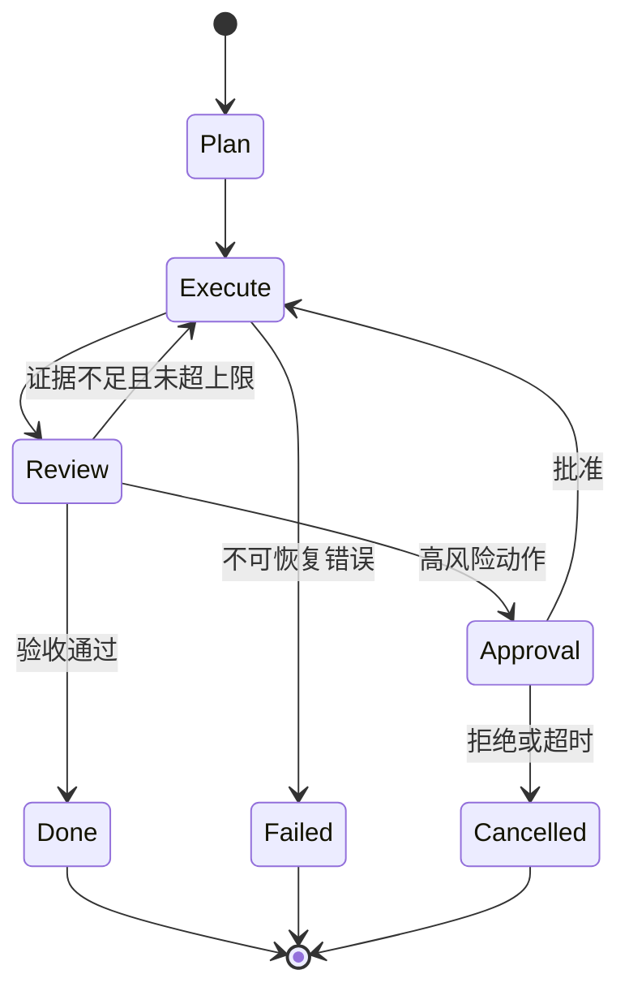

# 01 - LangGraph：状态机、循环与人工介入

# 一、学习目标与适用边界

本模块用于有分支、循环、恢复和人工审批的长流程。学完后应能定义稳定的 State 数据契约，把业务步骤拆成 Node 与条件 Edge，加入 Checkpoint、失败路由、最大循环和 Human-in-the-loop，并能从中断点安全恢复。

顺序固定且无需恢复的流程，用普通函数或队列更简单；只有控制流需要根据运行状态变化，或者任务必须跨请求暂停、恢复和审批时，LangGraph 才有明显价值。不要把每个函数都包装成模型节点。

# 二、状态流

# 三、学习顺序

| 阶段 | 核心问题 | 必须产出 |
| --- | --- | --- |
| State | 哪些字段决定下一步 | 带类型、默认值和版本的最小状态 |
| Node/Edge | 谁读取和修改哪些字段 | 节点输入输出与条件路由表 |
| Loop | 何时继续、拒答或失败 | 次数、时间、Token、费用四类上限 |
| Checkpoint | 中断后从哪里恢复 | `thread_id`、图版本、状态版本与恢复测试 |
| HIL | 谁能审批什么动作 | 待审快照、批准/拒绝/超时终态 |
| Multi-Agent | 状态怎样交接和归并 | Supervisor 路由与冲突处理规则 |

# 四、状态与副作用设计

State 只保存驱动流程所需的数据：问题、证据 ID、步骤计数、审批状态、错误码和输出摘要。文档正文、文件或大型工具结果应放在外部存储并通过 ID 引用，避免每个节点复制上下文。

节点尽量是可重放的纯计算。发送消息、修改订单、扣费等副作用必须携带幂等键，并记录“准备执行、执行成功、结果确认”状态。Checkpoint 只能证明状态被保存，不能自动保证外部副作用不会重复。

每条 Edge 的条件应来自结构化字段，而不是模糊文本。失败需要区分可重试、需人工处理和永久失败；重试要有退避与上限，最终进入显式终态，不能在图中无限循环。

# 五、最小实践项目

实现一个“高风险知识库操作助手”：检索资料后生成变更计划，证据不足时改写 Query 并有限重试，涉及写操作时暂停等待审批。要求：

- State 使用 Python 类型定义，并包含 `schema_version`、`step_count`、`status` 和 `error_code`。
- 图至少包含正常完成、空召回重试、工具失败、人工拒绝、审批超时五条路径。
- 进程重启后能用同一 `thread_id` 从节点边界恢复。
- 重放审批前后的状态时，外部写操作只执行一次。
- Trace 可显示节点耗时、状态差异、路由原因和最终终态。

# 六、常见失败与排查顺序

1. **恢复后重复调用工具**：检查副作用是否位于 Checkpoint 边界内，是否使用稳定幂等键。
2. **状态越来越大**：检查节点是否把文档与完整消息不断追加，改为 ID、摘要和受限窗口。
3. **循环无法停止**：检查计数器是否真正写回 State，以及所有失败分支是否指向终态。
4. **升级后旧任务无法恢复**：为图和 State 保存版本，提供字段默认值、迁移函数或让旧版本图完成存量任务。
5. **多 Agent 覆盖彼此结果**：为共享字段定义 reducer/归并策略，对不可合并冲突进入仲裁节点。

# 七、验收标准

- State 字段最小、类型明确，大对象通过 ID 引用。
- 每条循环都有次数、时间、Token 和费用上限。
- Checkpoint 可恢复，副作用有幂等键并经过重复执行测试。
- 人工批准、拒绝、取消、超时和工具失败均有显式终态。
- 图版本与 State Schema 可迁移、可回放，Trace 能解释每次路由。

# 八、总结

LangGraph 的价值是把隐式控制流变成可验证状态机。真正的工程难点是状态契约、终止条件、恢复和副作用一致性，而不是画出更多节点。
