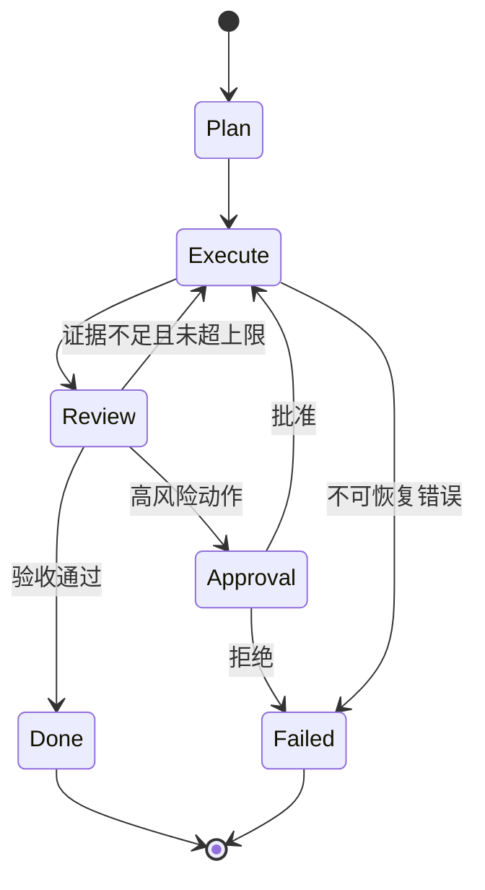

# 01 - LangGraph：状态机、循环与人工介入

> 主分类：LangGraph
> 关联标签：StateGraph、Checkpoint、循环、Human-in-the-loop、Agentic RAG

# 一、学习目标

这一模块用于有分支、循环、恢复和人工审批的长流程。先定义 State 数据契约，再实现 Node 和条件 Edge，最后加入 Checkpoint、失败路由、最大循环和 Human-in-the-loop。

# 二、状态流

> DIAGRAM_DESCRIPTION：状态图必须包含 Plan、Execute、Review、Approval、Done、Failed；Review 到 Execute 的循环必须标明证据不足和次数上限，高风险动作必须经过 Approval。

# 三、验收标准

- State 只保存必要字段，大对象通过 ID 引用。
- 每条循环都有次数、时间和费用上限。
- Checkpoint 可以从节点边界恢复，副作用具备幂等键。
- 人工拒绝、超时和工具失败都有显式终态。
- 图版本和状态 Schema 可迁移、可回放。

# 四、总结

LangGraph 的价值是把 Agent 的隐式控制流变成可验证状态机，而不是把所有步骤都改成模型节点。
