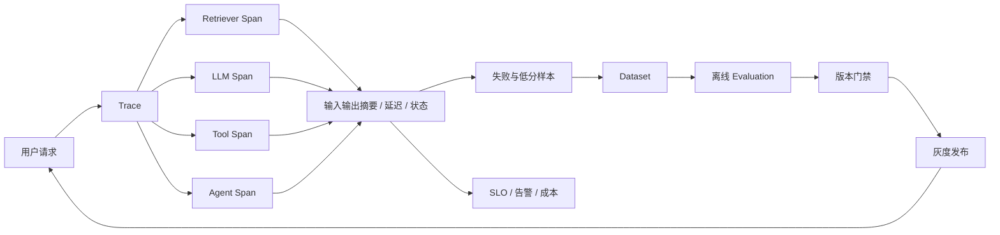

# 01 - LangSmith / LangFuse：Tracing、Evaluation 与告警

# 一、学习目标与观测边界

本模块建立大模型应用的证据链：一次请求经过了哪些检索、模型、工具和子 Agent，哪一步消耗 Token 或发生错误，版本变更是否让质量回退。学完后应能设计 Trace 数据模型、建立离线评测集、设置线上指标与告警，并根据数据驻留和运维边界选择平台。

普通日志回答“某行代码输出了什么”，Trace 要回答“一个用户请求为什么得到这个结果”。Evaluation 判断结果是否满足质量标准，监控告警判断线上何时需要行动。三者必须使用同一 `trace_id` 和版本元数据才能形成闭环。

# 二、可观测性数据模型

一条 Trace 表示一次端到端请求，Span 表示检索、模型、工具或节点等阶段。每条 Span 至少记录开始/结束时间、状态、父子关系、输入输出摘要、Token/费用、错误分类，以及模型、Prompt、索引、Embedding 和应用版本。敏感正文默认不上传，只记录哈希、ID、长度或脱敏摘要。

# 三、平台选型方法

| 维度 | LangSmith 侧重点 | Langfuse 侧重点 | 决策问题 |
| --- | --- | --- | --- |
| 框架接入 | 与 LangChain/LangGraph 工作流衔接自然 | 支持多种 SDK 与开放接入 | 当前调用链是否已绑定某框架 |
| 部署边界 | 托管使用路径直接 | 可评估自托管与托管 | 是否要求私有化和数据驻留 |
| 评测流程 | Dataset、Experiment 与链路调试 | Trace、评分、Prompt 与分析闭环 | 团队更重视研发实验还是统一平台 |
| 运维成本 | 平台能力减少自建工作 | 自托管需要容量、升级和备份 | 谁对可用性、升级和数据安全负责 |

选型前用同一组 RAG 与 Agent 请求做最小验证：接入工作量、Trace 完整率、查询速度、脱敏能力、权限模型、评测闭环和总成本。平台功能会迭代，最终能力边界以项目锁定版本与官方文档为准。

# 四、从 Trace 到评测闭环

1. 定义统一事件字段和错误分类，先让正常、超时、空召回、解析失败、工具失败都可检索。
2. 从线上失败、低分反馈和高价值场景抽样，去重、脱敏后进入 Dataset，并保留来源与标签。
3. 为检索、生成和 Agent 轨迹分别定义指标，不用单个 LLM Judge 分数代表全部质量。
4. 每次模型、Prompt、Chunk、Embedding、索引或工具变更都回放同一数据集，与基线比较。
5. 达到质量、延迟和成本门禁后灰度发布，线上异常样本继续回流。

RAG 至少观察 Recall@K、引用正确率、忠实度和无证据拒答；Agent 还要观察任务成功率、工具选择/参数正确率、平均步骤数、循环超限和危险操作拦截率。

# 五、控制台验收证据

文章涉及平台操作时，截图应证明配置真的生效，而不是只截首页。至少保留：

- 一条完整 Trace 的树形结构，能看到 Retriever、LLM、Tool 或 Agent 子 Span。
- 一个失败 Span 的错误分类、关键元数据和耗时，不展示密钥或原始敏感正文。
- 同一 Dataset 上基线与候选版本的指标对比。
- 告警规则及一次测试触发结果，包含阈值、窗口和通知状态。
- 数据脱敏或采样配置，以及受限成员无法访问敏感项目的权限验证。

# 六、SLO、告警与成本

告警必须可行动。建议按服务级和质量级分层：请求错误率、P95/P99、超时率、Token/费用异常负责快速发现运行故障；空召回率、引用缺失率、Agent 超限率和用户负反馈负责发现质量漂移。阈值使用时间窗口和最小样本量，避免单次慢请求触发告警风暴。

采样策略可保留全部错误、高价值或高风险请求，对正常流量按比例采样；评测与事故样本单独长期保存。成本既包括平台存储，也包括全量正文上报、Judge 评测和高基数标签带来的查询压力。

# 七、安全与权限

在 SDK 上报前完成密钥、个人信息和文档正文脱敏。项目按环境、租户与团队隔离，读者、标注者和管理员使用最小权限。Dataset 导出、Trace 分享和 Prompt 查看均应进入审计；保留期限、删除流程和备份策略必须符合业务数据治理要求。

# 八、常见失败与排查顺序

1. **Trace 断链**：检查异步任务、队列和子 Agent 是否透传同一 trace 上下文。
2. **只有最终答案**：补 Retriever、LLM、Tool 等阶段 Span；没有中间证据就无法定位根因。
3. **Judge 分数虚高**：核对评分 Rubric、参考答案、Judge 版本和人工抽检，不让被测输出影响评判指令。
4. **告警很多但没人处理**：为每条规则绑定责任人、Runbook、抑制窗口和恢复通知。
5. **观测平台泄漏数据**：立即停止相关上报，轮换暴露凭据，审计存量 Trace 并修复 SDK 侧脱敏。

# 九、验收标准

- Trace 能串联一次请求的检索、模型、工具与子 Agent，且关键 Span 完整。
- Dataset 来源可追溯，评测规则、Prompt、Judge 与被测版本固定。
- P95、错误率、Token、费用及关键质量指标有 SLO、告警与 Runbook。
- 敏感字段在上报前脱敏，项目权限、保留和删除策略经过验证。
- 版本发布能回放相同数据集、对比基线、阻止回退并保留灰度证据。

# 十、总结

Tracing 解决“发生了什么”，Evaluation 解决“改动是否更好”，告警解决“何时需要行动”。只有把请求证据、质量门禁和线上反馈连起来，可观测平台才不是昂贵的日志浏览器。
