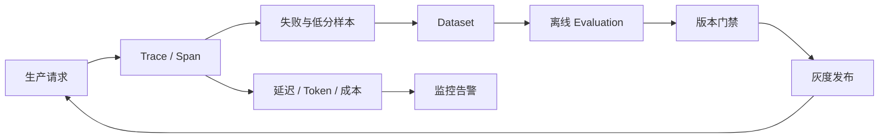

# 01 - LangSmith / LangFuse：Tracing、Evaluation 与告警

> 主分类：LangSmith/LangFuse
> 关联标签：Trace、Dataset、Evaluation、成本、延迟、告警

# 一、学习目标

这一模块建立大模型应用的证据链：请求如何经过检索、模型、工具和子 Agent，哪一步消耗了 Token、出现了错误，版本升级是否回归。平台选型服从数据驻留、框架集成、评测和运维要求。

# 二、观测闭环

> DIAGRAM_DESCRIPTION：流程图必须展示生产请求进入 Trace/Span，失败样本沉淀为 Dataset，离线 Evaluation 形成版本门禁并进入灰度发布；Trace 还要分流延迟、Token、成本到监控告警。

# 三、截图策略

> SCREENSHOT_DESCRIPTION：控制台截图应包含一次完整 Trace 的 Run 树、检索候选、模型 Token、节点耗时、错误状态和版本标签；必须脱敏用户正文、密钥、内部 URL 和租户标识。

# 四、验收标准

- Trace 能串联一次请求的检索、模型、工具与子 Agent。
- Dataset 来源可追溯，评测 Prompt 与 Judge 模型版本固定。
- P95、错误率、Token 和费用有 SLO 与告警阈值。
- 敏感字段在 SDK 上报前脱敏，外部平台权限最小化。
- 版本发布能够回放相同数据集并对比差异。

# 五、总结

Tracing 解决“发生了什么”，Evaluation 解决“改动是否更好”，告警解决“何时需要行动”。三者缺一不可。
