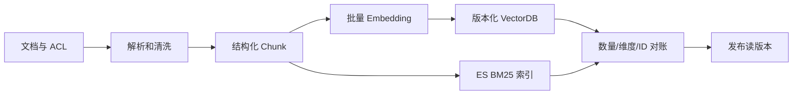

# RAG（02） - RAG 离线建库：解析、切分、向量化与索引

> 读完后，你应能：
> - 能验证“RAG 的离线链路负责把原始资料变成可检索索引，它不应该出现在每次问答请求里”，并保存输入、输出与失败样本。
> - 能验证“稳定的顺序是：加载文档 → 清洗 → 切分 Chunk”，并保存输入、输出与失败样本。
> - 能验证“→ 补充 Metadata → 计算 Embedding → 写入索引”，并保存输入、输出与失败样本。


RAG 的离线链路负责把原始资料变成可检索索引，它不应该出现在每次问答请求里。稳定的顺序是：**加载文档 → 清洗 → 切分 Chunk
→ 补充 Metadata → 计算 Embedding → 写入索引**。



<!-- article-progressive-block:start -->
# 一、先建立全局：RAG 离线建库：解析、切分、向量化与索引 是什么？

理解“RAG 离线建库：解析、切分、向量化与索引”，先要把标题中的对象放进同一条处理链：它接收什么输入，经过哪些状态变化，最终用什么证据判断结果。下表不另造概念，只把作者正文已经解释的章节按依赖顺序连起来。

“RAG 离线建库：解析、切分、向量化与索引”的第一个核心判断是：生产系统通常使用 Embedding 服务和 Milvus、Elasticsearch 或 pgvector。。先弄清这个判断中的对象和输入输出，后面的实现、故障和验收才有共同语境。

| 顺序 | 章节 | 读完本节应抓住的结论 |
| --- | --- | --- |
| 1 | 每一步保存什么 | 生产系统通常使用 Embedding 服务和 Milvus、Elasticsearch 或 pgvector。 |
| 2 | 可执行示例 | 把代码保存为 build_index.py 后执行 python build_index.py，会生成下一课可直接读取的 |
| 3 | 生产化检查 | 权限字段必须在入库时保存，检索前过滤，不能生成答案后再隐藏。 |
| 4 | RAG 的离线链路负责把原始资料变成可检索索引 | RAG 的离线链路负责把原始资料变成可检索索引，它不应该出现在每次问答请求里。 |
| 5 | 稳定的顺序是 | 稳定的顺序是：加载文档 → 清洗 → 切分 Chunk |
| 6 | 补充 Metadata → 计算 Embedding → 写入索 | 补充 Metadata → 计算 Embedding → 写入索引。 |

## 1.1 核心对象之间怎样衔接


这张图只表达本文的讲解顺序，不替代正文机制。判断“RAG 离线建库：解析、切分、向量化与索引”是否真正掌握，需要能从最后一个结果沿图回到前面每个章节的输入、状态变化和证据。

## 1.2 再看失败：问题最早会出现在哪一步？

在“RAG 离线建库：解析、切分、向量化与索引”的对象和顺序已经明确后，再看可观察的失败：解析丢内容、正确 chunk 未召回、过滤误删、重排掉出或引用不支持结论。定位时不从最后一条错误猜原因，而是沿上图找第一个偏离正文结论的节点。
<!-- article-progressive-block:end -->

# 二、每一步保存什么

| 阶段     | 核心产物              | 关键检查                   |
| -------- | --------------------- | -------------------------- |
| 解析     | 正文、标题、页码      | 是否丢表格、代码和层级     |
| 切分     | 可独立理解的 Chunk    | 是否在句子或函数中间断开   |
| Metadata | 来源、版本、权限      | 能否定位证据并做权限过滤   |
| 向量化   | 固定维度向量          | 文档与查询是否使用同一模型 |
| 索引     | Chunk、向量、Metadata | 新增、更新、删除能否同步   |

生产系统通常使用 Embedding 服务和 Milvus、Elasticsearch 或 pgvector。下面的纯 Python 示例用稳定哈希向量替代真实 Embedding，只用于跑通数据契约；它不是语义模型。

# 三、可执行示例

把代码保存为 `build_index.py` 后执行 `python build_index.py`，会生成下一课可直接读取的
`rag-index.json`。

```text
# requirements.txt
# 本教学脚本仅使用 Python 3.10+ 标准库，无第三方依赖。
```

```python
import hashlib
import json
import math
import re
from pathlib import Path

# 哈希向量的固定维度；生产环境应替换为真实 Embedding 的输出维度。
VECTOR_DIMENSION = 64
# 每个 Chunk 允许的最大字符数。
CHUNK_SIZE = 48
# 索引输出文件位置。
INDEX_PATH = Path("rag-index.json")
# 用于演示离线建库的原始文档。
DOCUMENTS = [
    {"source": "refund.md", "text": "耳机签收后七天内，商品完好且配件齐全可以申请退款。"},
    {"source": "shipping.md", "text": "退款审核通过后，款项通常在三个工作日内原路退回。"},
]


def tokenize(text: str) -> list[str]:
    """把中英文文本转换为稳定的检索词元。"""
    # 文本中的英文单词和单个中文字符。
    tokens = re.findall(r"[a-z0-9]+|[\u4e00-\u9fff]", text.lower())
    return tokens


def embed(text: str) -> list[float]:
    """生成可复现的教学向量，生产环境应调用真实 Embedding 模型。"""
    # 当前文本累加得到的稀疏哈希向量。
    vector = [0.0] * VECTOR_DIMENSION
    for token in tokenize(text):
        # 词元的稳定哈希值，用于决定向量位置。
        token_hash = int(hashlib.sha256(token.encode("utf-8")).hexdigest(), 16)
        vector[token_hash % VECTOR_DIMENSION] += 1.0

    # 向量的 L2 范数，用于归一化后直接计算余弦相似度。
    norm = math.sqrt(sum(value * value for value in vector)) or 1.0
    return [value / norm for value in vector]


def split_text(text: str) -> list[str]:
    """按固定上限切分文本，真实项目应优先保留标题和语义边界。"""
    # 按中文句号得到的非空句子。
    sentences = [sentence.strip() for sentence in text.split("。") if sentence.strip()]
    return [sentence[:CHUNK_SIZE] for sentence in sentences]


# 最终写入磁盘的 Chunk 索引记录。
index_records = []
for document in DOCUMENTS:
    for chunk_index, chunk_text in enumerate(split_text(document["text"]), start=1):
        # 同时保存证据、来源和向量，在线链路不再重复解析文档。
        index_records.append({
            "id": f"{document['source']}#{chunk_index}",
            "source": document["source"],
            "text": chunk_text,
            "vector": embed(chunk_text),
        })

INDEX_PATH.write_text(json.dumps(index_records, ensure_ascii=False, indent=2), encoding="utf-8")
print(f"已写入 {len(index_records)} 个 Chunk：{INDEX_PATH}")
```

# 四、生产化检查

- 文档更新时按稳定 `document_id` 删除旧 Chunk，再写入新版本。
- 权限字段必须在入库时保存，检索前过滤，不能生成答案后再隐藏。
- 更换 Embedding 模型或维度时重建索引，不能混用新旧向量。
- 保存来源和页码，在线答案才能给出可核验引用。
- Embedding 选型用真实问题集比较 Recall@K、语言覆盖、最大长度、吞吐、维度、私有化能力和单 Chunk 成本。
- FAISS 适合单机验证，pgvector 适合数据规模可控且希望复用 PostgreSQL，Milvus 适合独立的大规模向量服务，Elasticsearch 适合统一混合检索；最终以过滤能力、运维能力和压测结果决定。

<!-- article-progressive-block:start -->
# 五、动手验证：先跑通 RAG 离线建库：解析、切分、向量化与索引，再改变一个变量

前面的章节已经建立问题、概念和机制。现在把“RAG 离线建库：解析、切分、向量化与索引”放进同一套基线中运行；本节不再引入新术语，只验证前文结论能否被复现。

## 5.1 基线与候选只允许一个变量不同

验证“RAG 离线建库：解析、切分、向量化与索引”时，先固定标注查询集、原文与 chunk 快照、Embedding 和索引版本、权限身份。候选方案只能改变本次要验证的变量；如果同时更换数据、依赖和配置，即使结果改善，也不能知道是哪一项产生作用。

执行“RAG 离线建库：解析、切分、向量化与索引”时，动作是：依次回放解析、切分、召回、过滤、重排、上下文组装和引用生成。原始结果不能只保留截图或汇总分数，必须同步保存：原文位置、各路候选、分数、过滤前后 Diff、Recall@K、NDCG、引用和 Trace，使下一次复查可以在同一输入上重放。

| 实验要素 | 本文要求 |
| --- | --- |
| 固定条件 | 标注查询集、原文与 chunk 快照、Embedding 和索引版本、权限身份 |
| 唯一变量 | 本次候选方案与基线之间的一项明确差异 |
| 原始证据 | 原文位置、各路候选、分数、过滤前后 Diff、Recall@K、NDCG、引用和 Trace |
| 通过阈值 | 正确证据可召回可回链，无答案时拒答，权限过滤不泄漏其他主体资料 |
| 立即停止 | 解析丢内容、正确 chunk 未召回、过滤误删、重排掉出或引用不支持结论 |

## 5.2 执行前先排除不可比较条件

“RAG 离线建库：解析、切分、向量化与索引”开始前先确认下面四项；任一项不成立，都应先修复实验条件，而不是解释结果。

- 基线能够在“RAG 离线建库：解析、切分、向量化与索引”的当前环境重复运行。
- 候选只改变一个与“RAG 离线建库：解析、切分、向量化与索引”结论直接相关的条件。
- “RAG 离线建库：解析、切分、向量化与索引”的基线和候选使用同一批输入、同一版本依赖与同一通过阈值。
- “RAG 离线建库：解析、切分、向量化与索引”的原始输出和失败现场不会被重试、格式化或汇总覆盖。

## 5.3 执行后先核对证据完整性

结果出来后先检查证据，再讨论“RAG 离线建库：解析、切分、向量化与索引”是否通过。缺少中间状态时，最终输出只能说明现象，不能证明机制。

| 检查项 | 当前文章的判定 |
| --- | --- |
| 输入可追溯 | 标注查询集、原文与 chunk 快照、Embedding 和索引版本、权限身份 |
| 过程可回放 | 依次回放解析、切分、召回、过滤、重排、上下文组装和引用生成 |
| 结果可审计 | 原文位置、各路候选、分数、过滤前后 Diff、Recall@K、NDCG、引用和 Trace |

“RAG 离线建库：解析、切分、向量化与索引”的一次合格基线对照按以下顺序执行：

1. 保存“RAG 离线建库：解析、切分、向量化与索引”基线版本及输入摘要，确认基线本身可以重复运行。
2. 写下“RAG 离线建库：解析、切分、向量化与索引”候选方案唯一变化的变量，以及它预期影响的指标。
3. 在同一环境执行“RAG 离线建库：解析、切分、向量化与索引”：依次回放解析、切分、召回、过滤、重排、上下文组装和引用生成。
4. 为“RAG 离线建库：解析、切分、向量化与索引”保存：原文位置、各路候选、分数、过滤前后 Diff、Recall@K、NDCG、引用和 Trace。
5. 使用“RAG 离线建库：解析、切分、向量化与索引”预登记条件判断：正确证据可召回可回链，无答案时拒答，权限过滤不泄漏其他主体资料。
6. 如果“RAG 离线建库：解析、切分、向量化与索引”未通过，不修改第二个变量，先恢复基线并保留失败现场。

# 六、用一张矩阵验证 RAG 离线建库：解析、切分、向量化与索引 的关键结论

矩阵按正文顺序列出“RAG 离线建库：解析、切分、向量化与索引”的结论。一次实验只选择一行，只改变这一行对应的条件；不要把多行合并成一个无法归因的大实验。

| 正文章节 | 已解释的结论 | 本轮唯一变量 | 必须保存的证据 |
| --- | --- | --- | --- |
| 每一步保存什么 | 生产系统通常使用 Embedding 服务和 Milvus、Elasticsearch 或 pgvector。 | 只改变与“每一步保存什么”相关的条件 | 原文位置、各路候选、分数、过滤前后 Diff、Recall@K、NDCG、引用和 Trace |
| 可执行示例 | 把代码保存为 build_index.py 后执行 python build_index.py，会生成下一课可直接读取的 | 只改变与“可执行示例”相关的条件 | 原文位置、各路候选、分数、过滤前后 Diff、Recall@K、NDCG、引用和 Trace |
| 生产化检查 | 权限字段必须在入库时保存，检索前过滤，不能生成答案后再隐藏。 | 只改变与“生产化检查”相关的条件 | 原文位置、各路候选、分数、过滤前后 Diff、Recall@K、NDCG、引用和 Trace |
| RAG 的离线链路负责把原始资料变成可检索索引 | RAG 的离线链路负责把原始资料变成可检索索引，它不应该出现在每次问答请求里。 | 只改变与“RAG 的离线链路负责把原始资料变成可检索索引”相关的条件 | 原文位置、各路候选、分数、过滤前后 Diff、Recall@K、NDCG、引用和 Trace |
| 稳定的顺序是 | 稳定的顺序是：加载文档 → 清洗 → 切分 Chunk | 只改变与“稳定的顺序是”相关的条件 | 原文位置、各路候选、分数、过滤前后 Diff、Recall@K、NDCG、引用和 Trace |
| 补充 Metadata → 计算 Embedding → 写入索 | 补充 Metadata → 计算 Embedding → 写入索引。 | 只改变与“补充 Metadata → 计算 Embedding → 写入索”相关的条件 | 原文位置、各路候选、分数、过滤前后 Diff、Recall@K、NDCG、引用和 Trace |

## 6.1 记录本次实际实验

下面的记录用于“RAG 离线建库：解析、切分、向量化与索引”当前这一次实验，不是第二套知识目录。先从矩阵选择一个章节，再填写实际值；没有填写的字段表示尚未验证。

```yaml
topic: "RAG 离线建库：解析、切分、向量化与索引"
selected_chapter: required
claim_from_article: required
baseline_version: required
changed_condition: exactly_one
execution: "依次回放解析、切分、召回、过滤、重排、上下文组装和引用生成"
evidence: "原文位置、各路候选、分数、过滤前后 Diff、Recall@K、NDCG、引用和 Trace"
pass_when: "正确证据可召回可回链，无答案时拒答，权限过滤不泄漏其他主体资料"
stop_when: "解析丢内容、正确 chunk 未召回、过滤误删、重排掉出或引用不支持结论"
observed_result: required
first_deviation: null_or_evidence
recovery_replay: required_after_failure
```

## 6.2 边界实验必须证明能够停止和恢复

成功路径只能证明“RAG 离线建库：解析、切分、向量化与索引”在当前样本上工作，不能证明它可以进入生产。边界实验需要主动制造：解析丢内容、正确 chunk 未召回、过滤误删、重排掉出或引用不支持结论，并观察系统是否在产生不可逆副作用前停止。

| 场景 | 只改变什么 | 应保存什么 | 通过标准 |
| --- | --- | --- | --- |
| 正常路径 | 使用已知有效输入 | 原文位置、各路候选、分数、过滤前后 Diff、Recall@K、NDCG、引用和 Trace | 正确证据可召回可回链，无答案时拒答，权限过滤不泄漏其他主体资料 |
| 边界路径 | 把一个输入推进到约束临界值 | 临界值前后的输出与指标 | 不静默降级，不把部分结果冒充成功 |
| 明确失败 | 注入：解析丢内容、正确 chunk 未召回、过滤误删、重排掉出或引用不支持结论 | 原始错误、首个异常阶段和最终状态 | 失败被正确分类且没有扩大副作用 |
| 恢复重放 | 执行：在最早丢失正确证据的阶段停止，固定该阶段输入单独修复并重放全链 | 原失败样本的复测证据 | 原样本恢复，正常样本没有回归 |

恢复动作不是简单重启。对于“RAG 离线建库：解析、切分、向量化与索引”，第一步是：在最早丢失正确证据的阶段停止，固定该阶段输入单独修复并重放全链。完成后使用原始失败样本复测；只验证一个新样本成功，不能证明触发条件已经消失。

“RAG 离线建库：解析、切分、向量化与索引”边界实验结束后，应把正常、临界、失败和恢复四类记录放在同一个运行批次中。这样才能区分“候选方案真的修复问题”和“环境变化让问题暂时没有出现”。

# 七、RAG 离线建库：解析、切分、向量化与索引 的结果解释

解释“RAG 离线建库：解析、切分、向量化与索引”实验时先看首个偏差，而不是最后一条错误。最后的异常通常只是上游状态错误的结果；从末端反推容易误把症状当根因。

| 观察结果 | 可以支持的判断 | 下一步 |
| --- | --- | --- |
| 主链路没有达到预期 | 解析丢内容、正确 chunk 未召回、过滤误删、重排掉出或引用不支持结论 | 先执行：在最早丢失正确证据的阶段停止，固定该阶段输入单独修复并重放全链 |
| 异常链路无法恢复 | 解析丢内容、正确 chunk 未召回、过滤误删、重排掉出或引用不支持结论 | 先执行：在最早丢失正确证据的阶段停止，固定该阶段输入单独修复并重放全链 |
| 新样本成功但原样本仍失败 | 修复没有覆盖原始触发条件 | 固定原失败输入，恢复基线后重新比较 |
| 指标改善但证据无法回链 | 数据、版本或中间状态没有固定 | 暂停发布，补齐可追溯记录后重跑 |

“RAG 离线建库：解析、切分、向量化与索引”只有同时满足“正确证据可召回可回链，无答案时拒答，权限过滤不泄漏其他主体资料”，并且没有出现“解析丢内容、正确 chunk 未召回、过滤误删、重排掉出或引用不支持结论”，才可以认为主链路通过。这里的“通过”只对当前固定版本、样本和环境有效，不能外推到尚未测试的容量、权限或数据分布。

如果“RAG 离线建库：解析、切分、向量化与索引”候选方案与基线差异很小，先检查证据分辨率是否足够；如果差异很大，先排除数据泄漏、环境漂移和版本不一致。两种情况都不能只看一个汇总均值，需要回到逐样本输出和中间状态。

“RAG 离线建库：解析、切分、向量化与索引”故障定位完成后，记录“现象、首个偏差、根因、改动、原样本复测”五项。缺少原样本复测时，只能标记为待观察，不能标记为已解决。

# 八、RAG 离线建库：解析、切分、向量化与索引 的发布判断

发布判断需要把“RAG 离线建库：解析、切分、向量化与索引”的质量、失败边界和恢复能力放在同一份记录中。以下任一条件缺失，都应停止扩量，而不是用“基本正常”替代证据。

- [ ] “RAG 离线建库：解析、切分、向量化与索引”的基线与候选只存在一个计划内变量。
- [ ] “RAG 离线建库：解析、切分、向量化与索引”的输入、代码、依赖、配置和数据版本可以追溯。
- [ ] “RAG 离线建库：解析、切分、向量化与索引”的正常、临界、失败和恢复样本使用同一套断言。
- [ ] “RAG 离线建库：解析、切分、向量化与索引”的原始输出、中间状态和失败现场已经保留。
- [ ] “RAG 离线建库：解析、切分、向量化与索引”的日志、Trace、截图和测试数据已经脱敏。
- [ ] “RAG 离线建库：解析、切分、向量化与索引”的停止条件、负责人和回滚入口已经演练。
- [ ] “RAG 离线建库：解析、切分、向量化与索引”尚未覆盖的输入、权限、容量和外部依赖已经登记。

最终记录至少包含基线版本、唯一变量、原始证据、首个偏差、恢复复测和发布责任人。没有参与本次修改的人如果不能据此重放“RAG 离线建库：解析、切分、向量化与索引”的判断，就不能发布。
<!-- article-progressive-block:end -->

# 九、总结

- **每一步保存什么**：| 解析 | 正文、标题、页码 | 是否丢表格、代码和层级 |
- **生产化检查**：权限字段必须在入库时保存，检索前过滤，不能生成答案后再隐藏。
- **工程边界**：RAG 的离线链路负责把原始资料变成可检索索引，它不应该出现在每次问答请求里。
- **验证方式**：FAISS 适合单机验证，pgvector 适合数据规模可控且希望复用 PostgreSQL，Milvus 适合独立的大规模向量服务，Elasticsearch 适合统一混合检索；

## 参考资料

- [LangChain Retrieval](https://docs.langchain.com/oss/python/langchain/retrieval)
- [Milvus 文档](https://milvus.io/docs)
